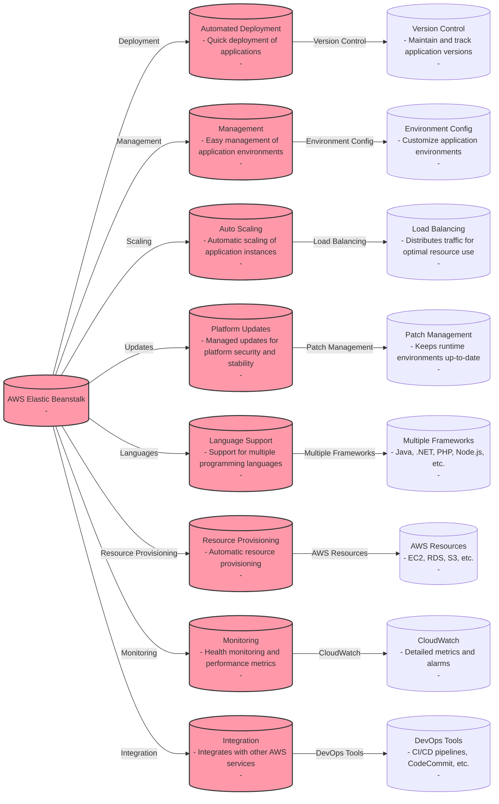

# AWS Elastic Beanstalk

## Differences between the Web Server Tier and the Worker Tier in AWS Elastic BeanstalkR

| Feature / Tier                   | Web Server Tier                                                           | Worker Tier                                                               |
|----------------------------------|---------------------------------------------------------------------------|---------------------------------------------------------------------------|
| **Purpose**                      | Serve HTTP/S requests                                                     | Process background tasks                                                  |
| **Environment**                  | Typically public-facing and responds to user requests via a web server    | Internal-facing, processes tasks from a queue                             |
| **Scaling**                      | Scales based on traffic to the HTTP/S service                             | Scales based on the number of jobs in the queue                           |
| **Components**                   | Load balancer, application servers                                       | SQS queue, dedicated background job processors                            |
| **Default Service**              | Apache, Nginx, IIS based on the platform                                  | Amazon Simple Queue Service (SQS)                                         |
| **Request Model**                | Synchronous                                                               | Asynchronous                                                              |
| **Execution Model**              | Request-response                                                          | Event-driven, message polling                                             |
| **Use Cases**                    | Web applications, RESTful APIs                                            | Long-running processes, email processing, scheduled tasks                 |
| **State**                        | Stateless, scales horizontally                                            | Stateless or stateful, scales horizontally                                |
| **Communication**                | Direct HTTP/S requests                                                    | Messages placed on an SQS queue                                           |
| **Latency**                      | Expected to have low latency                                              | Can tolerate higher latency, batch processing                             |
| **Health Check**                 | ELB health checks for HTTP/S endpoint                                    | Queue-based health checks or custom health check implementations         |
| **Updates & Deployments**        | Rolling updates, blue-green deployments, canary releases                  | Rolling updates based on queue depth, batch job completion                |
| **Monitoring**                   | ELB access logs, application logs, CloudWatch metrics                     | Worker logs, SQS metrics, CloudWatch metrics                              |
| **Session Persistence**          | Managed by ELB sticky sessions or application logic                      | Not typically applicable                                                  |
| **Traffic Source**               | Direct from users or other services                                       | Triggered by events, often from a web server tier or other AWS services   |

