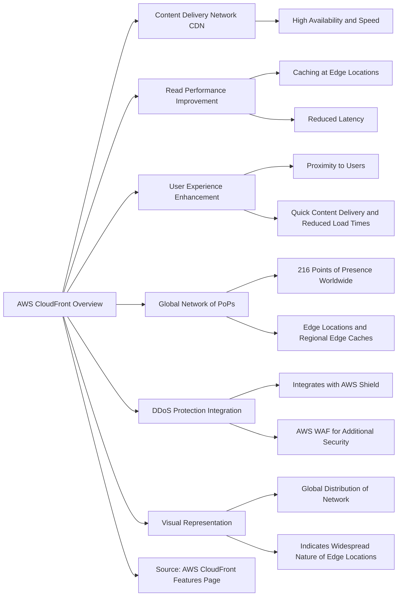
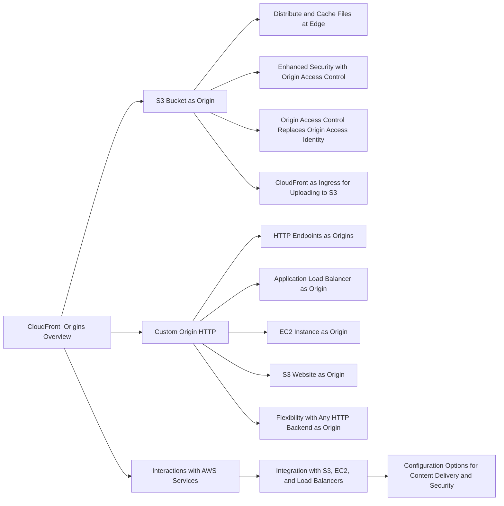
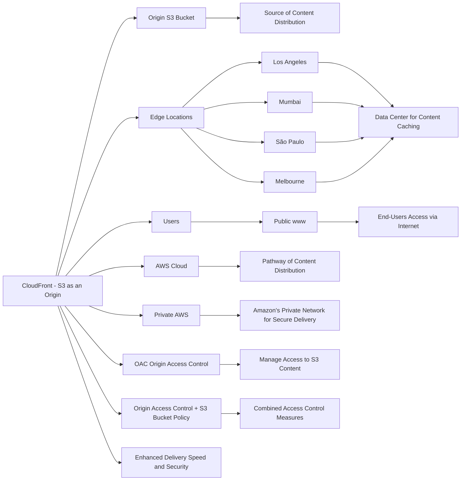
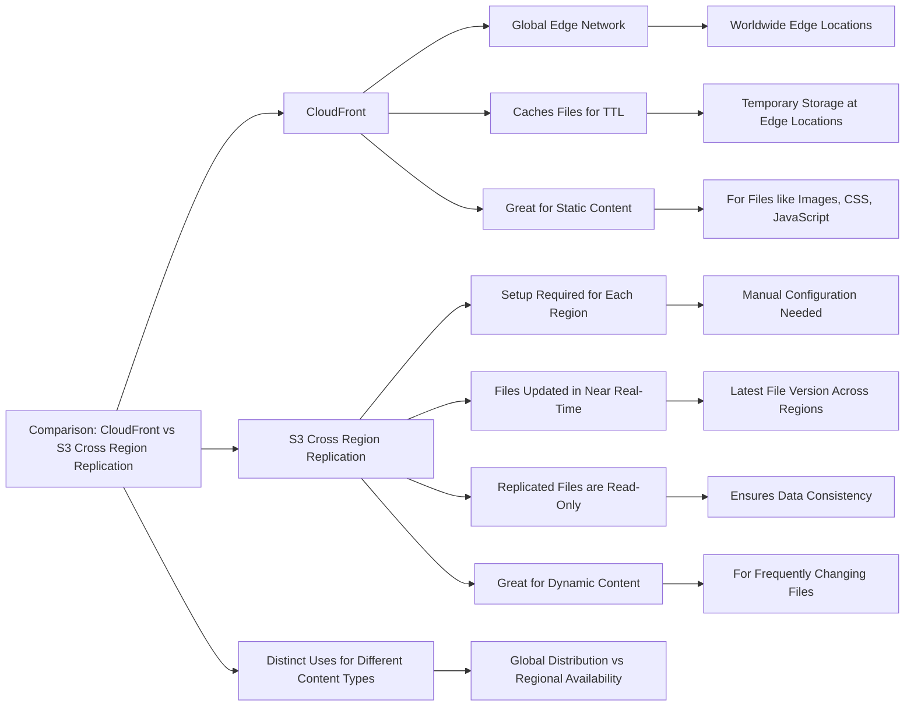
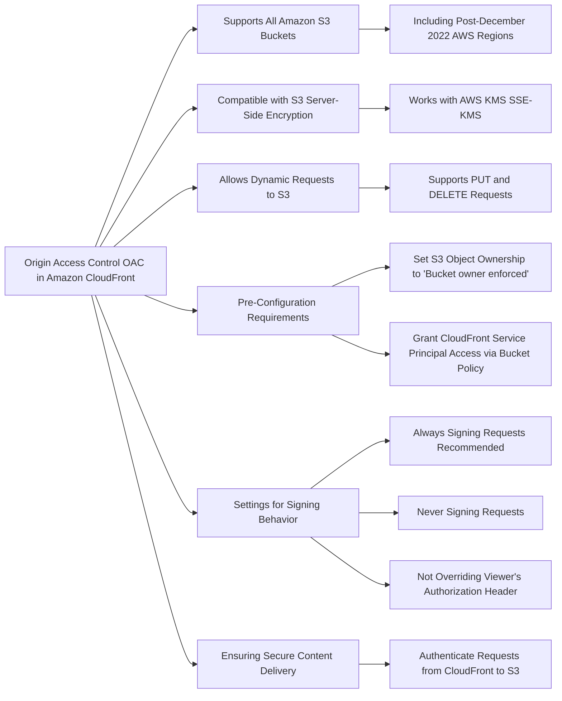
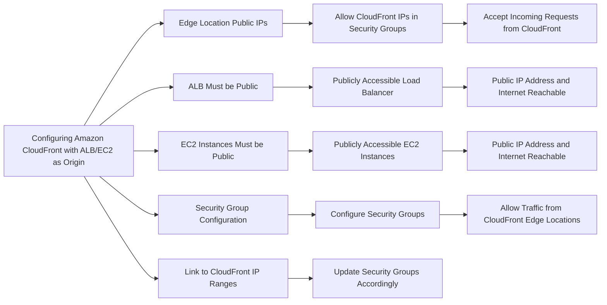
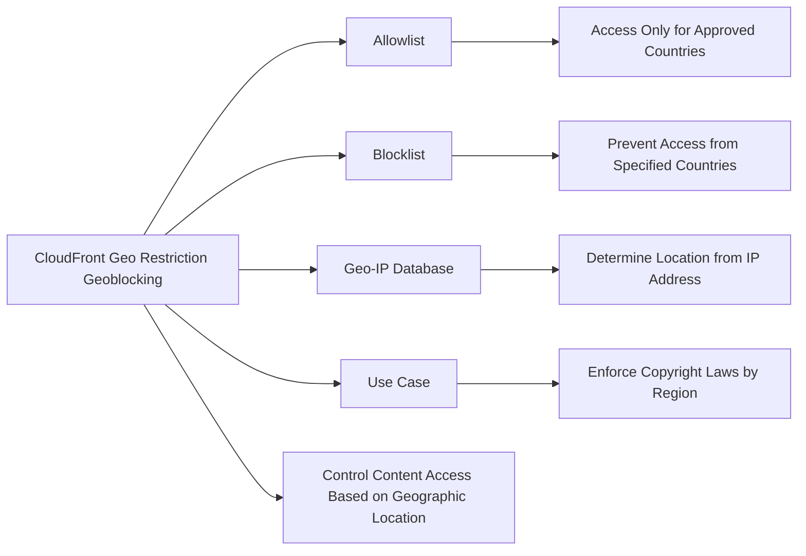
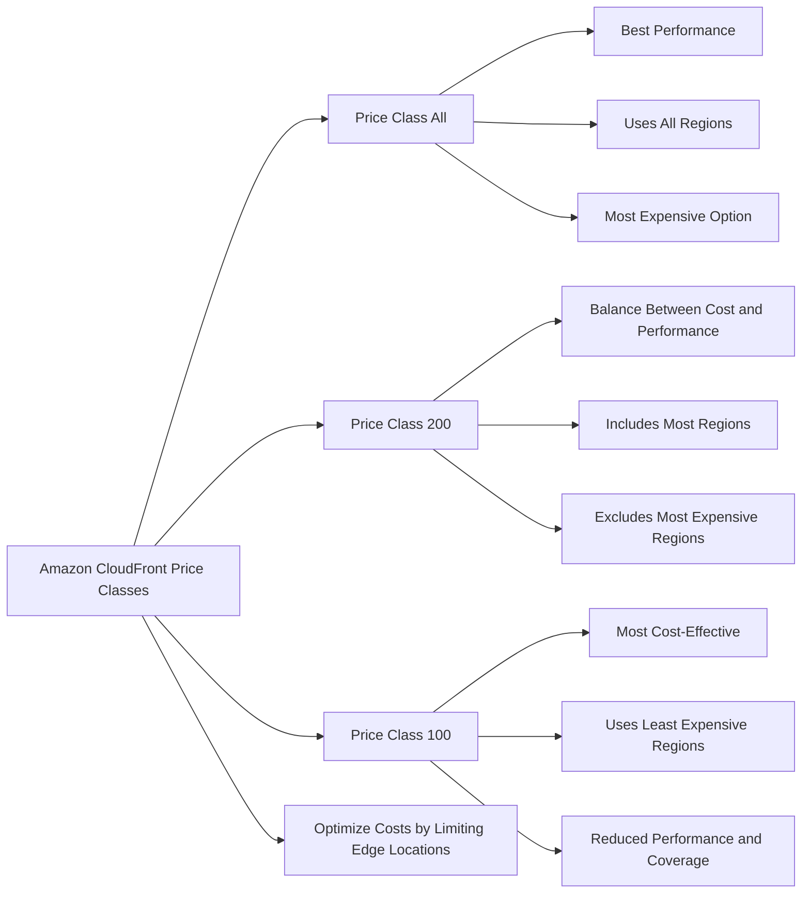
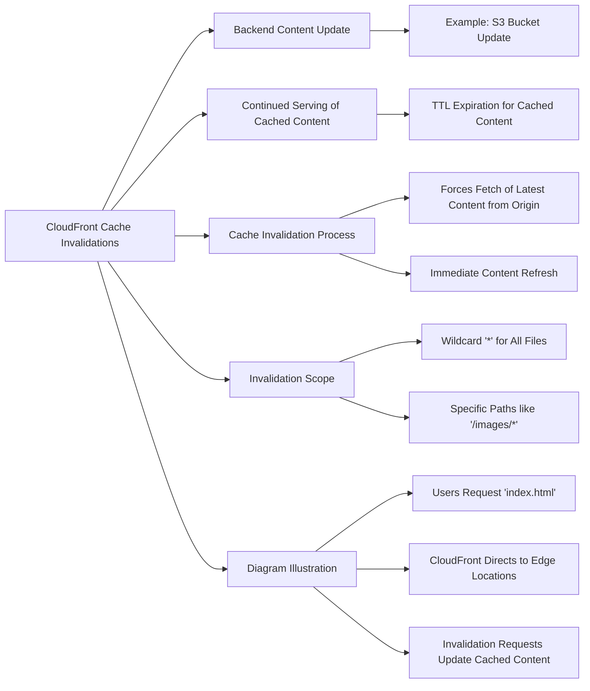
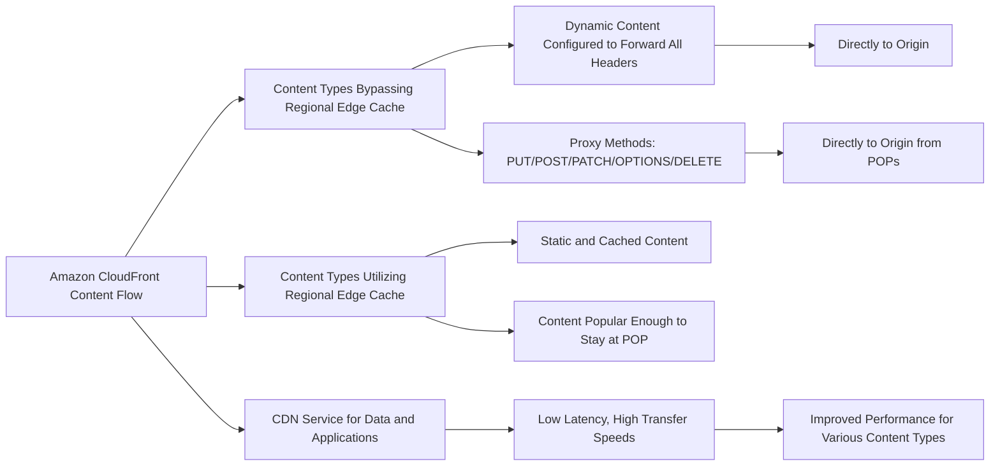

# CloudFront

| Feature | CloudFront | S3 Cross Region Replication |
|---------|------------|-----------------------------|
| Network Type | Global Edge network | Inter-region data replication |
| Content Type | Static content | Dynamic content |
| Availability | Global | Specific regions set up by user |
| Cache Duration | TTL (e.g., a day) | N/A (real-time replication) |
| Update Frequency | As per TTL or when invalidated | Near real-time |
| Access Type | Public (usually) | Read-only after replication |
| Best Used For | Content that must be available everywhere | Content that needs low-latency access in select regions |

## For exam

1. Amazon CloudFront offers a multi-tier cache in the form of regional edge caches that improve latency. However, there are certain content types that bypass the regional edge cache, and go directly to the origin.

Which of the following content types skip the regional edge cache? (Select two)

***Answer:*** Dynamic content, as determined at request time (cache-behavior configured to forward all headers)

Amazon CloudFront is a fast content delivery network (CDN) service that securely delivers data, videos, applications, and APIs to customers globally with low latency, high transfer speeds, all within a developer-friendly environment.

CloudFront points of presence (POPs) (edge locations) make sure that popular content can be served quickly to your viewers. CloudFront also has regional edge caches that bring more of your content closer to your viewers, even when the content is not popular enough to stay at a POP, to help improve performance for that content.

Dynamic content, as determined at request time (cache-behavior configured to forward all headers), does not flow through regional edge caches, but goes directly to the origin. So this option is correct.

Proxy methods PUT/POST/PATCH/OPTIONS/DELETE go directly to the origin

Proxy methods PUT/POST/PATCH/OPTIONS/DELETE go directly to the origin from the POPs and do not proxy through the regional edge caches. So this option is also correct.

