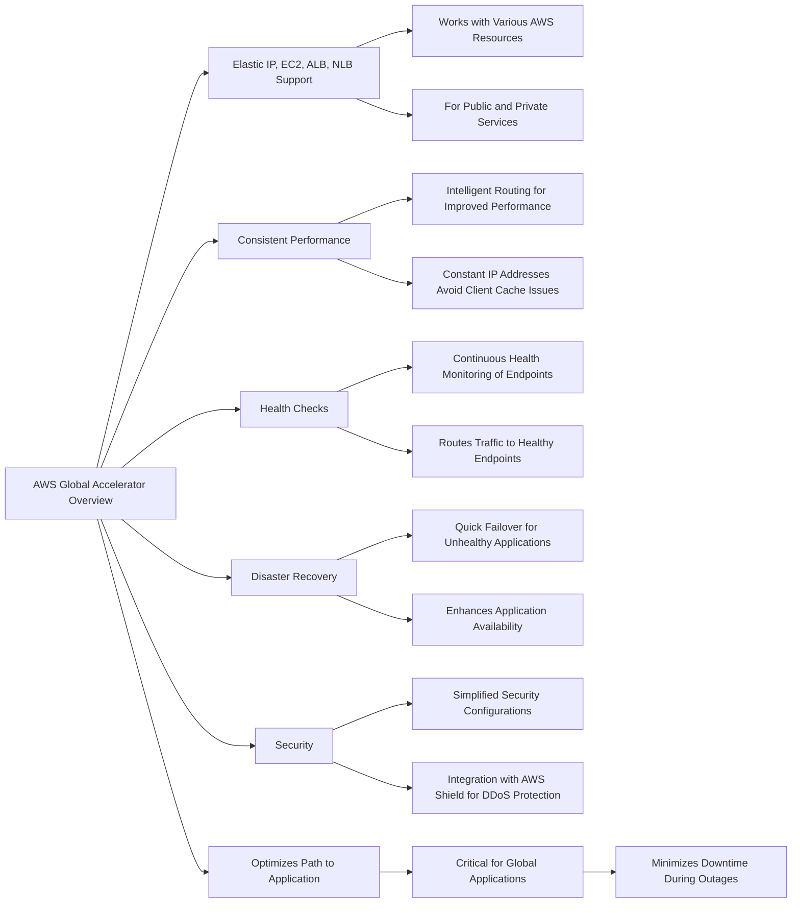

# GlobalAccelerator

| Feature          | Anycast IP                                 | Unicast IP                               |
|------------------|--------------------------------------------|------------------------------------------|
| Definition       | One-to-nearest addressing method           | One-to-one addressing method             |
| Routing          | Traffic is routed to the nearest node      | Traffic is routed to a specific endpoint |
| Redundancy       | High, due to multiple nodes                | Low, as it relies on a single node       |
| Load Distribution | Automatic, based on network proximity     | Manual, requires load balancing          |
| Scalability      | Highly scalable                            | Limited scalability                      |
| Use Cases        | Content Delivery Networks (CDNs), DNS      | Standard internet connectivity           |
| Efficiency       | High, reduces latency and improves speed   | Less efficient compared to Anycast       |
| Complexity       | More complex to set up and manage          | Simpler to set up and manage             |

| Feature                  | AWS Global Accelerator                                  | AWS CloudFront                                         |
|--------------------------|---------------------------------------------------------|--------------------------------------------------------|
| Service Type             | Networking service                                      | Content Delivery Network (CDN)                         |
| Protocol Support         | TCP and UDP                                             | Primarily HTTP/S                                       |
| Use Cases                | Wide range of applications including gaming, IoT, VoIP  | Web content delivery, such as images, videos, API, and dynamic site content |
| Performance Improvement  | Proxies packets at the edge for improved performance    | Caches content at edge locations for lower latency delivery |
| Static IP Addresses      | Provides static IP addresses                            | Does not provide static IP addresses                   |
| Failover                 | Fast regional failover with deterministic routing       | Provides failover through content replication and edge locations |
| DDoS Protection          | Integrates with AWS Shield                              | Integrates with AWS Shield                             |
| Content Caching          | Not applicable                                          | Improves read performance by caching content at the edge |
| Edge Locations           | Utilizes AWS global network and edge locations          | Utilizes a vast number of edge locations worldwide     |
| Pricing                  | Based on the use of fixed IP endpoints and regions served | Based on content delivery and request handling        |
