# Aurora

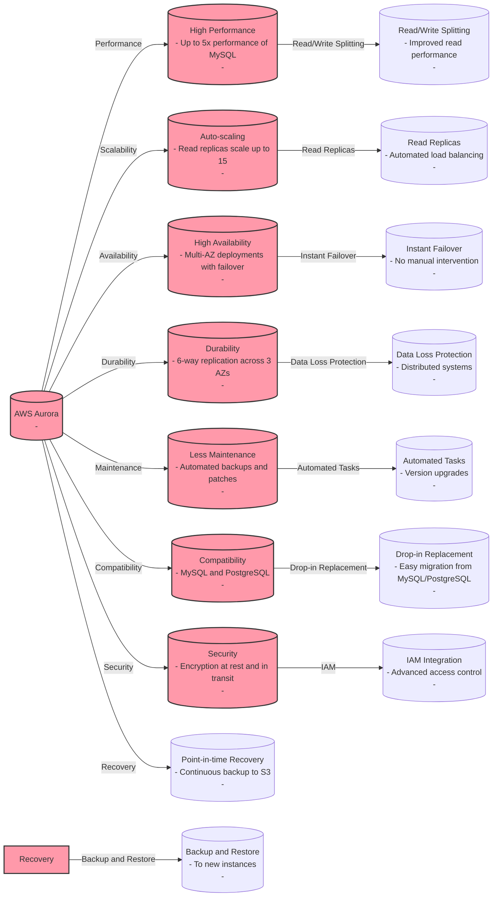

## Amazon Aurora High Availability & Read Scaling
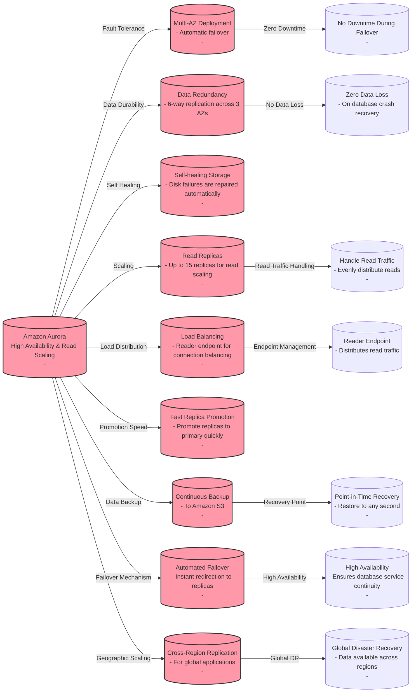

## Aurora Endpoints
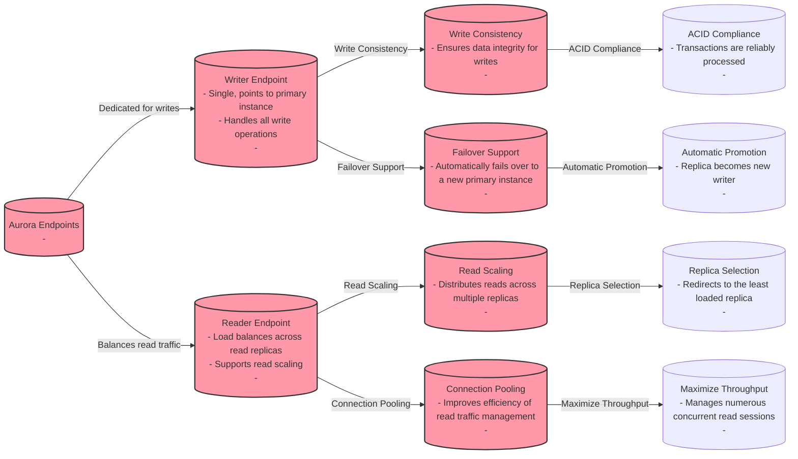

## Aurora Read Replicas

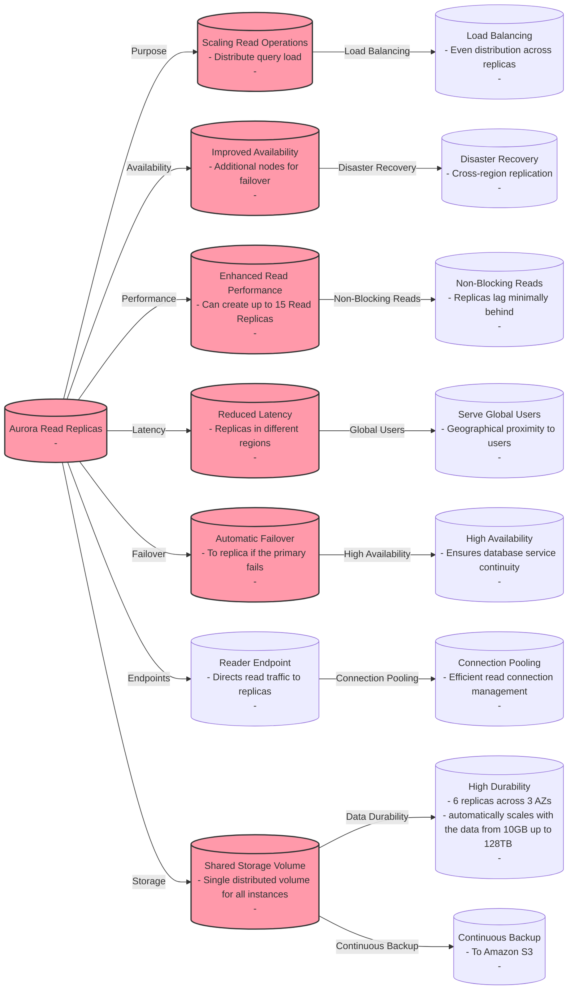

## Aurora Custom Endpoints

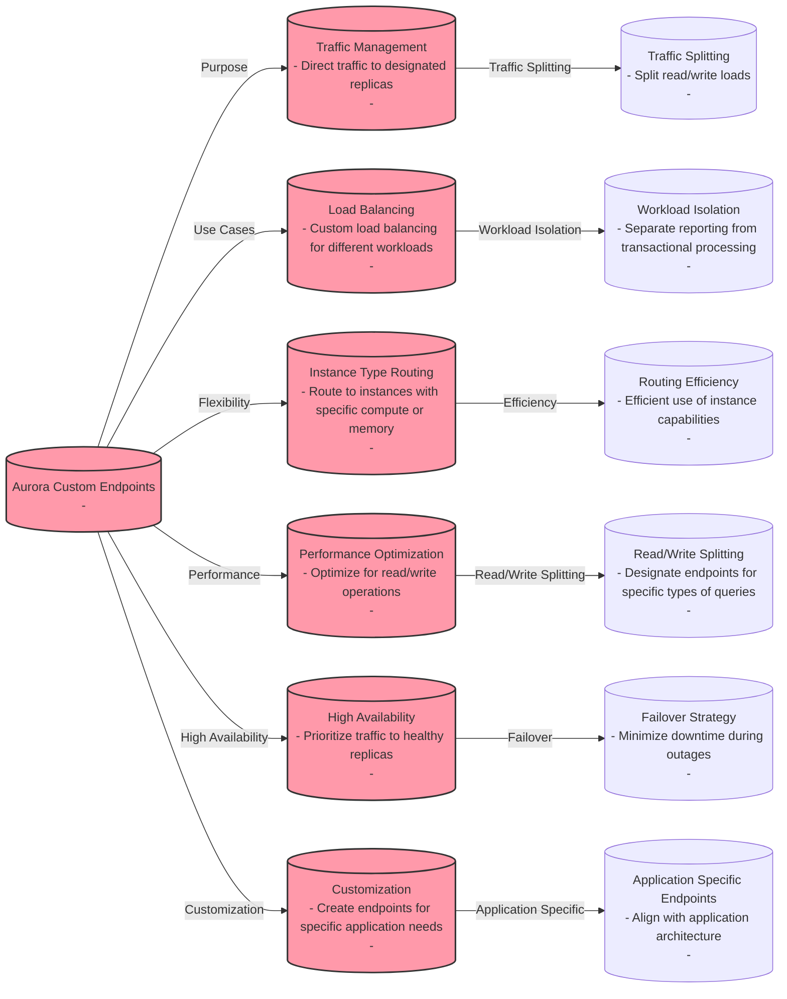

## Amazon Aurora Multi-Master

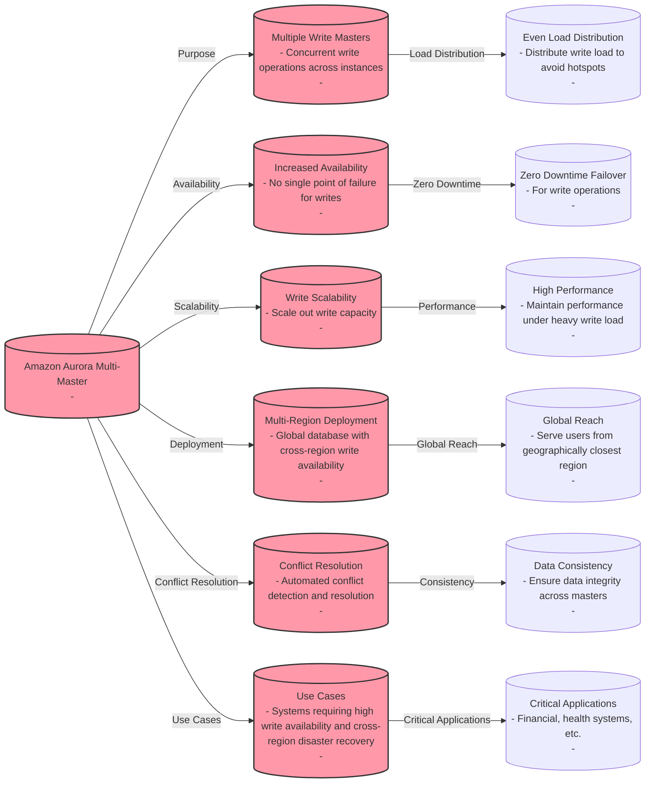

## Amazon Aurora Global Database

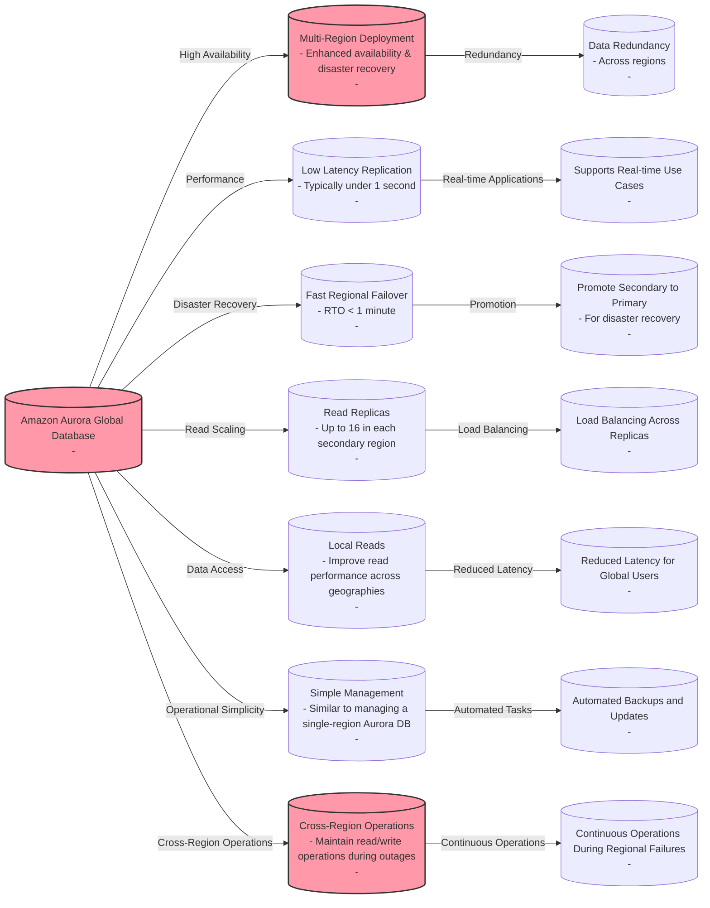

## Amazon Aurora Backups

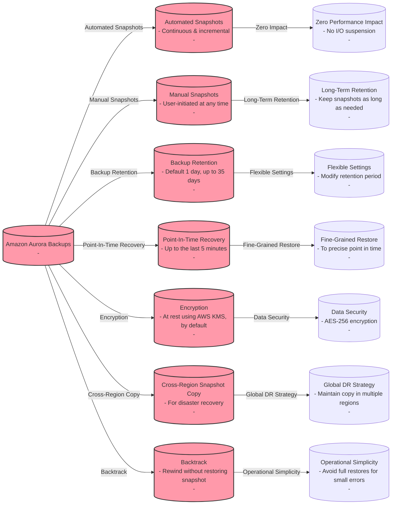

## Differences between restoring from a backup or snapshot versus using the backtrack feature on Amazon Aurora

| Feature                    | Restore from Backup/Snapshot                      | Backtracking in Amazon Aurora                       |
|----------------------------|--------------------------------------------------|-------------------------------------------------|
| Purpose                    | To recover data from a specific point in time     | To quickly undo accidental changes without restore |
| Time to Recover            | Can take several minutes to hours                 | Almost immediate, typically within seconds        |
| Downtime                   | Required; new instance creation involved          | None; operation is done in-place                  |
| Data Loss                  | No data loss if done correctly                    | Potential for minimal data loss                   |
| Availability               | All RDS database engines                          | Only available for Amazon Aurora                  |
| Point-in-Time              | Any point within the snapshot retention period    | Up to the last backtrack window configured        |
| Operation Complexity       | More complex; involves creating a new instance    | Simple; no new resources required                 |
| Impact on Performance      | No impact on the running instance                 | Minimal impact; allows normal operations to continue |
| Use Case                   | Disaster recovery, corruption recovery            | Quick recovery from user errors, logical errors   |
| Storage Impact             | Requires additional storage for the new instance  | No additional storage needed                      |

## Amazon Aurora Database Cloning

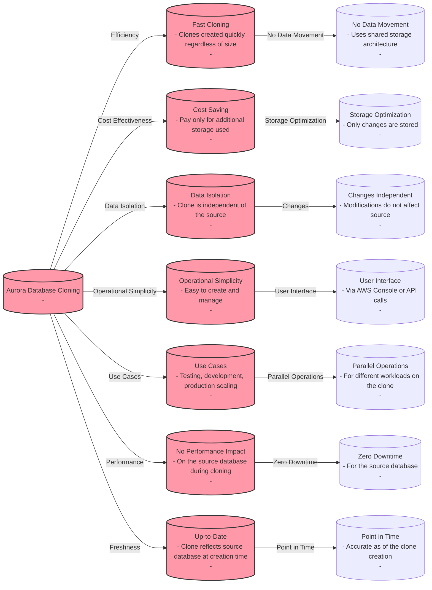

## Amazon RDS & Aurora Security
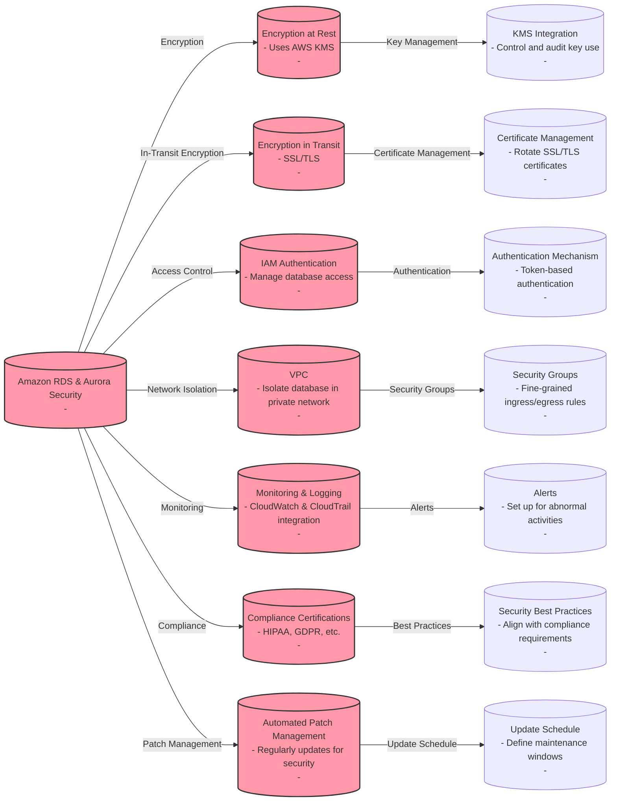

## Amazon RDS Proxy
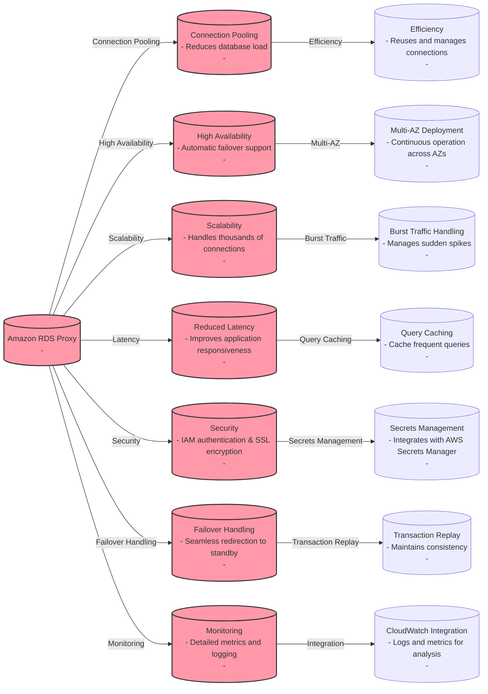

## For exam
1. The flagship application for a gaming company connects to an Amazon Aurora database and the entire technology stack is currently deployed in the United States. Now, the company has plans to expand to Europe and Asia for its operations. It needs the games table to be accessible globally but needs the users and games_played tables to be regional only.

How would you implement this with minimal application refactoring?

***Answer*** : Amazon Aurora is a MySQL and PostgreSQL-compatible relational database built for the cloud, that combines the performance and availability of traditional enterprise databases with the simplicity and cost-effectiveness of open source databases. Amazon Aurora features a distributed, fault-tolerant, self-healing storage system that auto-scales up to 128TB per database instance. Aurora is not an in-memory database.

Amazon Aurora Global Database is designed for globally distributed applications, allowing a single Amazon Aurora database to span multiple AWS regions. It replicates your data with no impact on database performance, enables fast local reads with low latency in each region, and provides disaster recovery from region-wide outages. Amazon Aurora Global Database is the correct choice for the given use-case.

For the given use-case, we, therefore, need to have two Aurora clusters, one for the global table (games table) and the other one for the local tables (users and games_played tables).

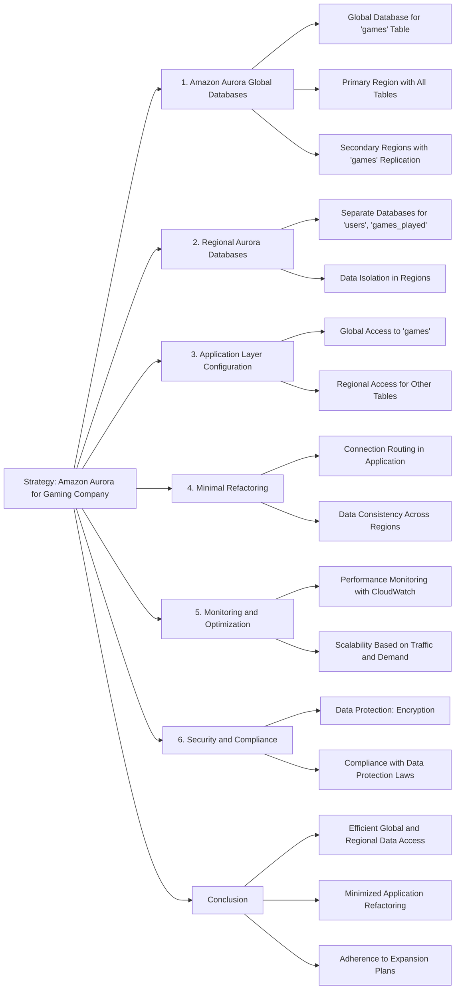

2. A gaming company uses Amazon Aurora as its primary database service. The company has now deployed 5 multi-AZ read replicas to increase the read throughput and for use as failover target. The replicas have been assigned the following failover priority tiers and corresponding instance sizes are given in parentheses: tier-1 (16 terabytes), tier-1 (32 terabytes), tier-10 (16 terabytes), tier-15 (16 terabytes), tier-15 (32 terabytes).

In the event of a failover, Amazon Aurora will promote which of the following read replicas?

***Answer:*** Amazon Aurora features a distributed, fault-tolerant, self-healing storage system that auto-scales up to 128TB per database instance. It delivers high performance and availability with up to 15 low-latency read replicas, point-in-time recovery, continuous backup to Amazon S3, and replication across three Availability Zones (AZs).

For Amazon Aurora, each Read Replica is associated with a priority tier (0-15). In the event of a failover, Amazon Aurora will promote the Read Replica that has the highest priority (the lowest numbered tier). If two or more Aurora Replicas share the same priority, then Amazon RDS promotes the replica that is largest in size. If two or more Aurora Replicas share the same priority and size, then Amazon Aurora promotes an arbitrary replica in the same promotion tier.

Therefore, for this problem statement, the Tier-1 (32 terabytes) replica will be promoted.

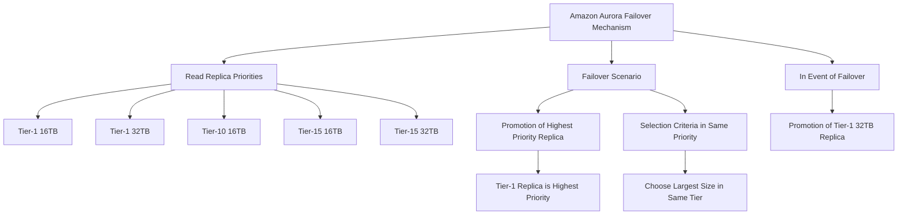