# DB Summary

## Types of Databases and Use Cases
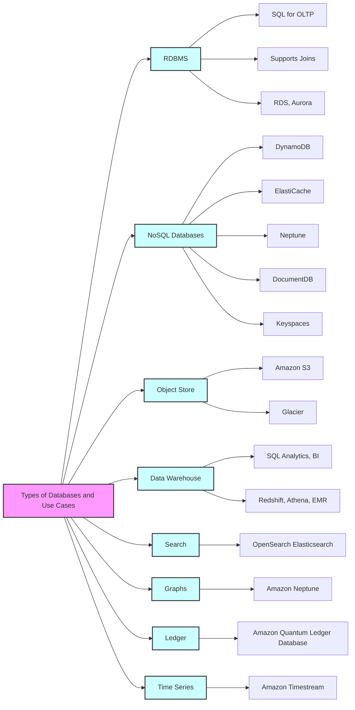

## Amazon RDS Summary
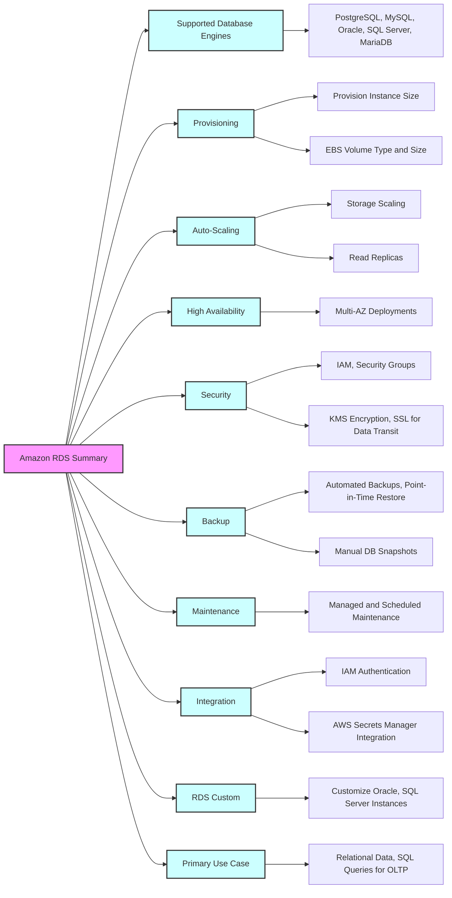

## Amazon Aurora Summary
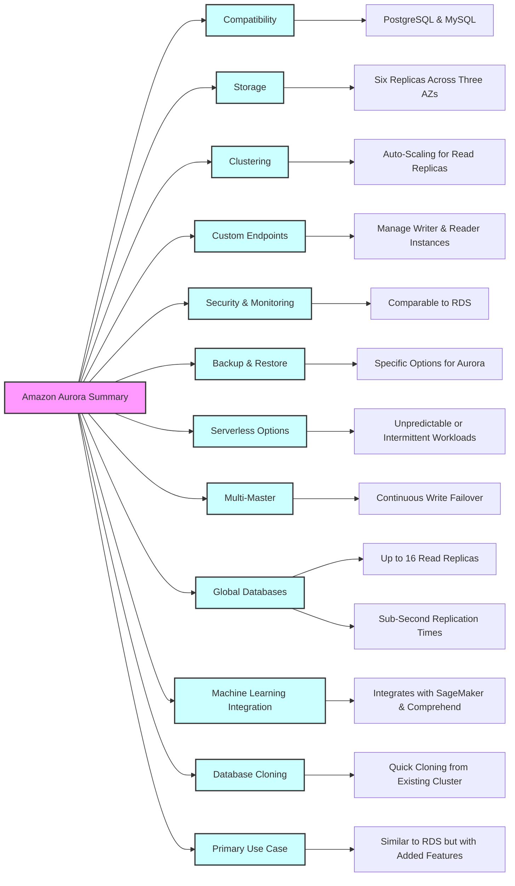

## Amazon DynamoDB Summary
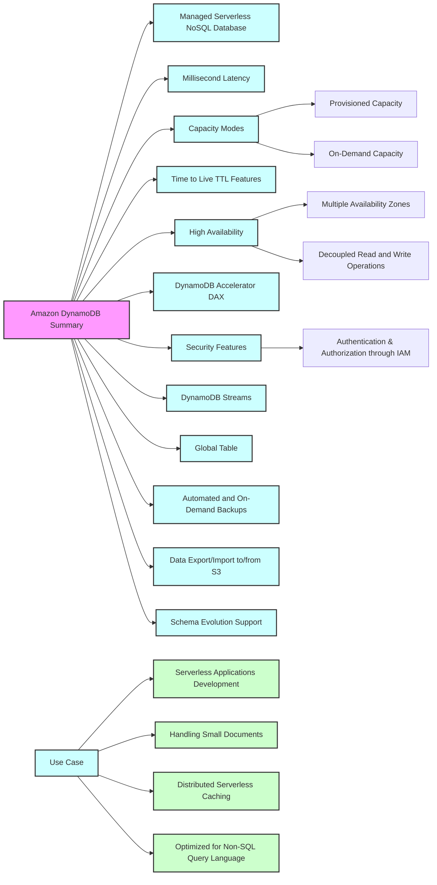

## Amazon S3 Summary
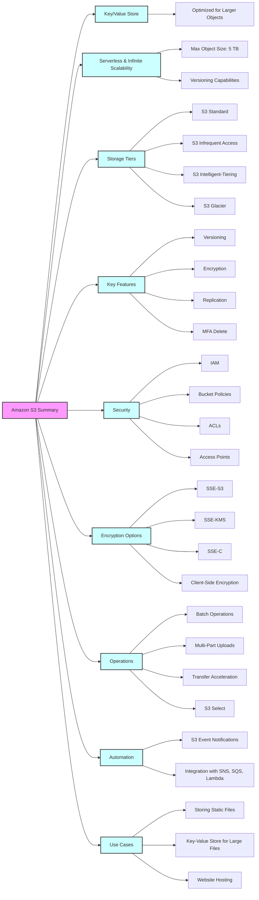

## Amazon DocumentDB Overview
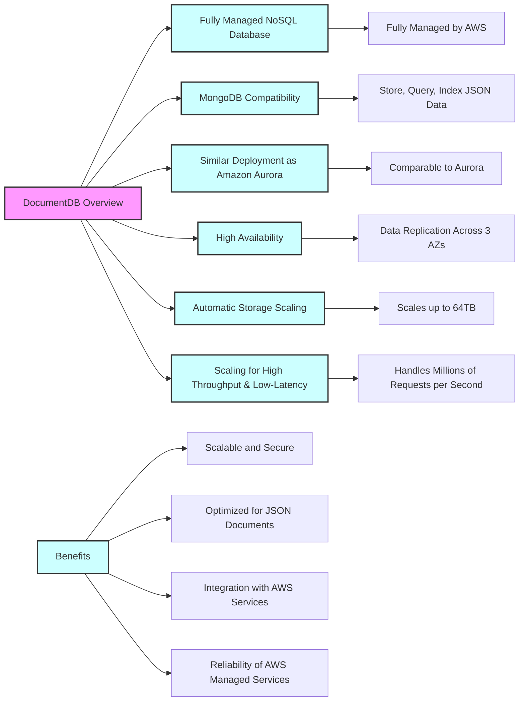

## Amazon Neptune Overview
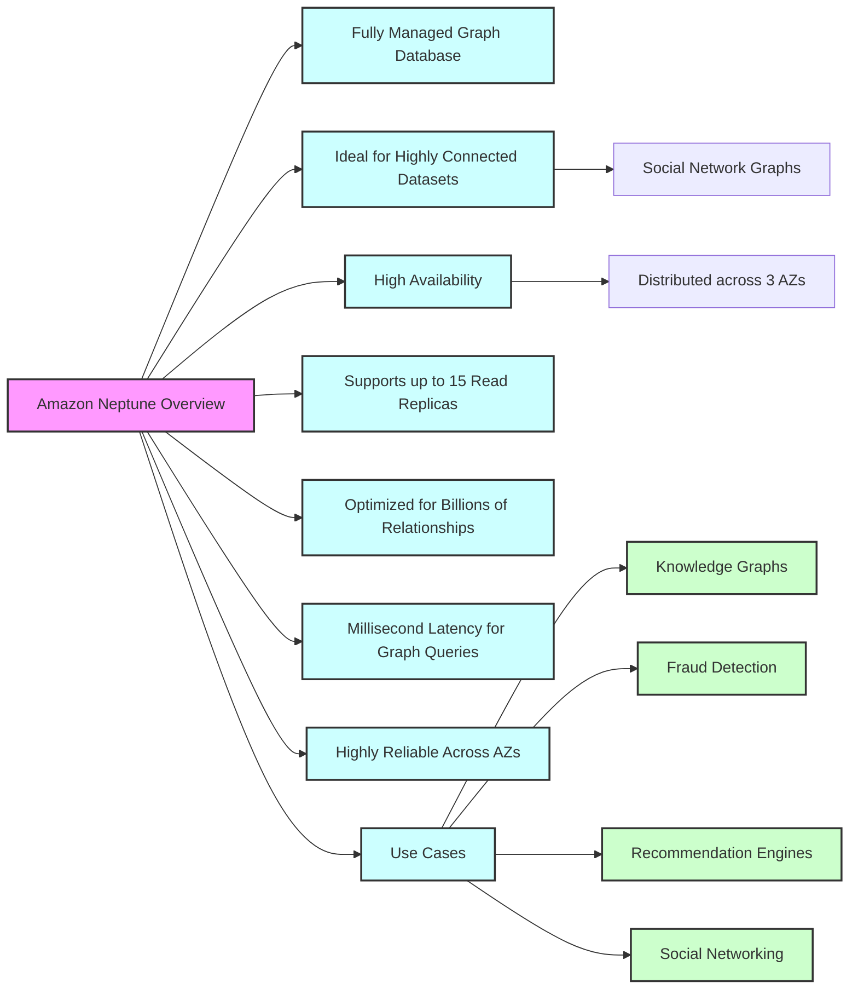

## Amazon Keyspaces
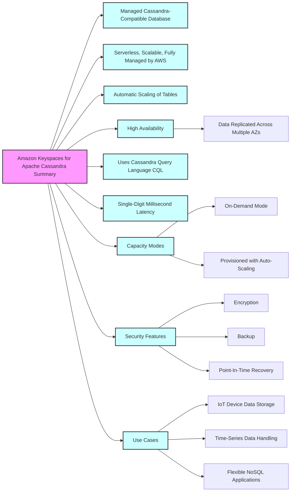

## Amazon QLDB Summary
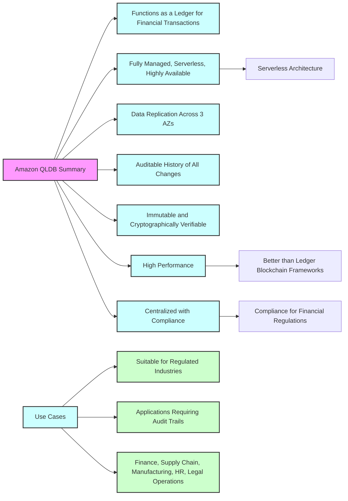

## Amazon Timestream Summary
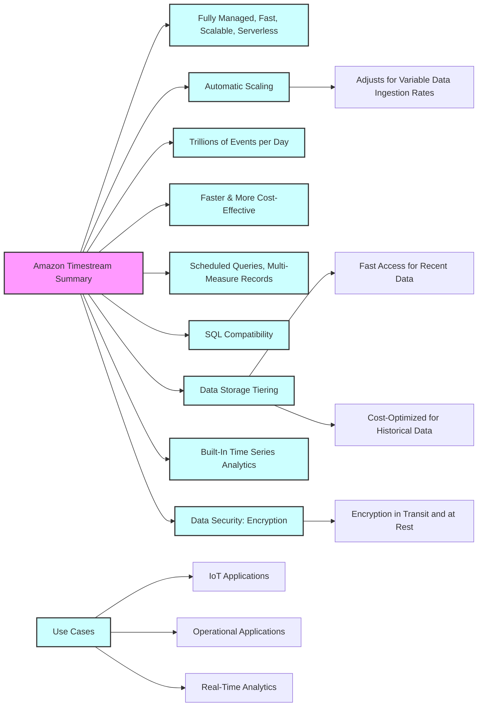
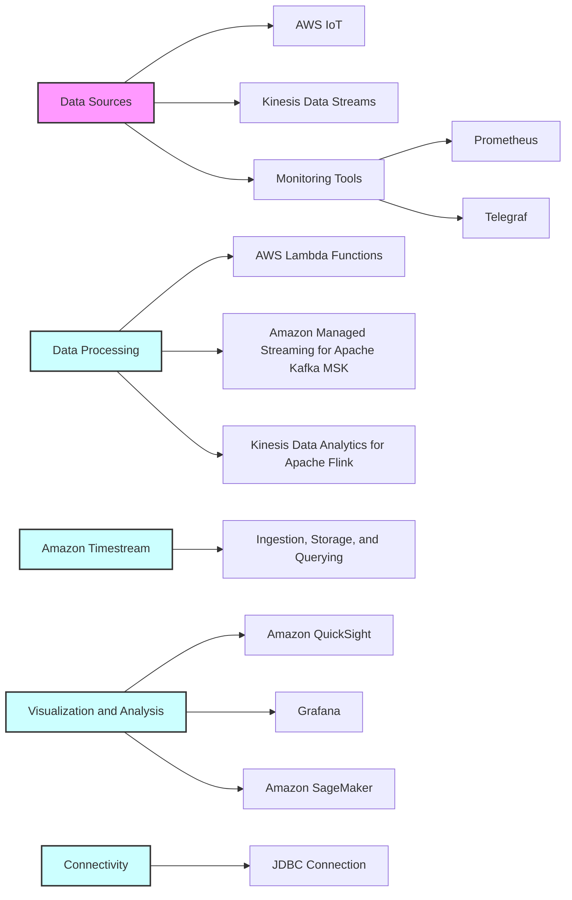
