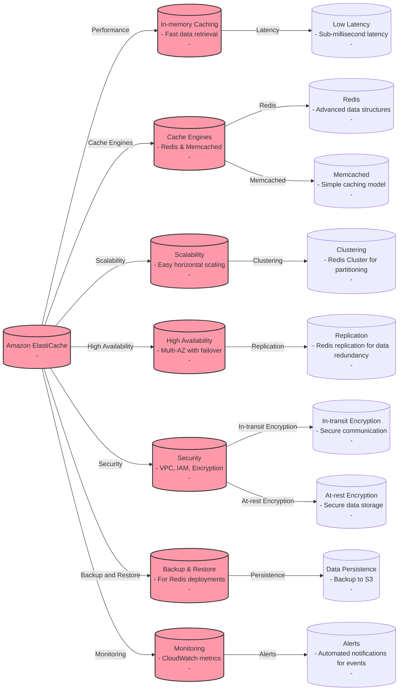
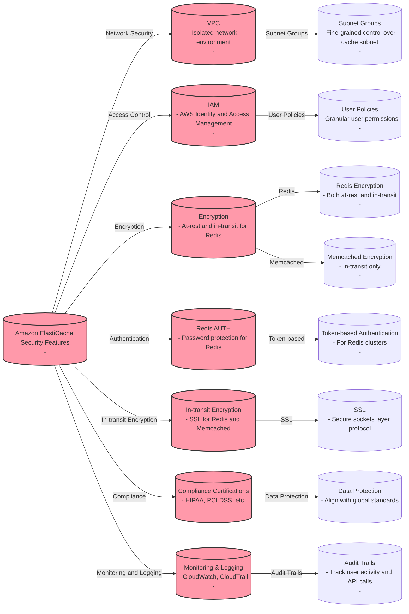
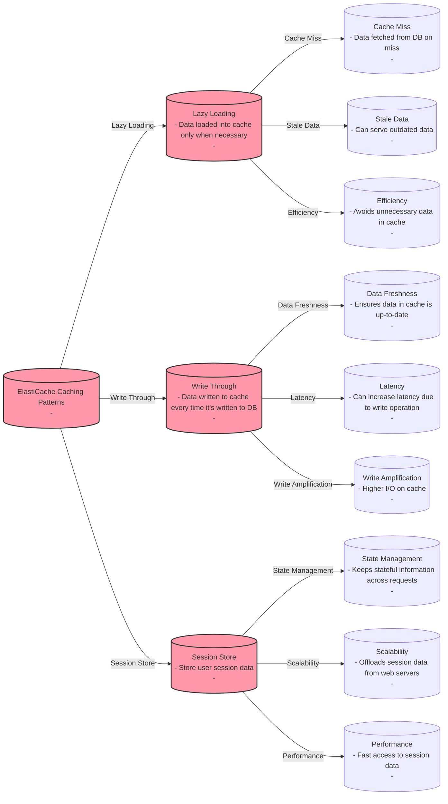
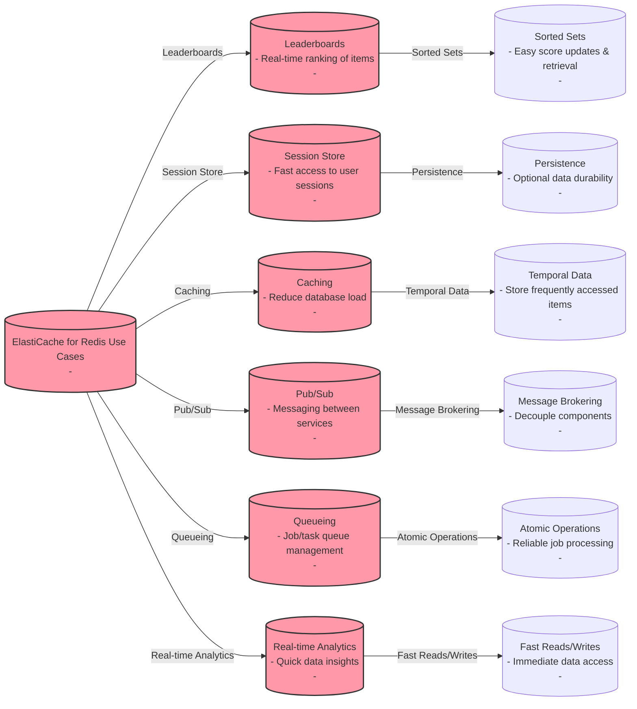

# Amazon ElastiCache

## Redis on Amazon ElastiCache vs Memcached on Amazon ElastiCache

| Feature / Engine             | Redis on Amazon ElastiCache                        | Memcached on Amazon ElastiCache                   |
|------------------------------|----------------------------------------------------|----------------------------------------------------|
| Data Structures              | Supports strings, hashes, lists, sets, sorted sets | Simple key-value store                             |
| Transactions                 | Supports transactions with atomicity               | Does not support transactions                      |
| Persistence                  | Can be persistent with data durability             | Purely in-memory, no data persistence              |
| Replication                  | Supports master/slave replication                  | Does not support replication natively              |
| Backup and Restore           | Supports backup and point-in-time recovery         | No built-in mechanism for backup and restore       |
| Clustering                   | Supports partitioning data across shards           | Supports sharding managed by the client            |
| Advanced Features            | Lua scripting, Pub/Sub, Geospatial indexes         | Multi-threaded architecture                        |
| Use Cases                    | Complex data types, data persistence, replication  | Simple, ephemeral cache scenarios, quick retrieval |
| Scalability                  | Vertical scaling and sharding for horizontal scaling| Horizontal scaling with client-side sharding       |
| High Availability            | Multi-AZ with automatic failover                   | Multi-node for redundancy, manual failover         |
| Security                     | Supports in-transit and at-rest encryption         | Supports in-transit encryption, no at-rest encryption |
| Performance                  | Can be tuned for high performance with persistence | Designed for raw speed, less focus on persistence  |
| Cost                         | Generally more expensive due to feature set        | Generally less expensive due to simpler model      |

# Amazon ElastiCache Security Features

# Amazon ElastiCache Caching Patterns

# Amazon ElastiCache for Redis Use Cases

