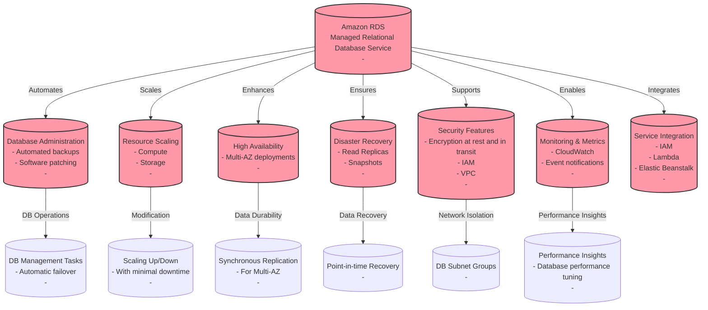
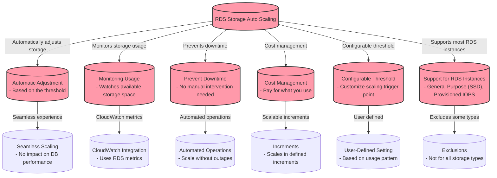
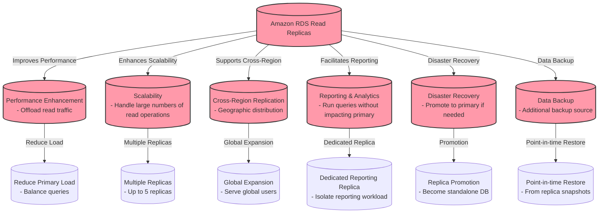
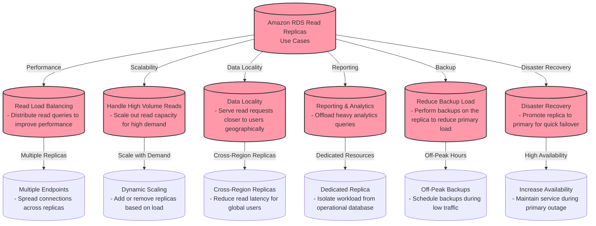
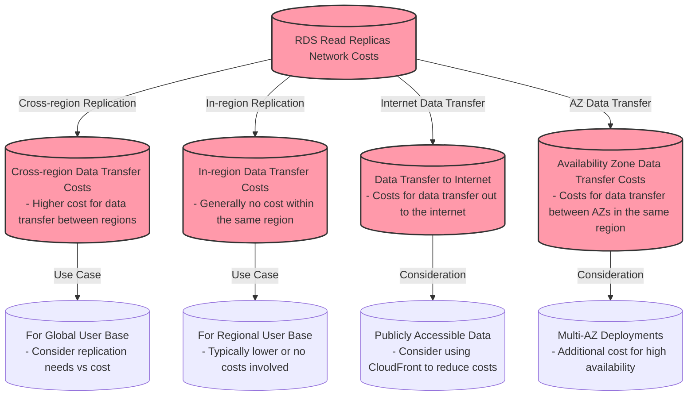
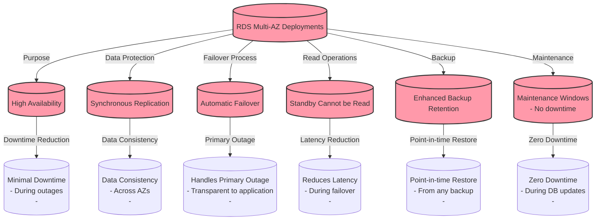
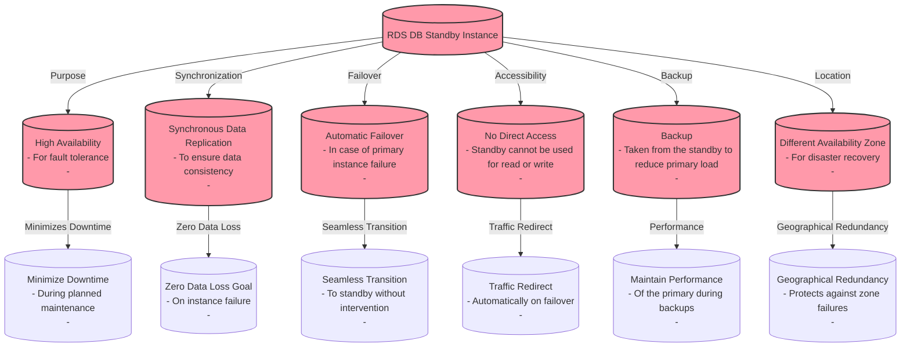
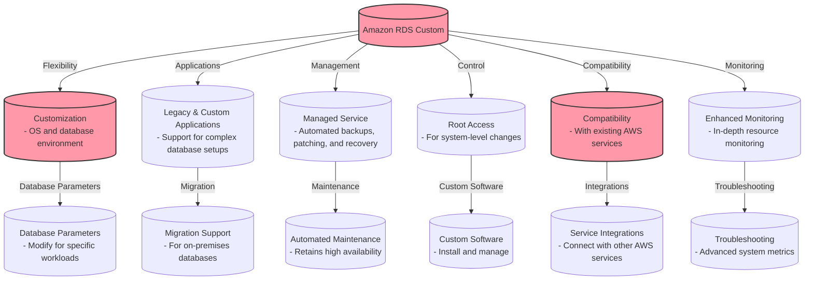
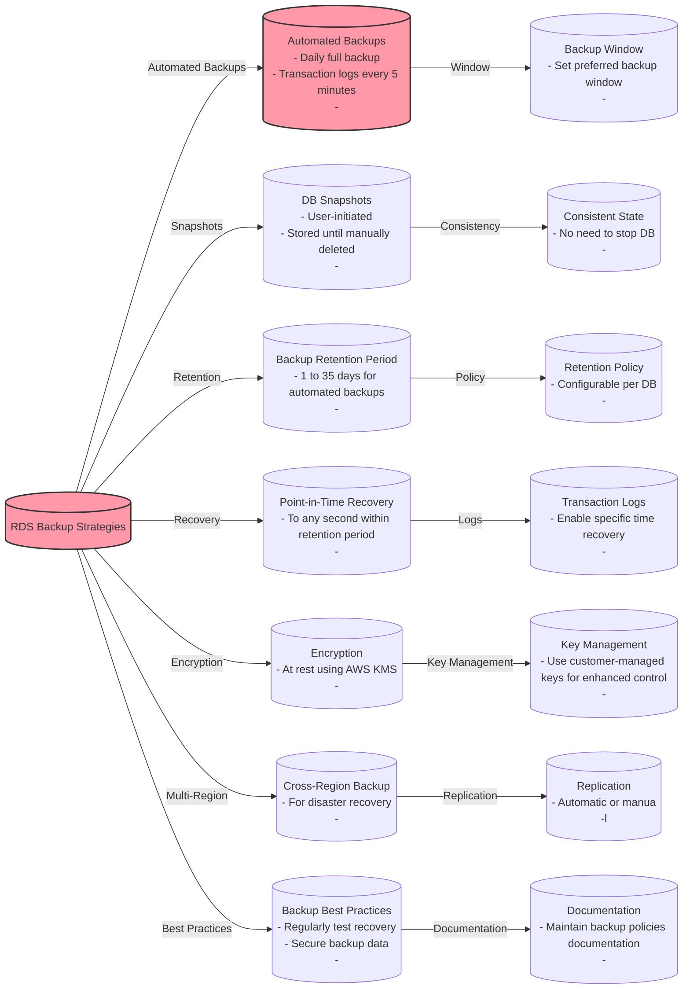
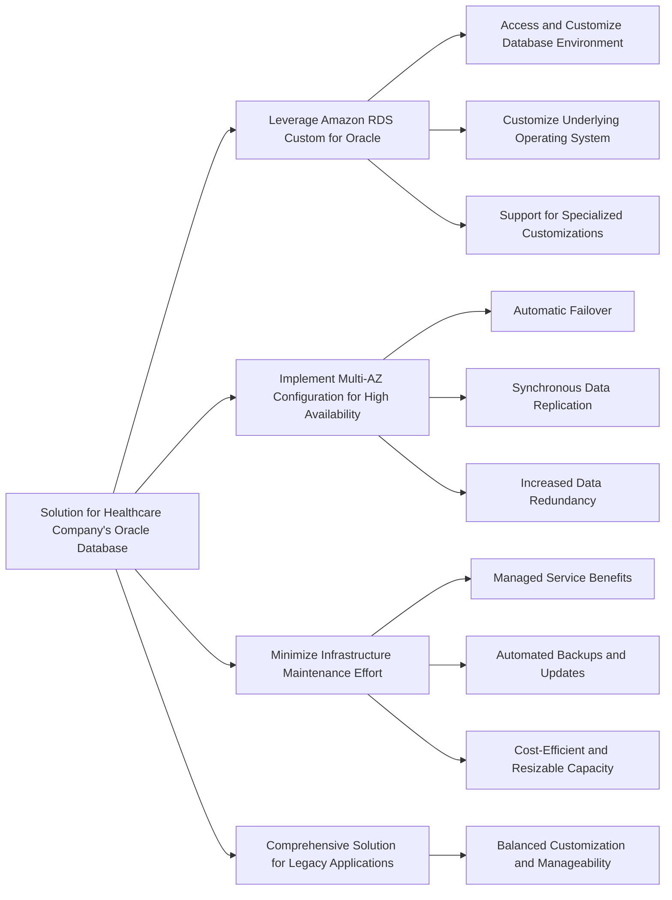

# RDS

## RDS Storage Auto Scaling

## RDS Read Replicas

## RDS Read Replicas Use Cases

## RDS Read Replicas Network Costs

## RDS Multi-AZ Deployments

## RDS DB Standby Instance

## Amazon RDS Custom

## Amazon RDS  vs Amazon RDS Custom
| Feature                          | Amazon RDS                                           | Amazon RDS Custom                                    |
|----------------------------------|-----------------------------------------------------|------------------------------------------------------|
| Management                       | Fully managed service                               | Managed service with customizable features           |
| Customization                    | Limited to specific DB parameters and settings      | Full control over the OS and database environment    |
| Root Access                      | Not available                                       | Available for system-level changes                   |
| Database Engine Support          | MySQL, PostgreSQL, MariaDB, Oracle, SQL Server      | Oracle, SQL Server (with more to come)               |
| Operating System Access          | Managed by AWS                                      | Customer-managed, with AWS support                   |
| Maintenance                      | Automated patching and backups                      | Selective automated and manual patching and backups  |
| Application Suitability          | Standard applications and workloads                 | Legacy, custom, and packaged applications requiring specific configurations |
| Compatibility with AWS Services  | High                                               | High, but may vary based on customizations           |
| Monitoring                       | Standard RDS monitoring                             | Enhanced monitoring with access to OS-level metrics  |
| Hardware Access                  | Not available                                       | Available for specific use cases                     |
| Use Case                         | Turnkey solutions for common database requirements  | Complex environments needing customization           |
| Pricing                          | Standard RDS pricing                                | Additional cost for increased flexibility and control|

## RDS Backup Strategies

## Differences between snapshots and backups on Amazon RDS

| Feature                    | RDS Snapshot                              | RDS Automated Backup                       |
|----------------------------|-------------------------------------------|--------------------------------------------|
| Type of Operation          | Manual or automatic (if triggered by user)| Automated by AWS RDS                       |
| Frequency                  | On-demand                                 | Daily, plus transaction logs every 5 minutes|
| Retention Period           | User-defined, can be indefinite           | 1 to 35 days (user-configurable)           |
| Restoration Time           | Might be longer due to larger data size   | Generally faster due to incremental nature |
| Point-in-Time Recovery     | Not available                             | Available within the retention period      |
| Storage Location           | Amazon S3                                 | Amazon S3                                  |
| Availability               | Available for all RDS engines             | Available for all RDS engines              |
| Storage Costs              | Based on the amount of data stored        | Included in RDS pricing; additional storage costs for logs|
| Impact on Performance      | Minimal, if any                           | Minimal, due to continuous backup          |
| Use Case                   | Long-term storage, archiving, or migration| Quick recovery, operational restores       |

## For exam

1. A healthcare company uses its on-premises infrastructure to run legacy applications that require specialized customizations to the underlying Oracle database as well as its host operating system (OS). The company also wants to improve the availability of the Oracle database layer. The company has hired you as an AWS Certified Solutions Architect – Associate to build a solution on AWS that meets these requirements while minimizing the underlying infrastructure maintenance effort.

Which of the following options represents the best solution for this use case?

***Answer*** Leverage multi-AZ configuration of Amazon RDS Custom for Oracle that allows the Database Administrator (DBA) to access and customize the database environment and the underlying operating system

Amazon RDS is a managed service that makes it easy to set up, operate, and scale a relational database in the cloud. It provides cost-efficient and resizable capacity while managing time-consuming database administration tasks. Amazon RDS can automatically back up your database and keep your database software up to date with the latest version. However, RDS does not allow you to access the host OS of the database.

For the given use-case, you need to use Amazon RDS Custom for Oracle as it allows you to access and customize your database server host and operating system, for example by applying special patches and changing the database software settings to support third-party applications that require privileged access. Amazon RDS Custom for Oracle facilitates these functionalities with minimum infrastructure maintenance effort. You need to set up the RDS Custom for Oracle in multi-AZ configuration for high availability.

