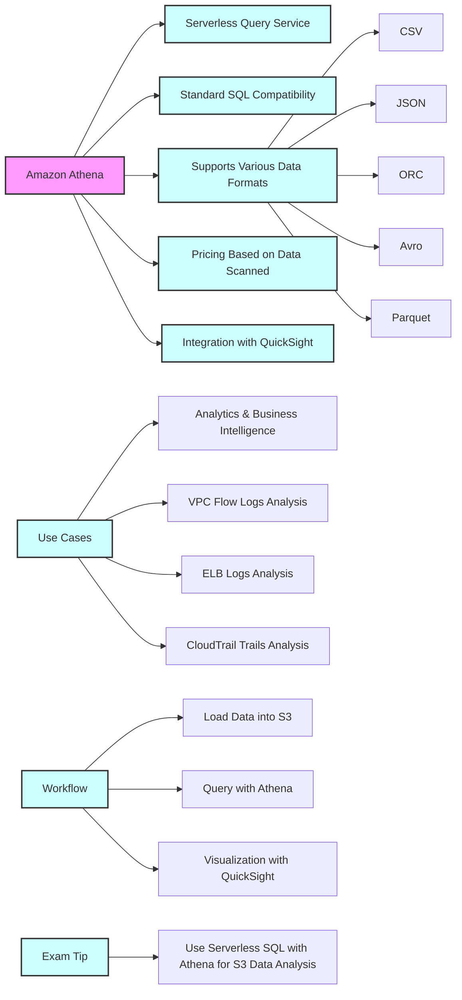
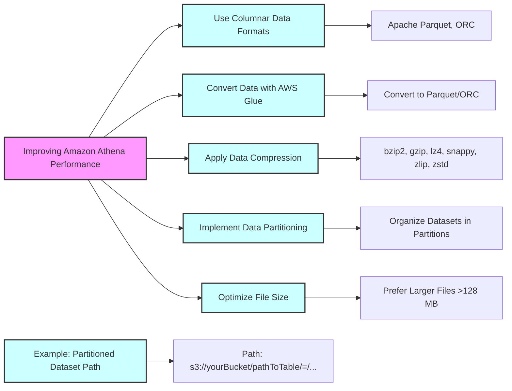
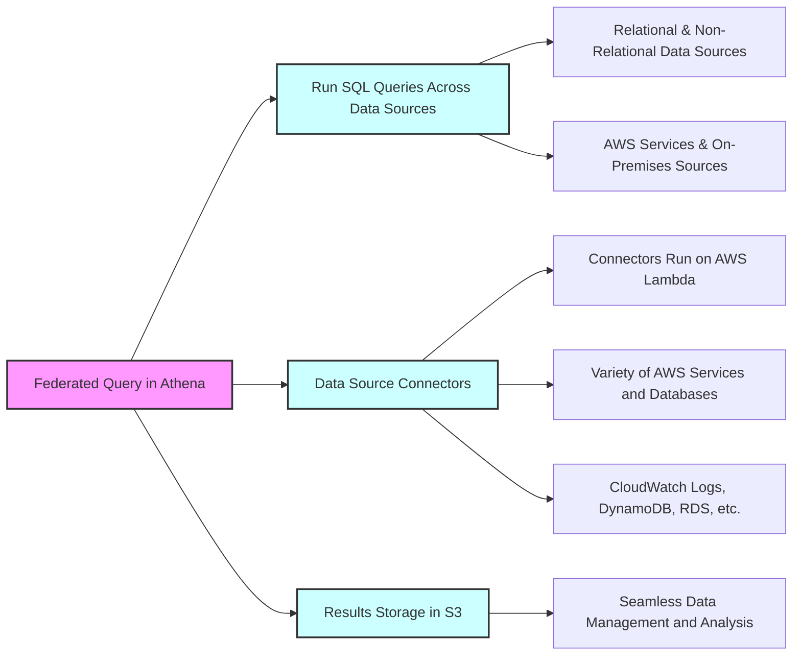

# Athena

```mermaid
graph LR
    Athena[Amazon Athena] --> Serverless_Query[Serverless Query Service]
    Athena --> SQL_Compatibility[Standard SQL Compatibility]
    Athena --> Data_Formats[Supports Various Data Formats]
    Athena --> Pricing[Pricing Based on Data Scanned]
    Athena --> Integration[Integration with QuickSight]

    Data_Formats --> CSV[CSV]
    Data_Formats --> JSON[JSON]
    Data_Formats --> ORC[ORC]
    Data_Formats --> Avro[Avro]
    Data_Formats --> Parquet[Parquet]

    Use_Cases[Use Cases] --> Analytics_BI[Analytics & Business Intelligence]
    Use_Cases --> VPC_Flow_Logs[VPC Flow Logs Analysis]
    Use_Cases --> ELB_Logs[ELB Logs Analysis]
    Use_Cases --> CloudTrail_Trails[CloudTrail Trails Analysis]

    Workflow[Workflow] --> Load_S3[Load Data into S3]
    Workflow --> Query_Athena[Query with Athena]
    Workflow --> Visualization[Visualization with QuickSight]

    Exam_Tip[Exam Tip] --> Serverless_SQL[Use Serverless SQL with Athena for S3 Data Analysis]

    style Athena fill:#f9f,stroke:#333,stroke-width:2px
    style Serverless_Query fill:#cff,stroke:#333,stroke-width:2px
    style SQL_Compatibility fill:#cff,stroke:#333,stroke-width:2px
    style Data_Formats fill:#cff,stroke:#333,stroke-width:2px
    style Pricing fill:#cff,stroke:#333,stroke-width:2px
    style Integration fill:#cff,stroke:#333,stroke-width:2px
    style Use_Cases fill:#cff,stroke:#333,stroke-width:2px
    style Workflow fill:#cff,stroke:#333,stroke-width:2px
    style Exam_Tip fill:#cff,stroke:#333,stroke-width:2px


```

## Improving Amazon Athena Performance

```mermaid
graph LR
Athena_Performance[Improving Amazon Athena Performance] --> Columnar_Data[Use Columnar Data Formats]
Athena_Performance --> Data_Conversion[Convert Data with AWS Glue]
Athena_Performance --> Data_Compression[Apply Data Compression]
Athena_Performance --> Partitioning[Implement Data Partitioning]
Athena_Performance --> File_Size[Optimize File Size]

    Columnar_Data --> Formats_Columnar[Apache Parquet, ORC]
    Data_Conversion --> Glue_Conversion[Convert to Parquet/ORC]
    Data_Compression --> Compression_Formats[bzip2, gzip, lz4, snappy, zlip, zstd]
    Partitioning --> Dataset_Organization[Organize Datasets in Partitions]
    File_Size --> Larger_Files[Prefer Larger Files >128 MB]

    Example[Example: Partitioned Dataset Path] --> Path_Format[Path: s3://yourBucket/pathToTable/<PARTITION_COLUMN_NAME>=<VALUE>/...]

    style Athena_Performance fill:#f9f,stroke:#333,stroke-width:2px
    style Columnar_Data fill:#cff,stroke:#333,stroke-width:2px
    style Data_Conversion fill:#cff,stroke:#333,stroke-width:2px
    style Data_Compression fill:#cff,stroke:#333,stroke-width:2px
    style Partitioning fill:#cff,stroke:#333,stroke-width:2px
    style File_Size fill:#cff,stroke:#333,stroke-width:2px
    style Example fill:#cff,stroke:#333,stroke-width:2px
```

## Federated Query in Athena

```mermaid
graph LR
Federated_Query[Federated Query in Athena] --> Query_Capability[Run SQL Queries Across Data Sources]
Federated_Query --> Data_Source_Connectors[Data Source Connectors]
Federated_Query --> Results_Storage[Results Storage in S3]

    Query_Capability --> Relational_NonRelational[Relational & Non-Relational Data Sources]
    Query_Capability --> AWS_OnPrem[AWS Services & On-Premises Sources]

    Data_Source_Connectors --> AWS_Lambda[Connectors Run on AWS Lambda]
    Data_Source_Connectors --> Variety_Services[Variety of AWS Services and Databases]
    Data_Source_Connectors --> Examples[CloudWatch Logs, DynamoDB, RDS, etc.]

    Results_Storage --> Seamless_Integration[Seamless Data Management and Analysis]

    style Federated_Query fill:#f9f,stroke:#333,stroke-width:2px
    style Query_Capability fill:#cff,stroke:#333,stroke-width:2px
    style Data_Source_Connectors fill:#cff,stroke:#333,stroke-width:2px
    style Results_Storage fill:#cff,stroke:#333,stroke-width:2px
```