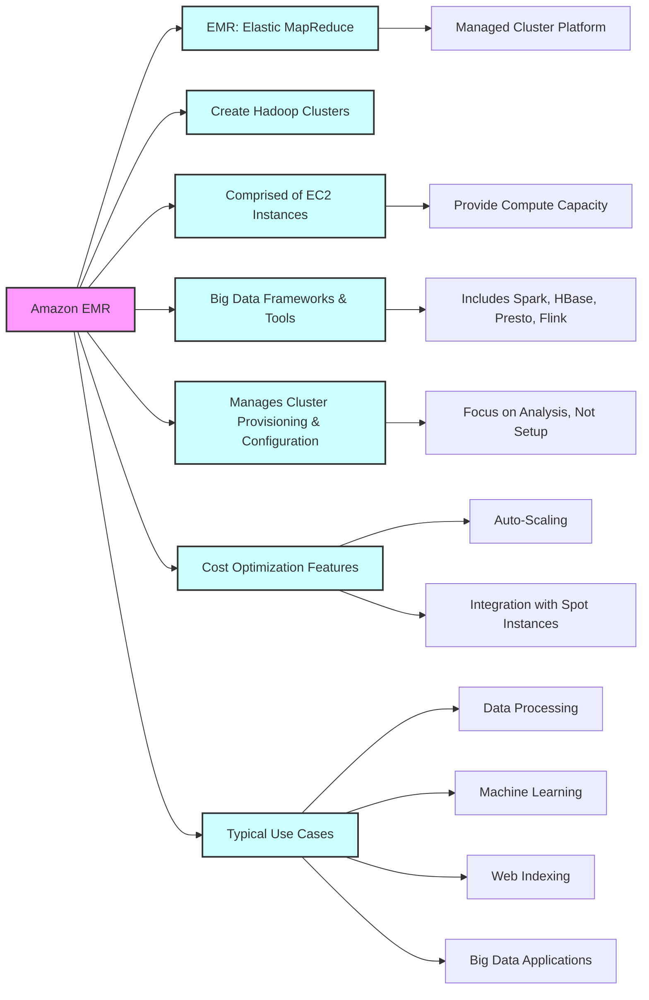
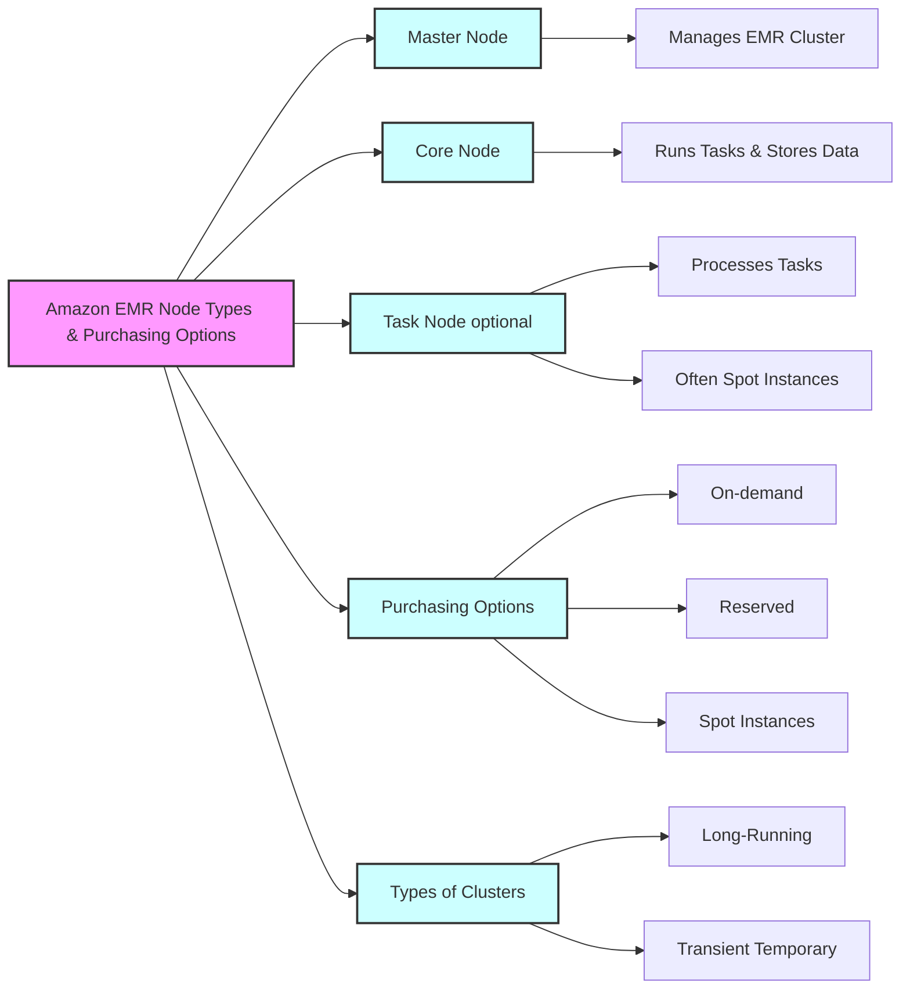

# EMR

```mermaid
graph LR
    EMR[Amazon EMR] --> EMR_Definition[EMR: Elastic MapReduce]
    EMR --> Hadoop_Clusters[Create Hadoop Clusters]
    EMR --> EC2_Instances[Comprised of EC2 Instances]
    EMR --> Big_Data_Frameworks[Big Data Frameworks & Tools]
    EMR --> Cluster_Management[Manages Cluster Provisioning & Configuration]
    EMR --> Cost_Optimization[Cost Optimization Features]
    EMR --> Use_Cases[Typical Use Cases]

    EMR_Definition --> Managed_Platform[Managed Cluster Platform]
    EC2_Instances --> Compute_Capacity[Provide Compute Capacity]
    Big_Data_Frameworks --> Includes[Includes Spark, HBase, Presto, Flink]
    Cluster_Management --> Focus_on_Analysis[Focus on Analysis, Not Setup]
    Cost_Optimization --> Auto_Scaling[Auto-Scaling]
    Cost_Optimization --> Spot_Instances[Integration with Spot Instances]
    Use_Cases --> Data_Processing[Data Processing]
    Use_Cases --> Machine_Learning[Machine Learning]
    Use_Cases --> Web_Indexing[Web Indexing]
    Use_Cases --> Big_Data_Applications[Big Data Applications]

    style EMR fill:#f9f,stroke:#333,stroke-width:2px
    style EMR_Definition fill:#cff,stroke:#333,stroke-width:2px
    style Hadoop_Clusters fill:#cff,stroke:#333,stroke-width:2px
    style EC2_Instances fill:#cff,stroke:#333,stroke-width:2px
    style Big_Data_Frameworks fill:#cff,stroke:#333,stroke-width:2px
    style Cluster_Management fill:#cff,stroke:#333,stroke-width:2px
    style Cost_Optimization fill:#cff,stroke:#333,stroke-width:2px
    style Use_Cases fill:#cff,stroke:#333,stroke-width:2px


```

## Amazon EMR Node Types & Purchasing Options

```mermaid
graph LR
EMR_Nodes[Amazon EMR Node Types & Purchasing Options] --> Master_Node[Master Node]
EMR_Nodes --> Core_Node[Core Node]
EMR_Nodes --> Task_Node[Task Node optional]
EMR_Nodes --> Purchasing_Options[Purchasing Options]
EMR_Nodes --> Clusters_Type[Types of Clusters]

    Master_Node --> Manage_Cluster[Manages EMR Cluster]
    Core_Node --> Run_Tasks_Store_Data[Runs Tasks & Stores Data]
    Task_Node --> Process_Tasks[Processes Tasks]
    Task_Node --> Spot_Instances[Often Spot Instances]

    Purchasing_Options --> On_demand[On-demand]
    Purchasing_Options --> Reserved[Reserved]
    Purchasing_Options --> Spot[Spot Instances]

    Clusters_Type --> Long_Running[Long-Running]
    Clusters_Type --> Transient[Transient Temporary]

    style EMR_Nodes fill:#f9f,stroke:#333,stroke-width:2px
    style Master_Node fill:#cff,stroke:#333,stroke-width:2px
    style Core_Node fill:#cff,stroke:#333,stroke-width:2px
    style Task_Node fill:#cff,stroke:#333,stroke-width:2px
    style Purchasing_Options fill:#cff,stroke:#333,stroke-width:2px
    style Clusters_Type fill:#cff,stroke:#333,stroke-width:2px
```