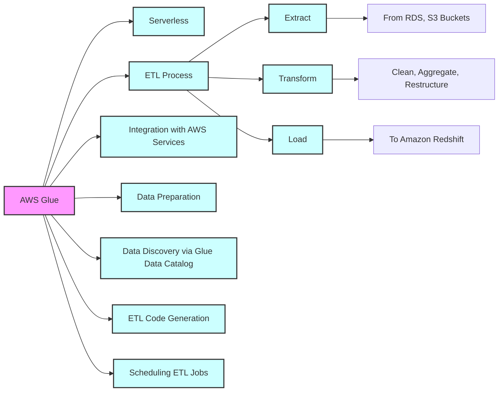
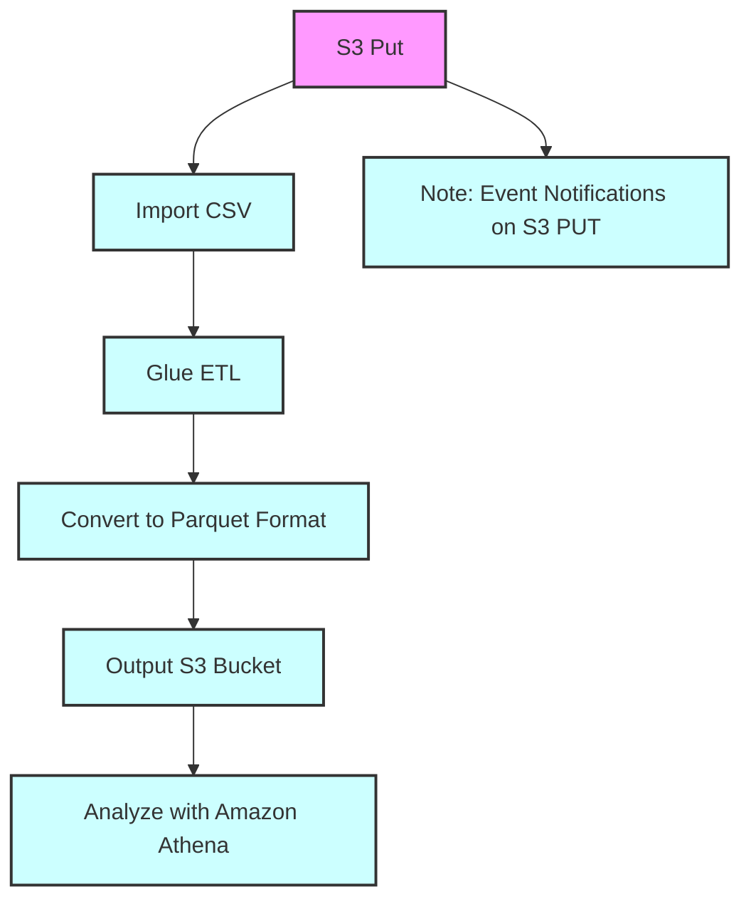
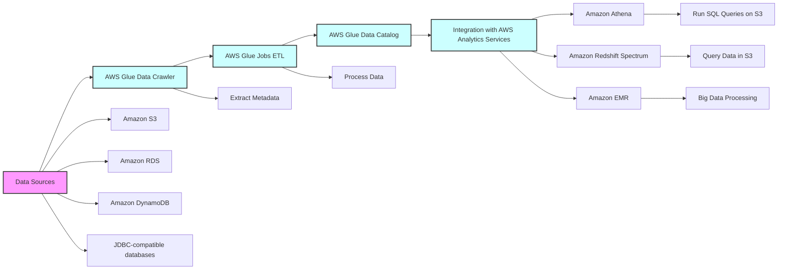
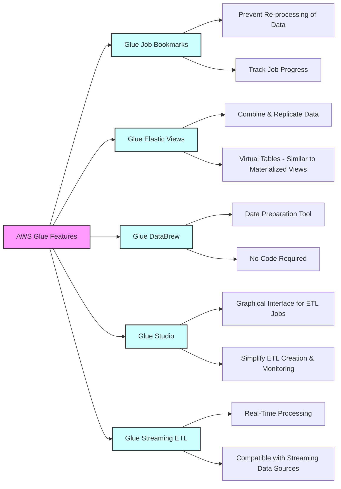

# Glue

```mermaid
graph LR
    AWS_Glue[AWS Glue] --> Serverless[Serverless]
    AWS_Glue --> ETL_Process[ETL Process]

    ETL_Process --> Extract[Extract]
    ETL_Process --> Transform[Transform]
    ETL_Process --> Load[Load]

    Extract --> Data_Sources[From RDS, S3 Buckets]
    Transform --> Data_Transformation[Clean, Aggregate, Restructure]
    Load --> Data_Warehouse[To Amazon Redshift]

    AWS_Glue --> Integration[Integration with AWS Services]
    AWS_Glue --> Data_Preparation[Data Preparation]
    AWS_Glue --> Data_Discovery[Data Discovery via Glue Data Catalog]
    AWS_Glue --> Code_Generation[ETL Code Generation]
    AWS_Glue --> Scheduling[Scheduling ETL Jobs]

    style AWS_Glue fill:#f9f,stroke:#333,stroke-width:2px
    style Serverless fill:#cff,stroke:#333,stroke-width:2px
    style ETL_Process fill:#cff,stroke:#333,stroke-width:2px
    style Extract fill:#cff,stroke:#333,stroke-width:2px
    style Transform fill:#cff,stroke:#333,stroke-width:2px
    style Load fill:#cff,stroke:#333,stroke-width:2px
    style Integration fill:#cff,stroke:#333,stroke-width:2px
    style Data_Preparation fill:#cff,stroke:#333,stroke-width:2px
    style Data_Discovery fill:#cff,stroke:#333,stroke-width:2px
    style Code_Generation fill:#cff,stroke:#333,stroke-width:2px
    style Scheduling fill:#cff,stroke:#333,stroke-width:2px


```

##  Parquet format using AWS Glue

```mermaid
graph TD
    S3_Put[S3 Put] --> Import_CSV[Import CSV]
    Import_CSV --> Glue_ETL[Glue ETL]
    Glue_ETL --> Parquet[Convert to Parquet Format]
    Parquet --> Output_S3_Bucket[Output S3 Bucket]
    Output_S3_Bucket --> Analyze[Analyze with Amazon Athena]

    S3_Put --> Event_Notifications[Note: Event Notifications on S3 PUT]

    style S3_Put fill:#f9f,stroke:#333,stroke-width:2px
    style Import_CSV fill:#cff,stroke:#333,stroke-width:2px
    style Glue_ETL fill:#cff,stroke:#333,stroke-width:2px
    style Parquet fill:#cff,stroke:#333,stroke-width:2px
    style Output_S3_Bucket fill:#cff,stroke:#333,stroke-width:2px
    style Analyze fill:#cff,stroke:#333,stroke-width:2px
    style Event_Notifications fill:#cff,stroke:#333,stroke-width:2px

```

##   Glue Data Catalog

```mermaid
graph LR
Data_Sources[Data Sources] --> Glue_Crawler[AWS Glue Data Crawler]
Glue_Crawler --> Glue_Jobs[AWS Glue Jobs ETL]
Glue_Jobs --> Glue_Data_Catalog[AWS Glue Data Catalog]
Glue_Data_Catalog --> Integration_AWS_Services[Integration with AWS Analytics Services]

    Data_Sources --> S3[Amazon S3]
    Data_Sources --> RDS[Amazon RDS]
    Data_Sources --> DynamoDB[Amazon DynamoDB]
    Data_Sources --> JDBC[JDBC-compatible databases]

    Glue_Crawler --> Metadata_Extraction[Extract Metadata]
    Glue_Jobs --> Process_Data[Process Data]

    Integration_AWS_Services --> Athena[Amazon Athena]
    Integration_AWS_Services --> Redshift_Spectrum[Amazon Redshift Spectrum]
    Integration_AWS_Services --> EMR[Amazon EMR]

    Athena --> SQL_Queries[Run SQL Queries on S3]
    Redshift_Spectrum --> Query_S3_Data[Query Data in S3]
    EMR --> Big_Data_Processing[Big Data Processing]

    style Data_Sources fill:#f9f,stroke:#333,stroke-width:2px
    style Glue_Crawler fill:#cff,stroke:#333,stroke-width:2px
    style Glue_Jobs fill:#cff,stroke:#333,stroke-width:2px
    style Glue_Data_Catalog fill:#cff,stroke:#333,stroke-width:2px
    style Integration_AWS_Services fill:#cff,stroke:#333,stroke-width:2px
```

##   AWS Glue Features

```mermaid
graph LR
AWS_Glue_Features[AWS Glue Features] --> Glue_Job_Bookmarks[Glue Job Bookmarks]
AWS_Glue_Features --> Glue_Elastic_Views[Glue Elastic Views]
AWS_Glue_Features --> Glue_DataBrew[Glue DataBrew]
AWS_Glue_Features --> Glue_Studio[Glue Studio]
AWS_Glue_Features --> Glue_Streaming_ETL[Glue Streaming ETL]

    Glue_Job_Bookmarks --> Prevent_Reprocessing[Prevent Re-processing of Data]
    Glue_Job_Bookmarks --> Track_Job_Progress[Track Job Progress]

    Glue_Elastic_Views --> Combine_Replicate_Data[Combine & Replicate Data]
    Glue_Elastic_Views --> Virtual_Tables[Virtual Tables - Similar to Materialized Views]

    Glue_DataBrew --> Data_Preparation_Tool[Data Preparation Tool]
    Glue_DataBrew --> No_Code_Required[No Code Required]

    Glue_Studio --> Graphical_Interface[Graphical Interface for ETL Jobs]
    Glue_Studio --> Simplify_ETL_Creation[Simplify ETL Creation & Monitoring]

    Glue_Streaming_ETL --> Real_Time_Processing[Real-Time Processing]
    Glue_Streaming_ETL --> Streaming_Sources[Compatible with Streaming Data Sources]

    style AWS_Glue_Features fill:#f9f,stroke:#333,stroke-width:2px
    style Glue_Job_Bookmarks fill:#cff,stroke:#333,stroke-width:2px
    style Glue_Elastic_Views fill:#cff,stroke:#333,stroke-width:2px
    style Glue_DataBrew fill:#cff,stroke:#333,stroke-width:2px
    style Glue_Studio fill:#cff,stroke:#333,stroke-width:2px
    style Glue_Streaming_ETL fill:#cff,stroke:#333,stroke-width:2px
```

