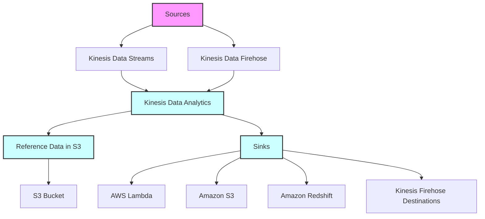
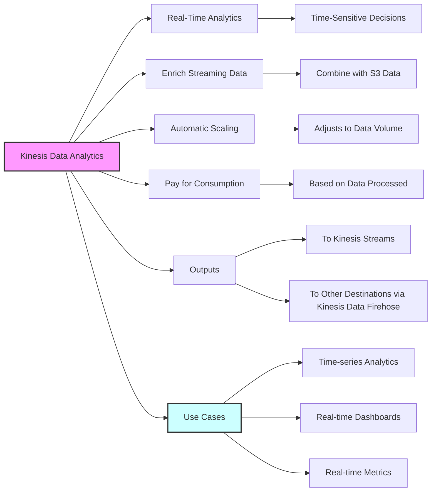
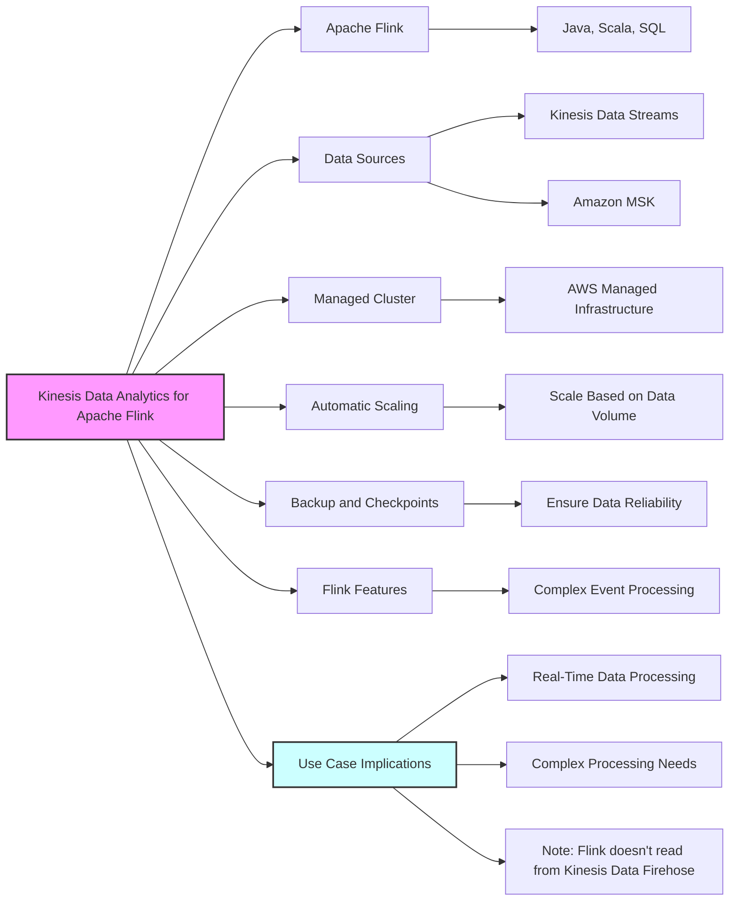

# Kinesis Data Analytics

## Kinesis Data Analytics for Apache Flink

# Kinesis Data Analytics: SQL vs Apache Flink

| Feature                            | SQL Applications                     | Apache Flink                          |
|------------------------------------|--------------------------------------|---------------------------------------|
| **Processing Paradigm**            | SQL-based processing                 | Stream processing with Apache Flink   |
| **Language Support**               | SQL                                  | Java, Scala, SQL                      |
| **Use Cases**                      | Simple transformations and analytics | Complex event processing              |
| **Management**                     | Fully managed                        | Fully managed with additional features like checkpoints and savepoints |
| **Scalability**                    | Automatic scaling                    | Automatic scaling and parallel computation |
| **Integration**                    | Direct integration with Kinesis Data Streams and Firehose | Typically uses Kinesis Data Streams; does not use Firehose |
| **Ease of Use**                    | User-friendly for SQL users          | Requires knowledge of Flink           |
| **Real-Time Analytics**            | Yes, with some limitations           | Yes, with advanced analytics capabilities |
| **Data Enrichment**                | Limited compared to Flink            | Rich data enrichment capabilities     |
| **State Management**               | Not as robust as Flink               | Advanced state management             |
| **Complexity**                     | Lower, suitable for simpler tasks    | Higher, suitable for complex tasks    |
| **Performance**                    | Optimized for SQL queries            | High performance for stream processing tasks |
| **Backups and Checkpoints**        | Not applicable                       | Checkpoints and savepoints for fault tolerance |
| **Pay Model**                      | Pay for actual consumption rate      | Pay for actual consumption rate       |

*Note: The above information is subject to change as AWS updates its services and features.*
