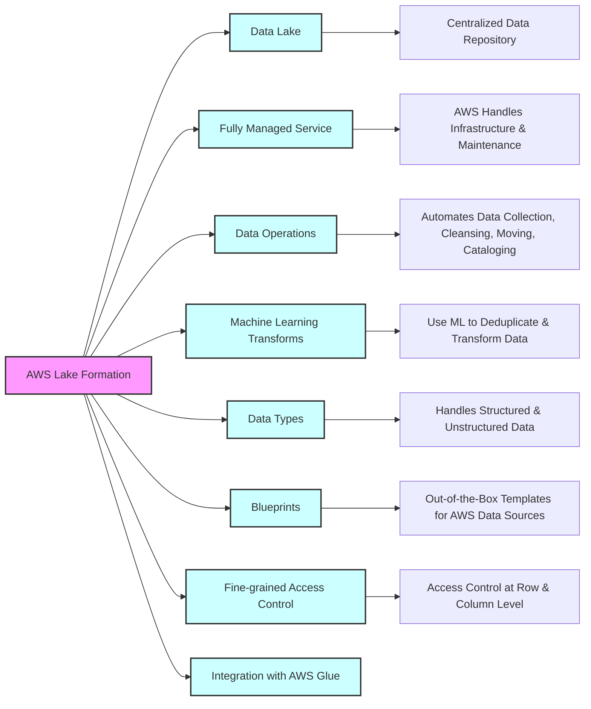
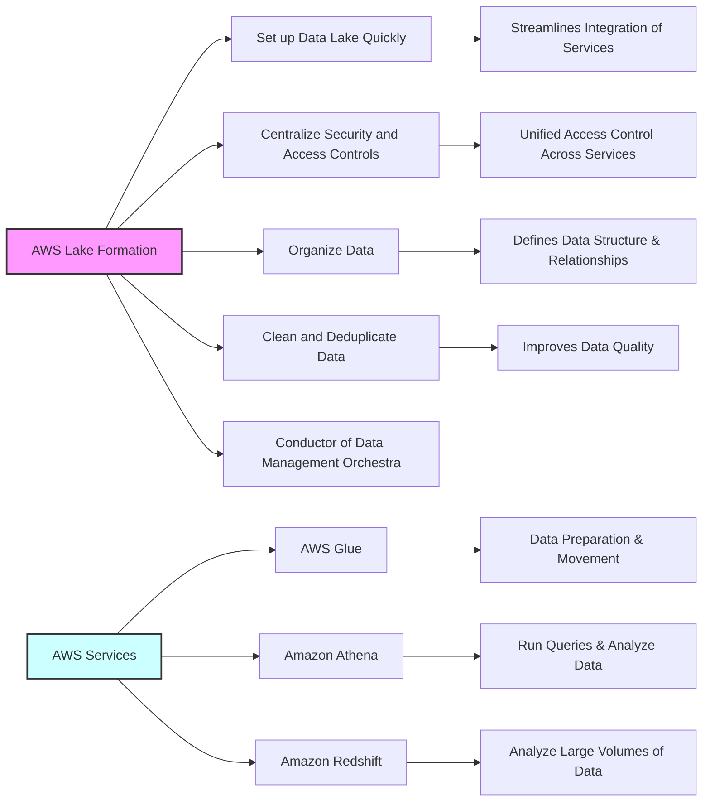
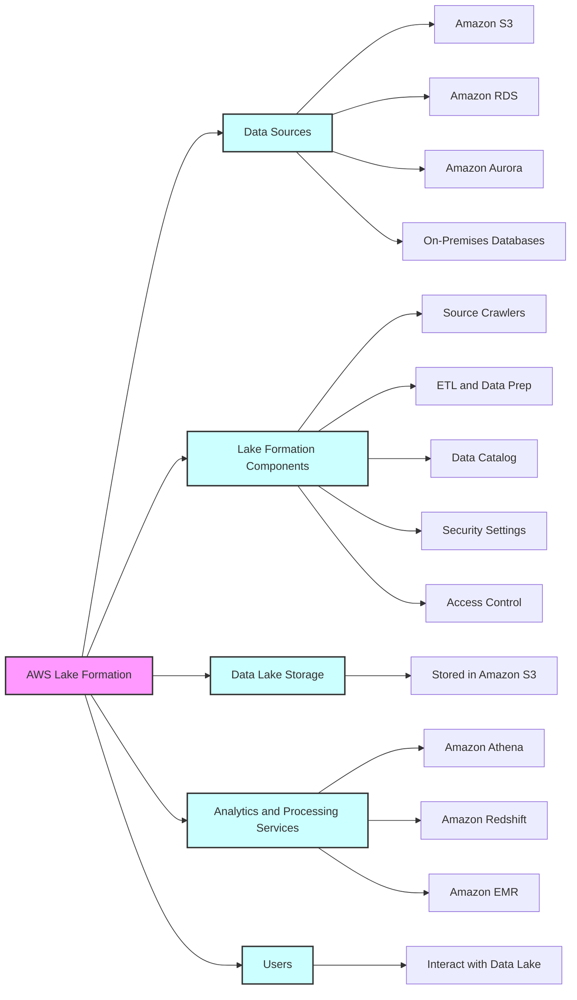
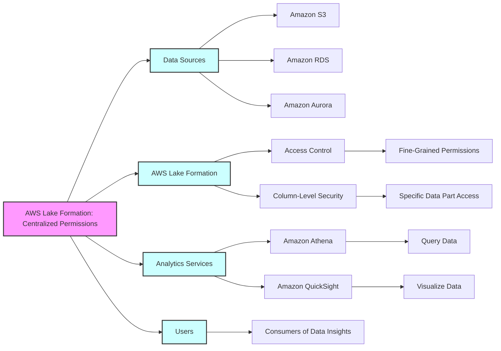

#   AWS Lake Formation

```mermaid
graph LR
AWS_Lake_Formation[AWS Lake Formation] --> Data_Lake[Data Lake]
AWS_Lake_Formation --> Fully_Managed_Service[Fully Managed Service]
AWS_Lake_Formation --> Data_Operations[Data Operations]
AWS_Lake_Formation --> Machine_Learning_Transforms[Machine Learning Transforms]
AWS_Lake_Formation --> Data_Types[Data Types]
AWS_Lake_Formation --> Blueprints[Blueprints]
AWS_Lake_Formation --> Fine_grained_Access_Control[Fine-grained Access Control]
AWS_Lake_Formation --> Integration[Integration with AWS Glue]

    Data_Lake --> Centralized_Repository[Centralized Data Repository]
    Fully_Managed_Service --> AWS_Managed[AWS Handles Infrastructure & Maintenance]
    Data_Operations --> Automates_Processes[Automates Data Collection, Cleansing, Moving, Cataloging]
    Machine_Learning_Transforms --> Deduplicate_Transform[Use ML to Deduplicate & Transform Data]
    Data_Types --> Structured_Unstructured[Handles Structured & Unstructured Data]
    Blueprints --> Predefined_Templates[Out-of-the-Box Templates for AWS Data Sources]
    Fine_grained_Access_Control --> Row_Column_Level[Access Control at Row & Column Level]

    style AWS_Lake_Formation fill:#f9f,stroke:#333,stroke-width:2px
    style Data_Lake fill:#cff,stroke:#333,stroke-width:2px
    style Fully_Managed_Service fill:#cff,stroke:#333,stroke-width:2px
    style Data_Operations fill:#cff,stroke:#333,stroke-width:2px
    style Machine_Learning_Transforms fill:#cff,stroke:#333,stroke-width:2px
    style Data_Types fill:#cff,stroke:#333,stroke-width:2px
    style Blueprints fill:#cff,stroke:#333,stroke-width:2px
    style Fine_grained_Access_Control fill:#cff,stroke:#333,stroke-width:2px
    style Integration fill:#cff,stroke:#333,stroke-width:2px
```

```mermaid
graph LR
LakeFormation[AWS Lake Formation] --> SetUpDataLake[Set up Data Lake Quickly]
LakeFormation --> CentralizeSecurity[Centralize Security and Access Controls]
LakeFormation --> OrganizeData[Organize Data]
LakeFormation --> CleanDeduplicate[Clean and Deduplicate Data]

    SetUpDataLake --> StreamlineProcess[Streamlines Integration of Services]
    CentralizeSecurity --> UnifiedControl[Unified Access Control Across Services]
    OrganizeData --> DataManagement[Defines Data Structure & Relationships]
    CleanDeduplicate --> DataQuality[Improves Data Quality]

    AWS_Services[AWS Services] --> Glue[AWS Glue]
    AWS_Services --> Athena[Amazon Athena]
    AWS_Services --> Redshift[Amazon Redshift]

    Glue --> DataPreparation[Data Preparation & Movement]
    Athena --> RunQueries[Run Queries & Analyze Data]
    Redshift --> AnalyzeVolume[Analyze Large Volumes of Data]

    LakeFormation --> ConductorRole[Conductor of Data Management Orchestra]

    style LakeFormation fill:#f9f,stroke:#333,stroke-width:2px
    style AWS_Services fill:#cff,stroke:#333,stroke-width:2px

```

## Lake Formation Components

```mermaid
graph LR
Lake_Formation[AWS Lake Formation] --> Data_Sources[Data Sources]
Lake_Formation --> Lake_Formation_Components[Lake Formation Components]
Lake_Formation --> Data_Lake_Storage[Data Lake Storage]
Lake_Formation --> Analytics_Processing_Services[Analytics and Processing Services]
Lake_Formation --> Users[Users]

    Data_Sources --> S3[Amazon S3]
    Data_Sources --> RDS[Amazon RDS]
    Data_Sources --> Aurora[Amazon Aurora]
    Data_Sources --> On_Premises[On-Premises Databases]

    Lake_Formation_Components --> Source_Crawlers[Source Crawlers]
    Lake_Formation_Components --> ETL_Data_Prep[ETL and Data Prep]
    Lake_Formation_Components --> Data_Catalog[Data Catalog]
    Lake_Formation_Components --> Security_Settings[Security Settings]
    Lake_Formation_Components --> Access_Control[Access Control]

    Data_Lake_Storage --> S3_Storage[Stored in Amazon S3]

    Analytics_Processing_Services --> Athena[Amazon Athena]
    Analytics_Processing_Services --> Redshift[Amazon Redshift]
    Analytics_Processing_Services --> EMR[Amazon EMR]

    Users --> Interact_Data_Lake[Interact with Data Lake]

    style Lake_Formation fill:#f9f,stroke:#333,stroke-width:2px
    style Data_Sources fill:#cff,stroke:#333,stroke-width:2px
    style Lake_Formation_Components fill:#cff,stroke:#333,stroke-width:2px
    style Data_Lake_Storage fill:#cff,stroke:#333,stroke-width:2px
    style Analytics_Processing_Services fill:#cff,stroke:#333,stroke-width:2px
    style Users fill:#cff,stroke:#333,stroke-width:2px

```

```mermaid
graph LR
Lake_Formation_Permissions[AWS Lake Formation: Centralized Permissions] --> Data_Sources[Data Sources]
Lake_Formation_Permissions --> AWS_Lake_Formation[AWS Lake Formation]
Lake_Formation_Permissions --> Analytics_Services[Analytics Services]
Lake_Formation_Permissions --> Users[Users]

    Data_Sources --> S3[Amazon S3]
    Data_Sources --> RDS[Amazon RDS]
    Data_Sources --> Aurora[Amazon Aurora]

    AWS_Lake_Formation --> Access_Control[Access Control]
    AWS_Lake_Formation --> Column_Level_Security[Column-Level Security]

    Analytics_Services --> Athena[Amazon Athena]
    Analytics_Services --> QuickSight[Amazon QuickSight]

    Users --> Data_Insights_Consumers[Consumers of Data Insights]

    Access_Control --> Fine_Grained_Permissions[Fine-Grained Permissions]
    Column_Level_Security --> Data_Part_Access[Specific Data Part Access]

    Athena --> Query_Data[Query Data]
    QuickSight --> Visualize_Data[Visualize Data]

    style Lake_Formation_Permissions fill:#f9f,stroke:#333,stroke-width:2px
    style Data_Sources fill:#cff,stroke:#333,stroke-width:2px
    style AWS_Lake_Formation fill:#cff,stroke:#333,stroke-width:2px
    style Analytics_Services fill:#cff,stroke:#333,stroke-width:2px
    style Users fill:#cff,stroke:#333,stroke-width:2px
```