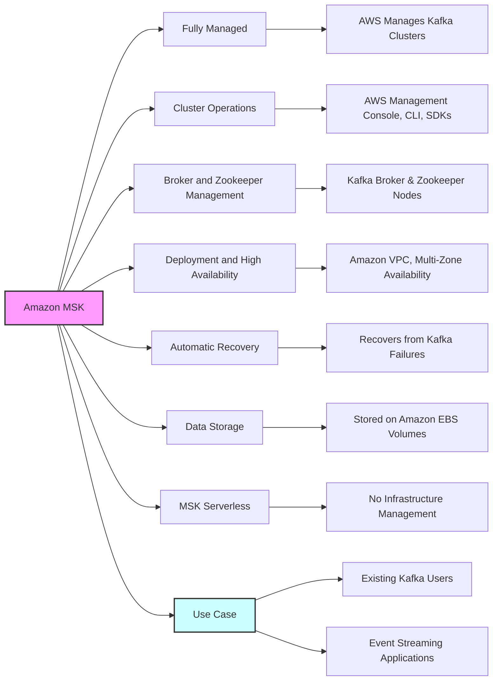
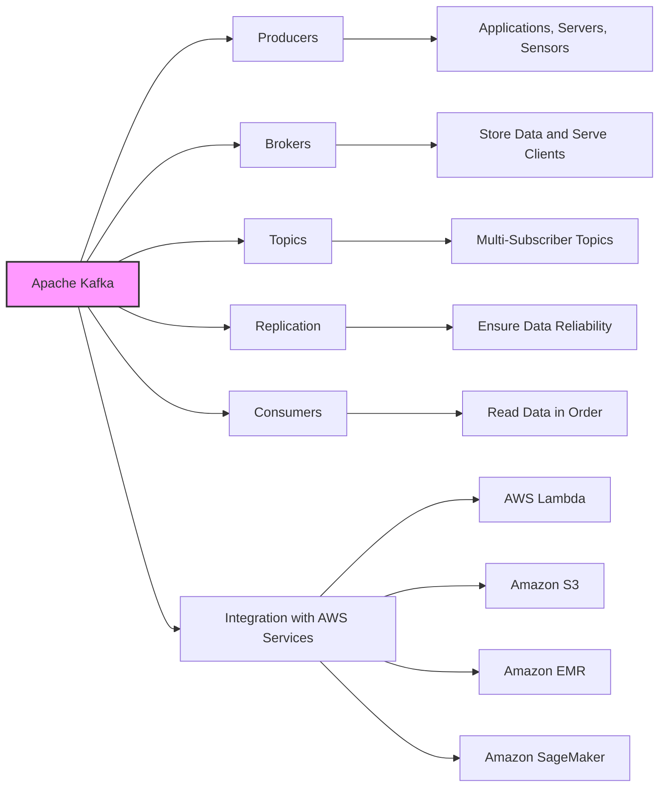
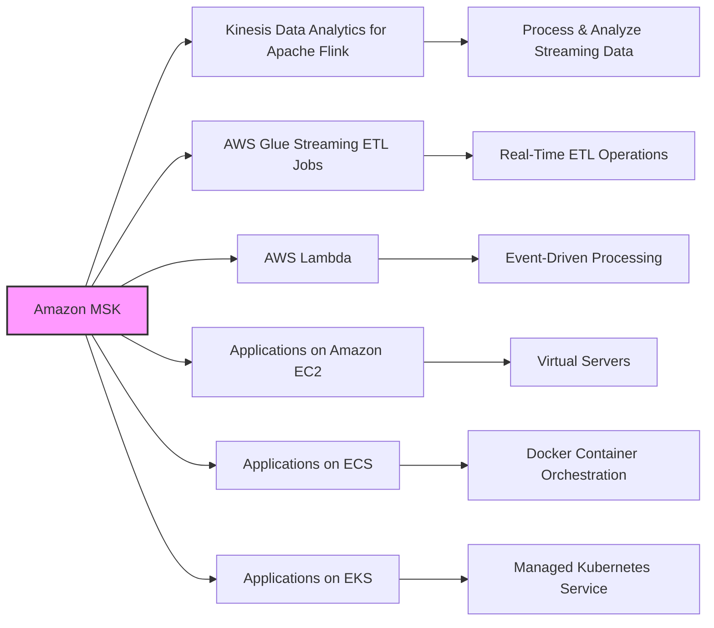

# Amazon MSK Kafka

| Feature                   | Kinesis Data Streams              | Amazon MSK                        |
|---------------------------|-----------------------------------|-----------------------------------|
| Message Size Limit        | 1 MB                              | 1 MB (configurable up to 10MB)    |
| Data Management           | Shards                            | Kafka Topics with Partitions      |
| Shard/Partition Changes   | Shard Splitting & Merging         | Can only add partitions to a topic|
| In-flight Encryption      | TLS                               | PLAINTEXT or TLS                  |
| At-rest Encryption        | KMS                               | KMS                               |
| Management                | AWS Managed                       | Fully managed Apache Kafka        |
| Integration               | AWS services integration          | Kafka ecosystem                   |

