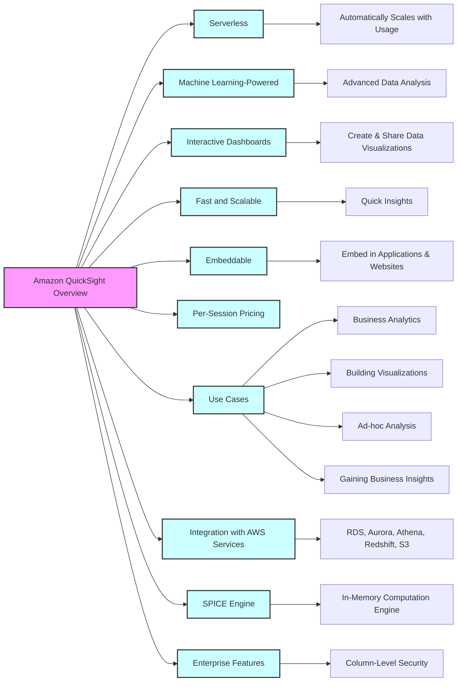
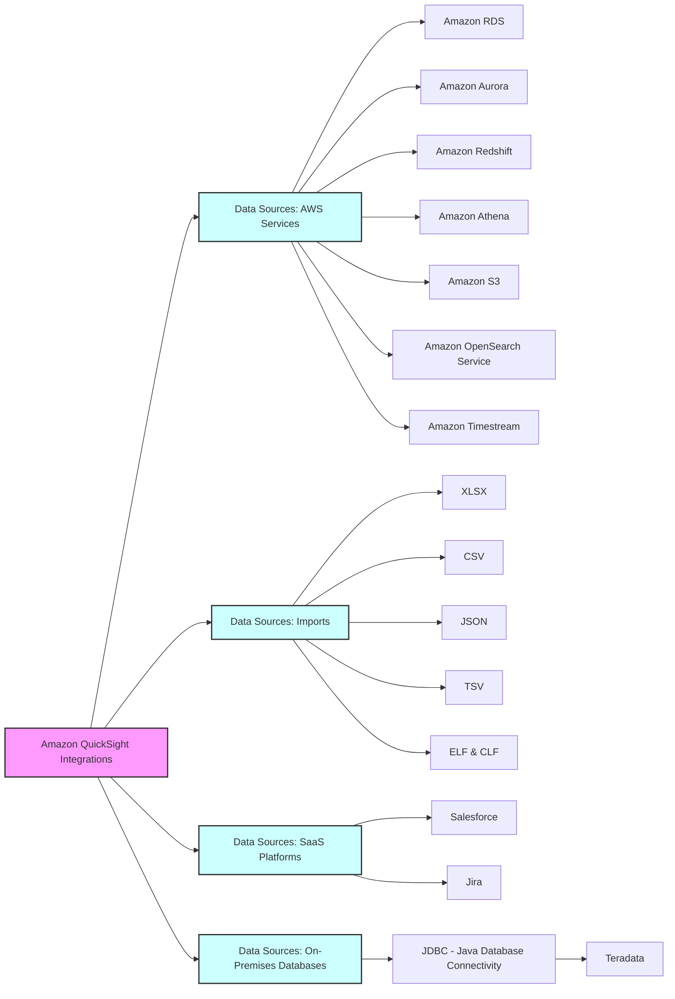
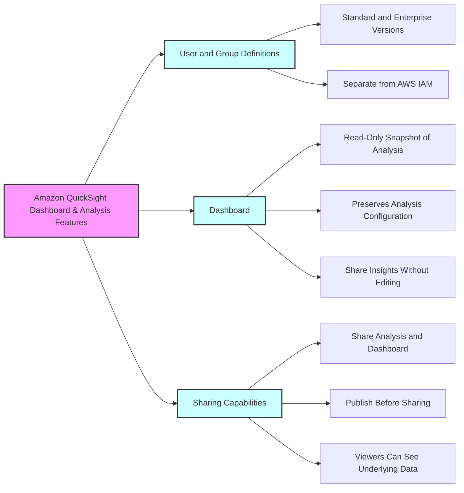

# QuickSight

```mermaid
graph LR
    QuickSight[Amazon QuickSight Overview] --> Serverless[Serverless]
    QuickSight --> ML_Powered[Machine Learning-Powered]
    QuickSight --> Interactive_Dashboards[Interactive Dashboards]
    QuickSight --> Fast_Scalable[Fast and Scalable]
    QuickSight --> Embeddable[Embeddable]
    QuickSight --> Per_Session_Pricing[Per-Session Pricing]
    QuickSight --> Use_Cases[Use Cases]
    QuickSight --> Integration[Integration with AWS Services]
    QuickSight --> SPICE_Engine[SPICE Engine]
    QuickSight --> Enterprise_Features[Enterprise Features]

    Serverless --> Auto_Scale[Automatically Scales with Usage]
    ML_Powered --> Advanced_Analysis[Advanced Data Analysis]
    Interactive_Dashboards --> Create_Share_Visualizations[Create & Share Data Visualizations]
    Fast_Scalable --> Quick_Insights[Quick Insights]
    Embeddable --> Embed_Apps_Websites[Embed in Applications & Websites]
    Use_Cases --> Business_Analytics[Business Analytics]
    Use_Cases --> Visualization_Building[Building Visualizations]
    Use_Cases --> Ad_hoc_Analysis[Ad-hoc Analysis]
    Use_Cases --> Business_Insights[Gaining Business Insights]
    Integration --> AWS_Services_Integration[RDS, Aurora, Athena, Redshift, S3]
    SPICE_Engine --> In_Memory_Calculation[In-Memory Computation Engine]
    Enterprise_Features --> Column_Level_Security[Column-Level Security]

    style QuickSight fill:#f9f,stroke:#333,stroke-width:2px
    style Serverless fill:#cff,stroke:#333,stroke-width:2px
    style ML_Powered fill:#cff,stroke:#333,stroke-width:2px
    style Interactive_Dashboards fill:#cff,stroke:#333,stroke-width:2px
    style Fast_Scalable fill:#cff,stroke:#333,stroke-width:2px
    style Embeddable fill:#cff,stroke:#333,stroke-width:2px
    style Per_Session_Pricing fill:#cff,stroke:#333,stroke-width:2px
    style Use_Cases fill:#cff,stroke:#333,stroke-width:2px
    style Integration fill:#cff,stroke:#333,stroke-width:2px
    style SPICE_Engine fill:#cff,stroke:#333,stroke-width:2px
    style Enterprise_Features fill:#cff,stroke:#333,stroke-width:2px


```

##  Amazon QuickSight Integrations

```mermaid
graph LR
QuickSight_Integration[Amazon QuickSight Integrations] --> AWS_Services[Data Sources: AWS Services]
QuickSight_Integration --> Imports[Data Sources: Imports]
QuickSight_Integration --> SaaS[Data Sources: SaaS Platforms]
QuickSight_Integration --> On_Prem[Data Sources: On-Premises Databases]

    AWS_Services --> RDS[Amazon RDS]
    AWS_Services --> Aurora[Amazon Aurora]
    AWS_Services --> Redshift[Amazon Redshift]
    AWS_Services --> Athena[Amazon Athena]
    AWS_Services --> S3[Amazon S3]
    AWS_Services --> OpenSearch[Amazon OpenSearch Service]
    AWS_Services --> Timestream[Amazon Timestream]

    Imports --> XLSX[XLSX]
    Imports --> CSV[CSV]
    Imports --> JSON[JSON]
    Imports --> TSV[TSV]
    Imports --> ELF_CLF[ELF & CLF]

    SaaS --> Salesforce[Salesforce]
    SaaS --> Jira[Jira]

    On_Prem --> JDBC[JDBC - Java Database Connectivity]
    JDBC --> Teradata[Teradata]

    style QuickSight_Integration fill:#f9f,stroke:#333,stroke-width:2px
    style AWS_Services fill:#cff,stroke:#333,stroke-width:2px
    style Imports fill:#cff,stroke:#333,stroke-width:2px
    style SaaS fill:#cff,stroke:#333,stroke-width:2px
    style On_Prem fill:#cff,stroke:#333,stroke-width:2px
```

##  Amazon QuickSight Dashboard & Analysis Features

```mermaid
graph LR
QuickSight_Features[Amazon QuickSight Dashboard & Analysis Features] --> User_Group_Definitions[User and Group Definitions]
QuickSight_Features --> Dashboard[Dashboard]
QuickSight_Features --> Sharing_Capabilities[Sharing Capabilities]

    User_Group_Definitions --> Standard_Enterprise[Standard and Enterprise Versions]
    User_Group_Definitions --> Separate_from_IAM[Separate from AWS IAM]

    Dashboard --> ReadOnly[Read-Only Snapshot of Analysis]
    Dashboard --> Preserves_Configuration[Preserves Analysis Configuration]
    Dashboard --> Share_Insights[Share Insights Without Editing]

    Sharing_Capabilities --> Share_Analysis_Dashboard[Share Analysis and Dashboard]
    Sharing_Capabilities --> Publish_Dashboard[Publish Before Sharing]
    Sharing_Capabilities --> View_Underlying_Data[Viewers Can See Underlying Data]

    style QuickSight_Features fill:#f9f,stroke:#333,stroke-width:2px
    style User_Group_Definitions fill:#cff,stroke:#333,stroke-width:2px
    style Dashboard fill:#cff,stroke:#333,stroke-width:2px
    style Sharing_Capabilities fill:#cff,stroke:#333,stroke-width:2px
```

