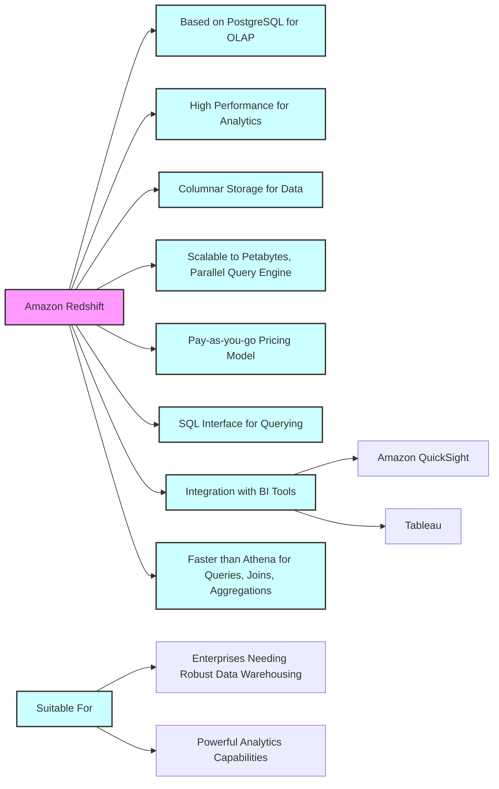
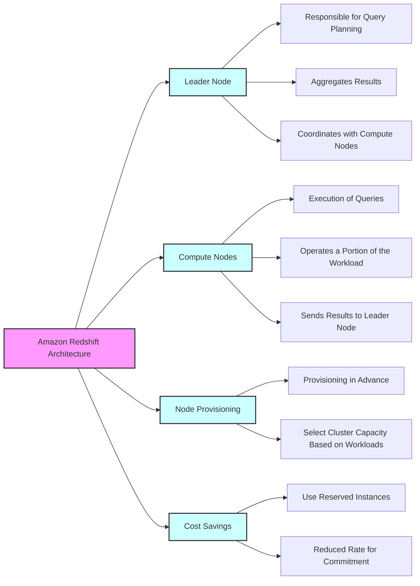
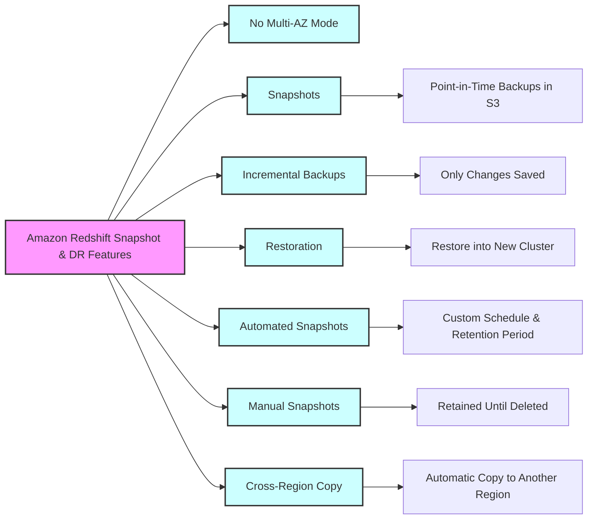
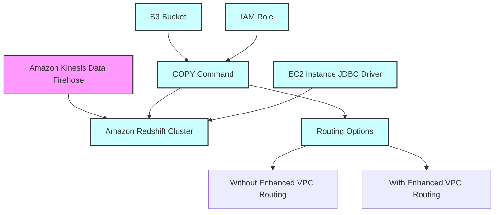
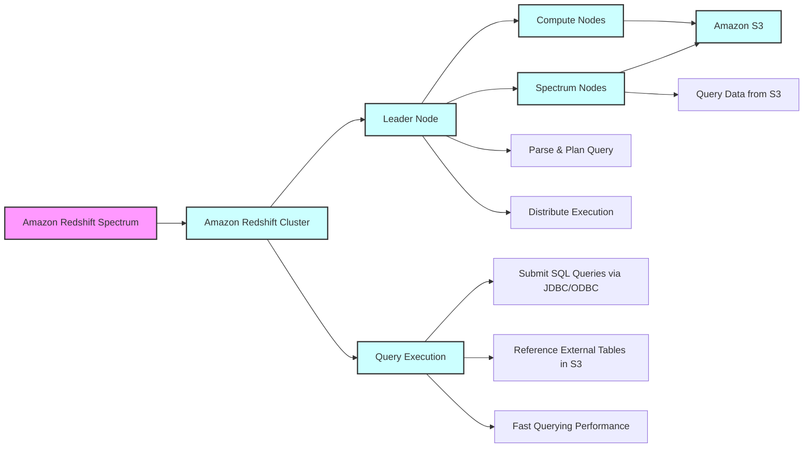
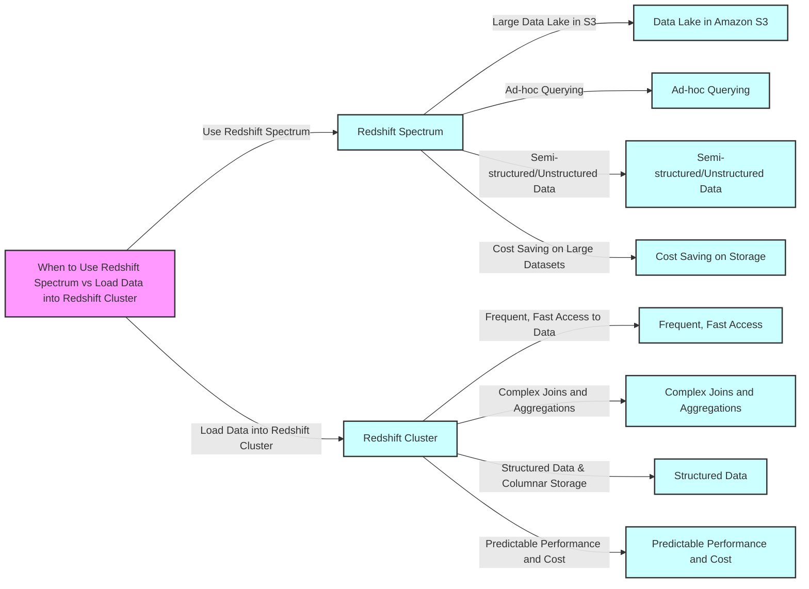

# Redshift

## Amazon Redshift Architecture

## Amazon Redshift Snapshot & DR Features

## Loading data into Redshift

## Amazon Redshift Spectrum

# Redshift Spectrum vs. Redshift Cluster Data Loading Comparison

| Feature | Redshift Spectrum | Redshift Cluster Data Loading |
|---------|-------------------|-------------------------------|
| **Data Storage** | Queries data directly in Amazon S3; no need to load into Redshift. | Requires data to be loaded into Redshift's own managed storage. |
| **Query Overhead** | No data loading or ETL overhead; can start querying immediately. | Data loading and ETL processes are required, which can add overhead. |
| **Scalability** | Can handle exabytes of data; scales automatically with the size of the dataset in S3. | Scaling depends on the size of the Redshift cluster; may require resizing for large datasets. |
| **Performance** | Optimized for complex queries over large, external datasets with less performance impact on the primary cluster. | Optimized for high-performance queries on datasets that are structured and loaded within Redshift. |
| **Cost** | Pay for the amount of data scanned during queries; can be cost-effective for large datasets with infrequent access. | Pay for cluster compute resources and storage; can be cost-efficient for frequently accessed datasets. |
| **Data Format** | Supports various file formats such as Parquet and ORC, which are optimized for analytics workloads. | Data needs to be in formats compatible with Redshift's columnar storage for optimal performance. |
| **Use Cases** | Ideal for occasional complex queries on vast data lakes stored in S3 without the need for transformation. | Best for operational analytics where data is frequently accessed and updated, benefiting from Redshift's performance. |
| **Maintenance** | No cluster management overhead since it's an extension of an existing Redshift cluster. | Requires managing and scaling Redshift clusters according to storage and performance needs. |
| **Data Freshness** | Can query the latest data in S3 without delay. | Loading times can lead to data not being up-to-date until the ETL process completes. |

## When to Use Redshift Spectrum
- For querying large data lakes in Amazon S3 without data movement.
- For ad-hoc querying of infrequently accessed data.
- When working with semi-structured or unstructured data formats.
- To optimize costs for storage with massive datasets.

## When to Load Data into Redshift Cluster
- For frequent, fast access to data for reporting and BI.
- To perform complex joins and aggregations on frequently updated datasets.
- When data is structured and benefits from Redshift's columnar storage.
- For predictable performance and cost control over compute and storage resources.

## Amazon Redshift Spectrum

# Amazon Athena vs Redshift Spectrum Comparison

| Feature | Amazon Athena | Redshift Spectrum |
|---------|---------------|-------------------|
| **Query Engine** | Serverless interactive query service using standard SQL. | Uses Redshift SQL query engine to run queries against data in S3. |
| **Setup** | No infrastructure setup; start querying data in S3 immediately. | Requires an existing Redshift cluster to start querying. |
| **Management** | Fully managed; no clusters to manage. | Requires management of the underlying Redshift cluster. |
| **Pricing** | Charged based on the amount of data scanned per query. | Charged for the Redshift cluster resources and the amount of data scanned. |
| **Data Formats** | Supports a variety of data formats directly in S3. | Supports various formats but can benefit from Redshift's optimization features like columnar storage. |
| **Performance** | Designed for quick, ad-hoc queries; performance can vary based on data format and query complexity. | Can leverage Redshift's performance optimizations for complex queries, especially when data is properly formatted and partitioned. |
| **Use Cases** | Ideal for analysts and data scientists running ad-hoc queries on S3 data. | Suitable for more complex analytical workloads that require the advanced capabilities of Redshift. |
| **Integration** | Directly integrates with S3 and other AWS services. | Integrated with Redshift; can combine queries on S3 data with Redshift managed storage. |
| **Scaling** | Automatically scales to accommodate query execution. | Query execution scales with the size of the Redshift cluster. |
| **Maintenance** | No maintenance required. | Cluster maintenance and optimization are required for better performance. |

## When to Use Amazon Athena
- When there is no need for a persistent database cluster.
- For simple, serverless querying of data lakes.
- For users who prefer a pay-as-you-go model without upfront costs.

## When to Use Redshift Spectrum
- When already using Amazon Redshift and you need to query large datasets in S3.
- For complex queries that benefit from Redshift's query optimizer.
- When you require consistent performance and are willing to manage and scale Redshift clusters.
