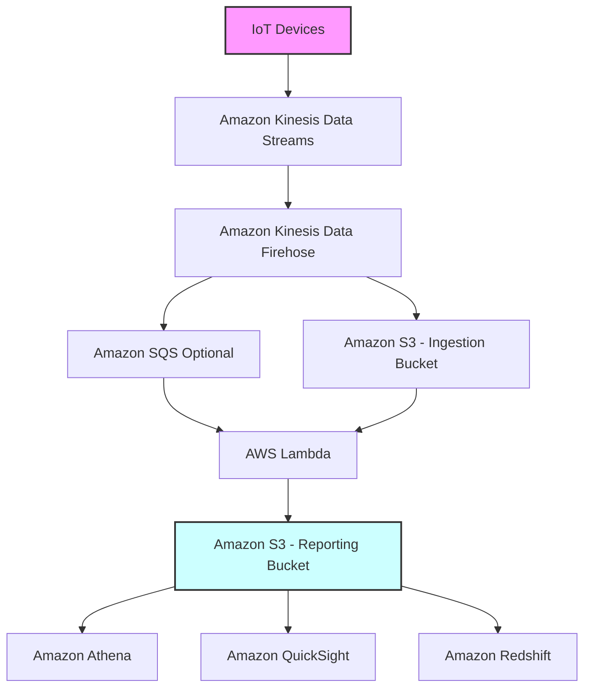

# Big Data Ingestion Pipeline

```mermaid
graph TD
    IoT_Devices[IoT Devices] --> Kinesis_Data_Streams[Amazon Kinesis Data Streams]
    Kinesis_Data_Streams --> Kinesis_Data_Firehose[Amazon Kinesis Data Firehose]
    Kinesis_Data_Firehose --> S3_Ingestion_Bucket[Amazon S3 - Ingestion Bucket]
    Kinesis_Data_Firehose --> SQS[Amazon SQS Optional]
SQS --> Lambda[AWS Lambda]
S3_Ingestion_Bucket --> Lambda
Lambda --> S3_Reporting_Bucket[Amazon S3 - Reporting Bucket]
S3_Reporting_Bucket --> Athena[Amazon Athena]
S3_Reporting_Bucket --> QuickSight[Amazon QuickSight]
S3_Reporting_Bucket --> Redshift[Amazon Redshift]

style IoT_Devices fill:#f9f,stroke:#333,stroke-width:2px
style S3_Reporting_Bucket fill:#cff,stroke:#333,stroke-width:2px


```
