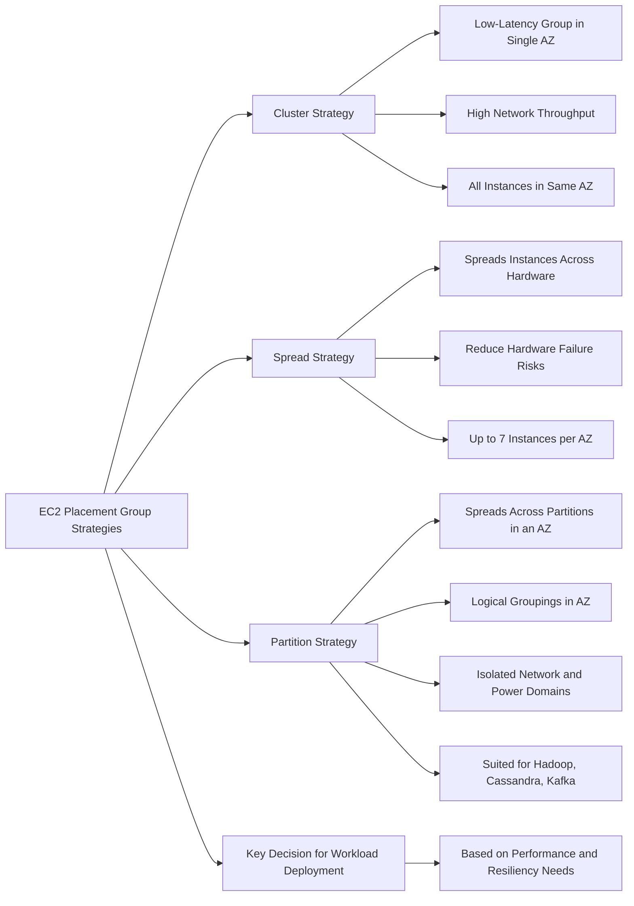
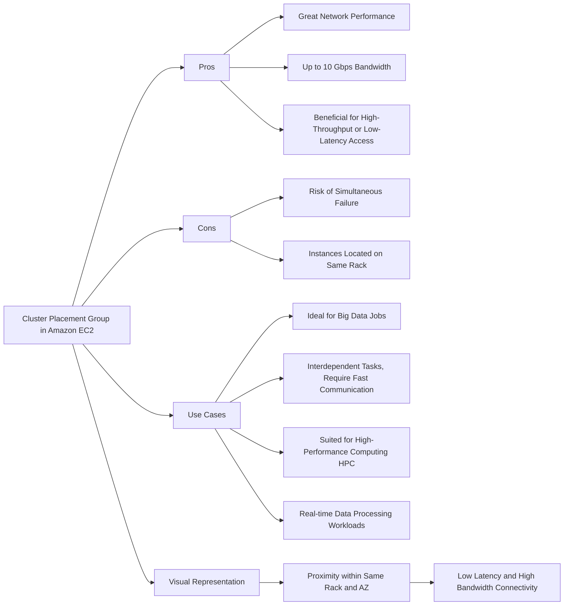
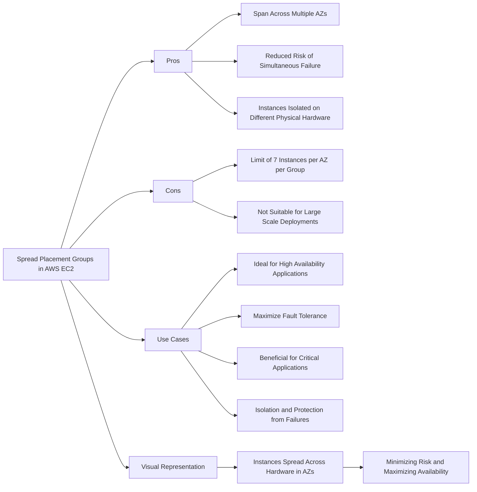
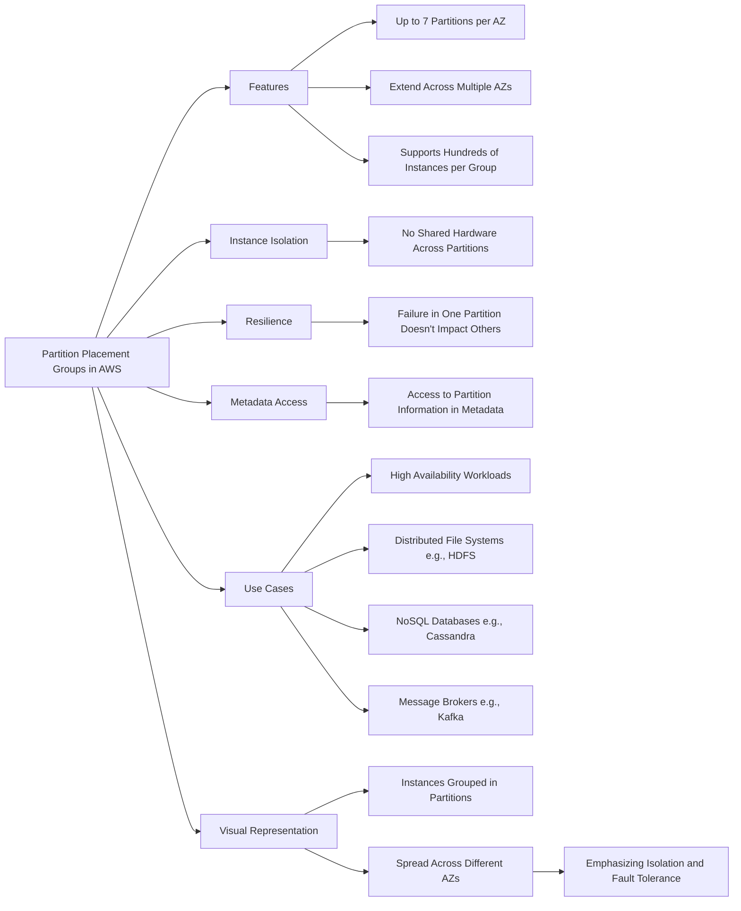
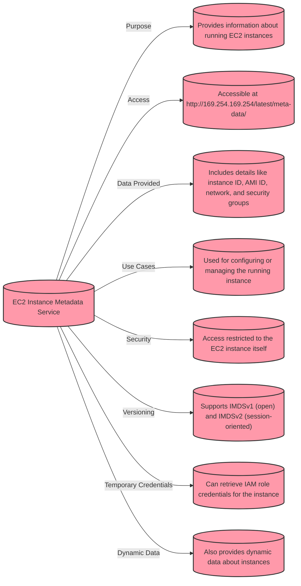
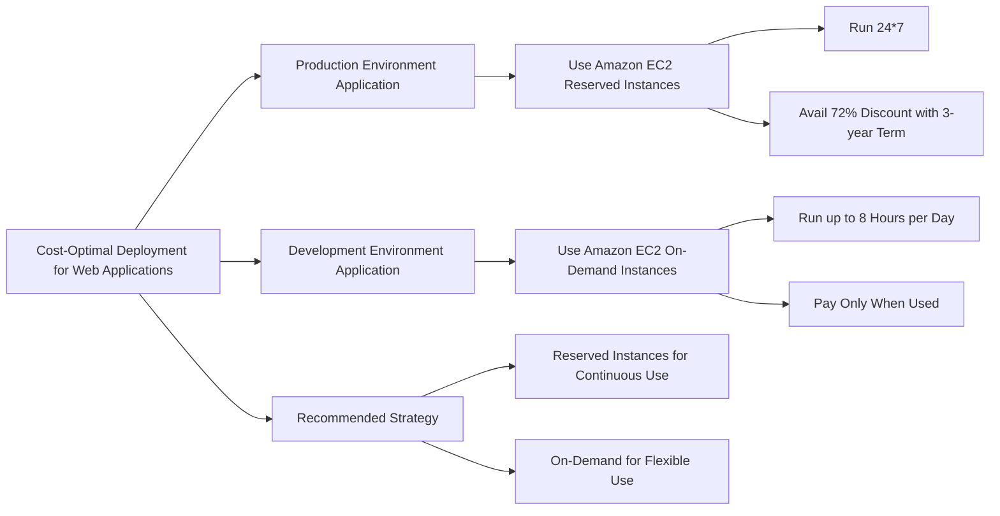
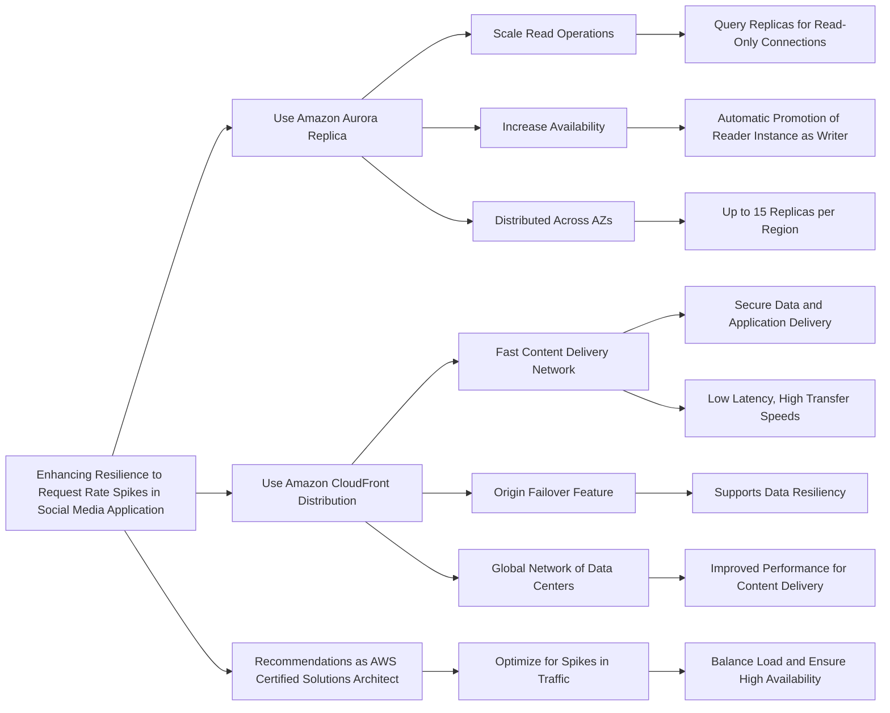
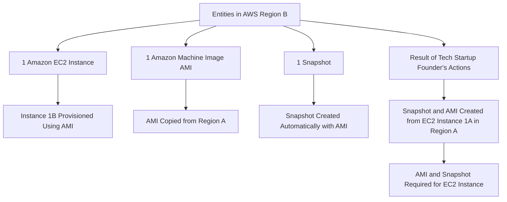
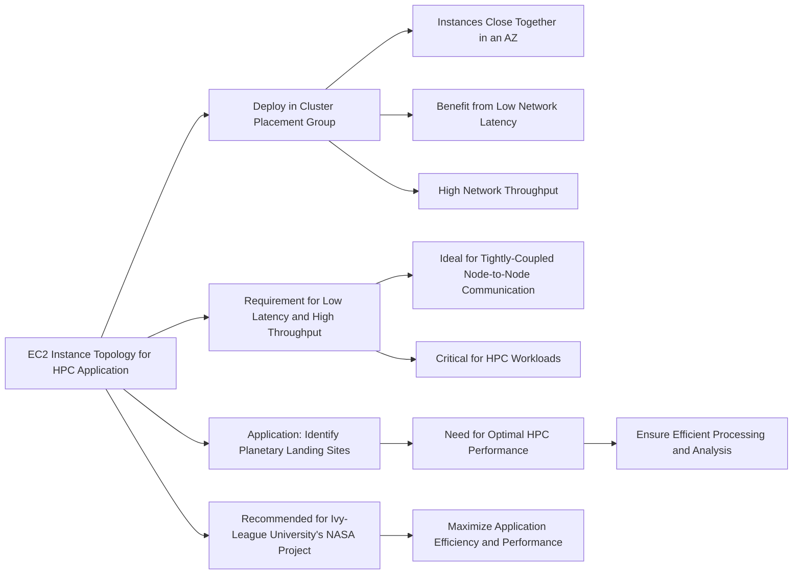

# EC2

## For exam

1. A company has a web application that runs 24*7 in the production environment. The development team at the company runs a clone of the same application in the dev environment for up to 8 hours every day. The company wants to build the MOST cost-optimal solution by deploying these applications using the best-fit pricing options for Amazon Elastic Compute Cloud (Amazon EC2) instances.

What would you recommend?

***Answer:*** For the given use case, you can use Amazon EC2 Reserved Instances for the production application as it is run 24*7. This way you can get a 72% discount if you avail a 3-year term. You can use on-demand instances for the dev application since it is only used for up to 8 hours per day. On-demand offers the flexibility to only pay for the Amazon EC2 instance when it is being used (0 to 8 hours for the given use case).

2. A company manages a multi-tier social media application that runs on Amazon Elastic Compute Cloud (Amazon EC2) instances behind an Application Load Balancer. The instances run in an Amazon EC2 Auto Scaling group across multiple Availability Zones (AZs) and use an Amazon Aurora database. As an AWS Certified Solutions Architect – Associate, you have been tasked to make the application more resilient to periodic spikes in request rates.

Which of the following solutions would you recommend for the given use-case? (Select two)

***Answer*** Correct options:

You can use Amazon Aurora replicas and Amazon CloudFront distribution to make the application more resilient to spikes in request rates.

Use Amazon Aurora Replica

Amazon Aurora Replicas have two main purposes. You can issue queries to them to scale the read operations for your application. You typically do so by connecting to the reader endpoint of the cluster. That way, Aurora can spread the load for read-only connections across as many Aurora Replicas as you have in the cluster. Amazon Aurora Replicas also help to increase availability. If the writer instance in a cluster becomes unavailable, Aurora automatically promotes one of the reader instances to take its place as the new writer. Up to 15 Aurora Replicas can be distributed across the Availability Zones (AZs) that a DB cluster spans within an AWS Region.

Use Amazon CloudFront distribution in front of the Application Load Balancer

Amazon CloudFront is a fast content delivery network (CDN) service that securely delivers data, videos, applications, and APIs to customers globally with low latency, high transfer speeds, all within a developer-friendly environment. CloudFront points of presence (POPs) (edge locations) make sure that popular content can be served quickly to your viewers. Amazon CloudFront also has regional edge caches that bring more of your content closer to your viewers, even when the content is not popular enough to stay at a POP, to help improve performance for that content.

Amazon CloudFront offers an origin failover feature to help support your data resiliency needs. Amazon CloudFront is a global service that delivers your content through a worldwide network of data centers called edge locations or points of presence (POPs). If your content is not already cached in an edge location, Amazon CloudFront retrieves it from an origin that you've identified as the source for the definitive version of the content.

3. The solo founder at a tech startup has just created a brand new AWS account. The founder has provisioned an Amazon EC2 instance 1A which is running in AWS Region A. Later, he takes a snapshot of the instance 1A and then creates a new Amazon Machine Image (AMI) in Region A from this snapshot. This AMI is then copied into another Region B. The founder provisions an instance 1B in Region B using this new AMI in Region B.

At this point in time, what entities exist in Region B?

***Answer:*** Correct option:

1 Amazon EC2 instance, 1 AMI and 1 snapshot exist in Region B

An Amazon Machine Image (AMI) provides the information required to launch an instance. You must specify an AMI when you launch an instance. When the new AMI is copied from Region A into Region B, it automatically creates a snapshot in Region B because AMIs are based on the underlying snapshots. Further, an instance is created from this AMI in Region B. Hence, we have 1 Amazon EC2 instance, 1 AMI and 1 snapshot in Region B.

4. An ivy-league university is assisting NASA to find potential landing sites for exploration vehicles of unmanned missions to our neighboring planets. The university uses High Performance Computing (HPC) driven application architecture to identify these landing sites.

Which of the following Amazon EC2 instance topologies should this application be deployed on?

***Answer:*** The Amazon EC2 instances should be deployed in a cluster placement group so that the underlying workload can benefit from low network latency and high network throughput

The key thing to understand in this question is that HPC workloads need to achieve low-latency network performance necessary for tightly-coupled node-to-node communication that is typical of HPC applications. Cluster placement groups pack instances close together inside an Availability Zone. These are recommended for applications that benefit from low network latency, high network throughput, or both. Therefore this option is the correct answer.

