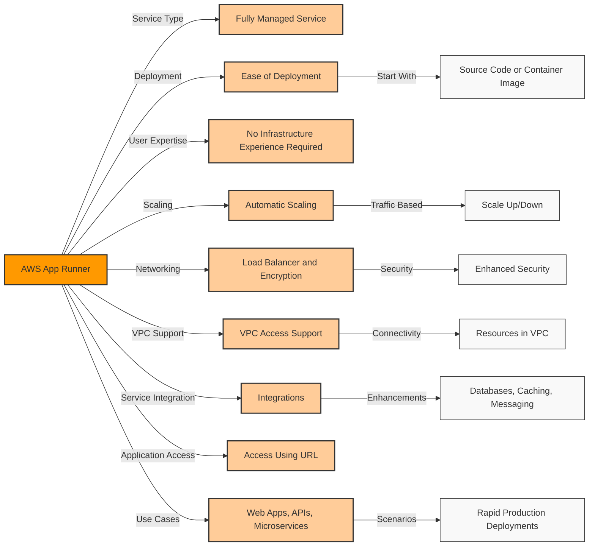

# AWS App Runner

```mermaid
graph LR
    A[AWS App Runner] -->|Service Type| B[Fully Managed Service]
    A -->|Deployment| C[Ease of Deployment]
    A -->|User Expertise| D[No Infrastructure Experience Required]
    A -->|Scaling| E[Automatic Scaling]
    A -->|Networking| F[Load Balancer and Encryption]
    A -->|VPC Support| G[VPC Access Support]
    A -->|Service Integration| H[Integrations]
    A -->|Application Access| I[Access Using URL]
    A -->|Use Cases| J[Web Apps, APIs, Microservices]

    C -->|Start With| K[Source Code or Container Image]
    E -->|Traffic Based| L[Scale Up/Down]
    F -->|Security| M[Enhanced Security]
    G -->|Connectivity| N[Resources in VPC]
    H -->|Enhancements| O[Databases, Caching, Messaging]
    J -->|Scenarios| P[Rapid Production Deployments]

    classDef aws fill:#ff9900,stroke:#333,stroke-width:2px;
    classDef feature fill:#ffcc99,stroke:#333,stroke-width:2px;
    classDef detail fill:#f9f9f9,stroke:#333,stroke-width:1px;

    class A aws;
    class B,C,D,E,F,G,H,I,J feature;
    class K,L,M,N,O,P detail;


```
