# ECS

## Amazon ECS EC2 Launch Type

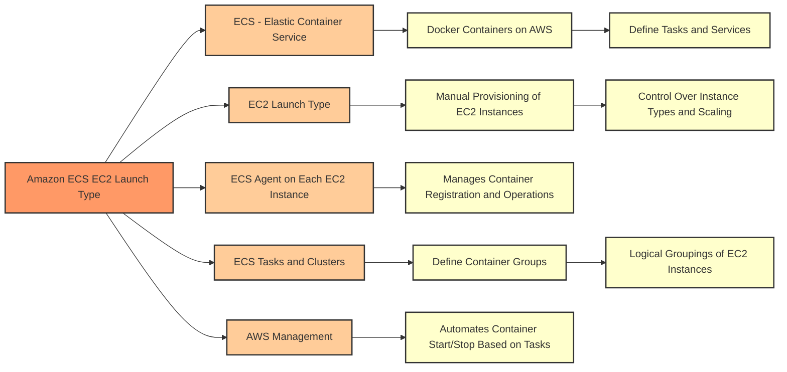

## Amazon ECS Fargate Launch Type

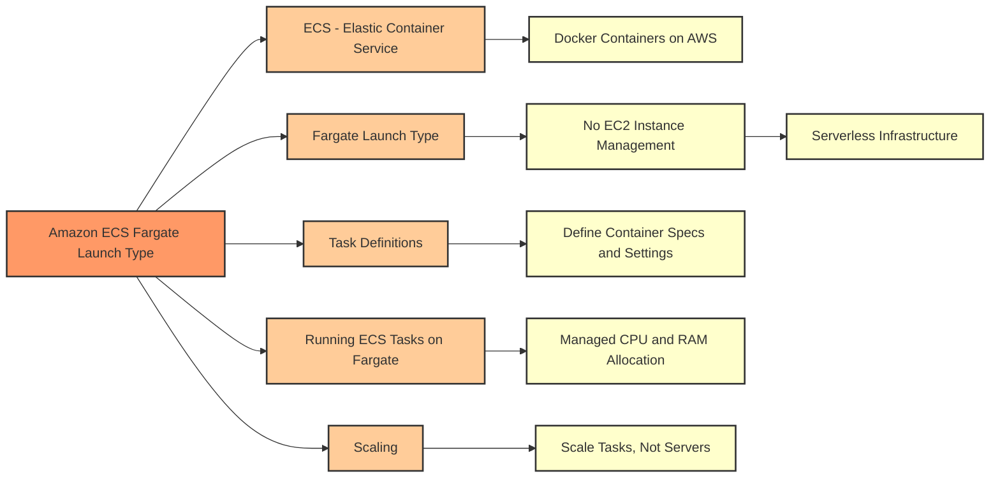

## IAM Roles for Amazon ECS - EC2 Launch Type

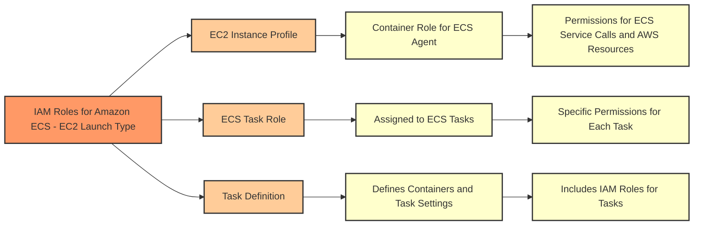

| Feature               | EC2 Instance Profile                                                                                             | ECS Task Role                                                                                                          |
|-----------------------|-----------------------------------------------------------------------------------------------------------------|-----------------------------------------------------------------------------------------------------------------------|
| Purpose               | Provides permissions to the EC2 instance to allow the ECS agent to manage the containers.                        | Provides permissions to the ECS task itself, allowing each task to interact with AWS services according to its needs.  |
| Scope                 | Applies to the EC2 instance level.                                                                               | Applies to the task level, affecting all containers within the task.                                                   |
| Permissions           | Generally broader, used for instance management tasks such as registering with the ECS cluster.                  | More granular, intended for specific AWS service interactions required by the task.                                    |
| Defined In            | Associated with the EC2 instance itself.                                                                         | Defined within the ECS task definition.                                                                                |
| Used By               | ECS Agent running on the EC2 instance.                                                                           | Individual tasks and containers launched by ECS.                                                                       |
| Typical Actions       | Register the instance with the ECS cluster, send logs to CloudWatch, pull images from ECR.                       | Access S3 buckets, write to DynamoDB tables, publish messages to SNS topics, etc.                                      |
| Assumed By            | The ECS agent when making calls to AWS services on behalf of the EC2 instance.                                   | The ECS service when the task makes calls to AWS services.                                                             |
| Flexibility           | Less flexible as it applies the same role to all tasks on the instance.                                          | More flexible, allows different tasks to have different roles.                                                         |
| Best Used For         | Instances that need to perform administrative actions on the cluster or other AWS services.                       | Tasks that require specific AWS access without granting broad permissions to the underlying infrastructure.            |

## Amazon ECS Load Balancers

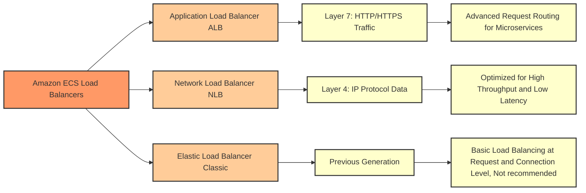

## Amazon ECS with EFS
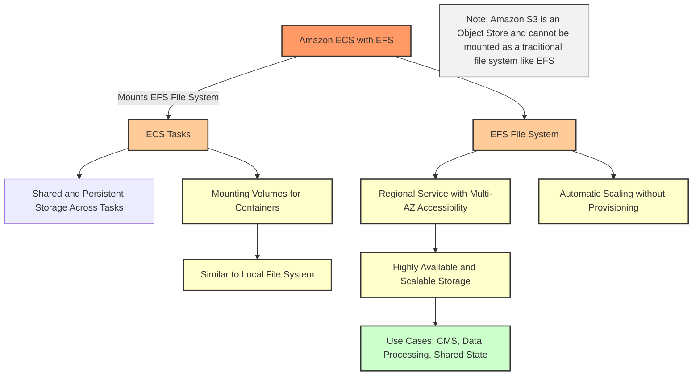

## Capacity Providers in Amazon ECS
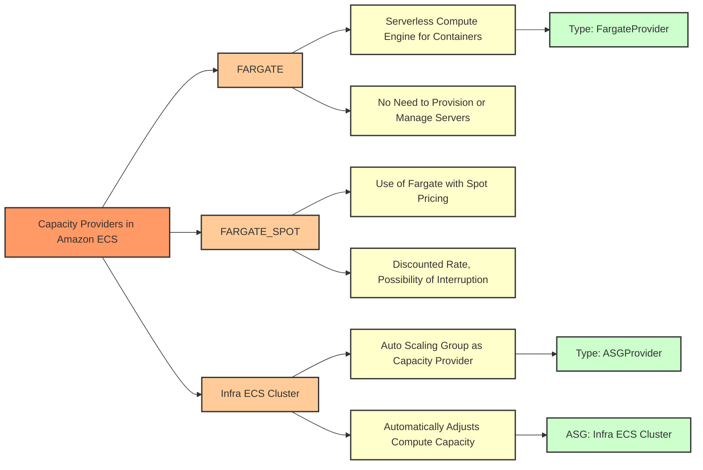

## Auto Scaling in Amazon ECS
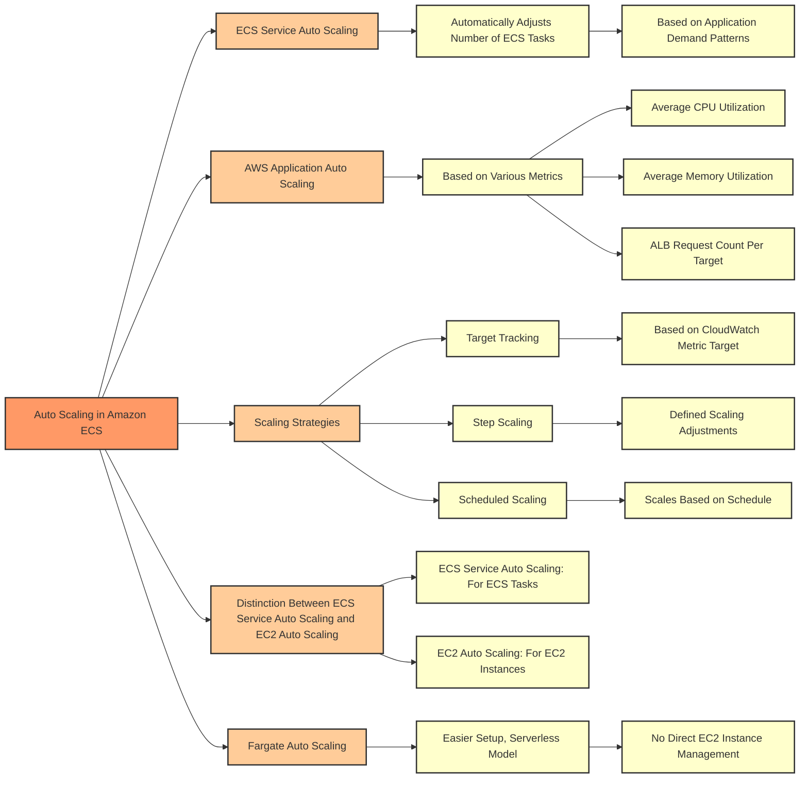

## EC2 Launch Type in ECS Auto Scaling EC2 Instances
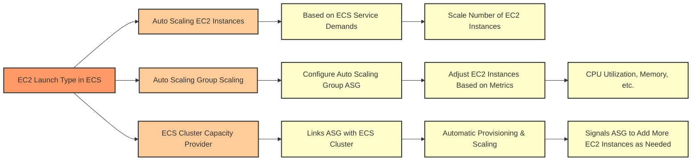

| Feature                     | EC2 ASG (Auto Scaling Groups) | ECS Service Auto Scaling       | Fargate Auto Scaling           |
|-----------------------------|-------------------------------|--------------------------------|--------------------------------|
| Scaling Target              | EC2 Instances                 | ECS Tasks                      | ECS Tasks                      |
| Scaling Metrics             | CPU, Network, Custom          | CPU, Memory, Custom            | CPU, Memory, Custom            |
| Infrastructure Management   | Manual (by user)              | Managed by ECS                 | Serverless, fully managed by AWS|
| Pricing                     | Per EC2 instance hour         | Per task running               | Per task running               |
| Availability                | Multiple AZs                  | Multiple AZs                   | Multiple AZs                   |
| Integration with Load Balancer | Yes                         | Yes                            | Yes                            |
| Use Case                    | General purpose EC2 workloads | Containerized workloads        | Containerized workloads        |
| Failover Support            | Yes, via AZs and health checks| Yes, via task health checks    | Yes, via task health checks    |
| Granularity                 | Instance level                | Task (container) level         | Task (container) level         |
| Scalability                 | Manual scaling rules          | Automatic task scaling         | Automatic task scaling         |
| Server Management           | Required                      | Not required                   | Not required                   |
| Spot Instance Support       | Yes                           | Yes (if using EC2 launch type) | Yes (with Fargate Spot)        |

## CloudWatch Metric: ECS Service CPU Usage
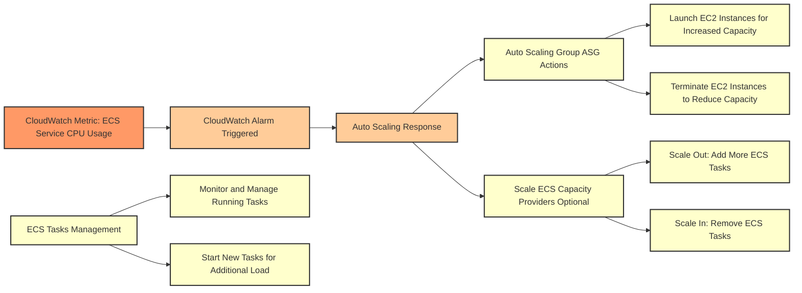

## Upload Object to S3
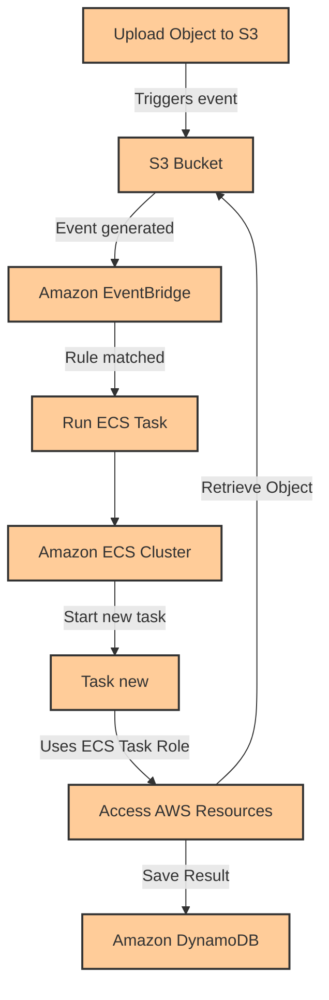

## Amazon EventBridge
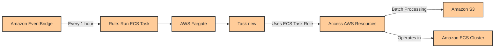

## ECR Role
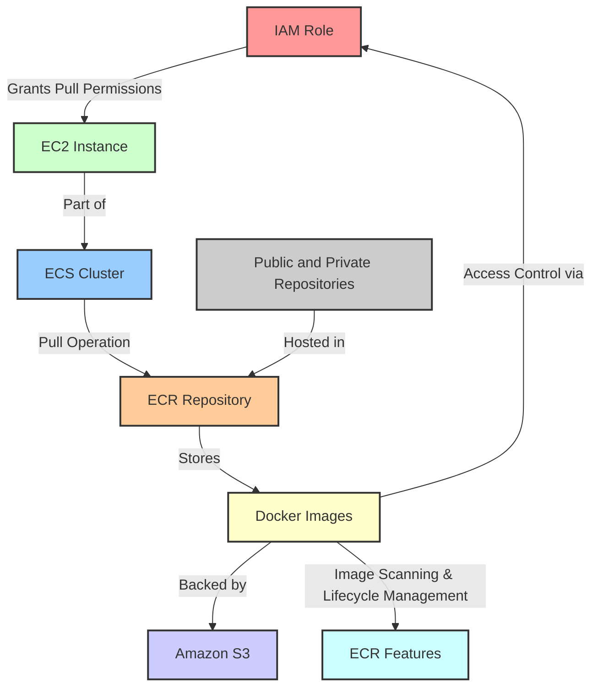

| ECS Term                | EKS Term                | Description                                                                                     |
|-------------------------|-------------------------|-------------------------------------------------------------------------------------------------|
| Task Definition         | Pod Specification       | Defines the container and volume configuration for a set of containers.                         |
| Task                    | Pod                     | A running set of containers on the cluster.                                                     |
| Service                 | Deployment/StatefulSet  | Manages the desired number of tasks/pods ensuring specified number runs and are updated correctly. |
| Container Instance      | Node                    | An EC2 instance that is part of an ECS Cluster / A Kubernetes worker machine in EKS.            |
| ECS Agent               | Kubelet                 | The agent that runs on each node in the cluster to manage the containers.                       |
| Cluster                 | Cluster                 | A logical set of EC2 instances that host your application containers.                           |
| ECS Service Auto Scaling| Horizontal Pod Autoscaler| Automatically adjusts the number of running tasks/pods based on demand.                        |
| Fargate                 | Fargate                 | A serverless compute engine for containers that works with both ECS and EKS.                    |
| Launch Type             | Node Group              | Determines the type of infrastructure on which your tasks/pods will be launched.                |
| Service Discovery       | Service/Ingress         | Allows your services to discover and talk to each other.                                        |
| Task Role               | Service Account         | Assigns permissions to the task/pod level, controlling what actions they can perform.           |

## For exam

1. A leading social media analytics company is contemplating moving its dockerized application stack into AWS Cloud. The company is not sure about the pricing for using Amazon Elastic Container Service (Amazon ECS) with the EC2 launch type compared to the Amazon Elastic Container Service (Amazon ECS) with the Fargate launch type.

Which of the following is correct regarding the pricing for these two services?

***Answer***With the Fargate launch type, you pay for the amount of vCPU and memory resources that your containerized application requests. vCPU and memory resources are calculated from the time your container images are pulled until the Amazon ECS Task terminates, rounded up to the nearest second. With the EC2 launch type, there is no additional charge for the EC2 launch type. You pay for AWS resources (e.g. EC2 instances or EBS volumes) you create to store and run your application.

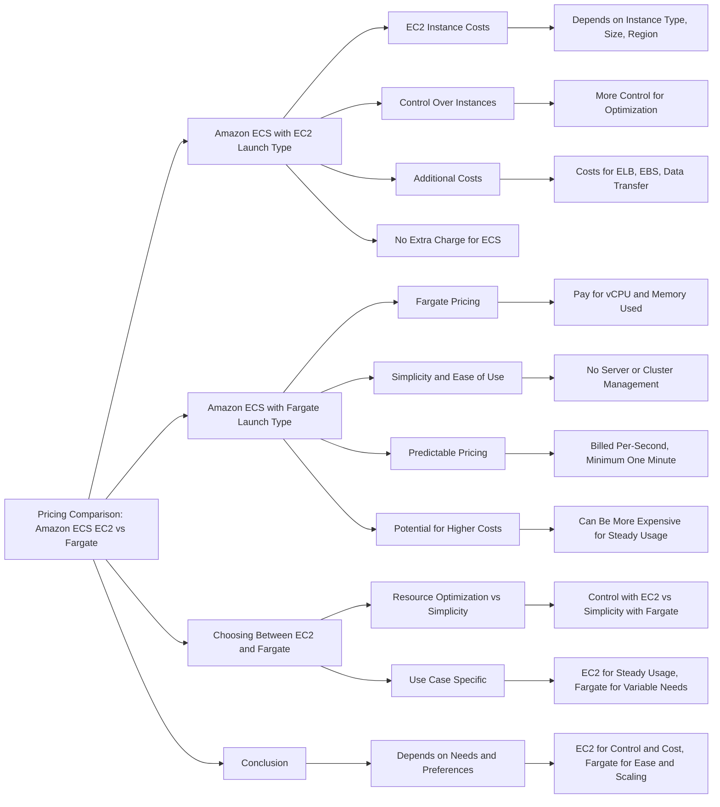