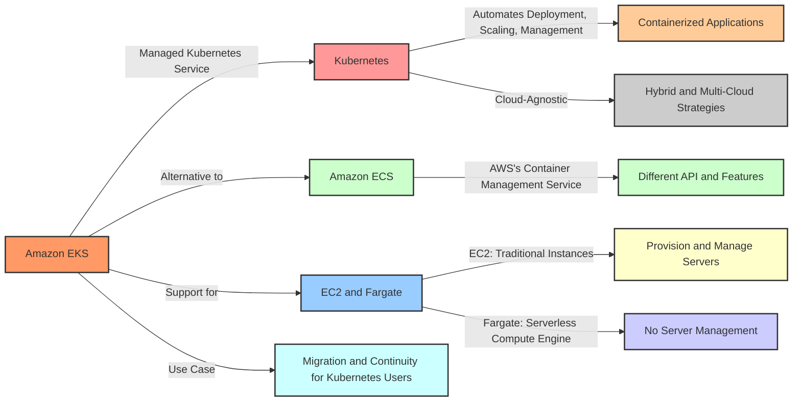
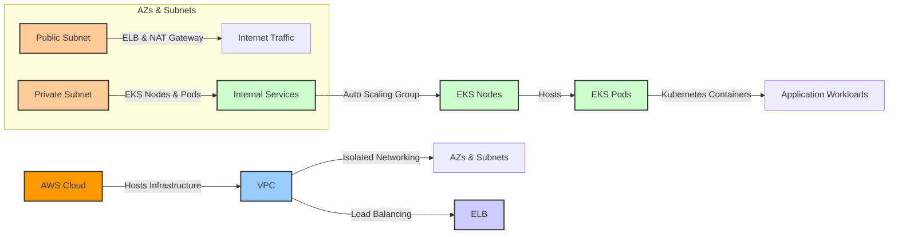
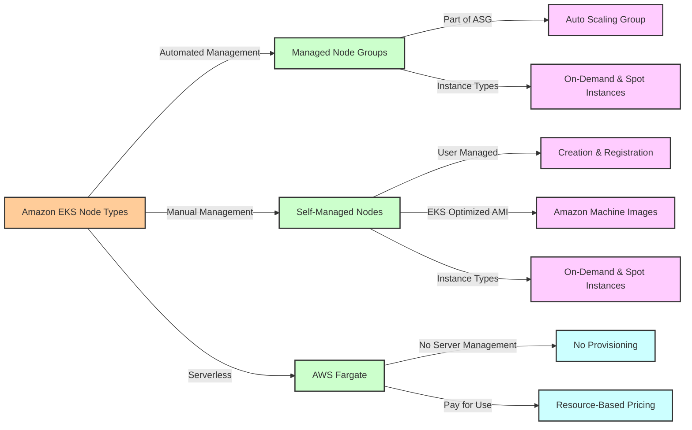
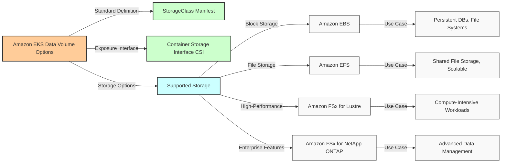

# EKS

## Amazon EKS Node Types

## Amazon EKS Data Volume Options

| ECS Term                | EKS Term                | Description                                                                                     |
|-------------------------|-------------------------|-------------------------------------------------------------------------------------------------|
| Task Definition         | Pod Specification       | Defines the container and volume configuration for a set of containers.                         |
| Task                    | Pod                     | A running set of containers on the cluster.                                                     |
| Service                 | Deployment/StatefulSet  | Manages the desired number of tasks/pods ensuring specified number runs and are updated correctly. |
| Container Instance      | Node                    | An EC2 instance that is part of an ECS Cluster / A Kubernetes worker machine in EKS.            |
| ECS Agent               | Kubelet                 | The agent that runs on each node in the cluster to manage the containers.                       |
| Cluster                 | Cluster                 | A logical set of EC2 instances that host your application containers.                           |
| ECS Service Auto Scaling| Horizontal Pod Autoscaler| Automatically adjusts the number of running tasks/pods based on demand.                        |
| Fargate                 | Fargate                 | A serverless compute engine for containers that works with both ECS and EKS.                    |
| Launch Type             | Node Group              | Determines the type of infrastructure on which your tasks/pods will be launched.                |
| Service Discovery       | Service/Ingress         | Allows your services to discover and talk to each other.                                        |
| Task Role               | Service Account         | Assigns permissions to the task/pod level, controlling what actions they can perform.           |
