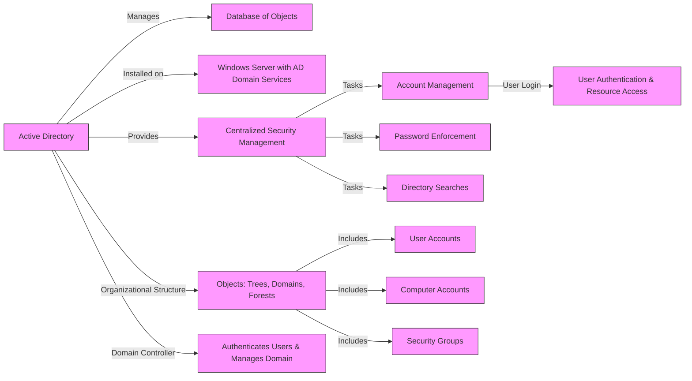
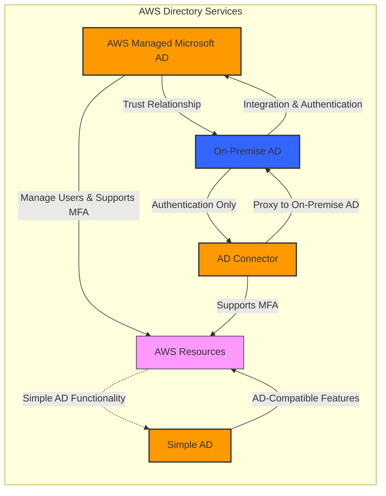
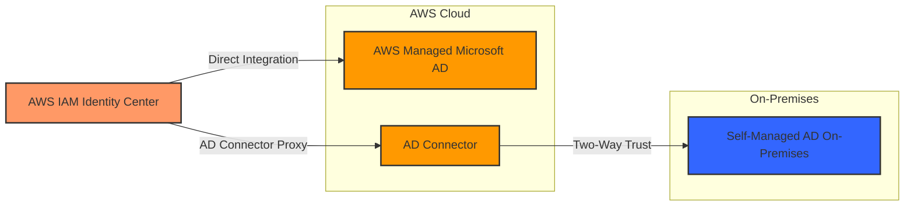

# Active Directory

| Feature                   | AWS Managed Microsoft AD | AD Connector | Simple AD |
|---------------------------|--------------------------|--------------|-----------|
| Standalone AD in AWS      | Yes                      | No           | Yes       |
| Manage users locally      | Yes                      | No           | Yes       |
| Supports MFA              | Yes                      | Yes          | No        |
| Trust relationships       | Yes                      | No           | No        |
| Integration with on-prem AD| Yes                      | Yes          | No        |
| Authentication redirection| No                       | Yes          | No        |
| User management           | In AWS                   | On-prem AD   | In AWS    |
| Suitable for              | Larger workloads         | Auth proxy   | Smaller workloads |
| AD feature set            | Full                     | Limited      | Basic     |

