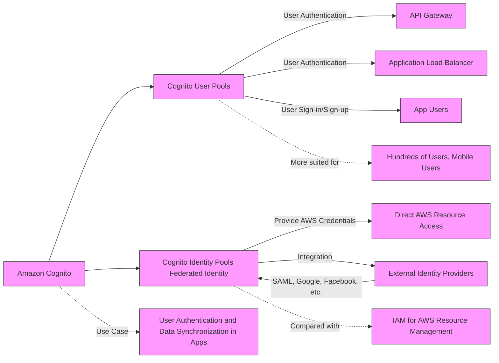
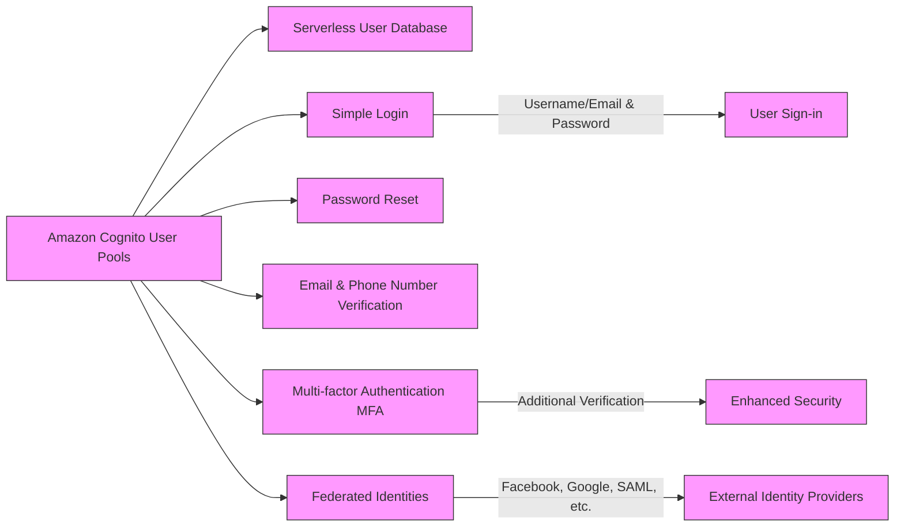
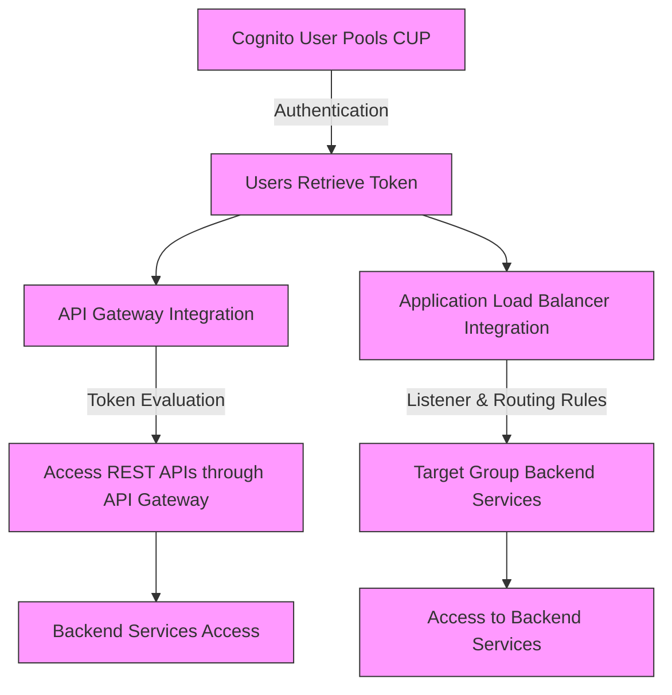
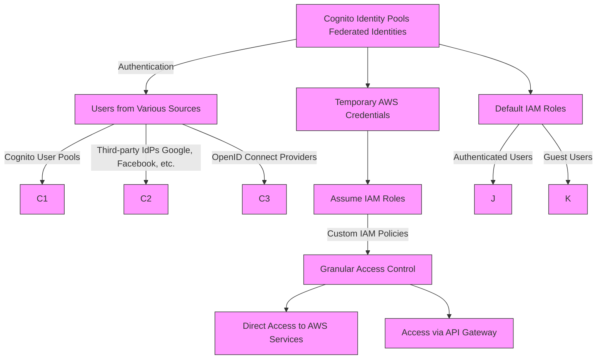
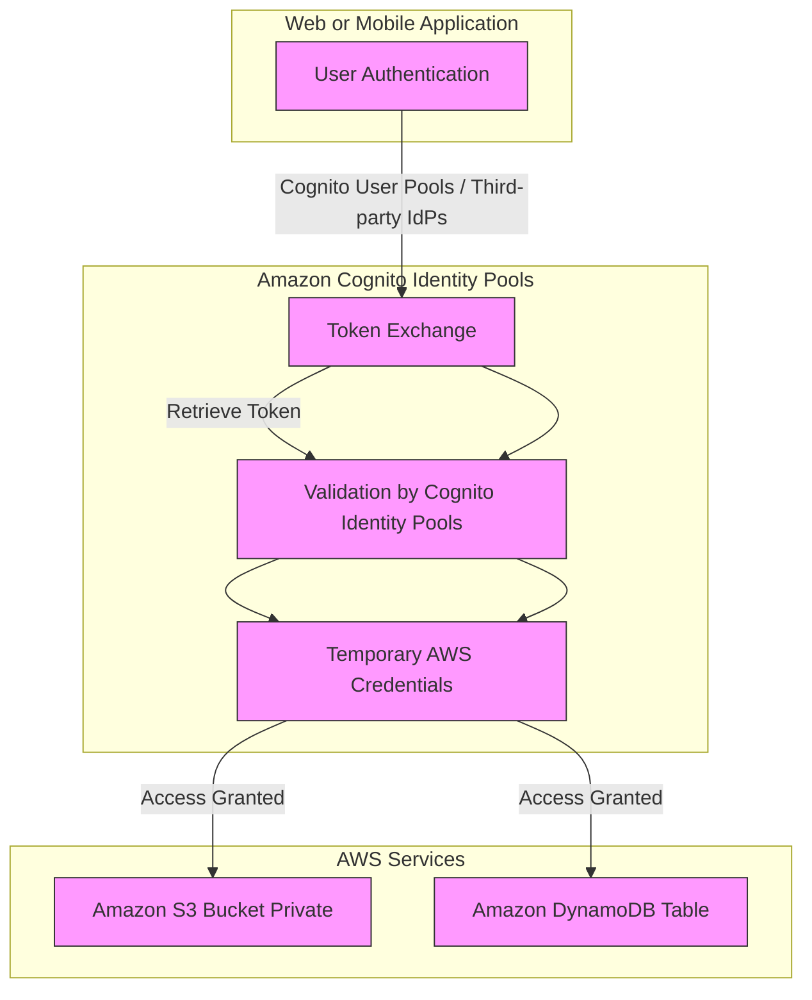
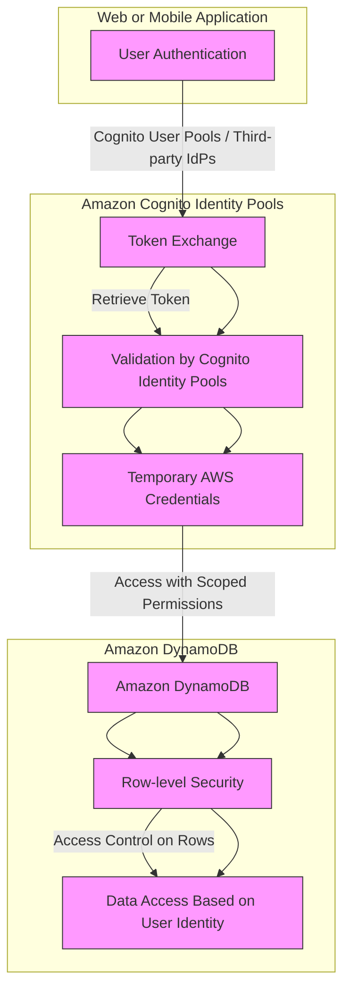

# Amazon Cognito

```mermaid
graph LR
    A[Amazon Cognito] --> B[Cognito User Pools]
    A --> C[Cognito Identity Pools Federated Identity]
B -->|User Authentication| D[API Gateway]
B -->|User Authentication| E[Application Load Balancer]
C -->|Provide AWS Credentials| F[Direct AWS Resource Access]
C -->|Integration| G[External Identity Providers]
G -->|SAML, Google, Facebook, etc.| C
B -->|User Sign-in/Sign-up| H[App Users]
C -.->|Compared with| I[IAM for AWS Resource Management]
B -.->|More suited for| J[Hundreds of Users, Mobile Users]
A -.->|Use Case| K[User Authentication and Data Synchronization in Apps]

classDef defaultStyle fill:#f9f,stroke:#333,stroke-width:1px;
class A,B,C,D,E,F,G,H,I,J,K defaultStyle;


```

```mermaid
graph LR
    A[Amazon Cognito User Pools] --> B[Serverless User Database]
    A --> C[Simple Login]
    A --> D[Password Reset]
    A --> E[Email & Phone Number Verification]
    A --> F[Multi-factor Authentication MFA]
    A --> G[Federated Identities]

    C -->|Username/Email & Password| H[User Sign-in]
    F -->|Additional Verification| I[Enhanced Security]
    G -->|Facebook, Google, SAML, etc.| J[External Identity Providers]

    classDef defaultStyle fill:#f9f,stroke:#333,stroke-width:1px;
    class A,B,C,D,E,F,G,H,I,J defaultStyle;

```

```mermaid
graph TD
    A[Cognito User Pools CUP] -->|Authentication| B[Users Retrieve Token]
    B --> C[API Gateway Integration]
    B --> D[Application Load Balancer Integration]

    C -->|Token Evaluation| E[Access REST APIs through API Gateway]
    E --> F[Backend Services Access]

    D -->|Listener & Routing Rules| G[Target Group Backend Services]
    G --> H[Access to Backend Services]

    classDef defaultStyle fill:#f9f,stroke:#333,stroke-width:1px;
    class A,B,C,D,E,F,G,H defaultStyle;

```

```mermaid
graph TD
    A[Cognito Identity Pools Federated Identities] -->|Authentication| B[Users from Various Sources]
    B -->|Cognito User Pools| C1
    B -->|Third-party IdPs Google, Facebook, etc.| C2
    B -->|OpenID Connect Providers| C3

    A --> D[Temporary AWS Credentials]
    D --> E[Assume IAM Roles]
    E -->|Custom IAM Policies| F[Granular Access Control]

    F --> G[Direct Access to AWS Services]
    F --> H[Access via API Gateway]

    A --> I[Default IAM Roles]
    I -->|Authenticated Users| J
    I -->|Guest Users| K

    classDef defaultStyle fill:#f9f,stroke:#333,stroke-width:1px;
    class A,B,C1,C2,C3,D,E,F,G,H,I,J,K defaultStyle;

```

```mermaid
graph TD
    A[User Authentication] -->|Cognito User Pools / Third-party IdPs| B[Token Exchange]
    B -->|Retrieve Token| C[Validation by Cognito Identity Pools]
    C --> D[Temporary AWS Credentials]
    D -->|Access Granted| E[Amazon S3 Bucket Private]
    D -->|Access Granted| F[Amazon DynamoDB Table]

    subgraph Web or Mobile Application
    A
    end

    subgraph Amazon Cognito Identity Pools
    B --> C --> D
    end

    subgraph AWS Services
    E
    F
    end

    classDef defaultStyle fill:#f9f,stroke:#333,stroke-width:1px;
    class A,B,C,D,E,F defaultStyle;

```

```mermaid
graph TD
    A[User Authentication] -->|Cognito User Pools / Third-party IdPs| B[Token Exchange]
    B -->|Retrieve Token| C[Validation by Cognito Identity Pools]
    C --> D[Temporary AWS Credentials]
    D -->|Access with Scoped Permissions| E[Amazon DynamoDB]
    E --> F[Row-level Security]
    F -->|Access Control on Rows| G[Data Access Based on User Identity]

    subgraph Web or Mobile Application
    A
    end

    subgraph Amazon Cognito Identity Pools
    B --> C --> D
    end

    subgraph Amazon DynamoDB
    E --> F --> G
    end

    classDef defaultStyle fill:#f9f,stroke:#333,stroke-width:1px;
    class A,B,C,D,E,F,G defaultStyle;

```