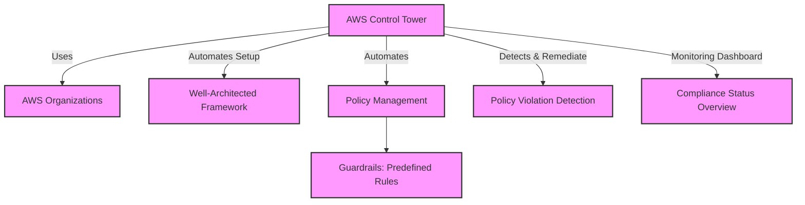
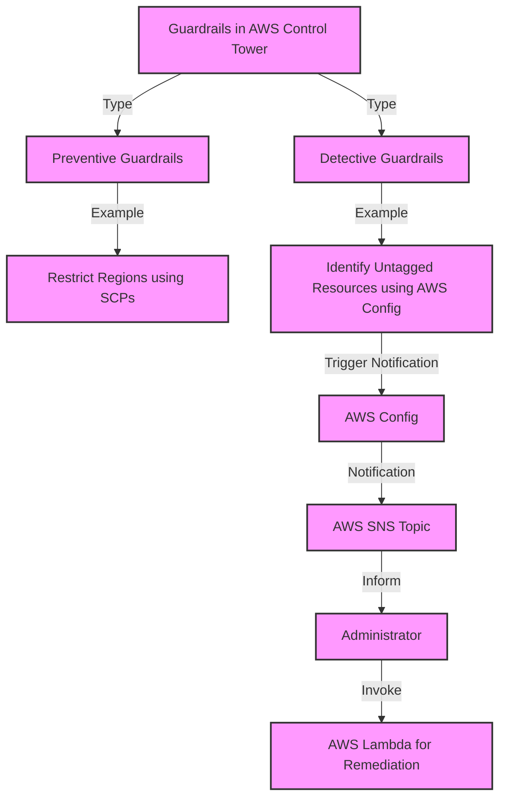

# Control Tower

```mermaid
graph TB
    AWSControlTower[AWS Control Tower] -->|Uses| AWSOrganizations[AWS Organizations]
    AWSControlTower -->|Automates Setup| WellArchitectedFramework[Well-Architected Framework]
    AWSControlTower -->|Automates| PolicyManagement[Policy Management]
    PolicyManagement --> Guardrails[Guardrails: Predefined Rules]
    AWSControlTower -->|Detects & Remediate| PolicyViolations[Policy Violation Detection]
    AWSControlTower -->|Monitoring Dashboard| ComplianceStatus[Compliance Status Overview]
    classDef default fill: #f9f, stroke: #333, stroke-width: 2px;
    classDef awsService fill: #ff9900, stroke: #333, stroke-width: 2px;


```

```mermaid
graph TD
    Guardrails[Guardrails in AWS Control Tower] -->|Type| Preventive[Preventive Guardrails]
    Guardrails -->|Type| Detective[Detective Guardrails]

    Preventive -->|Example| RestrictRegions[Restrict Regions using SCPs]
    Detective -->|Example| IdentifyUntagged[Identify Untagged Resources using AWS Config]

    IdentifyUntagged -->|Trigger Notification| AWSConfig[AWS Config]
    AWSConfig -->|Notification| SNSTopic[AWS SNS Topic]
    SNSTopic -->|Inform| Admin[Administrator]
    Admin -->|Invoke| Lambda[AWS Lambda for Remediation]

    classDef default fill:#f9f,stroke:#333,stroke-width:2px;
    classDef awsService fill:#ff9900,stroke:#333,stroke-width:2px;

```