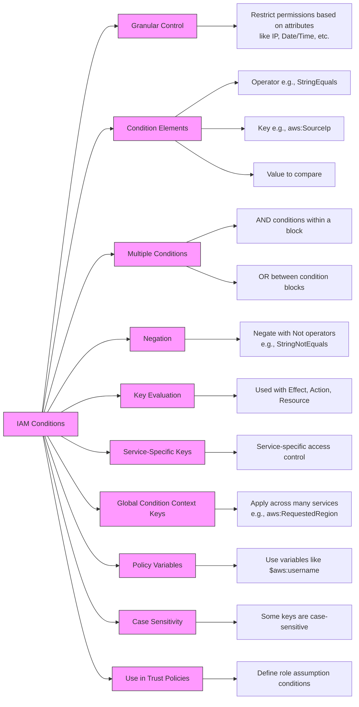

# IAM Conditions

```mermaid
graph LR
    A[IAM Conditions] --> B[Granular Control]
    A --> C[Condition Elements]
    A --> D[Multiple Conditions]
    A --> E[Negation]
    A --> F[Key Evaluation]
    A --> G[Service-Specific Keys]
    A --> H[Global Condition Context Keys]
    A --> I[Policy Variables]
    A --> J[Case Sensitivity]
    A --> K[Use in Trust Policies]

    B --> B1[Restrict permissions based on attributes<br>like IP, Date/Time, etc.]
    C --> C1[Operator e.g., StringEquals]
C --> C2[Key e.g., aws:SourceIp]
C --> C3[Value to compare]
D --> D1[AND conditions within a block]
D --> D2[OR between condition blocks]
E --> E1[Negate with Not operators<br>e.g., StringNotEquals]
F --> F1[Used with Effect, Action, Resource]
G --> G1[Service-specific access control]
H --> H1[Apply across many services<br>e.g., aws:RequestedRegion]
I --> I1[Use variables like $aws:username]
J --> J1[Some keys are case-sensitive]
K --> K1[Define role assumption conditions]

classDef defaultStyle fill:#f9f,stroke:#333,stroke-width:1px;
class A,B,C,D,E,F,G,H,I,J,K defaultStyle;


```
