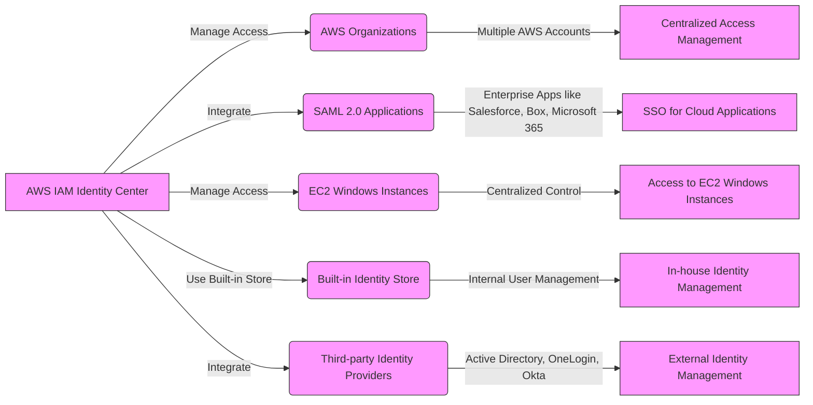
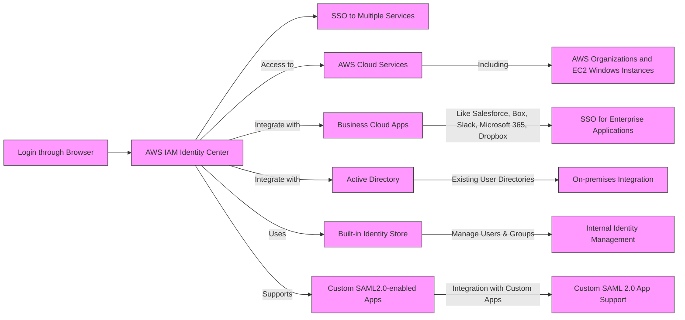
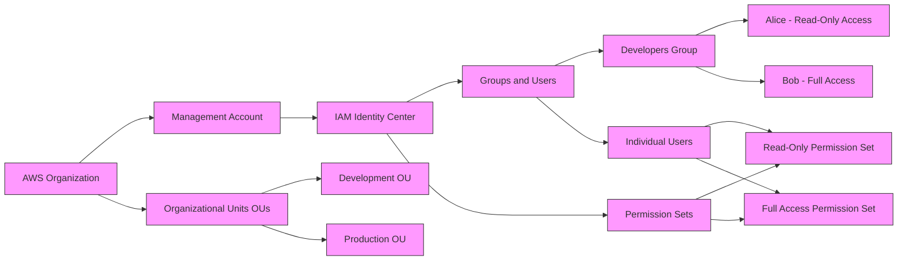
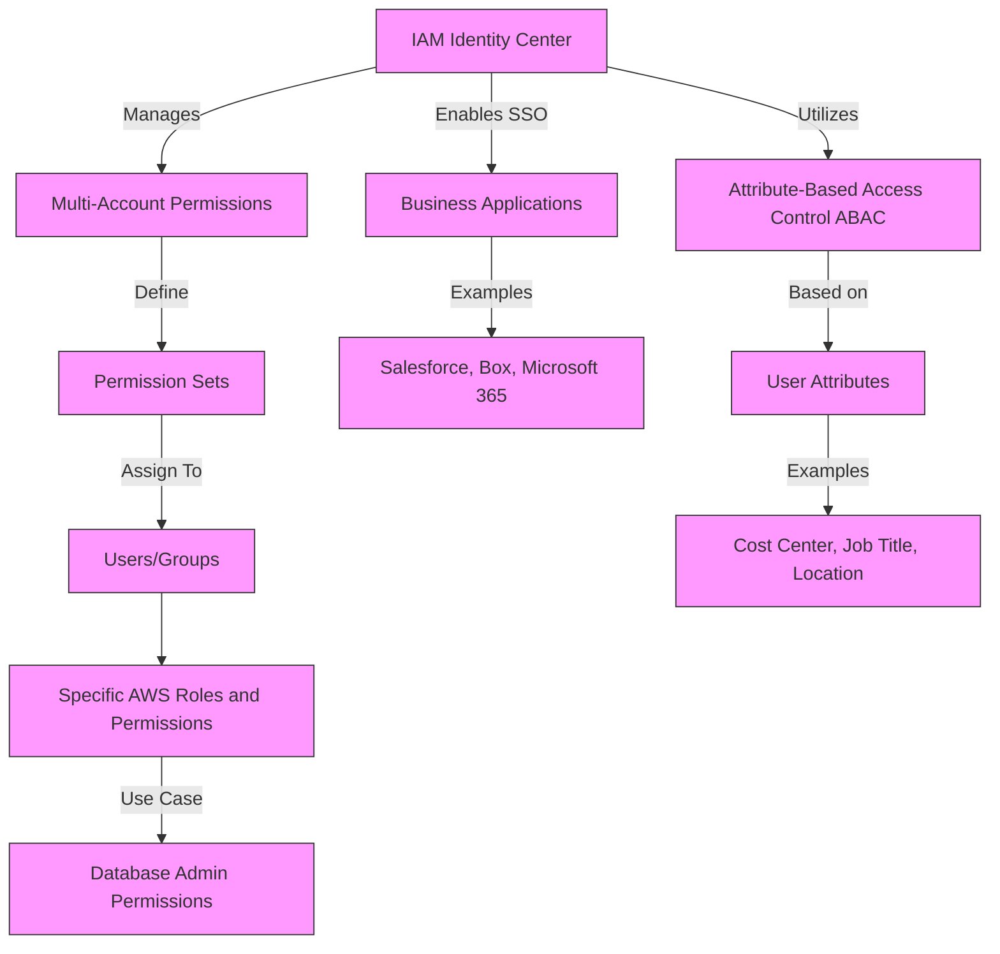

# IAM Identity Center

```mermaid
graph LR
    A[AWS IAM Identity Center] -->|Manage Access| B(AWS Organizations)
    A -->|Integrate| C(SAML 2.0 Applications)
    A -->|Manage Access| D(EC2 Windows Instances)
    A -->|Use Built-in Store| E(Built-in Identity Store)
    A -->|Integrate| F(Third-party Identity Providers)

    B -->|Multiple AWS Accounts| G[Centralized Access Management]
    C -->|Enterprise Apps like Salesforce, Box, Microsoft 365| H[SSO for Cloud Applications]
    D -->|Centralized Control| I[Access to EC2 Windows Instances]
    E -->|Internal User Management| J[In-house Identity Management]
    F -->|Active Directory, OneLogin, Okta| K[External Identity Management]

    classDef defaultStyle fill:#f9f,stroke:#333,stroke-width:1px;
    class A,B,C,D,E,F,G,H,I,J,K defaultStyle;
```

```mermaid
graph LR
    A[Login through Browser] --> B[AWS IAM Identity Center]
    B --> C[SSO to Multiple Services]
    B -->|Access to| D[AWS Cloud Services]
    B -->|Integrate with| E[Business Cloud Apps]
    B -->|Integrate with| F[Active Directory]
    B -->|Uses| G[Built-in Identity Store]
    B -->|Supports| H[Custom SAML2.0-enabled Apps]

    D -->|Including| I[AWS Organizations and EC2 Windows Instances]
    E -->|Like Salesforce, Box, Slack, Microsoft 365, Dropbox| J[SSO for Enterprise Applications]
    F -->|Existing User Directories| K[On-premises Integration]
    G -->|Manage Users & Groups| L[Internal Identity Management]
    H -->|Integration with Custom Apps| M[Custom SAML 2.0 App Support]

    classDef defaultStyle fill:#f9f,stroke:#333,stroke-width:1px;
    class A,B,C,D,E,F,G,H,I,J,K,L,M defaultStyle;

```

```mermaid
graph LR
    A[AWS Organization] --> B[Management Account]
    A --> C[Organizational Units OUs]
C --> D[Development OU]
C --> E[Production OU]
B --> F[IAM Identity Center]
F --> G[Groups and Users]
F --> H[Permission Sets]
G --> I[Developers Group]
G --> J[Individual Users]
I --> K[Alice - Read-Only Access]
I --> L[Bob - Full Access]
H --> M[Read-Only Permission Set]
H --> N[Full Access Permission Set]
J --> M
J --> N

classDef defaultStyle fill:#f9f,stroke:#333,stroke-width:1px;
class A,B,C,D,E,F,G,H,I,J,K,L,M,N defaultStyle;

```

```mermaid
graph TD
    A[IAM Identity Center] -->|Manages| B[Multi-Account Permissions]
    B -->|Define| C[Permission Sets]
    C -->|Assign To| D[Users/Groups]
    A -->|Enables SSO| E[Business Applications]
    E -->|Examples| F[Salesforce, Box, Microsoft 365]
    A -->|Utilizes| G[Attribute-Based Access Control ABAC]
    G -->|Based on| H[User Attributes]
    H -->|Examples| I[Cost Center, Job Title, Location]
    D --> J[Specific AWS Roles and Permissions]
    J -->|Use Case| K[Database Admin Permissions]

    classDef defaultStyle fill:#f9f,stroke:#333,stroke-width:1px;
    class A,B,C,D,E,F,G,H,I,J,K defaultStyle;

```