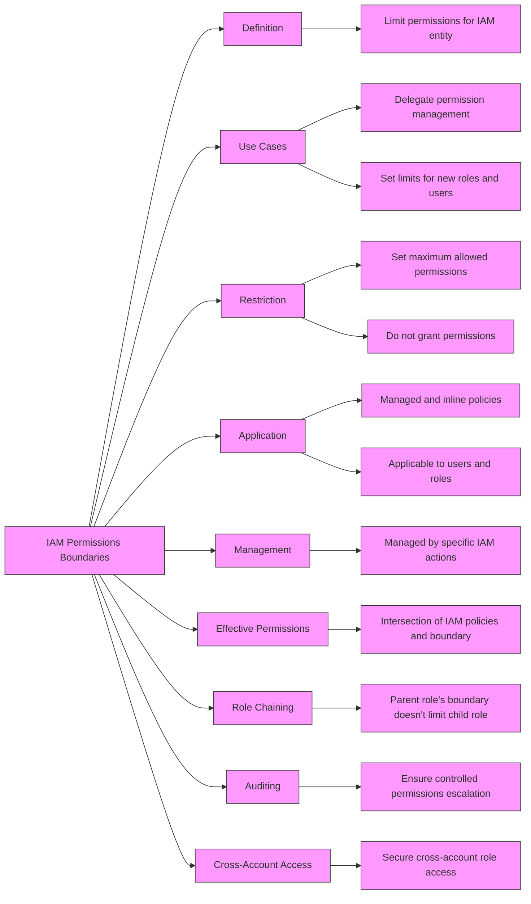
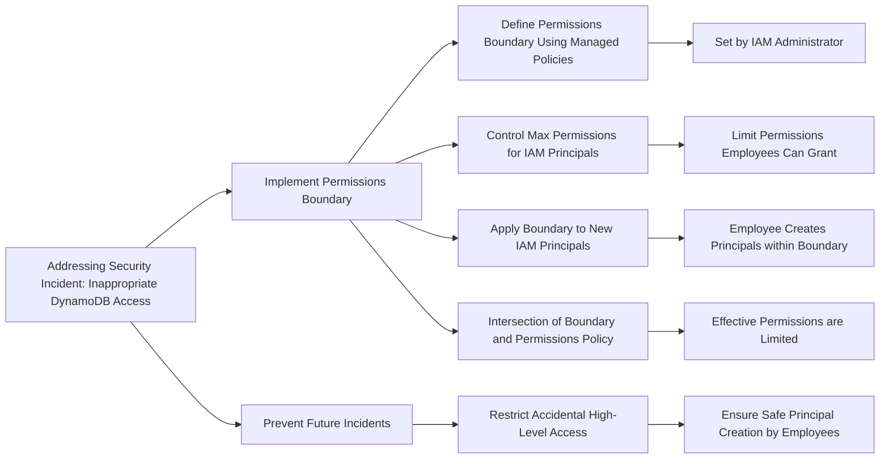

# IAM Policy Boundaries

## For exam

1. An IT company wants to review its security best-practices after an incident was reported where a new developer on the team was assigned full access to Amazon DynamoDB. The developer accidentally deleted a couple of tables from the production environment while building out a new feature.

Which is the MOST effective way to address this issue so that such incidents do not recur?

***Answer:*** Use permissions boundary to control the maximum permissions employees can grant to the IAM principals

A permissions boundary can be used to control the maximum permissions employees can grant to the IAM principals (that is, users and roles) that they create and manage. As the IAM administrator, you can define one or more permissions boundaries using managed policies and allow your employee to create a principal with this boundary. The employee can then attach a permissions policy to this principal. However, the effective permissions of the principal are the intersection of the permissions boundary and permissions policy. As a result, the new principal cannot exceed the boundary that you defined. Therefore, using the permissions boundary offers the right solution for this use-case.

