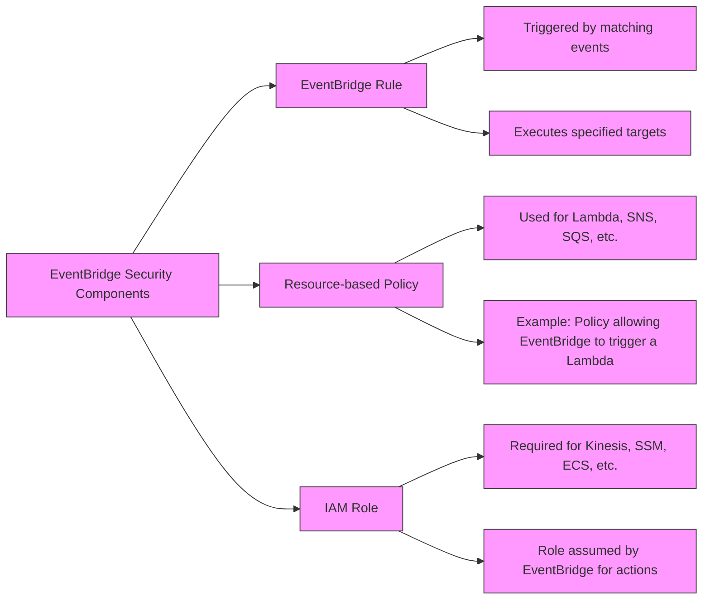

# IAM Roles vs Resource Policy

| Feature                     | IAM Roles                              | Resource-Based Policies               |
|-----------------------------|----------------------------------------|---------------------------------------|
| Attachment                  | Attached to trusted entities           | Attached directly to the resource     |
| Permissions                 | Grant temporary permissions            | Grant permissions to specified principals |
| Usage                       | To delegate access to users or services| To grant access to resources from any account |
| Principal                   | IAM user, application, or AWS service  | Any AWS account or IAM principal      |
| Permission Reversion        | Yes, original permissions are reverted after the role is relinquished | No, does not require relinquishing existing permissions |
| Use Case Example            | A user temporarily needs to perform actions that require different permissions | A user from one AWS account needs to access a resource in another account |
| Supported by                | All AWS services that support IAM roles| Services like S3 buckets, SNS topics, SQS queues, etc. |
| Delegation                  | Yes, allows assuming roles with specific permissions | No, it grants permissions directly without delegation |
| Cross-Account Access        | Yes, especially with roles meant for cross-account access | Yes, can specify external AWS accounts in the policy |
| Requires Trust Relationship | Yes, a trust relationship must be established | No, the policy itself specifies who has access |

