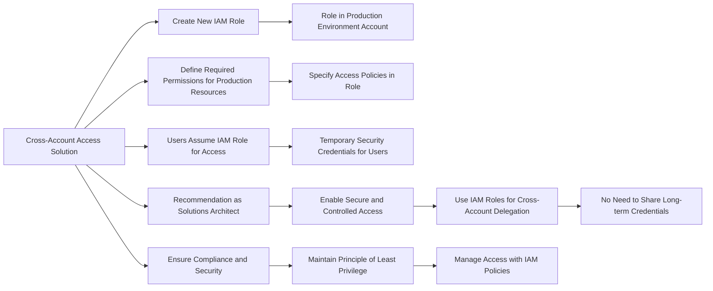

# IAM Roles

## For exam

1. An organization wants to delegate access to a set of users from the development environment so that they can access some resources in the production environment which is managed under another AWS account.

As a solutions architect, which of the following steps would you recommend?

***Answer:*** Create a new IAM role with the required permissions to access the resources in the production environment. The users can then assume this IAM role while accessing the resources from the production environment

IAM roles allow you to delegate access to users or services that normally don't have access to your organization's AWS resources. IAM users or AWS services can assume a role to obtain temporary security credentials that can be used to make AWS API calls. Consequently, you don't have to share long-term credentials for access to a resource. Using IAM roles, it is possible to access cross-account resources.

