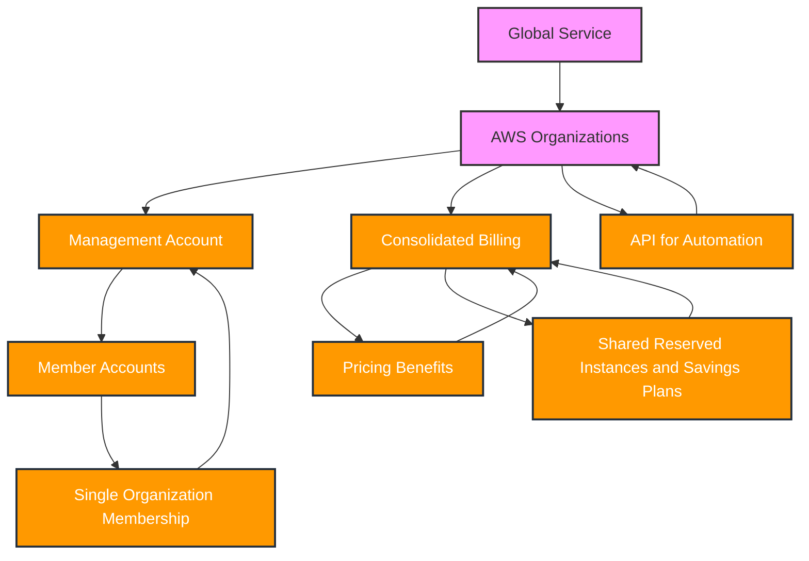
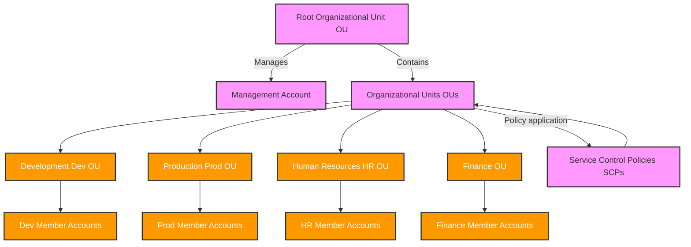
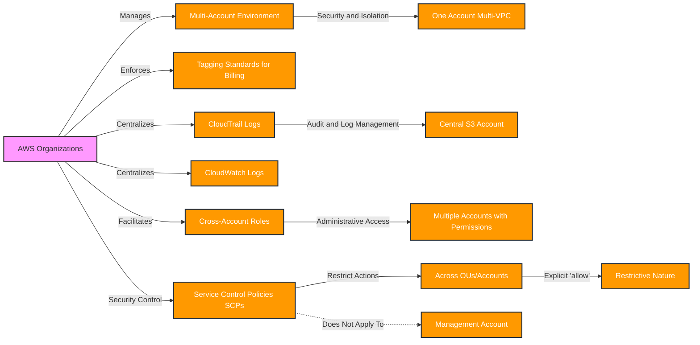
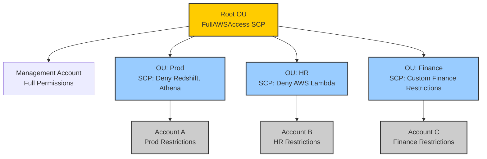

# Organization

```mermaid
graph TD
    A[Global Service] --> B[AWS Organizations]
    B --> C[Management Account]
    C --> D[Member Accounts]
    D --> E[Single Organization Membership]
    B --> F[Consolidated Billing]
    F --> G[Pricing Benefits]
    F --> H[Shared Reserved Instances and Savings Plans]
    B --> I[API for Automation]

    classDef defaultStyle fill:#f9f,stroke:#333,stroke-width:2px;
    classDef aws fill:#FF9900,color:#fff,stroke:#232F3E,stroke-width:2px;
    class A,B defaultStyle;
    class C,D,E,F,G,H,I aws;

    E --> C
    G --> F
    H --> F
    I --> B


```

```mermaid
graph TD
A[Root Organizational Unit OU] -->|Manages| B[Management Account]
A -->|Contains| C[Organizational Units OUs]
C --> D[Development Dev OU]
C --> E[Production Prod OU]
C --> F[Human Resources HR OU]
C --> G[Finance OU]
D --> H[Dev Member Accounts]
E --> I[Prod Member Accounts]
F --> J[HR Member Accounts]
G --> K[Finance Member Accounts]
C -->|Policy application| L[Service Control Policies SCPs]

    classDef defaultStyle fill:#f9f,stroke:#333,stroke-width:2px;
    classDef aws fill:#FF9900,color:#fff,stroke:#232F3E,stroke-width:2px;
    class A,B,C,L defaultStyle;
    class D,E,F,G,H,I,J,K aws;

    L --> C
```

```mermaid
graph LR
A[AWS Organizations] -->|Manages| B[Multi-Account Environment]
A -->|Enforces| C[Tagging Standards for Billing]
A -->|Centralizes| D[CloudTrail Logs]
A -->|Centralizes| E[CloudWatch Logs]
A -->|Facilitates| F[Cross-Account Roles]

    B -->|Security and Isolation| G[One Account Multi-VPC]
    D -->|Audit and Log Management| H[Central S3 Account]
    F -->|Administrative Access| I[Multiple Accounts with Permissions]

    A -->|Security Control| J[Service Control Policies SCPs]
    J -->|Restrict Actions| K[Across OUs/Accounts]
    J -.->|Does Not Apply To| L[Management Account]
    K -->|Explicit 'allow'| M[Restrictive Nature]

    classDef defaultStyle fill:#f9f,stroke:#333,stroke-width:2px;
    classDef aws fill:#FF9900,color:#fff,stroke:#232F3E,stroke-width:2px;
    class A defaultStyle;
    class B,C,D,E,F,G,H,I,J,K,L,M aws;
```

```mermaid
graph TD
    Root[Root OU<br>FullAWSAccess SCP] --> Management[Management Account<br> Full Permissions]
    Root --> Prod[OU: Prod<br>SCP: Deny Redshift, Athena]
    Root --> HR[OU: HR<br>SCP: Deny AWS Lambda]
    Root --> Finance[OU: Finance<br>SCP: Custom Finance Restrictions]

    Prod --> AccountA[Account A<br>Prod Restrictions]
    HR --> AccountB[Account B<br>HR Restrictions]
    Finance --> AccountC[Account C<br>Finance Restrictions]

    classDef rootStyle fill:#ffcc00,stroke:#333,stroke-width:2px;
    classDef ouStyle fill:#99ccff,stroke:#333,stroke-width:2px;
    classDef accountStyle fill:#cccccc,stroke:#333,stroke-width:2px;
    class Root rootStyle;
    class Prod,HR,Finance ouStyle;
    class AccountA,AccountB,AccountC accountStyle;


```