# DNS Terminologies in Route 53

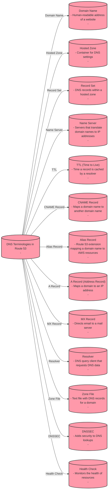
```mermaid
graph LR;
    DNS_Terminologies[("DNS Terminologies in Route 53\n-")]

    DNS_Terminologies -->|Domain Name| DomainName[("Domain Name\n- Human-readable address of a website\n-")]
    DNS_Terminologies -->|Hosted Zone| HostedZone[("Hosted Zone\n- Container for DNS settings\n-")]
    DNS_Terminologies -->|Record Set| RecordSet[("Record Set\n- DNS records within a hosted zone\n-")]
    DNS_Terminologies -->|Name Server| NameServer[("Name Server\n- Servers that translate domain names to IP addresses\n-")]
    DNS_Terminologies -->|TTL| TTL[("TTL (Time to Live)\n- Time a record is cached by a resolver\n-")]
    DNS_Terminologies -->|CNAME Record| CNAMERecord[("CNAME Record\n- Maps a domain name to another domain name\n-")]
    DNS_Terminologies -->|Alias Record| AliasRecord[("Alias Record\n- Route 53 extension mapping a domain name to AWS resources\n-")]
    DNS_Terminologies -->|A Record| ARecord[("A Record (Address Record)\n- Maps a domain to an IP address\n-")]
    DNS_Terminologies -->|MX Record| MXRecord[("MX Record\n- Directs email to a mail server\n-")]

    DNS_Terminologies -->|Resolver| Resolver[("Resolver\n- DNS query client that requests DNS data\n-")]
    DNS_Terminologies -->|Zone File| ZoneFile[("Zone File\n- Text file with DNS records for a domain\n-")]
    DNS_Terminologies -->|DNSSEC| DNSSEC[("DNSSEC\n- Adds security to DNS lookups\n-")]
    DNS_Terminologies -->|Health Check| HealthCheck[("Health Check\n- Monitors the health of resources\n-")]

    classDef important fill:#f9a,stroke:#333,stroke-width:2px,shape:rectangle;
    class DNS_Terminologies,DomainName,HostedZone,RecordSet,NameServer,TTL,CNAMERecord,AliasRecord,ARecord,MXRecord,Resolver,ZoneFile,DNSSEC,HealthCheck important;


```

## AWS Route 53

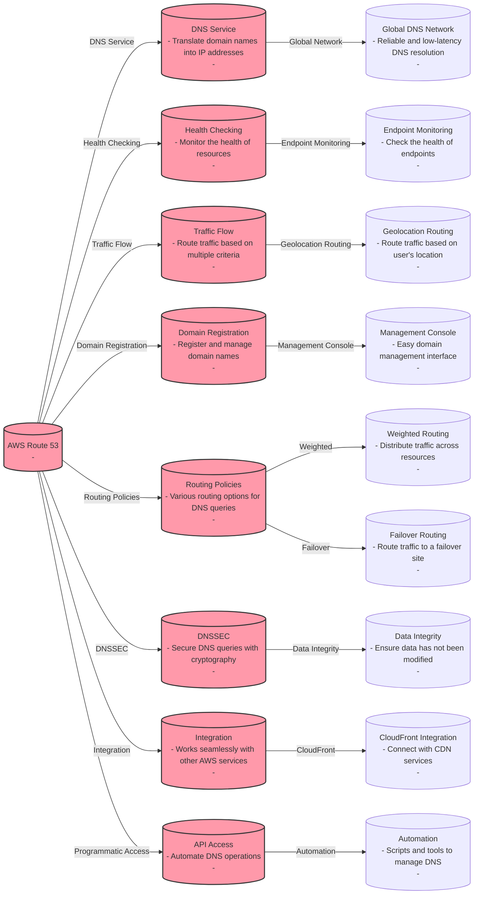
```mermaid
graph LR;
Route53[("AWS Route 53\n-")]
Route53 -->|DNS Service| DNSService[("DNS Service\n- Translate domain names into IP addresses\n-")]
Route53 -->|Health Checking| HealthChecking[("Health Checking\n- Monitor the health of resources\n-")]
Route53 -->|Traffic Flow| TrafficFlow[("Traffic Flow\n- Route traffic based on multiple criteria\n-")]
Route53 -->|Domain Registration| DomainRegistration[("Domain Registration\n- Register and manage domain names\n-")]
Route53 -->|Routing Policies| RoutingPolicies[("Routing Policies\n- Various routing options for DNS queries\n-")]
Route53 -->|DNSSEC| DNSSEC[("DNSSEC\n- Secure DNS queries with cryptography\n-")]
Route53 -->|Integration| Integration[("Integration\n- Works seamlessly with other AWS services\n-")]
Route53 -->|Programmatic Access| APIAccess[("API Access\n- Automate DNS operations\n-")]

    DNSService -->|Global Network| GlobalNetwork[("Global DNS Network\n- Reliable and low-latency DNS resolution\n-")]
    HealthChecking -->|Endpoint Monitoring| EndpointMonitoring[("Endpoint Monitoring\n- Check the health of endpoints\n-")]
    TrafficFlow -->|Geolocation Routing| GeolocationRouting[("Geolocation Routing\n- Route traffic based on user's location\n-")]
    DomainRegistration -->|Management Console| ManagementConsole[("Management Console\n- Easy domain management interface\n-")]
    RoutingPolicies -->|Weighted| WeightedRouting[("Weighted Routing\n- Distribute traffic across resources\n-")]
    RoutingPolicies -->|Failover| FailoverRouting[("Failover Routing\n- Route traffic to a failover site\n-")]
    DNSSEC -->|Data Integrity| DataIntegrity[("Data Integrity\n- Ensure data has not been modified\n-")]
    Integration -->|CloudFront| CloudFrontIntegration[("CloudFront Integration\n- Connect with CDN services\n-")]
    APIAccess -->|Automation| Automation[("Automation\n- Scripts and tools to manage DNS\n-")]

    classDef important fill:#f9a,stroke:#333,stroke-width:2px,shape:rectangle;
    class Route53,DNSService,HealthChecking,TrafficFlow,DomainRegistration,RoutingPolicies,DNSSEC,Integration,APIAccess important;
```

## Route 53 Record Components

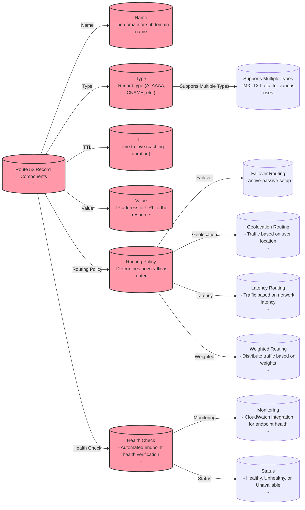
```mermaid

graph LR;
RecordComponents[("Route 53 Record Components\n-")]
RecordComponents -->|Name| RecordName[("Name\n- The domain or subdomain name\n-")]
RecordComponents -->|Type| RecordType[("Type\n- Record type (A, AAAA, CNAME, etc.)\n-")]
RecordComponents -->|TTL| RecordTTL[("TTL\n- Time to Live (caching duration)\n-")]
RecordComponents -->|Value| RecordValue[("Value\n- IP address or URL of the resource\n-")]
RecordComponents -->|Routing Policy| RoutingPolicy[("Routing Policy\n- Determines how traffic is routed\n-")]
RecordComponents -->|Health Check| HealthCheck[("Health Check\n- Automated endpoint health verification\n-")]

    RecordType -->|Supports Multiple Types| MultipleTypes[("Supports Multiple Types\n- MX, TXT, etc. for various uses\n-")]
    RoutingPolicy -->|Failover| Failover[("Failover Routing\n- Active-passive setup\n-")]
    RoutingPolicy -->|Geolocation| Geolocation[("Geolocation Routing\n- Traffic based on user location\n-")]
    RoutingPolicy -->|Latency| Latency[("Latency Routing\n- Traffic based on network latency\n-")]
    RoutingPolicy -->|Weighted| Weighted[("Weighted Routing\n- Distribute traffic based on weights\n-")]

    HealthCheck -->|Monitoring| Monitoring[("Monitoring\n- CloudWatch integration for endpoint health\n-")]
    HealthCheck -->|Status| Status[("Status\n- Healthy, Unhealthy, or Unavailable\n-")]

    classDef important fill:#f9a,stroke:#333,stroke-width:2px,shape:rectangle;
    class RecordComponents,RecordName,RecordType,RecordTTL,RecordValue,RoutingPolicy,HealthCheck important;

```

## Route 53 Record Types

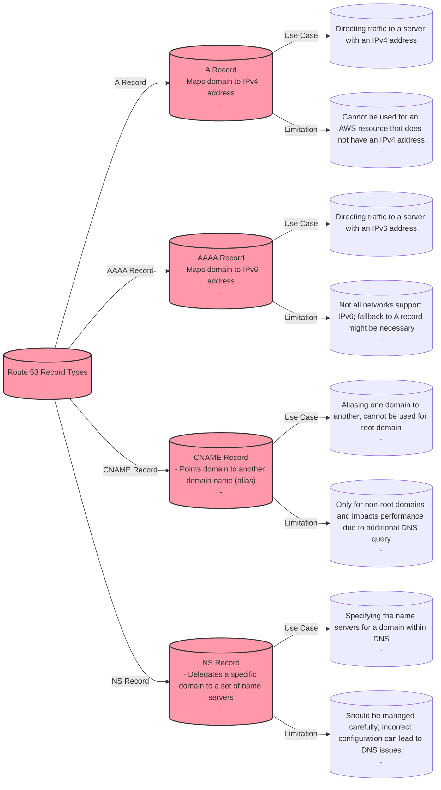
```mermaid

graph LR;
RecordTypes[("Route 53 Record Types\n-")]
RecordTypes -->|A Record| ARecord[("A Record\n- Maps domain to IPv4 address\n-")]
RecordTypes -->|AAAA Record| AAAARecord[("AAAA Record\n- Maps domain to IPv6 address\n-")]
RecordTypes -->|CNAME Record| CNAMERecord[("CNAME Record\n- Points domain to another domain name (alias)\n-")]
RecordTypes -->|NS Record| NSRecord[("NS Record\n- Delegates a specific domain to a set of name servers\n-")]

    ARecord -->|Use Case| AUseCase[("Directing traffic to a server with an IPv4 address\n-")]
    AAAARecord -->|Use Case| AAAAUseCase[("Directing traffic to a server with an IPv6 address\n-")]
    CNAMERecord -->|Use Case| CNAMEUseCase[("Aliasing one domain to another, cannot be used for root domain\n-")]
    NSRecord -->|Use Case| NSUseCase[("Specifying the name servers for a domain within DNS\n-")]

    ARecord -->|Limitation| ALimitation[("Cannot be used for an AWS resource that does not have an IPv4 address\n-")]
    AAAARecord -->|Limitation| AAAALimitation[("Not all networks support IPv6; fallback to A record might be necessary\n-")]
    CNAMERecord -->|Limitation| CNAMELimitation[("Only for non-root domains and impacts performance due to additional DNS query\n-")]
    NSRecord -->|Limitation| NSLimitation[("Should be managed carefully; incorrect configuration can lead to DNS issues\n-")]

    classDef important fill:#f9a,stroke:#333,stroke-width:2px,shape:rectangle;
    class RecordTypes,ARecord,AAAARecord,CNAMERecord,NSRecord important;

```

## Route 53 Hosted Zones

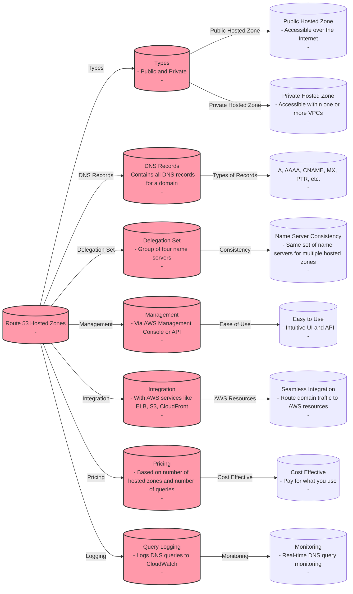
```mermaid

graph LR;
HostedZones[("Route 53 Hosted Zones\n-")]
HostedZones -->|Types| HZTypes[("Types\n- Public and Private\n-")]
HostedZones -->|DNS Records| DNSRecords[("DNS Records\n- Contains all DNS records for a domain\n-")]
HostedZones -->|Delegation Set| DelegationSet[("Delegation Set\n- Group of four name servers\n-")]
HostedZones -->|Management| Management[("Management\n- Via AWS Management Console or API\n-")]
HostedZones -->|Integration| Integration[("Integration\n- With AWS services like ELB, S3, CloudFront\n-")]
HostedZones -->|Pricing| Pricing[("Pricing\n- Based on number of hosted zones and number of queries\n-")]
HostedZones -->|Logging| Logging[("Query Logging\n- Logs DNS queries to CloudWatch\n-")]

    HZTypes -->|Public Hosted Zone| PublicHZ[("Public Hosted Zone\n- Accessible over the Internet\n-")]
    HZTypes -->|Private Hosted Zone| PrivateHZ[("Private Hosted Zone\n- Accessible within one or more VPCs\n-")]

    DNSRecords -->|Types of Records| RecordTypes[("A, AAAA, CNAME, MX, PTR, etc.\n-")]
    DelegationSet -->|Consistency| NameServerConsistency[("Name Server Consistency\n- Same set of name servers for multiple hosted zones\n-")]

    Management -->|Ease of Use| EasyManagement[("Easy to Use\n- Intuitive UI and API\n-")]
    Integration -->|AWS Resources| AWSResIntegration[("Seamless Integration\n- Route domain traffic to AWS resources\n-")]

    Pricing -->|Cost Effective| CostEffective[("Cost Effective\n- Pay for what you use\n-")]
    Logging -->|Monitoring| Monitoring[("Monitoring\n- Real-time DNS query monitoring\n-")]

    classDef important fill:#f9a,stroke:#333,stroke-width:2px,shape:rectangle;
    class HostedZones,HZTypes,DNSRecords,DelegationSet,Management,Integration,Pricing,Logging important;

```

## Public Hosted Zone vs Private Hosted Zone

| Feature                       | Public Hosted Zone                                | Private Hosted Zone                              |
|-------------------------------|---------------------------------------------------|--------------------------------------------------|
| Accessibility                 | Accessible from the Internet                       | Accessible only from specified VPCs              |
| DNS Resolution                | Can resolve DNS queries globally                  | Resolves DNS queries only within VPCs            |
| Purpose                       | Used for domains that need to be publicly resolvable | Used for domains that should not be publicly resolvable |
| Split-view (Split-horizon) DNS| Possible by creating both public and private hosted zones with the same domain name | Supports split-view by default when associated with a VPC |
| Associated Resources          | Can route traffic to public AWS resources or on-premises servers | Can route traffic to private IPs and resources in VPCs |
| Pricing                       | Charges for the number of hosted zones and the number of DNS queries | No additional charge for DNS queries within the AWS network |
| Health Checks                 | Can use health checks to route traffic based on resource health | Health checks can only be used if the health check and the private hosted zone are associated with the same VPC |
| Interface Endpoint            | Not applicable                                     | Can be associated with an interface endpoint in a VPC |
| Logging                       | Query logging available for additional insights    | Query logging available only within VPCs          |
| Use Case Examples             | Websites, web applications, public APIs            | Internal company websites, database servers, internal APIs |

## CNAME Record vs Alias Record

| Feature                  | CNAME Record                                   | Alias Record                                  |
|--------------------------|------------------------------------------------|-----------------------------------------------|
| Definition               | Points a domain to another domain name (alias) | Points a domain to an AWS resource            |
| Root Domain              | Cannot be used for the apex (root) domain      | Can be used for the apex (root) domain        |
| AWS Resource Targeting   | Cannot directly point to AWS resources         | Can point to Elastic Load Balancer, S3, etc.  |
| DNS Zone Apex            | Not supported at the zone apex                 | Supported at the zone apex                    |
| Record Type Visibility   | Visible as CNAME in DNS system                 | Resolves directly to resource with no visible CNAME |
| TTL Management           | TTL must be managed by the user                | AWS manages TTL, often set to a low value for AWS resources |
| Resolution Latency       | Can introduce an extra DNS query               | No extra DNS query, better performance        |
| Cost                     | Standard Route 53 charges apply                | No additional charges for Route 53 Alias queries to AWS resources |
| Use Case                 | Useful when pointing to external domains       | Preferred when aliasing AWS resources         |

## Route 53 Hosted Zones

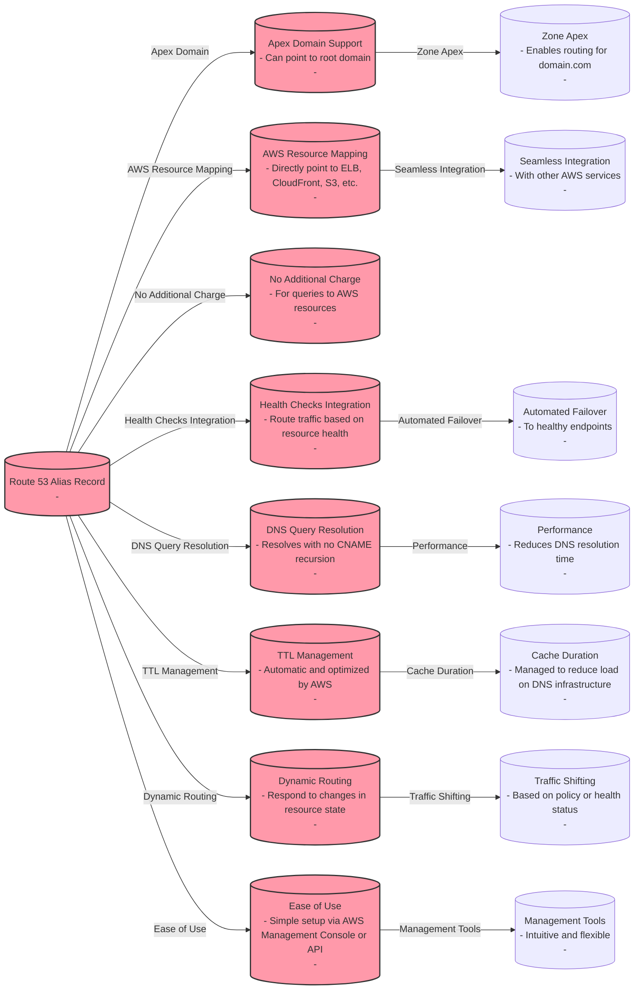
```mermaid
graph LR;
AliasRecord[("Route 53 Alias Record\n-")]
AliasRecord -->|Apex Domain| ApexDomain[("Apex Domain Support\n- Can point to root domain\n-")]
AliasRecord -->|AWS Resource Mapping| ResourceMapping[("AWS Resource Mapping\n- Directly point to ELB, CloudFront, S3, etc.\n-")]
AliasRecord -->|No Additional Charge| NoCharge[("No Additional Charge\n- For queries to AWS resources\n-")]
AliasRecord -->|Health Checks Integration| HealthChecks[("Health Checks Integration\n- Route traffic based on resource health\n-")]
AliasRecord -->|DNS Query Resolution| QueryResolution[("DNS Query Resolution\n- Resolves with no CNAME recursion\n-")]
AliasRecord -->|TTL Management| TTLManagement[("TTL Management\n- Automatic and optimized by AWS\n-")]
AliasRecord -->|Dynamic Routing| DynamicRouting[("Dynamic Routing\n- Respond to changes in resource state\n-")]
AliasRecord -->|Ease of Use| EaseOfUse[("Ease of Use\n- Simple setup via AWS Management Console or API\n-")]

    ApexDomain -->|Zone Apex| ZoneApex[("Zone Apex\n- Enables routing for domain.com\n-")]
    ResourceMapping -->|Seamless Integration| SeamlessIntegration[("Seamless Integration\n- With other AWS services\n-")]
    HealthChecks -->|Automated Failover| AutomatedFailover[("Automated Failover\n- To healthy endpoints\n-")]
    QueryResolution -->|Performance| Performance[("Performance\n- Reduces DNS resolution time\n-")]
    TTLManagement -->|Cache Duration| CacheDuration[("Cache Duration\n- Managed to reduce load on DNS infrastructure\n-")]
    DynamicRouting -->|Traffic Shifting| TrafficShifting[("Traffic Shifting\n- Based on policy or health status\n-")]
    EaseOfUse -->|Management Tools| ManagementTools[("Management Tools\n- Intuitive and flexible\n-")]

    classDef important fill:#f9a,stroke:#333,stroke-width:2px,shape:rectangle;
    class AliasRecord,ApexDomain,ResourceMapping,NoCharge,HealthChecks,QueryResolution,TTLManagement,DynamicRouting,EaseOfUse important;

```

## AWS Resources for Alias Records

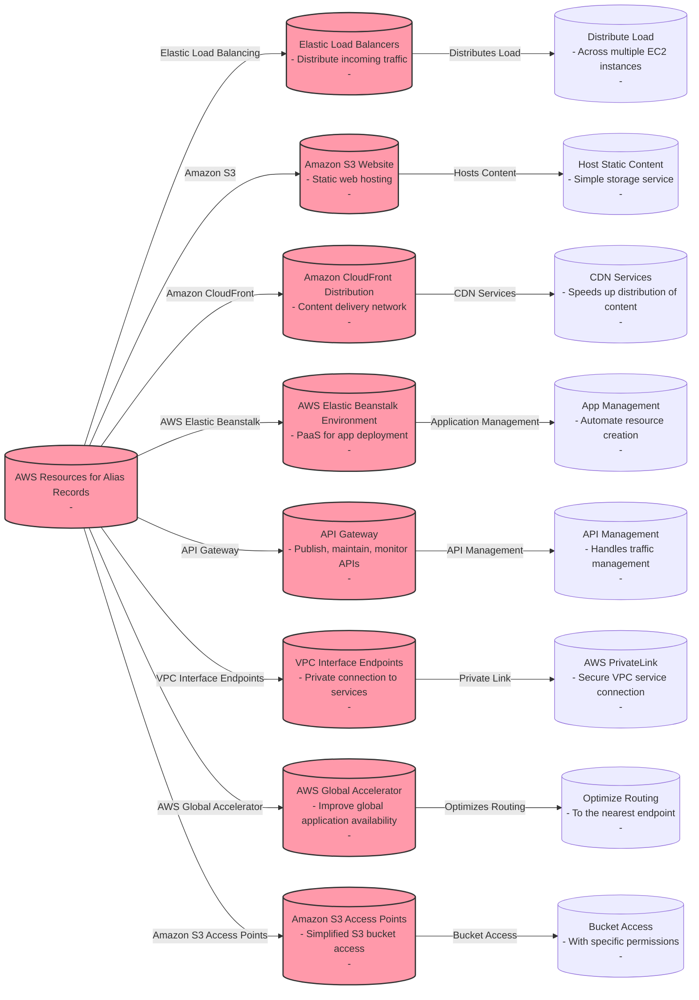
```mermaid
graph LR;
AliasTargets[("AWS Resources for Alias Records\n-")]
AliasTargets -->|Elastic Load Balancing| ELB[("Elastic Load Balancers\n- Distribute incoming traffic\n-")]
AliasTargets -->|Amazon S3| S3[("Amazon S3 Website\n- Static web hosting\n-")]
AliasTargets -->|Amazon CloudFront| CloudFront[("Amazon CloudFront Distribution\n- Content delivery network\n-")]
AliasTargets -->|AWS Elastic Beanstalk| Beanstalk[("AWS Elastic Beanstalk Environment\n- PaaS for app deployment\n-")]
AliasTargets -->|API Gateway| APIGateway[("API Gateway\n- Publish, maintain, monitor APIs\n-")]
AliasTargets -->|VPC Interface Endpoints| VPCInterface[("VPC Interface Endpoints\n- Private connection to services\n-")]
AliasTargets -->|AWS Global Accelerator| GlobalAccelerator[("AWS Global Accelerator\n- Improve global application availability\n-")]
AliasTargets -->|Amazon S3 Access Points| S3AccessPoints[("Amazon S3 Access Points\n- Simplified S3 bucket access\n-")]

    ELB -->|Distributes Load| ELBLoad[("Distribute Load\n- Across multiple EC2 instances\n-")]
    S3 -->|Hosts Content| S3Host[("Host Static Content\n- Simple storage service\n-")]
    CloudFront -->|CDN Services| CloudFrontCDN[("CDN Services\n- Speeds up distribution of content\n-")]
    Beanstalk -->|Application Management| BeanstalkApp[("App Management\n- Automate resource creation\n-")]
    APIGateway -->|API Management| APIManagement[("API Management\n- Handles traffic management\n-")]
    VPCInterface -->|Private Link| PrivateLink[("AWS PrivateLink\n- Secure VPC service connection\n-")]
    GlobalAccelerator -->|Optimizes Routing| AcceleratorRouting[("Optimize Routing\n- To the nearest endpoint\n-")]
    S3AccessPoints -->|Bucket Access| AccessPoint[("Bucket Access\n- With specific permissions\n-")]

    classDef important fill:#f9a,stroke:#333,stroke-width:2px,shape:rectangle;
    class AliasTargets,ELB,S3,CloudFront,Beanstalk,APIGateway,VPCInterface,GlobalAccelerator,S3AccessPoints important;

```

## Simple Routing Policy in Route 53

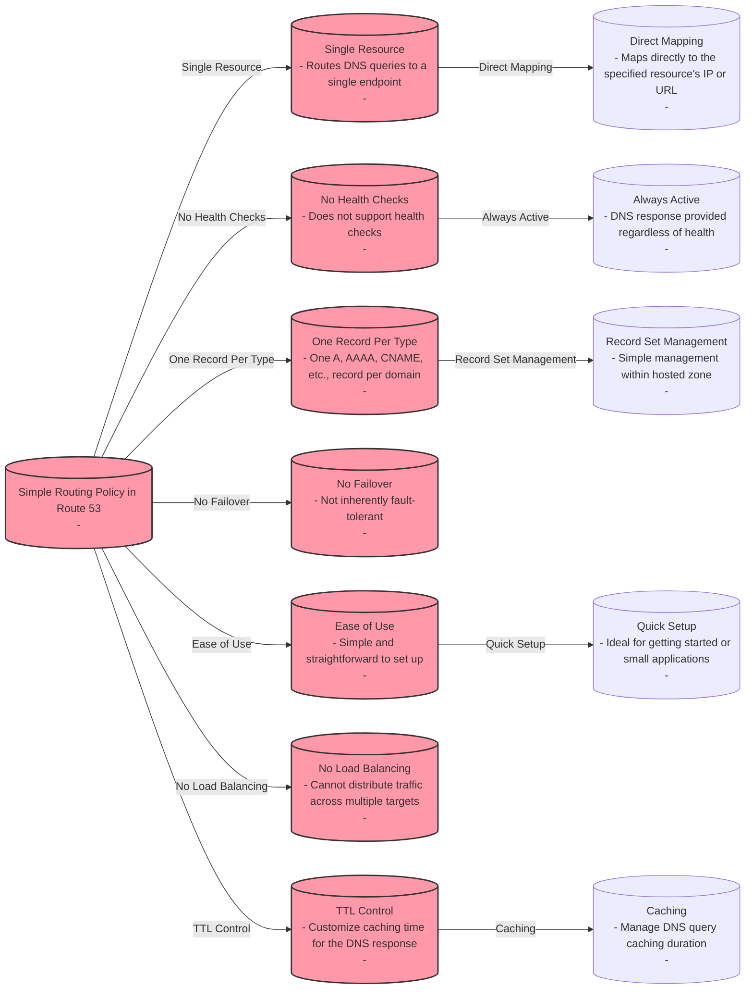
```mermaid

graph LR;
SimpleRoutingPolicy[("Simple Routing Policy in Route 53\n-")]
SimpleRoutingPolicy -->|Single Resource| SingleResource[("Single Resource\n- Routes DNS queries to a single endpoint\n-")]
SimpleRoutingPolicy -->|No Health Checks| NoHealthChecks[("No Health Checks\n- Does not support health checks\n-")]
SimpleRoutingPolicy -->|One Record Per Type| OneRecord[("One Record Per Type\n- One A, AAAA, CNAME, etc., record per domain\n-")]
SimpleRoutingPolicy -->|No Failover| NoFailover[("No Failover\n- Not inherently fault-tolerant\n-")]
SimpleRoutingPolicy -->|Ease of Use| EaseOfUse[("Ease of Use\n- Simple and straightforward to set up\n-")]
SimpleRoutingPolicy -->|No Load Balancing| NoLoadBalancing[("No Load Balancing\n- Cannot distribute traffic across multiple targets\n-")]
SimpleRoutingPolicy -->|TTL Control| TTLControl[("TTL Control\n- Customize caching time for the DNS response\n-")]

    SingleResource -->|Direct Mapping| DirectMapping[("Direct Mapping\n- Maps directly to the specified resource's IP or URL\n-")]
    NoHealthChecks -->|Always Active| AlwaysActive[("Always Active\n- DNS response provided regardless of health\n-")]
    OneRecord -->|Record Set Management| RecordSetManagement[("Record Set Management\n- Simple management within hosted zone\n-")]
    EaseOfUse -->|Quick Setup| QuickSetup[("Quick Setup\n- Ideal for getting started or small applications\n-")]
    TTLControl -->|Caching| Caching[("Caching\n- Manage DNS query caching duration\n-")]

    classDef important fill:#f9a,stroke:#333,stroke-width:2px,shape:rectangle;
    class SimpleRoutingPolicy,SingleResource,NoHealthChecks,OneRecord,NoFailover,EaseOfUse,NoLoadBalancing,TTLControl important;
```

## Weighted Routing Policy in Route 53

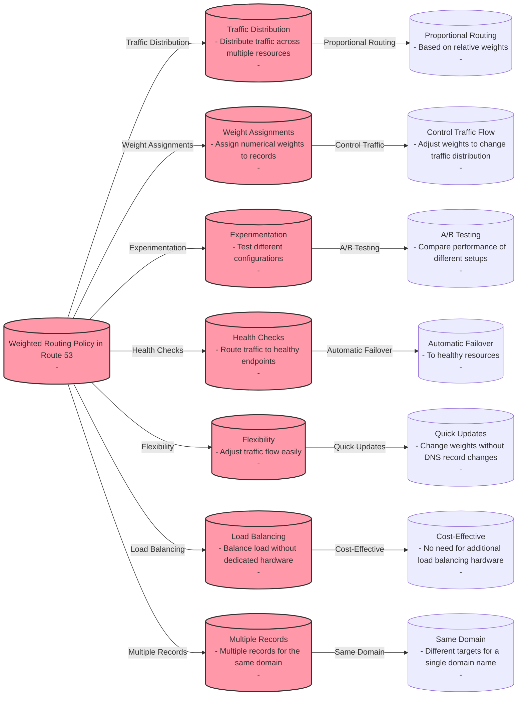
```mermaid

graph LR;
WeightedRoutingPolicy[("Weighted Routing Policy in Route 53\n-")]
WeightedRoutingPolicy -->|Traffic Distribution| TrafficDistribution[("Traffic Distribution\n- Distribute traffic across multiple resources\n-")]
WeightedRoutingPolicy -->|Weight Assignments| WeightAssignments[("Weight Assignments\n- Assign numerical weights to records\n-")]
WeightedRoutingPolicy -->|Experimentation| Experimentation[("Experimentation\n- Test different configurations\n-")]
WeightedRoutingPolicy -->|Health Checks| HealthChecks[("Health Checks\n- Route traffic to healthy endpoints\n-")]
WeightedRoutingPolicy -->|Flexibility| Flexibility[("Flexibility\n- Adjust traffic flow easily\n-")]
WeightedRoutingPolicy -->|Load Balancing| LoadBalancing[("Load Balancing\n- Balance load without dedicated hardware\n-")]
WeightedRoutingPolicy -->|Multiple Records| MultipleRecords[("Multiple Records\n- Multiple records for the same domain\n-")]

    TrafficDistribution -->|Proportional Routing| ProportionalRouting[("Proportional Routing\n- Based on relative weights\n-")]
    WeightAssignments -->|Control Traffic| ControlTraffic[("Control Traffic Flow\n- Adjust weights to change traffic distribution\n-")]
    Experimentation -->|A/B Testing| ABTesting[("A/B Testing\n- Compare performance of different setups\n-")]
    HealthChecks -->|Automatic Failover| AutomaticFailover[("Automatic Failover\n- To healthy resources\n-")]
    Flexibility -->|Quick Updates| QuickUpdates[("Quick Updates\n- Change weights without DNS record changes\n-")]
    LoadBalancing -->|Cost-Effective| CostEffective[("Cost-Effective\n- No need for additional load balancing hardware\n-")]
    MultipleRecords -->|Same Domain| SameDomain[("Same Domain\n- Different targets for a single domain name\n-")]

    classDef important fill:#f9a,stroke:#333,stroke-width:2px,shape:rectangle;
    class WeightedRoutingPolicy,TrafficDistribution,WeightAssignments,Experimentation,HealthChecks,Flexibility,LoadBalancing,MultipleRecords important;

```

## Weighted Routing Policy in Route 53

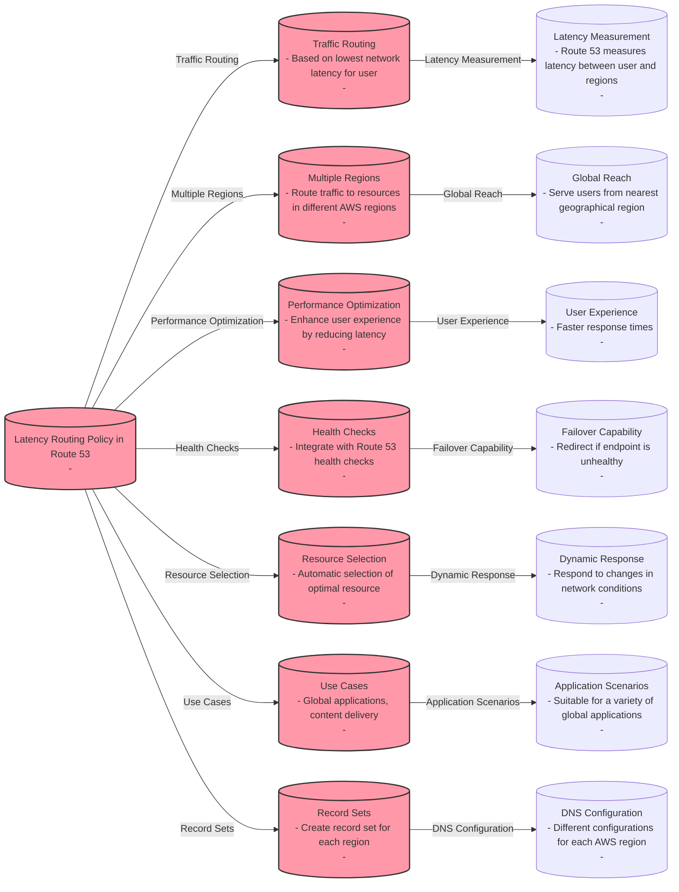
```mermaid
graph LR;
LatencyRoutingPolicy[("Latency Routing Policy in Route 53\n-")]
LatencyRoutingPolicy -->|Traffic Routing| TrafficRouting[("Traffic Routing\n- Based on lowest network latency for user\n-")]
LatencyRoutingPolicy -->|Multiple Regions| MultipleRegions[("Multiple Regions\n- Route traffic to resources in different AWS regions\n-")]
LatencyRoutingPolicy -->|Performance Optimization| PerformanceOptimization[("Performance Optimization\n- Enhance user experience by reducing latency\n-")]
LatencyRoutingPolicy -->|Health Checks| HealthChecks[("Health Checks\n- Integrate with Route 53 health checks\n-")]
LatencyRoutingPolicy -->|Resource Selection| ResourceSelection[("Resource Selection\n- Automatic selection of optimal resource\n-")]
LatencyRoutingPolicy -->|Use Cases| UseCases[("Use Cases\n- Global applications, content delivery\n-")]
LatencyRoutingPolicy -->|Record Sets| RecordSets[("Record Sets\n- Create record set for each region\n-")]

    TrafficRouting -->|Latency Measurement| LatencyMeasurement[("Latency Measurement\n- Route 53 measures latency between user and regions\n-")]
    MultipleRegions -->|Global Reach| GlobalReach[("Global Reach\n- Serve users from nearest geographical region\n-")]
    PerformanceOptimization -->|User Experience| UserExperience[("User Experience\n- Faster response times\n-")]
    HealthChecks -->|Failover Capability| FailoverCapability[("Failover Capability\n- Redirect if endpoint is unhealthy\n-")]
    ResourceSelection -->|Dynamic Response| DynamicResponse[("Dynamic Response\n- Respond to changes in network conditions\n-")]
    UseCases -->|Application Scenarios| ApplicationScenarios[("Application Scenarios\n- Suitable for a variety of global applications\n-")]
    RecordSets -->|DNS Configuration| DNSConfiguration[("DNS Configuration\n- Different configurations for each AWS region\n-")]

    classDef important fill:#f9a,stroke:#333,stroke-width:2px,shape:rectangle;
    class LatencyRoutingPolicy,TrafficRouting,MultipleRegions,PerformanceOptimization,HealthChecks,ResourceSelection,UseCases,RecordSets important;

```

## Route 53 Health Checks

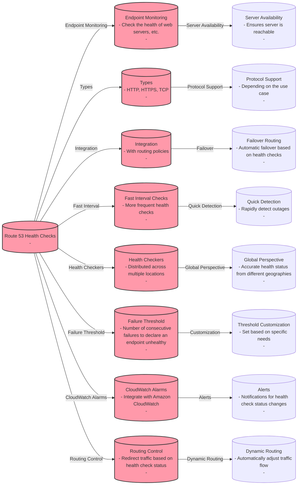
```mermaid
graph LR;
HealthChecks[("Route 53 Health Checks\n-")]
HealthChecks -->|Endpoint Monitoring| EndpointMonitoring[("Endpoint Monitoring\n- Check the health of web servers, etc.\n-")]
HealthChecks -->|Types| HealthCheckTypes[("Types\n- HTTP, HTTPS, TCP\n-")]
HealthChecks -->|Integration| Integration[("Integration\n- With routing policies\n-")]
HealthChecks -->|Fast Interval| FastInterval[("Fast Interval Checks\n- More frequent health checks\n-")]
HealthChecks -->|Health Checkers| HealthCheckers[("Health Checkers\n- Distributed across multiple locations\n-")]
HealthChecks -->|Failure Threshold| FailureThreshold[("Failure Threshold\n- Number of consecutive failures to declare an endpoint unhealthy\n-")]
HealthChecks -->|CloudWatch Alarms| CloudWatchAlarms[("CloudWatch Alarms\n- Integrate with Amazon CloudWatch\n-")]
HealthChecks -->|Routing Control| RoutingControl[("Routing Control\n- Redirect traffic based on health check status\n-")]

    EndpointMonitoring -->|Server Availability| ServerAvailability[("Server Availability\n- Ensures server is reachable\n-")]
    HealthCheckTypes -->|Protocol Support| ProtocolSupport[("Protocol Support\n- Depending on the use case\n-")]
    Integration -->|Failover| Failover[("Failover Routing\n- Automatic failover based on health checks\n-")]
    FastInterval -->|Quick Detection| QuickDetection[("Quick Detection\n- Rapidly detect outages\n-")]
    HealthCheckers -->|Global Perspective| GlobalPerspective[("Global Perspective\n- Accurate health status from different geographies\n-")]
    FailureThreshold -->|Customization| ThresholdCustomization[("Threshold Customization\n- Set based on specific needs\n-")]
    CloudWatchAlarms -->|Alerts| Alerts[("Alerts\n- Notifications for health check status changes\n-")]
    RoutingControl -->|Dynamic Routing| DynamicRouting[("Dynamic Routing\n- Automatically adjust traffic flow\n-")]

    classDef important fill:#f9a,stroke:#333,stroke-width:2px,shape:rectangle;
    class HealthChecks,EndpointMonitoring,HealthCheckTypes,Integration,FastInterval,HealthCheckers,FailureThreshold,CloudWatchAlarms,RoutingControl important;

```

## Route 53 Health Checks Endpoint Monitoring

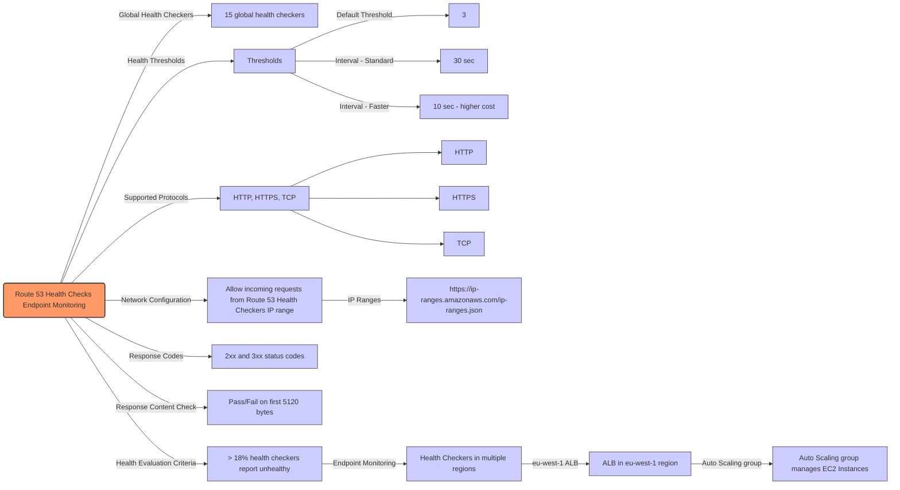
```mermaid
graph LR;
HealthChecks(Route 53 Health Checks Endpoint Monitoring)
HealthChecks -->|Global Health Checkers| GlobalCheckers[15 global health checkers]
HealthChecks -->|Health Thresholds| Thresholds
HealthChecks -->|Supported Protocols| Protocols[HTTP, HTTPS, TCP]
HealthChecks -->|Health Evaluation Criteria| Evaluation["> 18% health checkers report unhealthy"]
HealthChecks -->|Response Codes| Codes[2xx and 3xx status codes]
HealthChecks -->|Response Content Check| ContentCheck[Pass/Fail on first 5120 bytes]
HealthChecks -->|Network Configuration| NetworkConfig[Allow incoming requests from Route 53 Health Checkers IP range]

    Thresholds -->|Default Threshold| DefaultThreshold[3]
    Thresholds -->|Interval - Standard| IntervalStandard[30 sec]
    Thresholds -->|Interval - Faster| IntervalFaster[10 sec - higher cost]

    Protocols --> HTTP[HTTP]
    Protocols --> HTTPS[HTTPS]
    Protocols --> TCP[TCP]

    NetworkConfig -->|IP Ranges| IPRanges["https://ip-ranges.amazonaws.com/ip-ranges.json"]

    Evaluation -->|Endpoint Monitoring| EndpointMonitoring[Health Checkers in multiple regions]
    EndpointMonitoring -->|eu-west-1 ALB| ALB[ALB in eu-west-1 region]
    ALB -->|Auto Scaling group| ASG[Auto Scaling group manages EC2 Instances]

    classDef classTitle fill:#f96,stroke:#333,stroke-width:2px;
    classDef classBox fill:#ccf,stroke:#333,stroke-width:1px;
    class HealthChecks classTitle;
    class GlobalCheckers,Protocols,Thresholds,Evaluation,Codes,ContentCheck,NetworkConfig,DefaultThreshold,IntervalStandard,IntervalFaster,HTTP,HTTPS,TCP,IPRanges,EndpointMonitoring,ALB,ASG classBox;


```

## Route 53 Calculated Health Checks

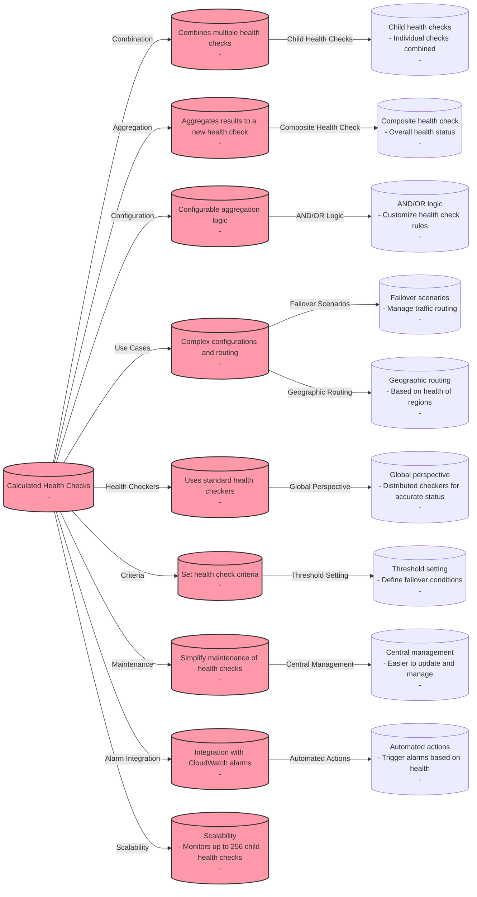
```mermaid

graph LR
;
    CalculatedHealthChecks[("Calculated Health Checks\n-")]
    CalculatedHealthChecks -->|Combination| Combination[("Combines multiple health checks\n-")]
    CalculatedHealthChecks -->|Aggregation| Aggregation[("Aggregates results to a new health check\n-")]
    CalculatedHealthChecks -->|Configuration| Configuration[("Configurable aggregation logic\n-")]
    CalculatedHealthChecks -->|Use Cases| UseCases[("Complex configurations and routing\n-")]
    CalculatedHealthChecks -->|Health Checkers| HealthCheckers[("Uses standard health checkers\n-")]
    CalculatedHealthChecks -->|Criteria| Criteria[("Set health check criteria\n-")]
    CalculatedHealthChecks -->|Maintenance| Maintenance[("Simplify maintenance of health checks\n-")]
    CalculatedHealthChecks -->|Alarm Integration| AlarmIntegration[("Integration with CloudWatch alarms\n-")]
    CalculatedHealthChecks -->|Scalability| Scalability[("Scalability\n- Monitors up to 256 child health checks\n-")]
    Combination -->|Child Health Checks| ChildHealthChecks[("Child health checks\n- Individual checks combined\n-")]
    Aggregation -->|Composite Health Check| CompositeHealthCheck[("Composite health check\n- Overall health status\n-")]
    Configuration -->|AND/OR Logic| ANDORLogic[("AND/OR logic\n- Customize health check rules\n-")]
    UseCases -->|Failover Scenarios| FailoverScenarios[("Failover scenarios\n- Manage traffic routing\n-")]
    UseCases -->|Geographic Routing| GeographicRouting[("Geographic routing\n- Based on health of regions\n-")]
    HealthCheckers -->|Global Perspective| GlobalPerspective[("Global perspective\n- Distributed checkers for accurate status\n-")]
    Criteria -->|Threshold Setting| ThresholdSetting[("Threshold setting\n- Define failover conditions\n-")]
    Maintenance -->|Central Management| CentralManagement[("Central management\n- Easier to update and manage\n-")]
    AlarmIntegration -->|Automated Actions| AutomatedActions[("Automated actions\n- Trigger alarms based on health\n-")]
    classDef important fill: #f9a, stroke: #333, stroke-width: 2px, shape: rectangle;
    class CalculatedHealthChecks,Combination,Aggregation,Configuration,UseCases,HealthCheckers,Criteria,Maintenance,AlarmIntegration,Scalability important;

```

## Route 53 Health Checks for Private Hosted Zones

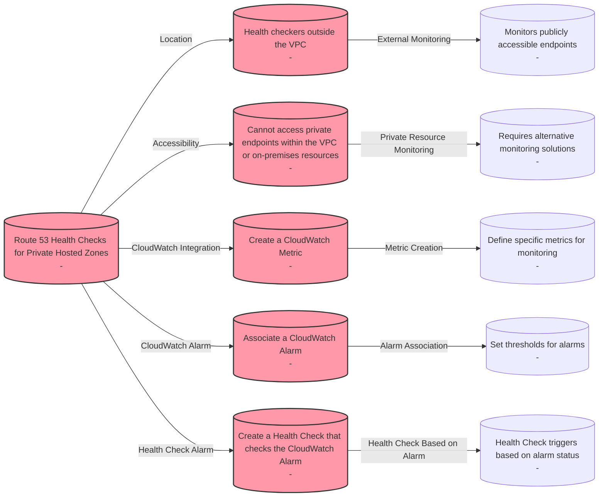
```mermaid
graph LR;
HealthChecksPrivate[("Route 53 Health Checks for Private Hosted Zones\n-")]
HealthChecksPrivate -->|Location| Location[("Health checkers outside the VPC\n-")]
HealthChecksPrivate -->|Accessibility| Accessibility[("Cannot access private endpoints within the VPC or on-premises resources\n-")]
HealthChecksPrivate -->|CloudWatch Integration| CloudWatchIntegration[("Create a CloudWatch Metric\n-")]
HealthChecksPrivate -->|CloudWatch Alarm| CloudWatchAlarm[("Associate a CloudWatch Alarm\n-")]
HealthChecksPrivate -->|Health Check Alarm| HealthCheckAlarm[("Create a Health Check that checks the CloudWatch Alarm\n-")]

    Location -->|External Monitoring| ExternalMonitoring[("Monitors publicly accessible endpoints\n-")]
    Accessibility -->|Private Resource Monitoring| PrivateResourceMonitoring[("Requires alternative monitoring solutions\n-")]
    CloudWatchIntegration -->|Metric Creation| MetricCreation[("Define specific metrics for monitoring\n-")]
    CloudWatchAlarm -->|Alarm Association| AlarmAssociation[("Set thresholds for alarms\n-")]
    HealthCheckAlarm -->|Health Check Based on Alarm| HealthCheckBasedAlarm[("Health Check triggers based on alarm status\n-")]

    classDef important fill:#f9a,stroke:#333,stroke-width:2px,shape:rectangle;
    class HealthChecksPrivate,Location,Accessibility,CloudWatchIntegration,CloudWatchAlarm,HealthCheckAlarm important;

```

## Failover (Active-Passive) Routing Policy in Route 53

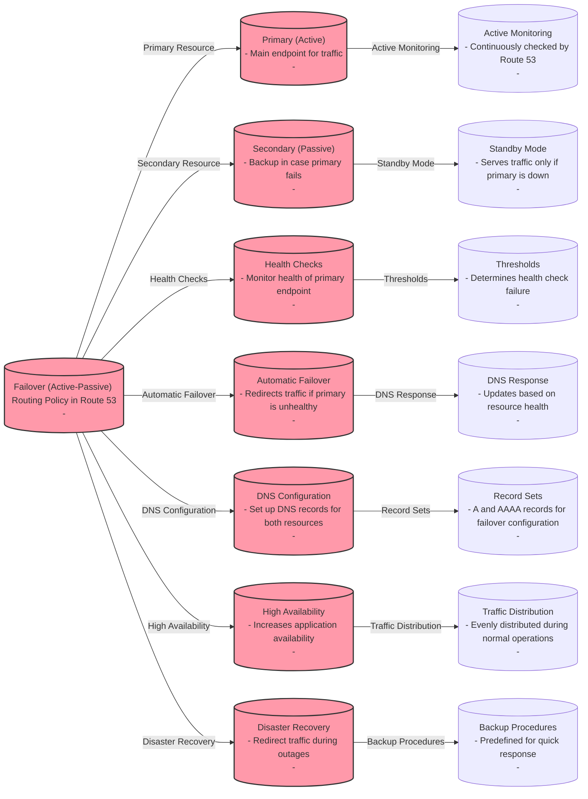
```mermaid
graph LR;
FailoverRoutingPolicy[("Failover (Active-Passive) Routing Policy in Route 53\n-")]
FailoverRoutingPolicy -->|Primary Resource| PrimaryResource[("Primary (Active)\n- Main endpoint for traffic\n-")]
FailoverRoutingPolicy -->|Secondary Resource| SecondaryResource[("Secondary (Passive)\n- Backup in case primary fails\n-")]
FailoverRoutingPolicy -->|Health Checks| HealthChecks[("Health Checks\n- Monitor health of primary endpoint\n-")]
FailoverRoutingPolicy -->|Automatic Failover| AutomaticFailover[("Automatic Failover\n- Redirects traffic if primary is unhealthy\n-")]
FailoverRoutingPolicy -->|DNS Configuration| DNSConfiguration[("DNS Configuration\n- Set up DNS records for both resources\n-")]
FailoverRoutingPolicy -->|High Availability| HighAvailability[("High Availability\n- Increases application availability\n-")]
FailoverRoutingPolicy -->|Disaster Recovery| DisasterRecovery[("Disaster Recovery\n- Redirect traffic during outages\n-")]

    PrimaryResource -->|Active Monitoring| ActiveMonitoring[("Active Monitoring\n- Continuously checked by Route 53\n-")]
    SecondaryResource -->|Standby Mode| StandbyMode[("Standby Mode\n- Serves traffic only if primary is down\n-")]
    HealthChecks -->|Thresholds| Thresholds[("Thresholds\n- Determines health check failure\n-")]
    AutomaticFailover -->|DNS Response| DNSResponse[("DNS Response\n- Updates based on resource health\n-")]
    DNSConfiguration -->|Record Sets| RecordSets[("Record Sets\n- A and AAAA records for failover configuration\n-")]
    HighAvailability -->|Traffic Distribution| TrafficDistribution[("Traffic Distribution\n- Evenly distributed during normal operations\n-")]
    DisasterRecovery -->|Backup Procedures| BackupProcedures[("Backup Procedures\n- Predefined for quick response\n-")]

    classDef important fill:#f9a,stroke:#333,stroke-width:2px,shape:rectangle;
    class FailoverRoutingPolicy,PrimaryResource,SecondaryResource,HealthChecks,AutomaticFailover,DNSConfiguration,HighAvailability,DisasterRecovery important;

```

## Geolocation Routing Policy in Route 53

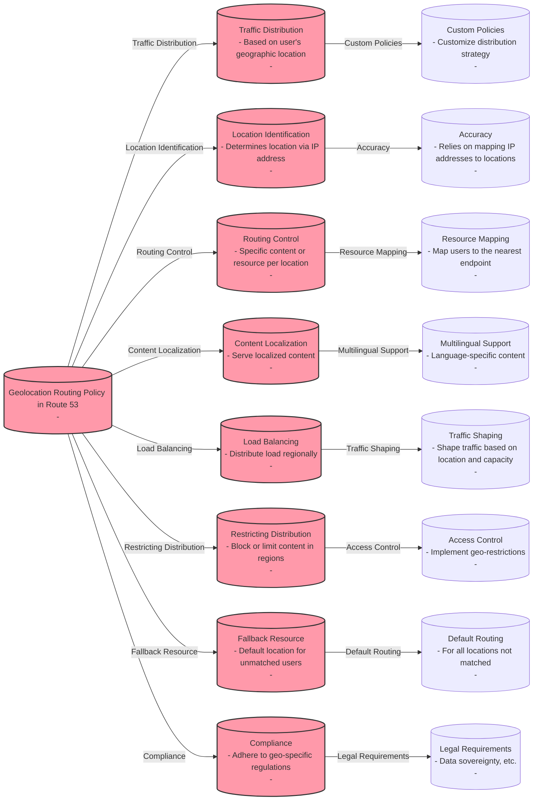
```mermaid

graph LR;
GeolocationRoutingPolicy[("Geolocation Routing Policy in Route 53\n-")]
GeolocationRoutingPolicy -->|Traffic Distribution| TrafficDistribution[("Traffic Distribution\n- Based on user's geographic location\n-")]
GeolocationRoutingPolicy -->|Location Identification| LocationIdentification[("Location Identification\n- Determines location via IP address\n-")]
GeolocationRoutingPolicy -->|Routing Control| RoutingControl[("Routing Control\n- Specific content or resource per location\n-")]
GeolocationRoutingPolicy -->|Content Localization| ContentLocalization[("Content Localization\n- Serve localized content\n-")]
GeolocationRoutingPolicy -->|Load Balancing| LoadBalancing[("Load Balancing\n- Distribute load regionally\n-")]
GeolocationRoutingPolicy -->|Restricting Distribution| RestrictingDistribution[("Restricting Distribution\n- Block or limit content in regions\n-")]
GeolocationRoutingPolicy -->|Fallback Resource| FallbackResource[("Fallback Resource\n- Default location for unmatched users\n-")]
GeolocationRoutingPolicy -->|Compliance| Compliance[("Compliance\n- Adhere to geo-specific regulations\n-")]

    TrafficDistribution -->|Custom Policies| CustomPolicies[("Custom Policies\n- Customize distribution strategy\n-")]
    LocationIdentification -->|Accuracy| Accuracy[("Accuracy\n- Relies on mapping IP addresses to locations\n-")]
    RoutingControl -->|Resource Mapping| ResourceMapping[("Resource Mapping\n- Map users to the nearest endpoint\n-")]
    ContentLocalization -->|Multilingual Support| MultilingualSupport[("Multilingual Support\n- Language-specific content\n-")]
    LoadBalancing -->|Traffic Shaping| TrafficShaping[("Traffic Shaping\n- Shape traffic based on location and capacity\n-")]
    RestrictingDistribution -->|Access Control| AccessControl[("Access Control\n- Implement geo-restrictions\n-")]
    FallbackResource -->|Default Routing| DefaultRouting[("Default Routing\n- For all locations not matched\n-")]
    Compliance -->|Legal Requirements| LegalRequirements[("Legal Requirements\n- Data sovereignty, etc.\n-")]

    classDef important fill:#f9a,stroke:#333,stroke-width:2px,shape:rectangle;
    class GeolocationRoutingPolicy,TrafficDistribution,LocationIdentification,RoutingControl,ContentLocalization,LoadBalancing,RestrictingDistribution,FallbackResource,Compliance important;
```

## Geoproximity Routing Policy in Route 53

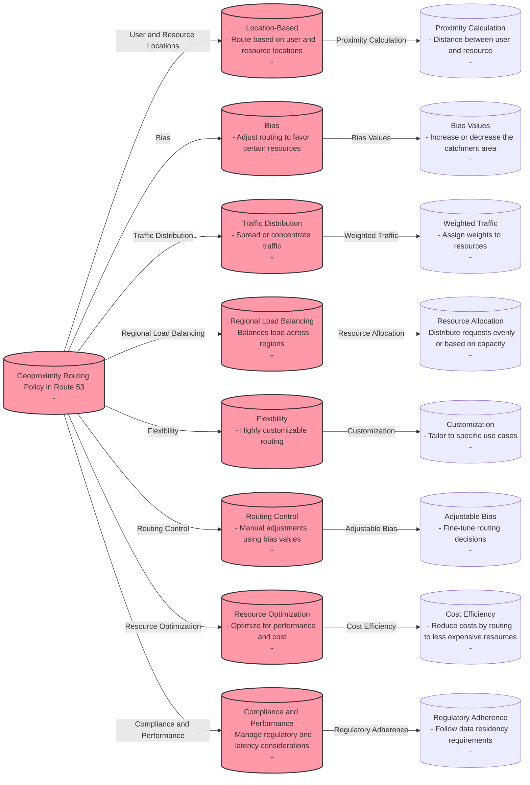
```mermaid

graph LR;
GeoproximityRoutingPolicy[("Geoproximity Routing Policy in Route 53\n-")]
GeoproximityRoutingPolicy -->|User and Resource Locations| UserResourceLocations[("Location-Based\n- Route based on user and resource locations\n-")]
GeoproximityRoutingPolicy -->|Bias| Bias[("Bias\n- Adjust routing to favor certain resources\n-")]
GeoproximityRoutingPolicy -->|Traffic Distribution| TrafficDistribution[("Traffic Distribution\n- Spread or concentrate traffic\n-")]
GeoproximityRoutingPolicy -->|Regional Load Balancing| RegionalLoadBalancing[("Regional Load Balancing\n- Balances load across regions\n-")]
GeoproximityRoutingPolicy -->|Flexibility| Flexibility[("Flexibility\n- Highly customizable routing\n-")]
GeoproximityRoutingPolicy -->|Routing Control| RoutingControl[("Routing Control\n- Manual adjustments using bias values\n-")]
GeoproximityRoutingPolicy -->|Resource Optimization| ResourceOptimization[("Resource Optimization\n- Optimize for performance and cost\n-")]
GeoproximityRoutingPolicy -->|Compliance and Performance| CompliancePerformance[("Compliance and Performance\n- Manage regulatory and latency considerations\n-")]

    UserResourceLocations -->|Proximity Calculation| ProximityCalculation[("Proximity Calculation\n- Distance between user and resource\n-")]
    Bias -->|Bias Values| BiasValues[("Bias Values\n- Increase or decrease the catchment area\n-")]
    TrafficDistribution -->|Weighted Traffic| WeightedTraffic[("Weighted Traffic\n- Assign weights to resources\n-")]
    RegionalLoadBalancing -->|Resource Allocation| ResourceAllocation[("Resource Allocation\n- Distribute requests evenly or based on capacity\n-")]
    Flexibility -->|Customization| Customization[("Customization\n- Tailor to specific use cases\n-")]
    RoutingControl -->|Adjustable Bias| AdjustableBias[("Adjustable Bias\n- Fine-tune routing decisions\n-")]
    ResourceOptimization -->|Cost Efficiency| CostEfficiency[("Cost Efficiency\n- Reduce costs by routing to less expensive resources\n-")]
    CompliancePerformance -->|Regulatory Adherence| RegulatoryAdherence[("Regulatory Adherence\n- Follow data residency requirements\n-")]

    classDef important fill:#f9a,stroke:#333,stroke-width:2px,shape:rectangle;
    class GeoproximityRoutingPolicy,UserResourceLocations,Bias,TrafficDistribution,RegionalLoadBalancing,Flexibility,RoutingControl,ResourceOptimization,CompliancePerformance important;
```

## Multi-Value Routing Policy

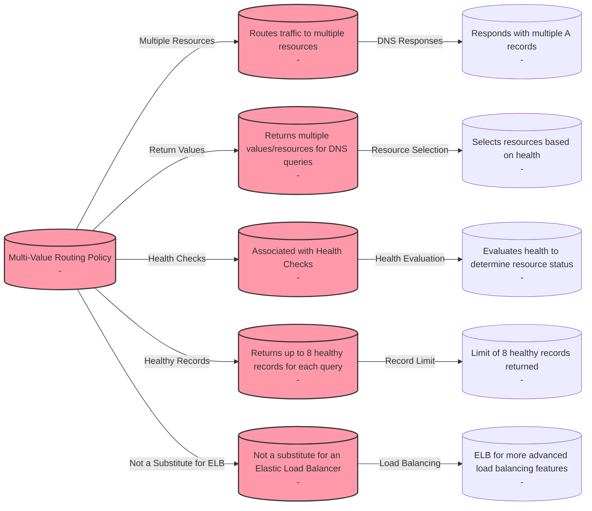
```mermaid
graph LR;
MultiValueRoutingPolicy[("Multi-Value Routing Policy\n-")]
MultiValueRoutingPolicy -->|Multiple Resources| MultipleResources[("Routes traffic to multiple resources\n-")]
MultiValueRoutingPolicy -->|Return Values| ReturnValues[("Returns multiple values/resources for DNS queries\n-")]
MultiValueRoutingPolicy -->|Health Checks| HealthChecks[("Associated with Health Checks\n-")]
MultiValueRoutingPolicy -->|Healthy Records| HealthyRecords[("Returns up to 8 healthy records for each query\n-")]
MultiValueRoutingPolicy -->|Not a Substitute for ELB| NotELB[("Not a substitute for an Elastic Load Balancer\n-")]

    MultipleResources -->|DNS Responses| DNSResponses[("Responds with multiple A records\n-")]
    ReturnValues -->|Resource Selection| ResourceSelection[("Selects resources based on health\n-")]
    HealthChecks -->|Health Evaluation| HealthEvaluation[("Evaluates health to determine resource status\n-")]
    HealthyRecords -->|Record Limit| RecordLimit[("Limit of 8 healthy records returned\n-")]
    NotELB -->|Load Balancing| LoadBalancing[("ELB for more advanced load balancing features\n-")]

    classDef important fill:#f9a,stroke:#333,stroke-width:2px;
    class MultiValueRoutingPolicy,MultipleResources,ReturnValues,HealthChecks,HealthyRecords,NotELB important;

```

## Table that compares the main routing policies available in Route 53

| Feature / Policy           | Simple             | Weighted           | Latency          | Failover           | Geolocation        | Geoproximity       | Multi-Value        |
|----------------------------|--------------------|--------------------|------------------|--------------------|--------------------|--------------------|--------------------|
| **Traffic Routing**        | Single resource    | Multiple resources | Based on latency | Active/Passive     | Based on location  | Based on location with optional bias | Multiple health-checked resources |
| **Resource Health Checks** | Not supported      | Optional           | Optional         | Required           | Optional           | Optional           | Required           |
| **Use Cases**              | Basic DNS          | Load distribution  | Performance      | High availability  | Content localization | Customizable traffic distribution | Simple load balancing |
| **Resource Selection**     | Fixed              | Weight-based       | Latency-based    | Health-based       | Location-based     | Location and bias-based | Health-based       |
| **Response Diversity**     | Single answer      | Multiple answers   | Multiple answers | Two types: primary and secondary | Multiple answers   | Multiple answers   | Multiple answers   |
| **Suitability**            | Simple setups      | Complex setups with multiple endpoints | Performance optimization | Disaster recovery  | Location-based content delivery | Advanced location-based traffic shaping | Small scale load balancing |
| **Return Values**          | One                | One or more        | One or more      | One (active or passive) | One or more        | One or more        | Up to eight        |
| **Failover Capability**    | Not available      | Not by default     | Not by default   | Yes                | Not by default     | Not by default     | Not by default     |
| **Global Reach**           | Yes                | Yes                | Yes              | Yes                | Yes                | Yes with bias adjustments | Yes                |

## Key differences between Elastic Load Balancing (ELB) and Amazon Route 53 routing

| Feature                        | Elastic Load Balancing (ELB)                                                                 | Amazon Route 53 Routing                                                             |
|--------------------------------|----------------------------------------------------------------------------------------------|-------------------------------------------------------------------------------------|
| **Primary Function**           | Distributes incoming application traffic across multiple targets, such as EC2 instances.     | DNS service that routes end users to Internet applications.                         |
| **Health Checks**              | Performs health checks on the instances it manages.                                           | Offers health checking services that can route traffic based on health status.      |
| **Load Balancing Types**       | Application Load Balancer (ALB), Network Load Balancer (NLB), Classic Load Balancer (CLB).   | No specific types, but routing policies can mimic load balancing behavior.          |
| **Traffic Routing Methods**    | Based on content, application state, or network variables.                                    | Based on DNS queries, with methods like geolocation, latency, failover, etc.        |
| **Scalability**                | Automatically scales its request handling capacity to meet demands.                           | Scales traffic routing mechanisms but does not handle the actual traffic.            |
| **Integration with AWS Services** | Deep integration with EC2, ECS, Auto Scaling, etc.                                            | Integrates with AWS services for health checks and routing but does not manage traffic. |
| **DNS Management**             | Does not manage DNS, relies on Route 53 or other DNS services.                                | Manages DNS records and responds to DNS queries.                                    |
| **Protocols Supported**        | HTTP, HTTPS, TCP, UDP, and TLS (depending on the type of ELB).                                | DNS-based routing, protocol-agnostic.                                               |
| **Use Cases**                  | High-traffic web applications, real-time streaming, and WebSocket applications.               | Domain registration, DNS routing, health checks, and traffic flow logging.          |
| **Path-Based Routing**         | ALB can route traffic based on URL path in the request.                                       | Does not support path-based routing; routing decisions are made at the DNS level.   |
| **SSL/TLS Termination**        | Supports SSL/TLS termination at the load balancer.                                            | Does not terminate SSL/TLS, as it operates at the DNS level.                         |
| **Pricing**                    | Charged based on the number of Load Balancer Capacity Units (LCU) used.                        | Charged based on the number of DNS queries, health checks, and hosted zones.        |
| **High Availability**          | Provides high availability by distributing traffic across multiple AZs.                        | Provides high availability by routing user traffic to healthy endpoints.             |
| **Failover**                   | Automatically reroutes traffic to healthy instances in the event of failures.                  | Can be configured to perform failover routing to alternate endpoints.                |
