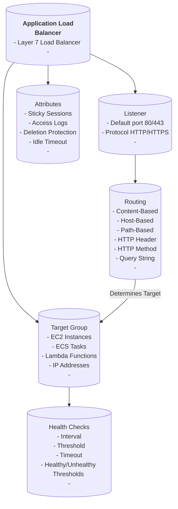
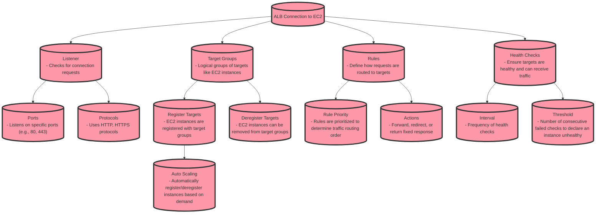
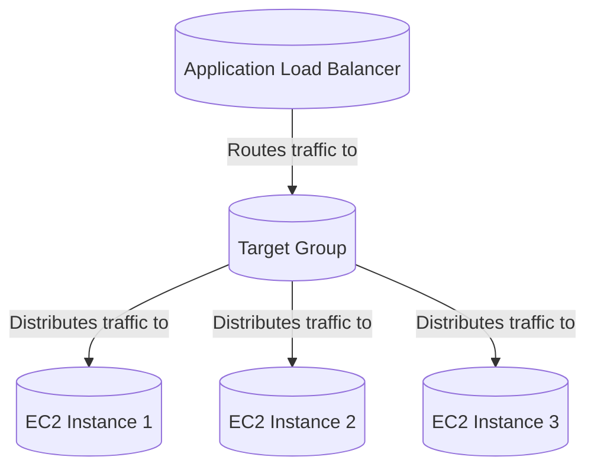

# ALB

```mermaid
graph TD;
    ALB[("<b> Application Load Balancer</b>\n- Layer 7 Load Balancer \n-")]
    Listener[("Listener\n- Default port 80/443\n- Protocol HTTP/HTTPS \n-")]
    TargetGroup[("Target Group\n- EC2 Instances\n- ECS Tasks\n- Lambda Functions\n- IP Addresses \n-")]
    Routing[("Routing\n- Content-Based\n- Host-Based\n- Path-Based\n- HTTP Header\n- HTTP Method\n- Query String\n-")]
    HealthChecks[("Health Checks\n- Interval\n- Threshold\n- Timeout\n- Healthy/Unhealthy Thresholds \n-")]
    Attributes[("Attributes\n- Sticky Sessions\n- Access Logs\n- Deletion Protection\n- Idle Timeout \n-")]

    ALB --> Listener
    Listener --> Routing
    ALB --> TargetGroup
    Routing -->|Determines Target| TargetGroup
    TargetGroup --> HealthChecks
    ALB --> Attributes


```

# ALB Connection to EC2

```mermaid
graph TD;
    ALB_Connection[("ALB Connection to EC2")]
    ALB_Connection --> Target_Groups[("Target Groups\n- Logical groups of targets like EC2 instances")]
    ALB_Connection --> Listener[("Listener\n- Checks for connection requests")]
    ALB_Connection --> Rules[("Rules\n- Define how requests are routed to targets")]
    ALB_Connection --> Health_Checks[("Health Checks\n- Ensure targets are healthy and can receive traffic")]

    Listener --> Ports[("Ports\n- Listens on specific ports (e.g., 80, 443)")]
    Listener --> Protocols[("Protocols\n- Uses HTTP, HTTPS protocols")]

    Target_Groups --> Register_Targets[("Register Targets\n- EC2 instances are registered with target groups")]
    Target_Groups --> Deregister_Targets[("Deregister Targets\n- EC2 instances can be removed from target groups")]

    Rules --> Rule_Priority[("Rule Priority\n- Rules are prioritized to determine traffic routing order")]
    Rules --> Actions[("Actions\n- Forward, redirect, or return fixed response")]

    Health_Checks --> Interval[("Interval\n- Frequency of health checks")]
    Health_Checks --> Threshold[("Threshold\n- Number of consecutive failed checks to declare an instance unhealthy")]

    Register_Targets --> Auto_Scaling[("Auto Scaling\n- Automatically register/deregister instances based on demand")]

    classDef important fill:#f9a,stroke:#333,stroke-width:4px;
    class ALB_Connection,Target_Groups,Listener,Rules,Health_Checks,Ports,Protocols,Register_Targets,Deregister_Targets,Rule_Priority,Actions,Interval,Threshold,Auto_Scaling important;


```

```mermaid
graph TD;
ALB[("Application Load Balancer")]
TG[("Target Group")]
EC2_1[("EC2 Instance 1")]
EC2_2[("EC2 Instance 2")]
EC2_3[("EC2 Instance 3")]

    ALB -->|Routes traffic to| TG
    TG -->|Distributes traffic to| EC2_1
    TG -->|Distributes traffic to| EC2_2
    TG -->|Distributes traffic to| EC2_3
```

