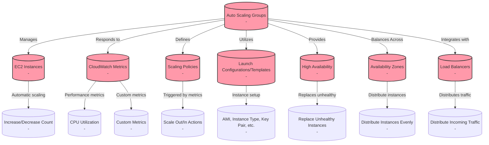
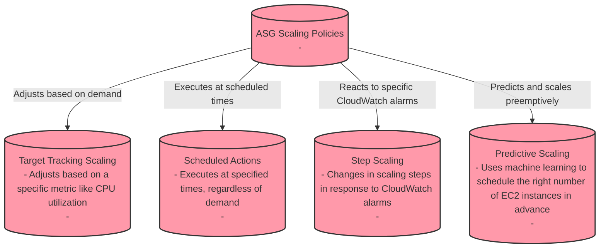
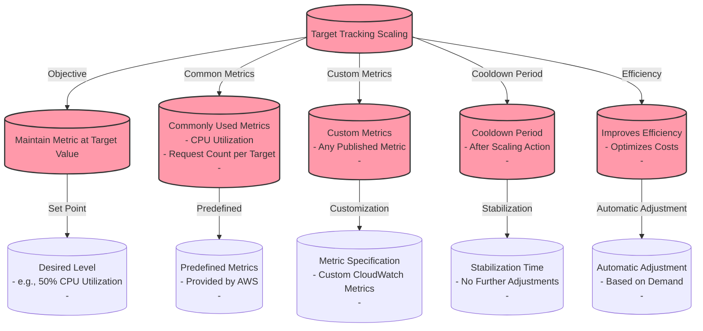
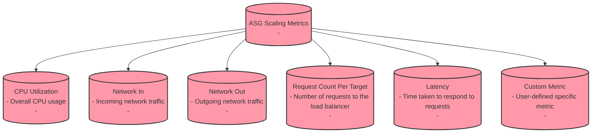
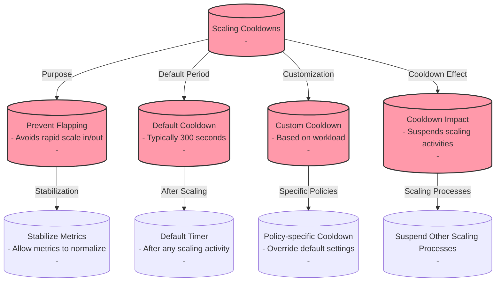
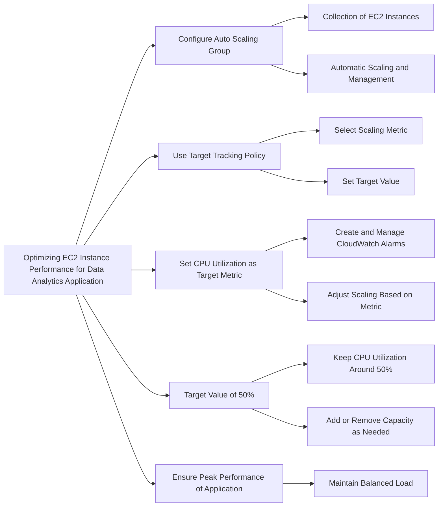
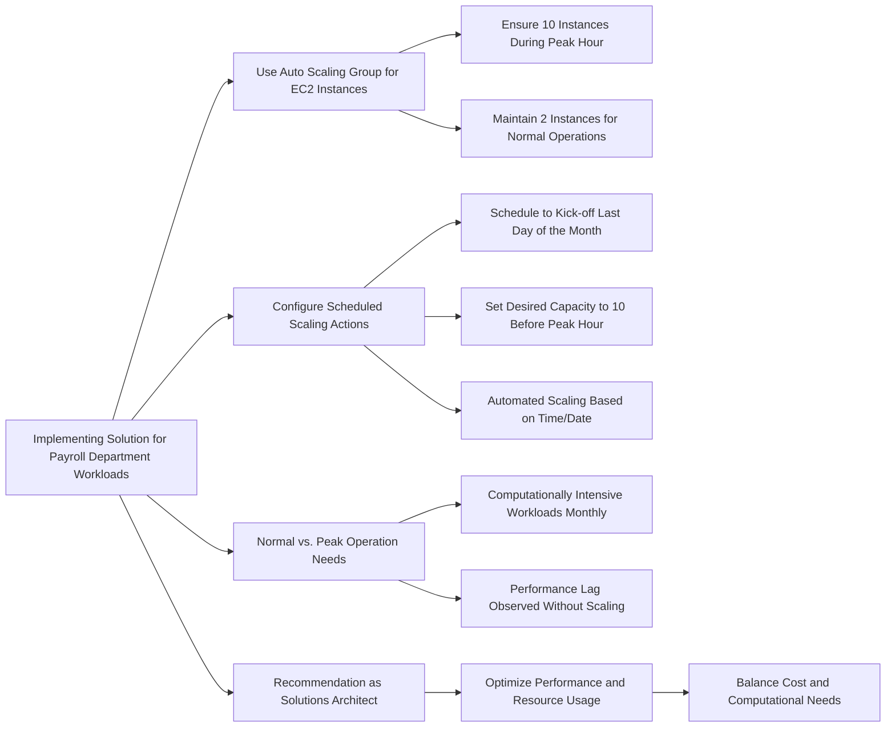

# ASG

## ASG Scaling Policies

## ASG Target Tracking Scaling

## ASG Scaling Metrics

## ASG Scaling Cooldowns

## For exam:

1. The engineering team at a data analytics company has observed that its flagship application functions at its peak performance when the underlying Amazon Elastic Compute Cloud (Amazon EC2) instances have a CPU utilization of about 50%. The application is built on a fleet of Amazon EC2 instances managed under an Auto Scaling group. The workflow requests are handled by an internal Application Load Balancer that routes the requests to the instances.

As a solutions architect, what would you recommend so that the application runs near its peak performance state?

***Answer:*** Configure the Auto Scaling group to use target tracking policy and set the CPU utilization as the target metric with a target value of 50%

An Auto Scaling group contains a collection of Amazon EC2 instances that are treated as a logical grouping for the purposes of automatic scaling and management. An Auto Scaling group also enables you to use Amazon EC2 Auto Scaling features such as health check replacements and scaling policies.

With target tracking scaling policies, you select a scaling metric and set a target value. Amazon EC2 Auto Scaling creates and manages the CloudWatch alarms that trigger the scaling policy and calculates the scaling adjustment based on the metric and the target value. The scaling policy adds or removes capacity as required to keep the metric at, or close to, the specified target value.

For example, you can use target tracking scaling to:

Configure a target tracking scaling policy to keep the average aggregate CPU utilization of your Auto Scaling group at 50 percent. This meets the requirements specified in the given use-case and therefore, this is the correct option.

2. The payroll department at a company initiates several computationally intensive workloads on Amazon EC2 instances at a designated hour on the last day of every month. The payroll department has noticed a trend of severe performance lag during this hour. The engineering team has figured out a solution by using Auto Scaling Group for these Amazon EC2 instances and making sure that 10 Amazon EC2 instances are available during this peak usage hour. For normal operations only 2 Amazon EC2 instances are enough to cater to the workload.

As a solutions architect, which of the following steps would you recommend to implement the solution?

***Answer:*** Configure your Auto Scaling group by creating a scheduled action that kicks-off at the designated hour on the last day of the month. Set the desired capacity of instances to 10. This causes the scale-out to happen before peak traffic kicks in at the designated hour

Scheduled scaling allows you to set your own scaling schedule. For example, let's say that every week the traffic to your web application starts to increase on Wednesday, remains high on Thursday, and starts to decrease on Friday. You can plan your scaling actions based on the predictable traffic patterns of your web application. Scaling actions are performed automatically as a function of time and date.

A scheduled action sets the minimum, maximum, and desired sizes to what is specified by the scheduled action at the time specified by the scheduled action. For the given use case, the correct solution is to set the desired capacity to 10. When we want to specify a range of instances, then we must use min and max values.

