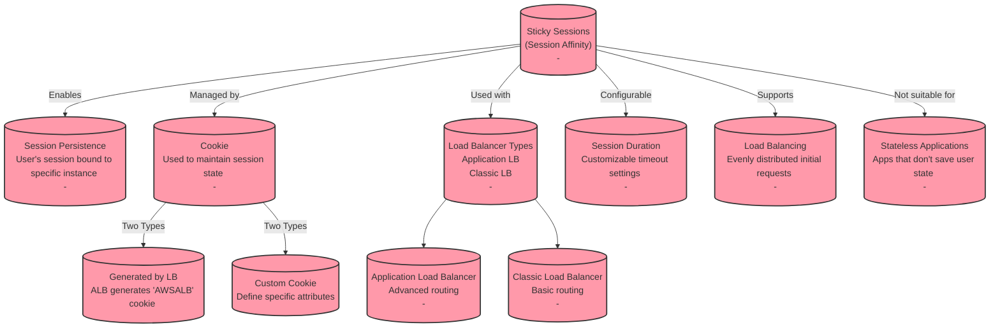

# Sticky sessions

```mermaid
graph TD;
    SS[("Sticky Sessions\n(Session Affinity) \n-")]
    SS -->|Enables| Persistence[("Session Persistence\nUser's session bound to specific instance \n-")]
    SS -->|Managed by| Cookie[("Cookie\nUsed to maintain session state \n-")]
    SS -->|Used with| LB_Types[("Load Balancer Types\nApplication LB\nClassic LB \n-")]
    SS -->|Configurable| Duration[("Session Duration\nCustomizable timeout settings \n-")]
    SS -->|Supports| Balancing[("Load Balancing\nEvenly distributed initial requests \n-")]
    SS -->|Not suitable for| Stateless[("Stateless Applications\nApps that don't save user state \n-")]

    Cookie -->|Two Types| CookieGenerated[("Generated by LB\nALB generates 'AWSALB' cookie \n")]
    Cookie -->|Two Types| CustomCookie[("Custom Cookie\nDefine specific attributes \n")]

    LB_Types --> ALB[("Application Load Balancer\nAdvanced routing \n-")]
    LB_Types --> CLB[("Classic Load Balancer\nBasic routing \n-")]

    classDef important fill:#f9a,stroke:#333,stroke-width:2px;
    class SS,Persistence,Cookie,LB_Types,Duration,Balancing,Stateless,CookieGenerated,CustomCookie,ALB,CLB important;


```
