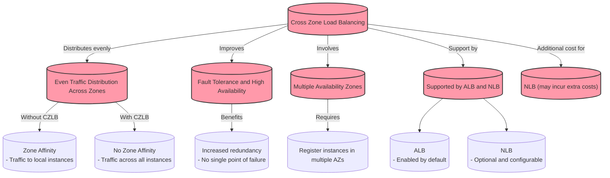

# Sticky sessions

```mermaid
graph TD;
    CZLB[("Cross Zone Load Balancing")]
    CZLB -->|Distributes evenly| TrafficDistribution[("Even Traffic Distribution Across Zones")]
    CZLB -->|Improves| FaultTolerance[("Fault Tolerance and High Availability")]
    CZLB -->|Involves| MultipleAZs[("Multiple Availability Zones")]
    CZLB -->|Support by| ALB_NLB[("Supported by ALB and NLB")]
    CZLB -->|Additional cost for| NLB_Cost[("NLB (may incur extra costs)")]

    TrafficDistribution -->|Without CZLB| ZoneAffinity[("Zone Affinity\n- Traffic to local instances")]
    TrafficDistribution -->|With CZLB| NoZoneAffinity[("No Zone Affinity\n- Traffic across all instances")]

    FaultTolerance -->|Benefits| FT_Benefits[("Increased redundancy\n- No single point of failure")]

    MultipleAZs -->|Requires| AZ_Registration[("Register instances in multiple AZs")]

    ALB_NLB --> ALB[("ALB\n- Enabled by default")]
    ALB_NLB --> NLB[("NLB\n- Optional and configurable")]

    style CZLB fill:#f9a,stroke:#333,stroke-width:2px,shape:rectangle
    style TrafficDistribution fill:#f9a,stroke:#333,stroke-width:2px,shape:rectangle
    style FaultTolerance fill:#f9a,stroke:#333,stroke-width:2px,shape:rectangle
    style MultipleAZs fill:#f9a,stroke:#333,stroke-width:2px,shape:rectangle
    style ALB_NLB fill:#f9a,stroke:#333,stroke-width:2px,shape:rectangle
    style NLB_Cost fill:#f9a,stroke:#333,stroke-width:2px,shape:rectangle


```
