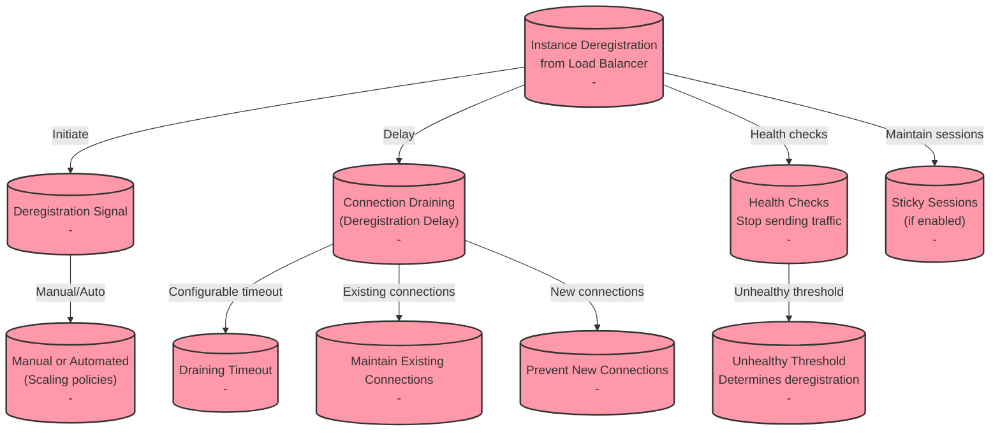

# Instance Deregistration

```mermaid
graph TD;
    Deregistration[("Instance Deregistration\nfrom Load Balancer\n-")]
    Deregistration -->|Initiate| DeregistrationSignal[("Deregistration Signal\n-")]
    Deregistration -->|Delay| ConnectionDraining[("Connection Draining\n(Deregistration Delay)\n-")]
    Deregistration -->|Health checks| HealthChecks[("Health Checks\nStop sending traffic\n-")]
    Deregistration -->|Maintain sessions| StickySessions[("Sticky Sessions\n(if enabled)\n-")]

    DeregistrationSignal -->|Manual/Auto| DeregistrationMethod[("Manual or Automated\n(Scaling policies)\n-")]

    ConnectionDraining -->|Configurable timeout| DrainingTimeout[("Draining Timeout\n-")]
    ConnectionDraining -->|Existing connections| MaintainConnections[("Maintain Existing Connections\n-")]
    ConnectionDraining -->|New connections| PreventNewConnections[("Prevent New Connections\n-")]

    HealthChecks -->|Unhealthy threshold| UnhealthyThreshold[("Unhealthy Threshold\nDetermines deregistration\n-")]


    classDef important fill:#f9a,stroke:#333,stroke-width:2px,shape:rectangle;
    class Deregistration,DeregistrationSignal,ConnectionDraining,HealthChecks,StickySessions,DeregistrationMethod,DrainingTimeout,MaintainConnections,PreventNewConnections,UnhealthyThreshold important;
```
