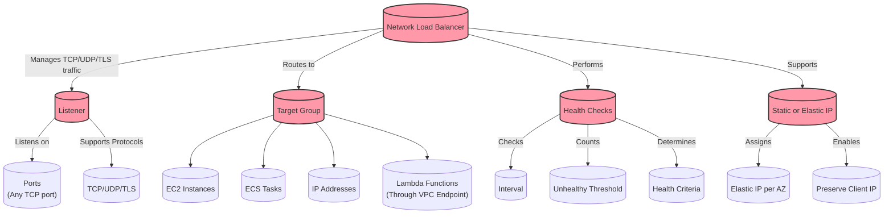

# NLB

```mermaid
graph TD;
    NLB[("Network Load Balancer")]
    NLB -->|Manages TCP/UDP/TLS traffic| Listener
    NLB -->|Routes to| TargetGroup
    NLB -->|Performs| HealthChecks
    NLB -->|Supports| StaticIP

    Listener[("Listener")]
    Listener -->|Listens on| Ports[("Ports\n(Any TCP port)")]
    Listener -->|Supports Protocols| Protocols[("TCP/UDP/TLS")]

    TargetGroup[("Target Group")]
    TargetGroup --> EC2[("EC2 Instances")]
    TargetGroup --> ECS[("ECS Tasks")]
    TargetGroup --> IP[("IP Addresses")]
    TargetGroup --> Lambda[("Lambda Functions\n(Through VPC Endpoint)")]

    HealthChecks[("Health Checks")]
    HealthChecks -->|Checks| Interval[("Interval")]
    HealthChecks -->|Counts| UnhealthyThreshold[("Unhealthy Threshold")]
    HealthChecks -->|Determines| HealthCriteria[("Health Criteria")]

    StaticIP[("Static or Elastic IP")]
    StaticIP -->|Assigns| EIP[("Elastic IP per AZ")]
    StaticIP -->|Enables| PreservedClientIP[("Preserve Client IP")]

    classDef important fill:#f9a,stroke:#333,stroke-width:2px;
    class NLB,Listener,TargetGroup,HealthChecks,StaticIP important;


```

