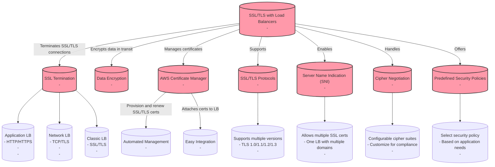

# SSL with LB

```mermaid
graph TD;
    SSL_LB[("SSL/TLS with Load Balancers\n-")]
    SSL_LB -->|Terminates SSL/TLS connections| Termination[("SSL Termination\n-")]
    SSL_LB -->|Encrypts data in transit| Encryption[("Data Encryption\n-")]
    SSL_LB -->|Manages certificates| ACM[("AWS Certificate Manager\n-")]
    SSL_LB -->|Supports| Protocols[("SSL/TLS Protocols\n-")]
    SSL_LB -->|Enables| SNI[("Server Name Indication (SNI)\n-")]
    SSL_LB -->|Handles| Cipher[("Cipher Negotiation\n-")]
    SSL_LB -->|Offers| ELB_Policies[("Predefined Security Policies\n-")]

    Termination --> ALB[("Application LB\n- HTTP/HTTPS \n-\n-")]
    Termination --> NLB[("Network LB\n- TCP/TLS \n-\n-")]
    Termination --> CLB[("Classic LB\n- SSL/TLS\n-")]

    ACM -->|Provision and renew SSL/TLS certs| ACM_Auto[("Automated Management\n-")]
    ACM -->|Attaches certs to LB| ACM_Attach[("Easy Integration\n-")]

    Protocols --> Protocols_List[("Supports multiple versions\n- TLS 1.0/1.1/1.2/1.3\n-")]
    SNI --> SNI_Details[("Allows multiple SSL certs\n- One LB with multiple domains\n-")]

    Cipher --> Cipher_Support[("Configurable cipher suites\n- Customize for compliance\n-")]
    ELB_Policies --> ELB_Security[("Select security policy\n- Based on application needs\n-")]

    classDef sslclass fill:#f9a,stroke:#333,stroke-width:2px,shape:rectangle;
    class SSL_LB,Termination,Encryption,ACM,Protocols,SNI,Cipher,ELB_Policies sslclass;


```

