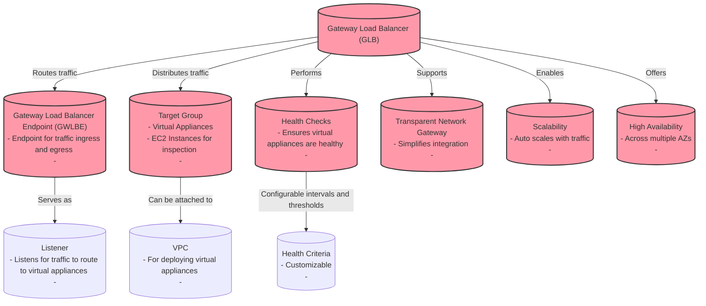

# GLB

```mermaid
graph TD;
    GLB[("Gateway Load Balancer (GLB)")]
    GLB -->|Routes traffic| Endpoint[("Gateway Load Balancer Endpoint (GWLBE)\n- Endpoint for traffic ingress and egress \n-")]
    GLB -->|Distributes traffic| TargetGroup[("Target Group\n- Virtual Appliances\n- EC2 Instances for inspection \n-")]
    GLB -->|Performs| HealthChecks[("Health Checks\n- Ensures virtual appliances are healthy \n-")]
    GLB -->|Supports| TransparentNetwork[("Transparent Network Gateway\n- Simplifies integration \n-")]
    GLB -->|Enables| Scalability[("Scalability\n- Auto scales with traffic \n-")]
    GLB -->|Offers| HighAvailability[("High Availability\n- Across multiple AZs \n-")]

    Endpoint -->|Serves as| Listener[("Listener\n- Listens for traffic to route to virtual appliances \n-")]
    TargetGroup -->|Can be attached to| VPC[("VPC\n- For deploying virtual appliances \n-")]
    HealthChecks -->|Configurable intervals and thresholds| HealthCriteria[("Health Criteria\n- Customizable \n-")]

    classDef important fill:#f9a,stroke:#333,stroke-width:2px;
    class GLB,Endpoint,TargetGroup,HealthChecks,TransparentNetwork,Scalability,HighAvailability important;


```
