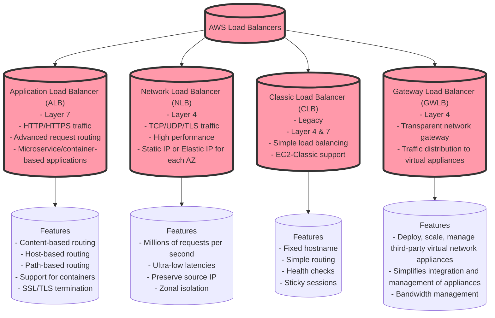

# AWS Load Balancers

```mermaid
graph TD;
    AWS_Load_Balancers[("AWS Load Balancers")]
    AWS_Load_Balancers --> Application_LB[("Application Load Balancer (ALB)\n- Layer 7\n- HTTP/HTTPS traffic\n- Advanced request routing\n- Microservice/container-based applications")]
    AWS_Load_Balancers --> Network_LB[("Network Load Balancer (NLB)\n- Layer 4\n- TCP/UDP/TLS traffic\n- High performance\n- Static IP or Elastic IP for each AZ")]
    AWS_Load_Balancers --> Classic_LB[("Classic Load Balancer (CLB)\n- Legacy\n- Layer 4 & 7\n- Simple load balancing\n- EC2-Classic support")]
    AWS_Load_Balancers --> Gateway_LB[("Gateway Load Balancer (GWLB)\n- Layer 4\n- Transparent network gateway\n- Traffic distribution to virtual appliances")]

    Application_LB --> ALB_Features[("Features\n- Content-based routing\n- Host-based routing\n- Path-based routing\n- Support for containers\n- SSL/TLS termination")]
    Network_LB --> NLB_Features[("Features\n- Millions of requests per second\n- Ultra-low latencies\n- Preserve source IP\n- Zonal isolation")]
    Classic_LB --> CLB_Features[("Features\n- Fixed hostname\n- Simple routing\n- Health checks\n- Sticky sessions")]
    Gateway_LB --> GWLB_Features[("Features\n- Deploy, scale, manage third-party virtual network appliances\n- Simplifies integration and management of appliances\n- Bandwidth management")]

    classDef important fill:#f9a,stroke:#333,stroke-width:4px;
    class AWS_Load_Balancers,Application_LB,Network_LB,Classic_LB,Gateway_LB important;


```

