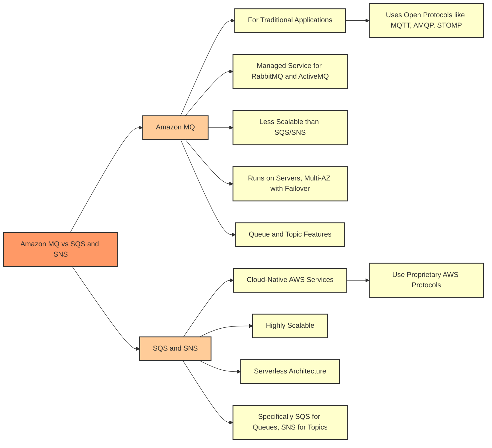
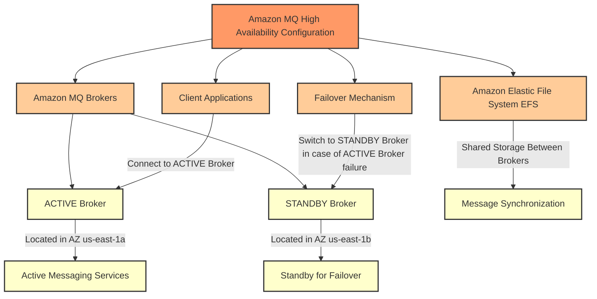

# Amazon MQ

```mermaid
graph LR
    A[Amazon MQ vs SQS and SNS] --> B[Amazon MQ]
    B --> C[For Traditional Applications]
    C --> D[Uses Open Protocols like MQTT, AMQP, STOMP]
    B --> E[Managed Service for RabbitMQ and ActiveMQ]
    B --> F[Less Scalable than SQS/SNS]
    B --> G[Runs on Servers, Multi-AZ with Failover]
    B --> H[Queue and Topic Features]

    A --> I[SQS and SNS]
    I --> J[Cloud-Native AWS Services]
    J --> K[Use Proprietary AWS Protocols]
    I --> L[Highly Scalable]
    I --> M[Serverless Architecture]
    I --> N[Specifically SQS for Queues, SNS for Topics]

    classDef heading fill:#f96,stroke:#333,stroke-width:2px;
    classDef subheading fill:#ffcc99,stroke:#333,stroke-width:2px;
    classDef details fill:#ffffcc,stroke:#333,stroke-width:2px;

    class A heading;
    class B,I subheading;
    class C,D,E,F,G,H,J,K,L,M,N details;
```
# Amazon MQ High Availability Configuration

```mermaid

graph TD
A[Amazon MQ High Availability Configuration] --> B[Amazon MQ Brokers]
B --> C[ACTIVE Broker]
C -->|Located in AZ us-east-1a| D[Active Messaging Services]
B --> E[STANDBY Broker]
E -->|Located in AZ us-east-1b| F[Standby for Failover]

    A --> G[Client Applications]
    G -->|Connect to ACTIVE Broker| C

    A --> H[Amazon Elastic File System EFS]
    H -->|Shared Storage Between Brokers| I[Message Synchronization]

    A --> J[Failover Mechanism]
    J -->|Switch to STANDBY Broker in case of ACTIVE Broker failure| E

    classDef heading fill:#f96,stroke:#333,stroke-width:2px;
    classDef subheading fill:#ffcc99,stroke:#333,stroke-width:2px;
    classDef details fill:#ffffcc,stroke:#333,stroke-width:2px;

    class A heading;
    class B,G,H,J subheading;
    class C,D,E,F,I details;
```
