# Kinesis

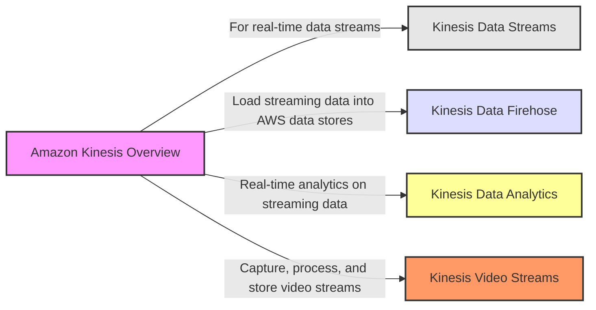

## Kinesis Data Streams

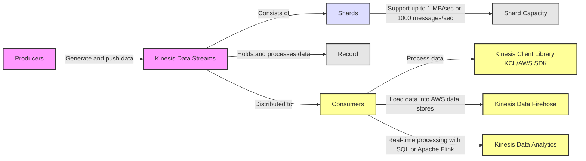

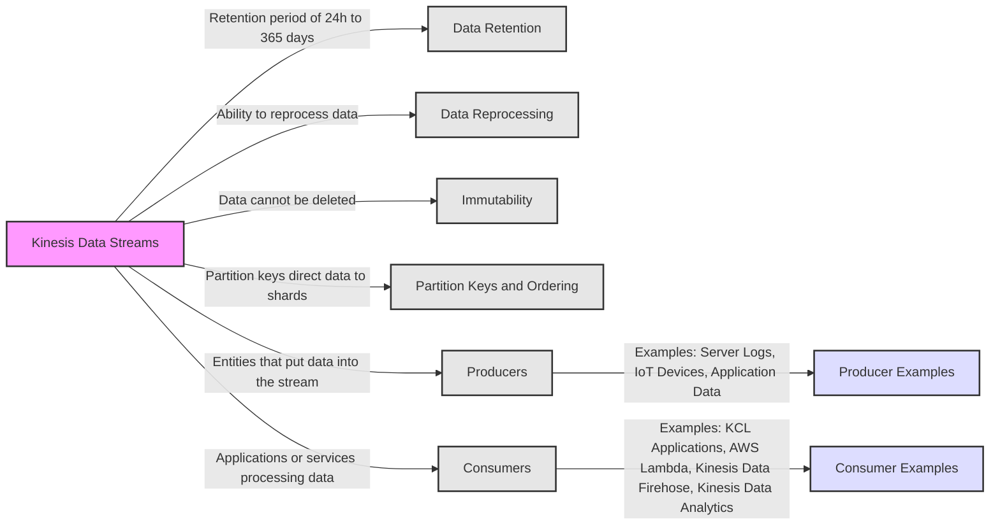
## Kinesis Data Streams Capacity Modes
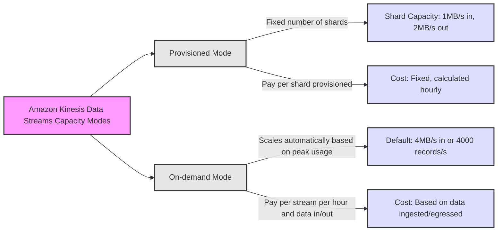

## Kinesis Data Streams Capacity Modes Comparison

| Feature | Provisioned Mode | On-demand Mode |
|---------|------------------|----------------|
| **Capacity Planning** | Must manually provision and manage the number of shards. | Automatic scaling without the need to manage shard capacity. |
| **Throughput** | 1 MB/s or 1000 messages/s for data input per shard; 2 MB/s for data output per shard (classic or enhanced fan-out consumer). | Default capacity provisioned (4 MB/s in or 4000 records per second) scales automatically. |
| **Scaling** | Manual scaling through the AWS Management Console or Kinesis API. | Scales automatically based on observed throughput peak during the last 30 days. |
| **Billing** | Pay per shard provisioned per hour. | Pay per stream per hour & data in/out per GB. |
| **Shard Management** | You choose the number of shards provisioned, scale manually or using API. | No need to provision or manage the capacity. |

## Kinesis Data Streams Security

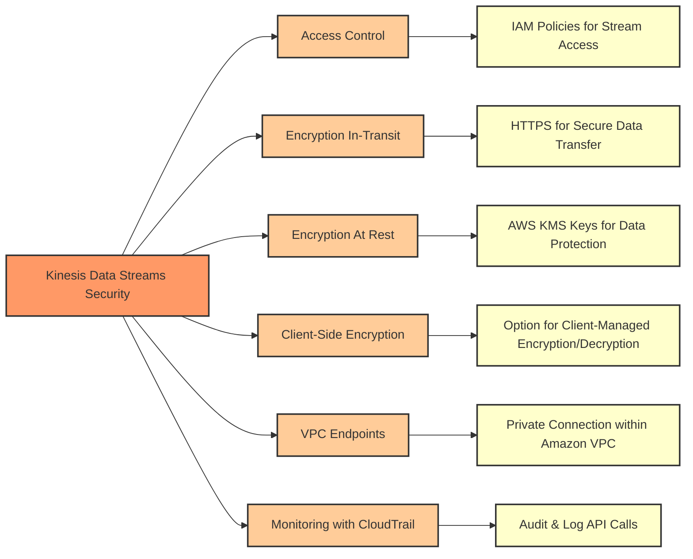

## Kinesis Data Streams vs Apache Kafka

| Feature                        | Kinesis Data Streams                                        | Apache Kafka                                                |
|--------------------------------|-------------------------------------------------------------|-------------------------------------------------------------|
| **Managed Service**            | AWS managed service with integrated AWS support.            | Self-managed, although managed services like Confluent exist.|
| **Provisioning**               | Automatic scaling with shard splitting and merging.          | Manual partition management and scaling.                     |
| **Data Retention**             | Default retention of 24 hours, extendable up to 7 days.      | Configurable, default is 7 days, but can be set indefinitely.|
| **Throughput**                 | Throughput is determined by the number of shards.            | Throughput is determined by the number of partitions.        |
| **Ordering**                   | Ordered at the shard level.                                  | Ordered within partitions.                                   |
| **Data Durability**            | Replicated across three availability zones.                  | Replicated across broker nodes, configurable replication.    |
| **Security**                   | Integrated with AWS IAM, KMS for encryption.                 | Supports SSL/TLS, SASL for security.                         |
| **Serverless**                 | Offers a serverless option with Kinesis Data Streams.        | Kafka does not have a serverless option natively.            |
| **Message Size**               | Maximum payload size of 1MB per record.                      | Maximum message size is configurable, typically a few MB.    |
| **Real-time Processing**       | Offers Kinesis Data Analytics for real-time analytics.       | Kafka Streams API for real-time stream processing.           |
| **Integration**                | Deep integration with AWS ecosystem.                         | Broad integration with many third-party systems.             |
| **Client Libraries**           | AWS SDK, Kinesis Producer Library (KPL), Kinesis Client Lib. | Kafka Producer and Consumer APIs, Kafka Streams, Kafka Connect.|
| **Deployment**                 | Cloud-only on AWS infrastructure.                            | Can be deployed on-premises, in the cloud, or hybrid.        |
| **Pricing**                    | Pay for the throughput capacity and data processed.          | Free and open-source; costs associated with self-hosting or managed services.|
| **Use Case**                   | Ideal for AWS-centric applications and workloads.            | Suited for high-throughput, fault-tolerant applications.     |

## Kinesis Data Firehose

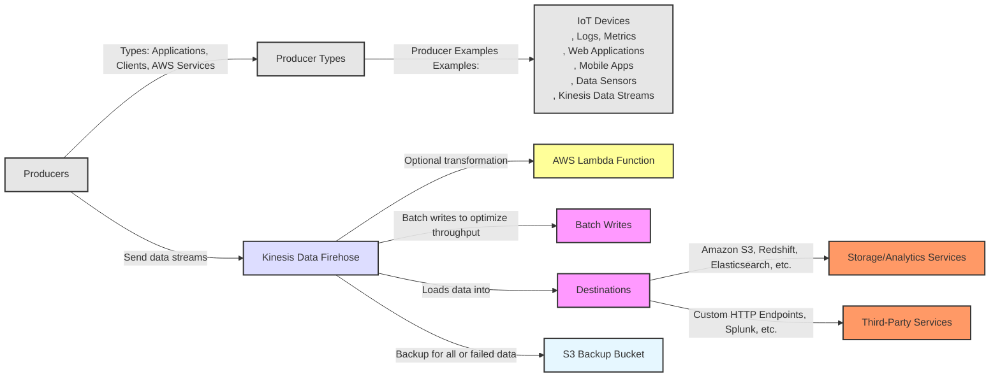

## Kinesis Data Firehose Overview

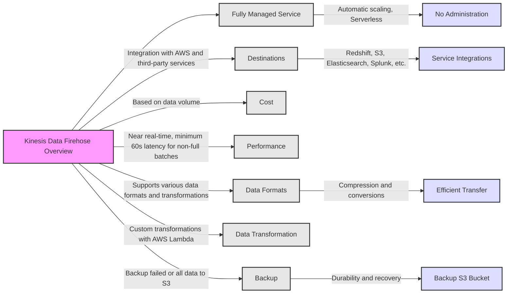

## Kinesis Data Streams vs Kinesis Data Firehose

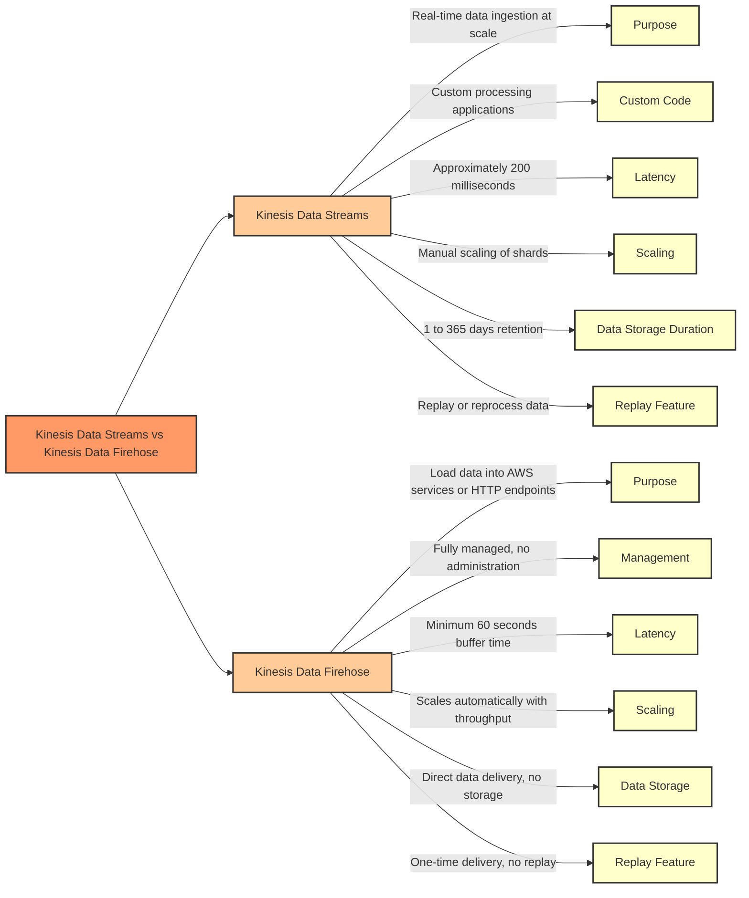

| Feature                 | Kinesis Data Streams                          | Kinesis Data Firehose                          |
|-------------------------|----------------------------------------------|-----------------------------------------------|
| **Service Type**        | Real-time data streaming service             | Managed service for loading streaming data    |
| **Customization**       | Write custom code for producers/consumers     | No custom consumer code; direct to destination|
| **Latency**             | Provides real-time processing with latencies of approximately 200 milliseconds.              | Near real-time with a minimum buffer time of 60 seconds for data delivery               |
| **Management**          | Manual scaling (shard management)            | Fully managed, automatic scaling              |
| **Data Storage**        | 1 to 365 days retention                      | No data storage; direct delivery              |
| **Data Replay**         | Supports replaying data                      | No replay capability                          |
| **Use Case**            | Real-time processing, analytics              | Simplified data delivery to AWS/endpoints     |

## Data Ordering in Kinesis Data Streams

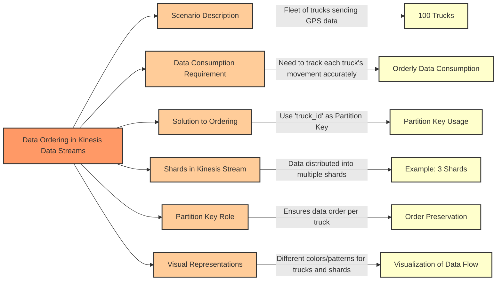

## SQS Ordering: Standard vs FIFO Queues
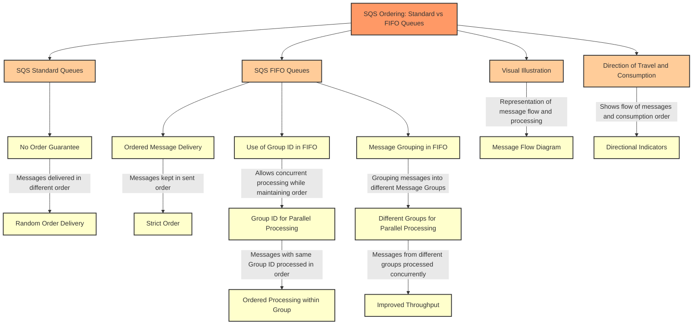

## Comparison: Kinesis Data Streams vs SQS FIFO
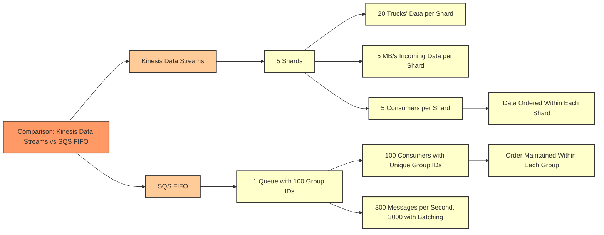

## Amazon SQS, SNS, and Kinesis Comparison
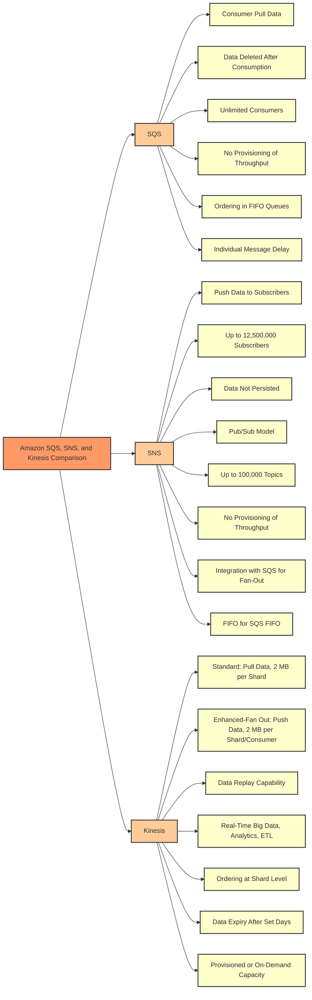

| Feature / Service | Amazon SQS                                      | Amazon SNS                                           | Amazon Kinesis                                      |
|-------------------|-------------------------------------------------|-----------------------------------------------------|-----------------------------------------------------|
| Delivery Mechanism| Consumer "pull data"                            | Push data to many subscribers                        | Standard: Pull data (2 MB/shard), Enhanced: Push data (2 MB/shard/consumer) |
| Data Handling     | Data is deleted after being consumed            | Data is not persisted (lost if not delivered)        | Possibility to replay data                          |
| Consumers         | Can have as many workers (consumers) as wanted  | Up to 12,500,000 subscribers                         | Depends on shard configuration                       |
| Throughput        | No need to provision throughput                 | No need to provision throughput                      | Provisioned mode or on-demand capacity mode          |
| Ordering          | Ordering guarantees only on FIFO queues         | FIFO capability for SQS FIFO                         | Ordering at the shard level                          |
| Additional Features| Individual message delay capability            | Integrates with SQS for fan-out architecture pattern | Meant for real-time big data, analytics, and ETL     |
| Topics/Queues     | N/A                                             | Up to 100,000 topics                                 | N/A                                                  |
| Data Expiry       | N/A                                             | N/A                                                  | Data expires after X days                            |

## For exam

1. A geological research agency maintains the seismological data for the last 100 years. The data has a velocity of 1GB per minute. You would like to store the data with only the most relevant attributes to build a predictive model for earthquakes.

What AWS services would you use to build the most cost-effective solution with the LEAST amount of infrastructure maintenance?

***Answer:*** Ingest the data in Amazon Kinesis Data Firehose and use an intermediary AWS Lambda function to filter and transform the incoming stream before the output is dumped on Amazon S3

Amazon Kinesis Data Firehose is the easiest way to load streaming data into data stores and analytics tools. It can capture, transform, and load streaming data into Amazon S3, Amazon Redshift, Amazon OpenSearch Service, and Splunk, enabling near real-time analytics with existing business intelligence tools and dashboards you’re already using today. It is a fully managed service that automatically scales to match the throughput of your data and requires no ongoing administration. It can also batch, compress, and encrypt the data before loading it, minimizing the amount of storage used at the destination and increasing security.

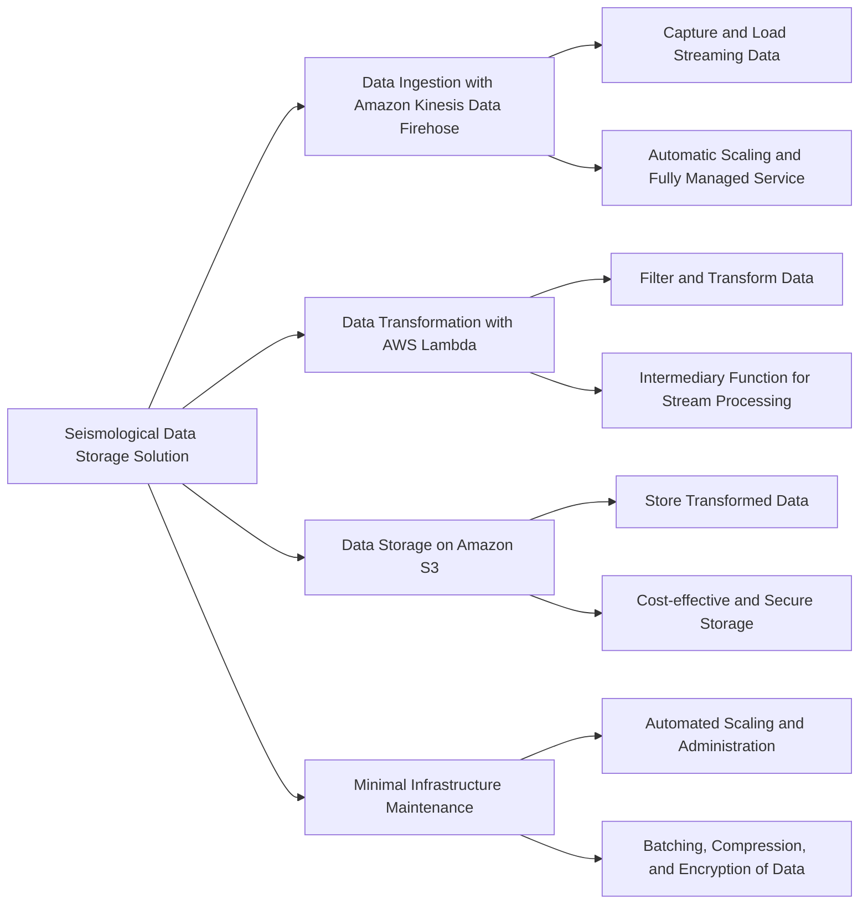

2. A gaming company is developing a mobile game that streams score updates to a backend processor and then publishes results on a leaderboard. The company has hired you as an AWS Certified Solutions Architect Associate to design a solution that can handle major traffic spikes, process the mobile game updates in the order of receipt, and store the processed updates in a highly available database. The company wants to minimize the management overhead required to maintain the solution.

Which of the following will you recommend to meet these requirements?

***Answer:*** Push score updates to Amazon Kinesis Data Streams which uses an AWS Lambda function to process these updates and then store these processed updates in Amazon DynamoDB

To help ingest real-time data or streaming data at large scales, you can use Amazon Kinesis Data Streams (KDS). KDS can continuously capture gigabytes of data per second from hundreds of thousands of sources. The data collected is available in milliseconds, enabling real-time analytics. KDS provides ordering of records, as well as the ability to read and/or replay records in the same order to multiple Amazon Kinesis Applications.

AWS Lambda integrates natively with Kinesis Data Streams. The polling, checkpointing, and error handling complexities are abstracted when you use this native integration. The processed data can then be configured to be saved in Amazon DynamoDB.

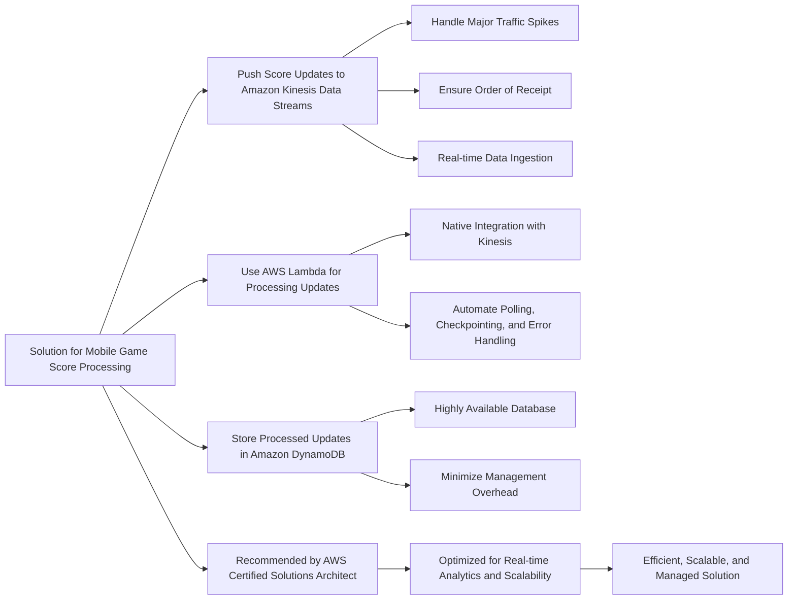