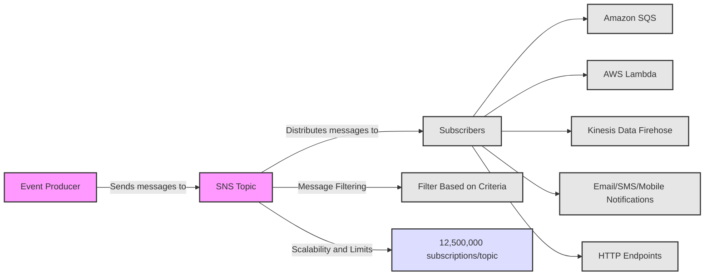
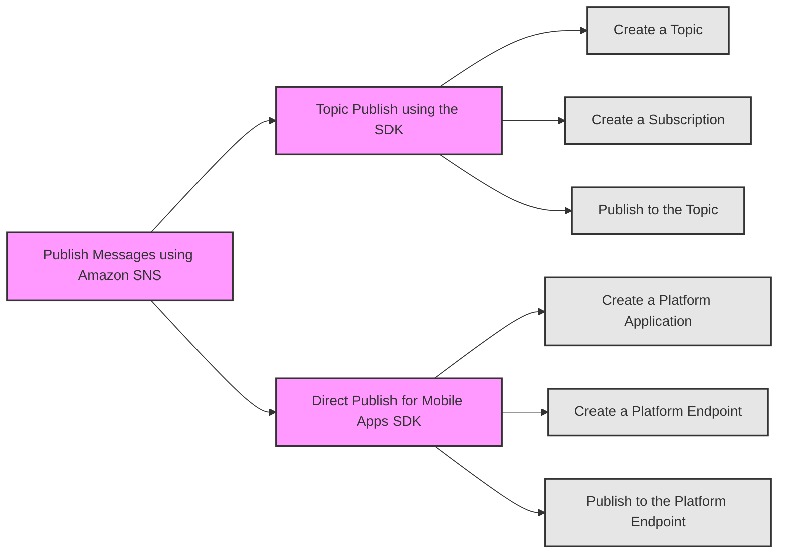
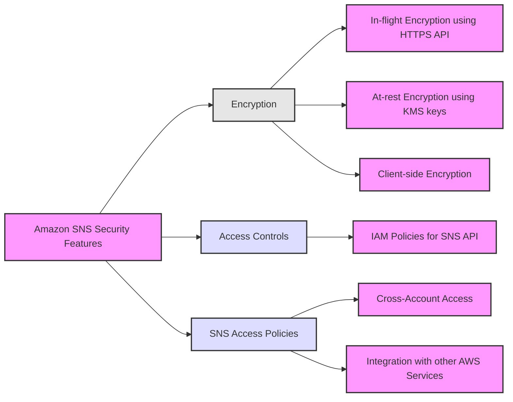
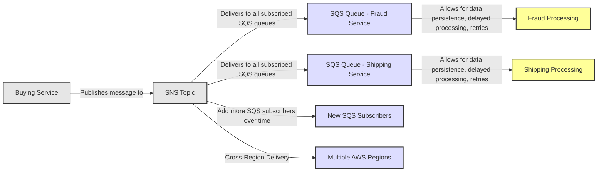
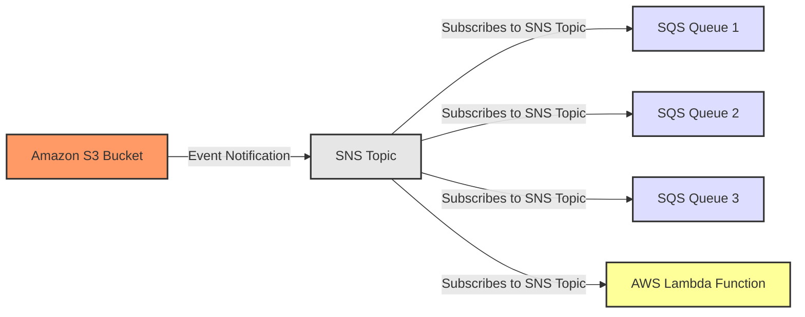
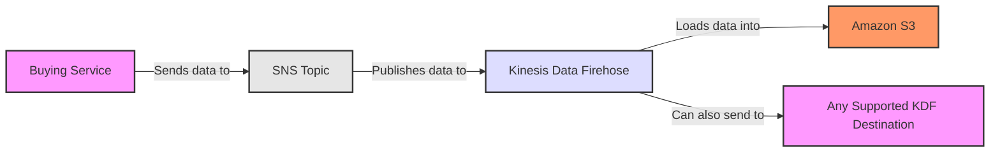
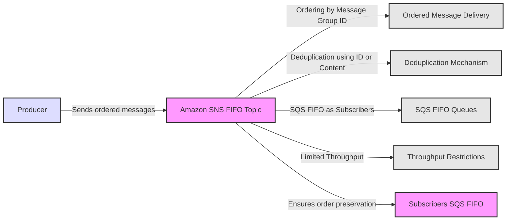
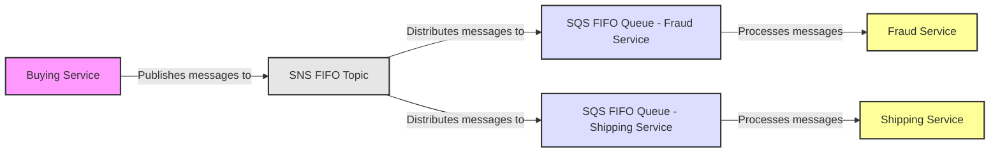
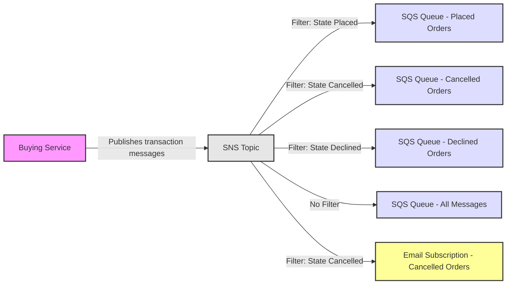
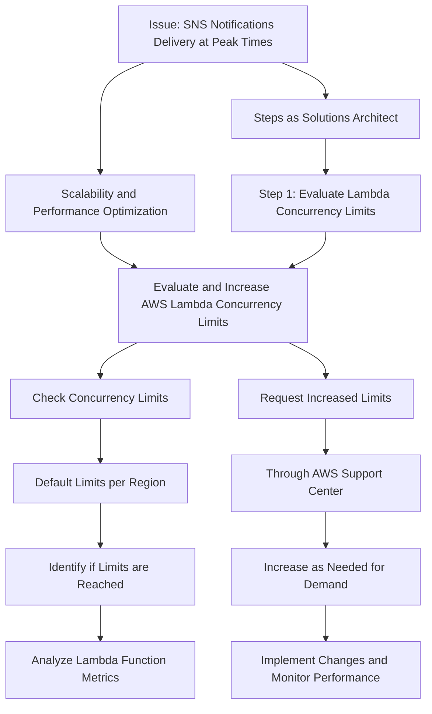

##  Amazon SNS

##  Publish Messages using Amazon SNS

##  Amazon SNS Security Features

##  Amazon SNS SQS Fanout

##  Amazon SNS Filtering

## For exam

1. The engineering team at a Spanish professional football club has built a notification system for its website using Amazon Simple Notification Service (Amazon SNS) notifications which are then handled by an AWS Lambda function for end-user delivery. During the off-season, the notification systems need to handle about 100 requests per second. During the peak football season, the rate touches about 5000 requests per second and it is noticed that a significant number of the notifications are not being delivered to the end-users on the website.

As a solutions architect, which of the following would you suggest as the BEST possible solution to this issue?

AWS Lambda currently supports 1000 concurrent executions per AWS account per region. If your Amazon SNS message deliveries to AWS Lambda contribute to crossing these concurrency quotas, your Amazon SNS message deliveries will be throttled. You need to contact AWS support to raise the account limit. Therefore this option is correct.

