# SQS

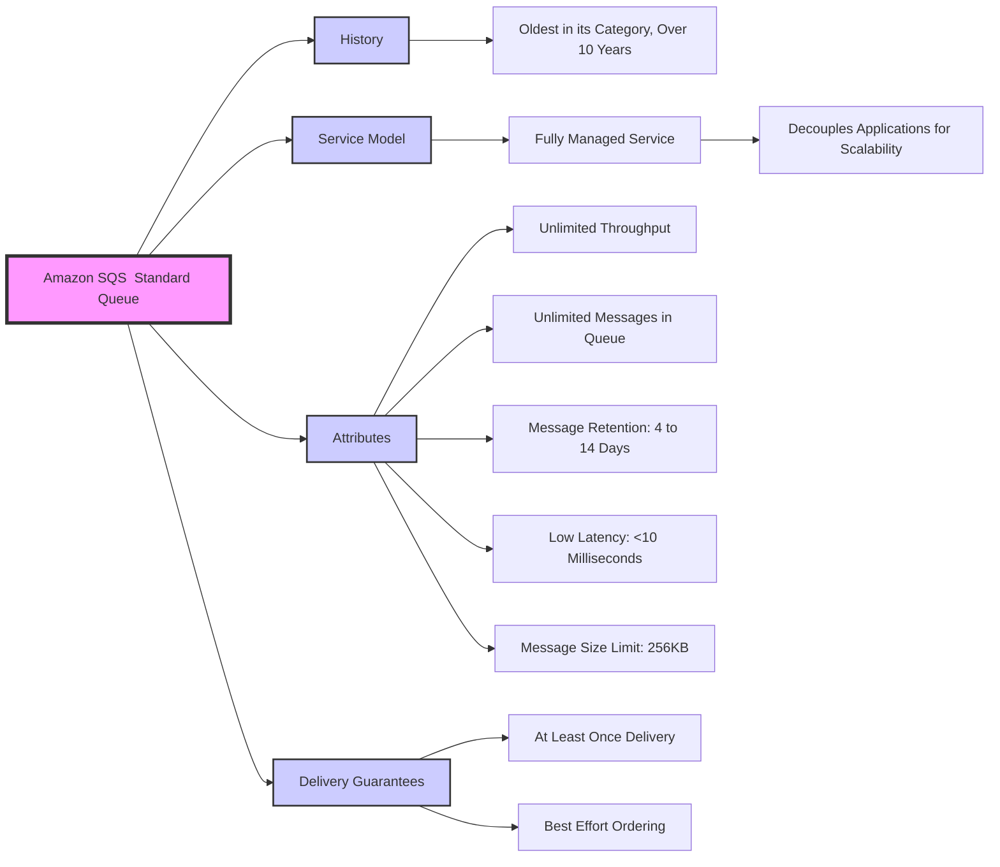

##  SQS  Producing Messages
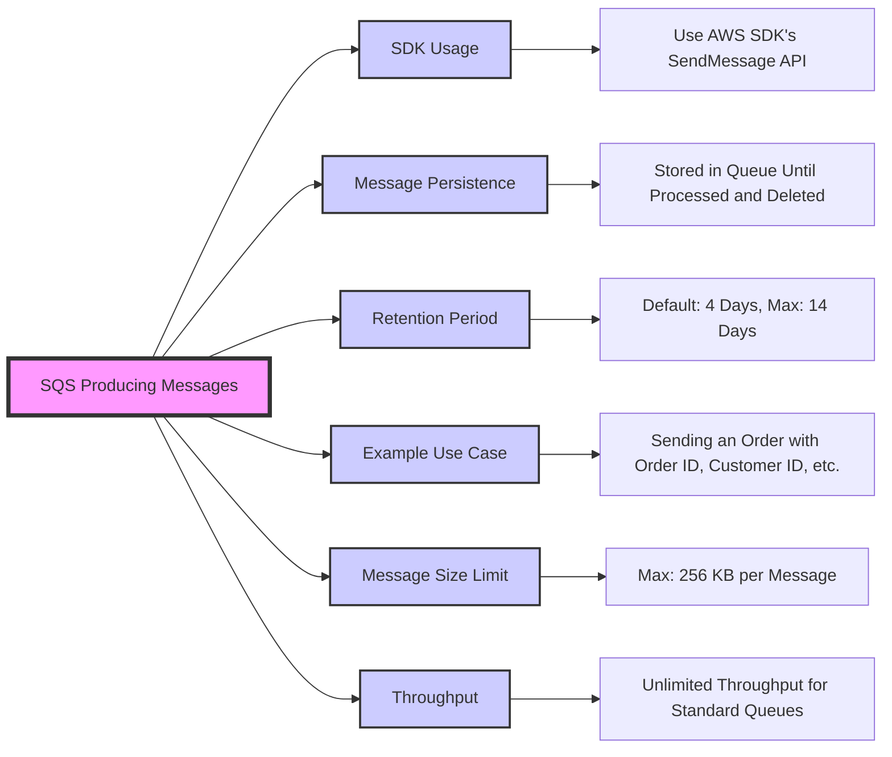

##  SQS  Amazon SQS Queue Consumers 
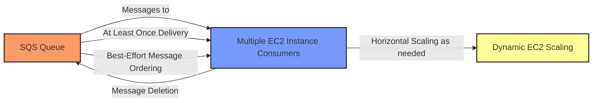

##  SQS  Amazon SQS Queue ASG
```mermaid
flowchart LR
sqs[SQS Queue] -->|Messages to be processed| ec2[(EC2 Instances)]
ec2 --> asg[Auto Scaling Group ASG]
asg -->|Scales in/out based on demand| cw[CloudWatch Metric - Queue Length]
cw -->|Triggers scaling| alarm[CloudWatch Alarm]
ec2 -->|Poll for Messages| sqs

    classDef sqsClass fill:#f96,stroke:#333,stroke-width:2px;
    classDef ec2Class fill:#79f,stroke:#333,stroke-width:2px;
    classDef asgClass fill:#ff9,stroke:#333,stroke-width:2px;
    classDef cwClass fill:#9f9,stroke:#333,stroke-width:2px;
    classDef alarmClass fill:#e6b8af,stroke:#333,stroke-width:2px;

    class sqs sqsClass;
    class ec2 ec2Class;
    class asg asgClass;
    class cw cwClass;
    class alarm alarmClass;

```

##  SQS  Amazon SQS Queue Decoupling
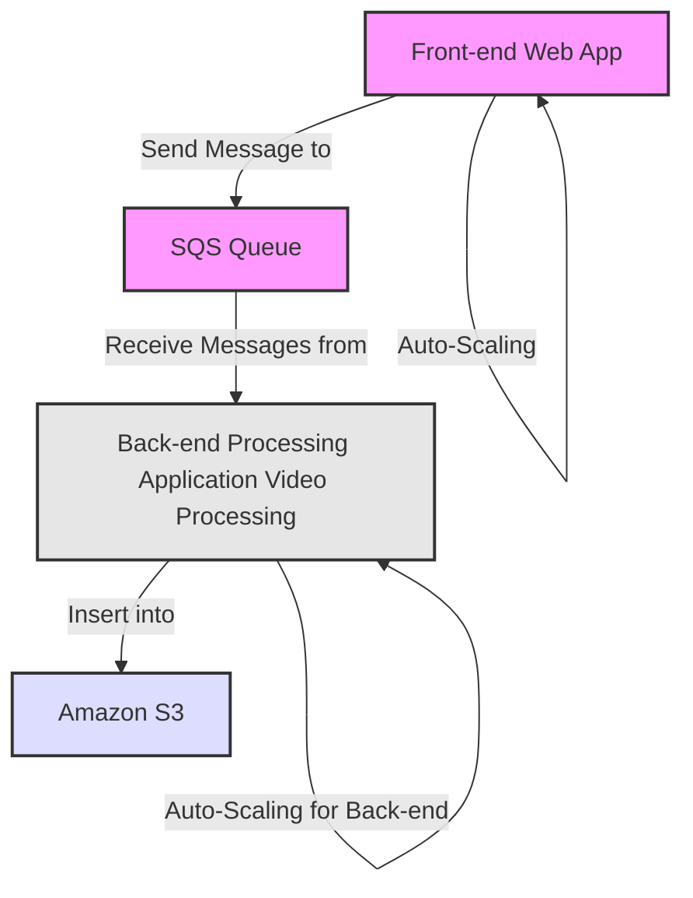

##  SQS  Amazon SQS Security Features
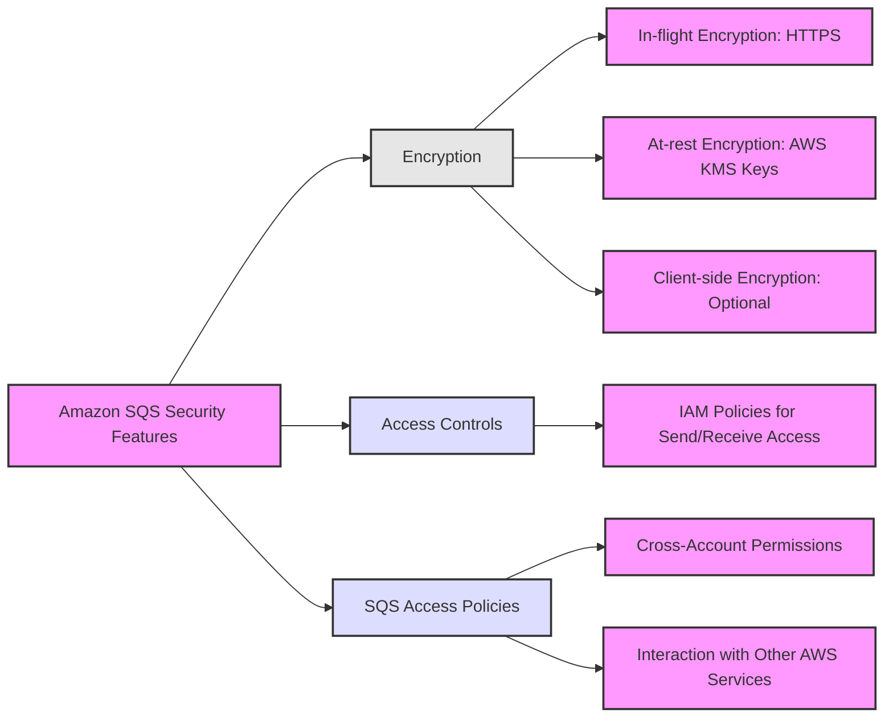

##    Amazon SQS  Visibility Timeout
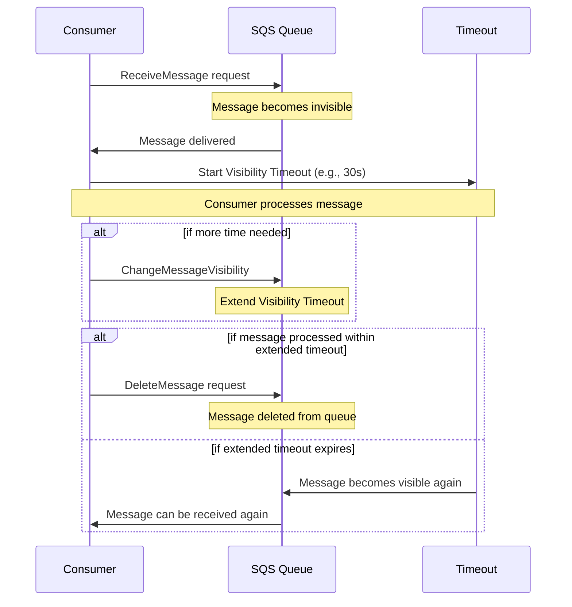

##  SQS  Amazon SQS Long Polling
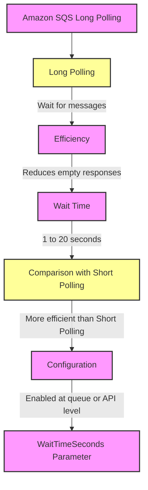

##  Amazon SQS FIFO Queues
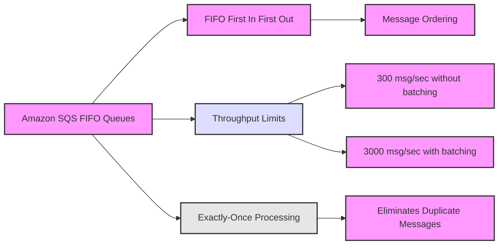

##  Amazon SQS Queue ASG
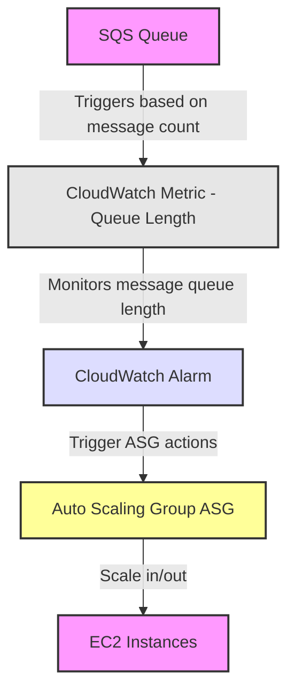

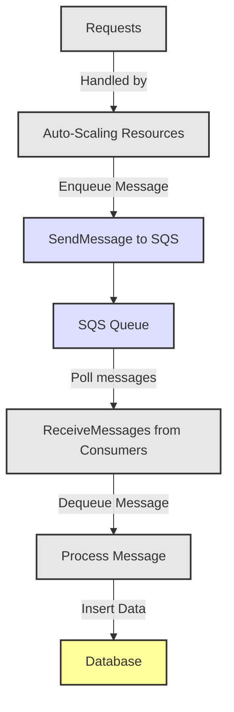
