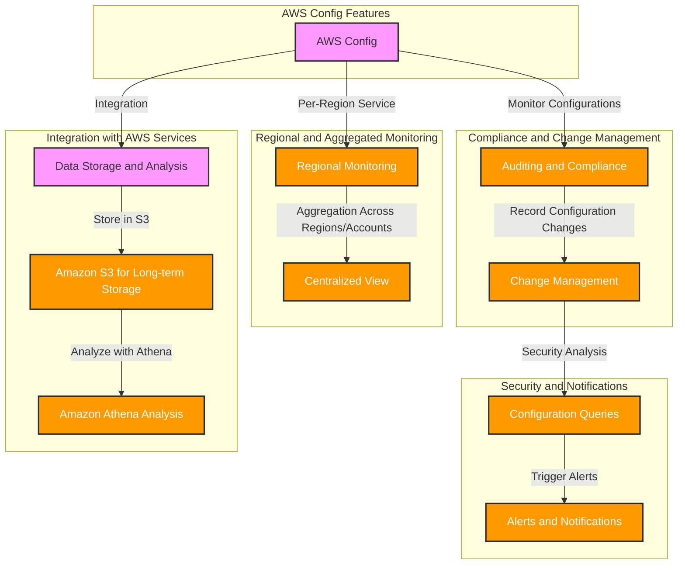
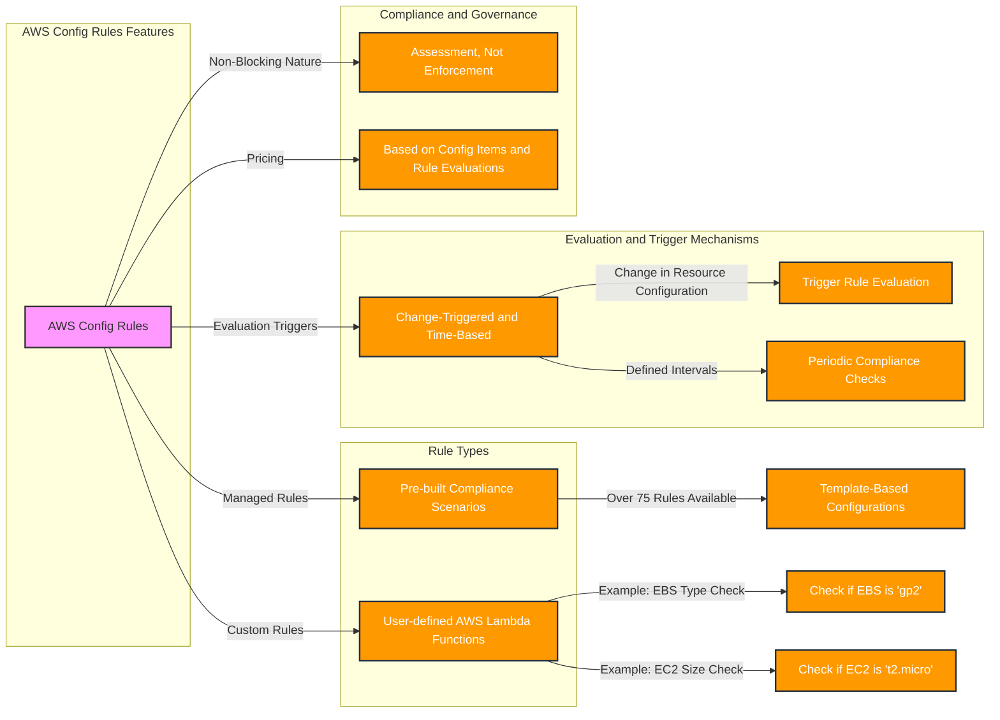
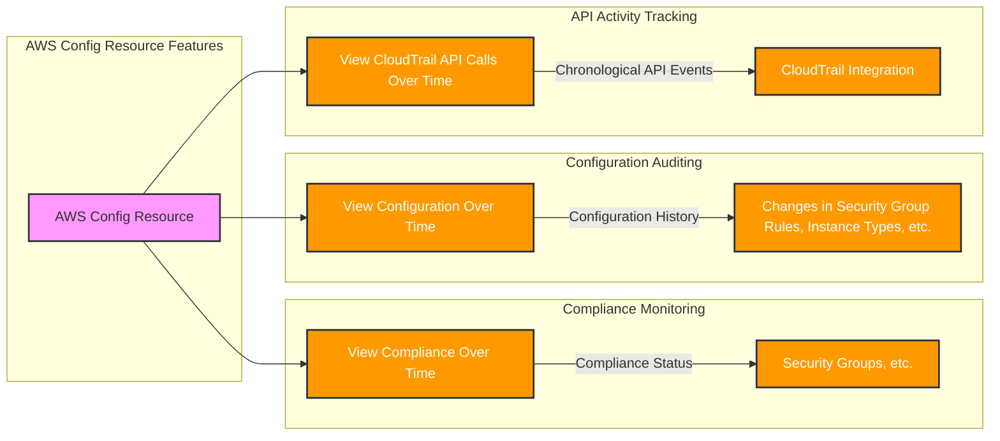
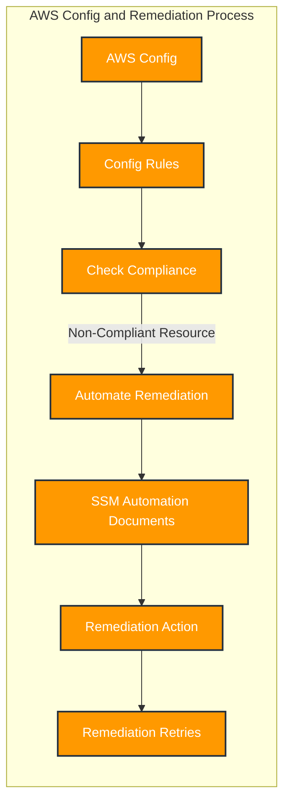
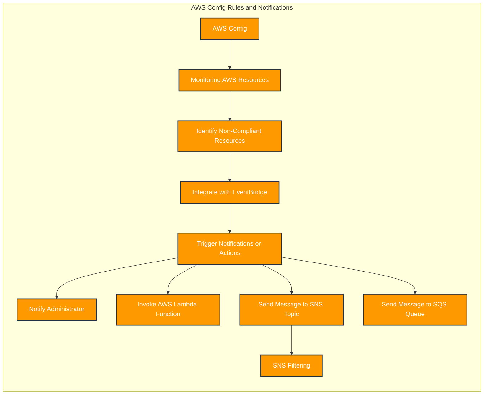

# AWS Config

```mermaid
graph TD
    A[AWS Config] -->|Monitor Configurations| B[Auditing and Compliance]
    B -->|Record Configuration Changes| C[Change Management]
    C -->|Security Analysis| D[Configuration Queries]
    D -->|Trigger Alerts| E[Alerts and Notifications]

    A -->|Per-Region Service| F[Regional Monitoring]
    F -->|Aggregation Across Regions/Accounts| G[Centralized View]
    A -->|Integration| H[Data Storage and Analysis]
    H -->|Store in S3| I[Amazon S3 for Long-term Storage]
    I -->|Analyze with Athena| J[Amazon Athena Analysis]

    classDef defaultStyle fill:#f9f,stroke:#333,stroke-width:2px;
    classDef aws fill:#FF9900,color:#fff,stroke:#232F3E,stroke-width:2px;
    class A,B,C,D,E,F,G,H,I,J defaultStyle;
    class B,C,D,E,F,G,I,J aws;

    subgraph AWS Config Features
        A
    end
    subgraph Compliance and Change Management
        B
        C
    end
    subgraph Security and Notifications
        D
        E
    end
    subgraph Regional and Aggregated Monitoring
        F
        G
    end
    subgraph Integration with AWS Services
        H
        I
        J
    end


```

```mermaid
graph LR
A[AWS Config Rules] -->|Managed Rules| B[Pre-built Compliance Scenarios]
A -->|Custom Rules| C[User-defined AWS Lambda Functions]
A -->|Evaluation Triggers| D[Change-Triggered and Time-Based]

    B -->|Over 75 Rules Available| E[Template-Based Configurations]
    C -->|Example: EBS Type Check| F[Check if EBS is 'gp2']
    C -->|Example: EC2 Size Check| G[Check if EC2 is 't2.micro']
    D -->|Change in Resource Configuration| H[Trigger Rule Evaluation]
    D -->|Defined Intervals| I[Periodic Compliance Checks]

    A -->|Non-Blocking Nature| J[Assessment, Not Enforcement]
    A -->|Pricing| K[Based on Config Items and Rule Evaluations]

    classDef defaultStyle fill:#f9f,stroke:#333,stroke-width:2px;
    classDef aws fill:#FF9900,color:#fff,stroke:#232F3E,stroke-width:2px;
    class A,B,C,D,E,F,G,H,I,J,K defaultStyle;
    class B,C,D,E,F,G,H,I,J,K aws;

    subgraph AWS Config Rules Features
        A
    end
    subgraph Rule Types
        B
        C
    end
    subgraph Evaluation and Trigger Mechanisms
        D
        H
        I
    end
    subgraph Compliance and Governance
        J
        K
    end

```

```mermaid
graph LR
A[AWS Config Resource] --> B[View Compliance Over Time]
A --> C[View Configuration Over Time]
A --> D[View CloudTrail API Calls Over Time]

    B -->|Compliance Status| E[Security Groups, etc.]
    C -->|Configuration History| F[Changes in Security Group Rules, Instance Types, etc.]
    D -->|Chronological API Events| G[CloudTrail Integration]

    classDef defaultStyle fill:#f9f,stroke:#333,stroke-width:2px;
    classDef aws fill:#FF9900,color:#fff,stroke:#232F3E,stroke-width:2px;
    class A,B,C,D,E,F,G defaultStyle;
    class B,C,D,E,F,G aws;

    subgraph AWS Config Resource Features
        A
    end
    subgraph Compliance Monitoring
        B
        E
    end
    subgraph Configuration Auditing
        C
        F
    end
    subgraph API Activity Tracking
        D
        G
    end

```

```mermaid
graph LR
A[AWS Config] --> B[Config Rules]
B --> C[Check Compliance]
C -->|Non-Compliant Resource| D[Automate Remediation]
D --> E[SSM Automation Documents]
E --> F[Remediation Action]
F --> G[Remediation Retries]

    classDef defaultStyle fill:#f9f,stroke:#333,stroke-width:2px;
    classDef aws fill:#FF9900,color:#fff,stroke:#232F3E,stroke-width:2px;
    class A,B,C,D,E,F,G defaultStyle;
    class A,B,C,D,E,F,G aws;

    subgraph AWS Config and Remediation Process
        A
        B
        C
        D
        E
        F
        G
    end
```

```mermaid
graph LR
A[AWS Config] --> B[Monitoring AWS Resources]
B --> C[Identify Non-Compliant Resources]
C --> D[Integrate with EventBridge]
D --> E[Trigger Notifications or Actions]
E --> F[Notify Administrator]
E --> G[Invoke AWS Lambda Function]
E --> H[Send Message to SNS Topic]
E --> I[Send Message to SQS Queue]
H --> J[SNS Filtering]

    classDef defaultStyle fill:#f9f,stroke:#333,stroke-width:2px;
    classDef aws fill:#FF9900,color:#fff,stroke:#232F3E,stroke-width:2px;
    class A,B,C,D,E,F,G,H,I,J defaultStyle;
    class A,B,C,D,E,F,G,H,I,J aws;

    subgraph AWS Config Rules and Notifications
        A
        B
        C
        D
        E
        F
        G
        H
        I
        J
    end
```