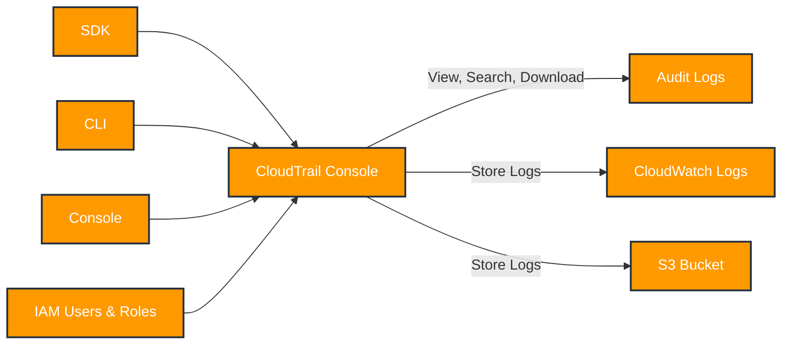
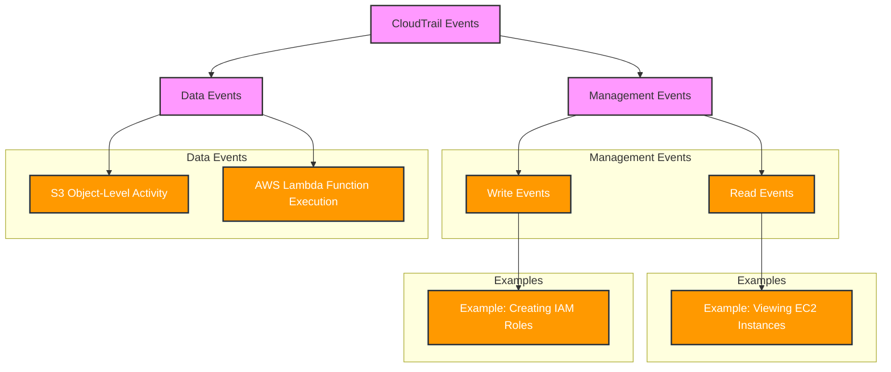
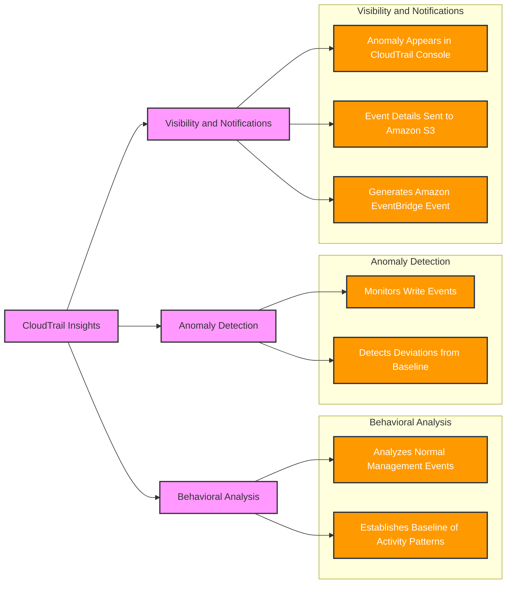
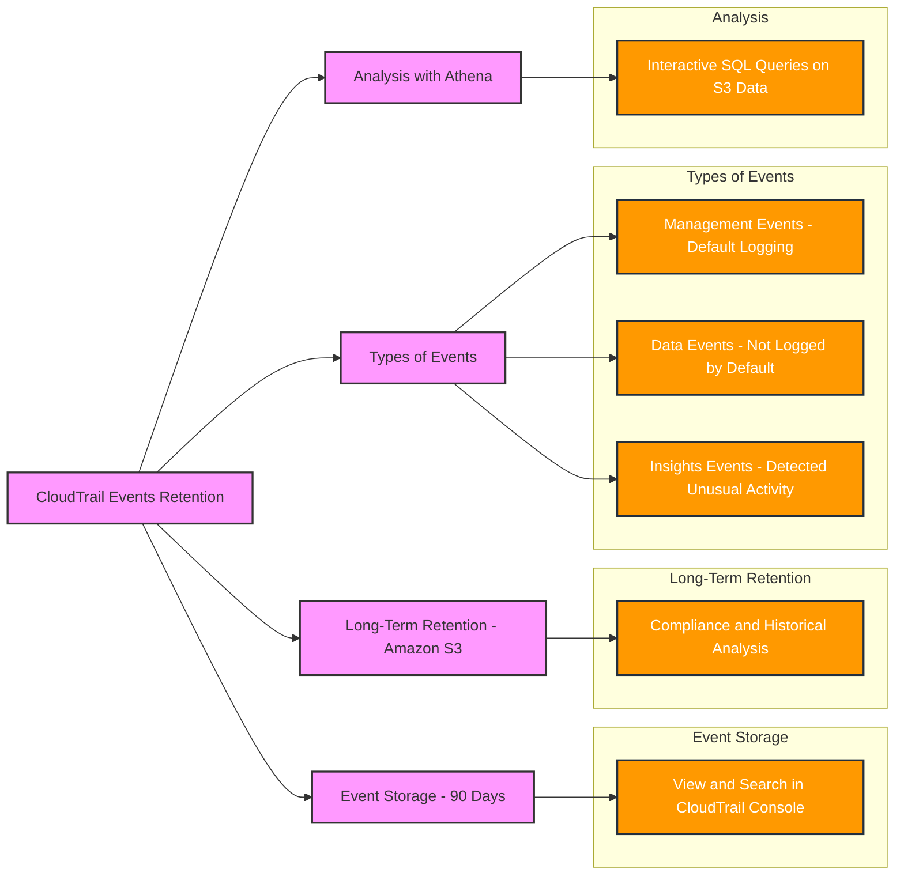
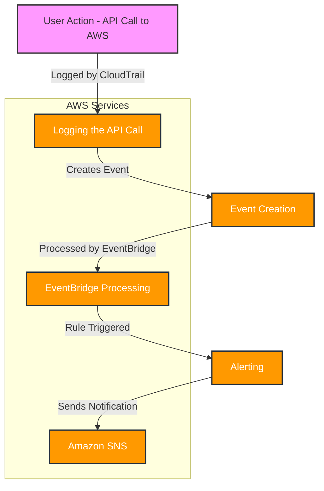
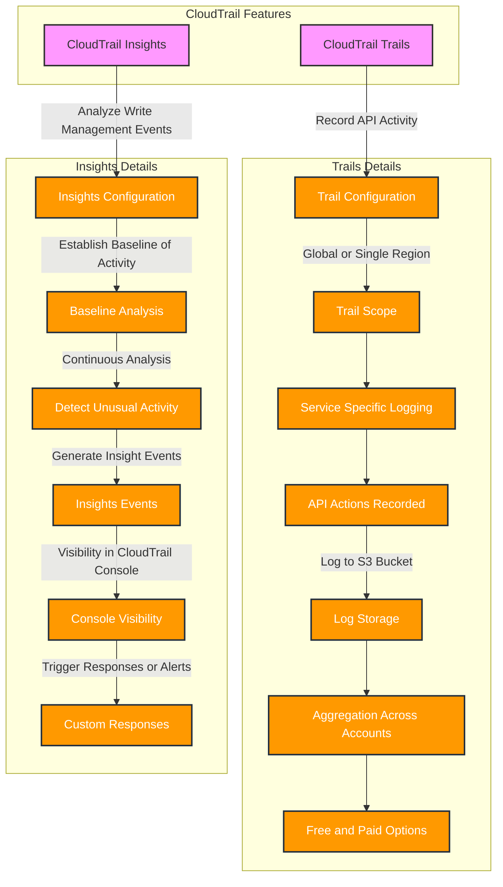
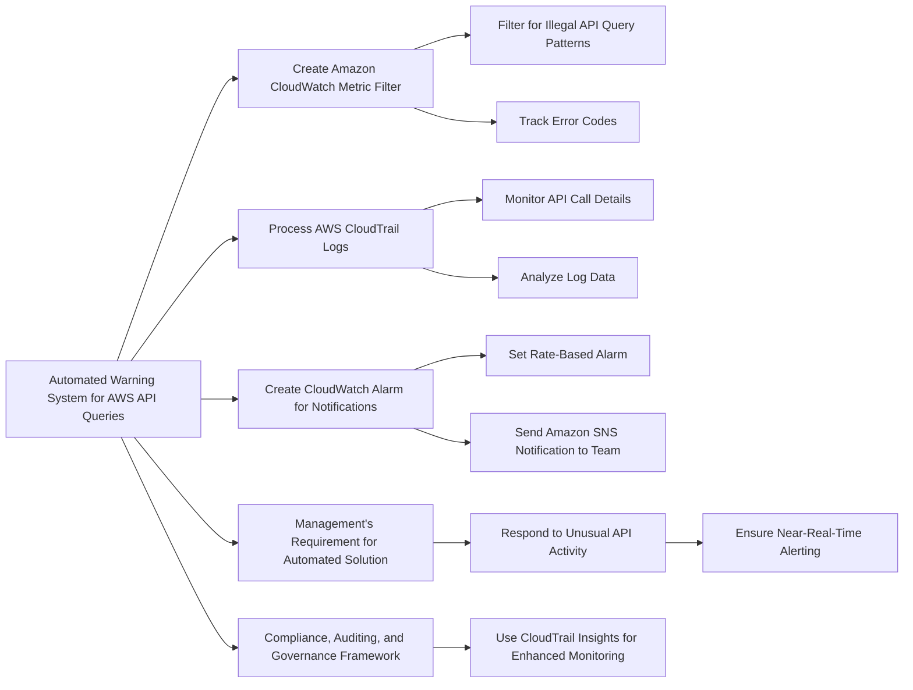

# CloudTrail

## For exam
1. While consolidating logs for the weekly reporting, a development team at an e-commerce company noticed that an unusually large number of illegal AWS application programming interface (API) queries were made sometime during the week. Due to the off-season, there was no visible impact on the systems. However, this event led the management team to seek an automated solution that can trigger near-real-time warnings in case such an event recurs.

Which of the following represents the best solution for the given scenario?

***Answer:*** Create an Amazon CloudWatch metric filter that processes AWS CloudTrail logs having API call details and looks at any errors by factoring in all the error codes that need to be tracked. Create an alarm based on this metric's rate to send an Amazon SNS notification to the required team

AWS CloudTrail log data can be ingested into Amazon CloudWatch to monitor and identify your AWS account activity against security threats, and create a governance framework for security best practices. You can analyze log trail event data in CloudWatch using features such as Logs Insight, Contributor Insights, Metric filters, and CloudWatch Alarms.

AWS CloudTrail integrates with the Amazon CloudWatch service to publish the API calls being made to resources or services in the AWS account. The published event has invaluable information that can be used for compliance, auditing, and governance of your AWS accounts. Below we introduce several features available in CloudWatch to monitor API activity, analyze the logs at scale, and take action when malicious activity is discovered, without provisioning your infrastructure.

For the AWS Cloudtrail logs available in Amazon CloudWatch Logs, you can begin searching and filtering the log data by creating one or more metric filters. Use these metric filters to turn log data into numerical CloudWatch metrics that you can graph or set a CloudWatch Alarm on.

Note: AWS CloudTrail Insights helps AWS users identify and respond to unusual activity associated with write API calls by continuously analyzing CloudTrail management events.

Insights events are logged when AWS CloudTrail detects unusual write management API activity in your account. If you have AWS CloudTrail Insights enabled and CloudTrail detects unusual activity, Insights events are delivered to the destination Amazon S3 bucket for your trail. You can also see the type of insight and the incident time when you view Insights events on the CloudTrail console. Unlike other types of events captured in a CloudTrail trail, Insights events are logged only when CloudTrail detects changes in your account's API usage that differ significantly from the account's typical usage patterns.

