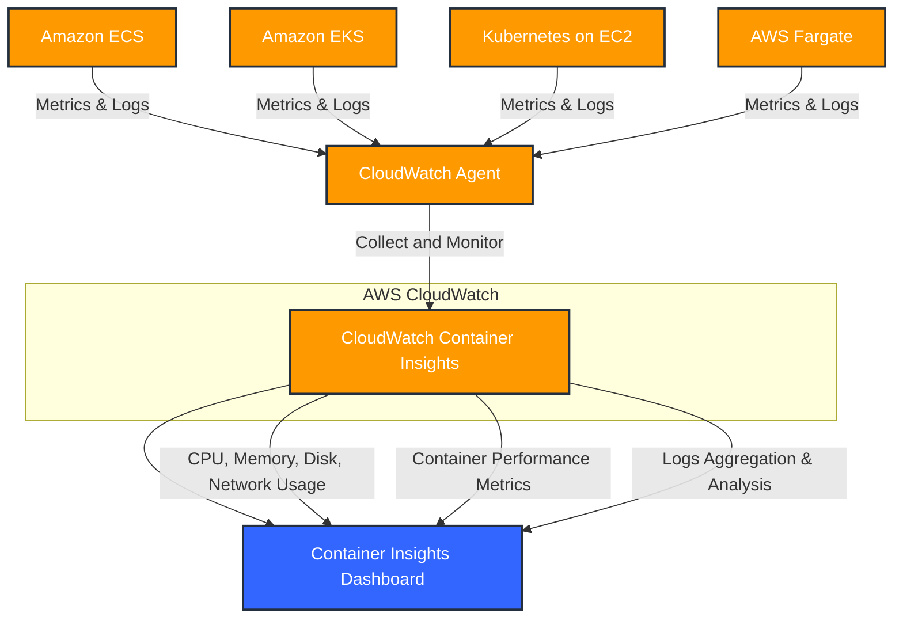
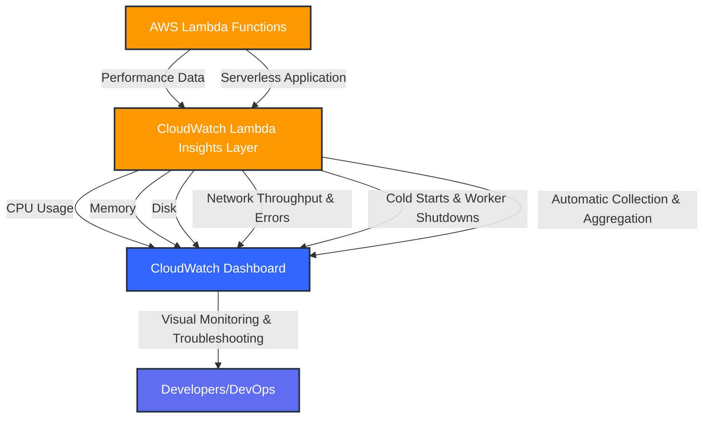
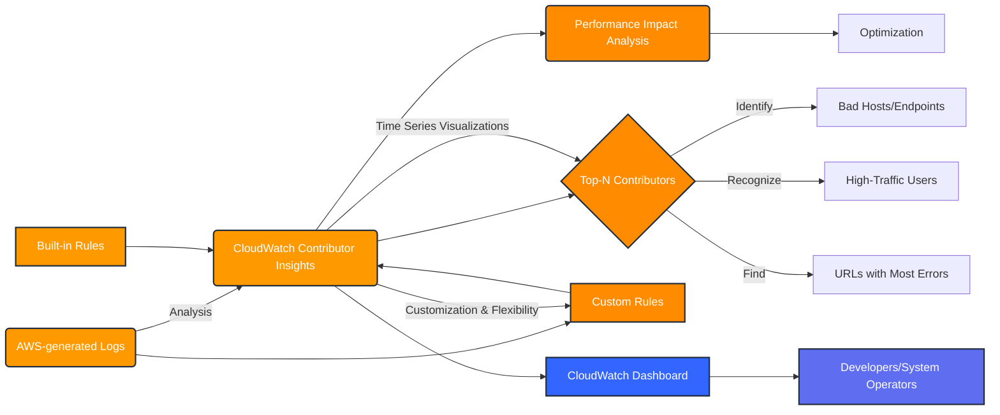
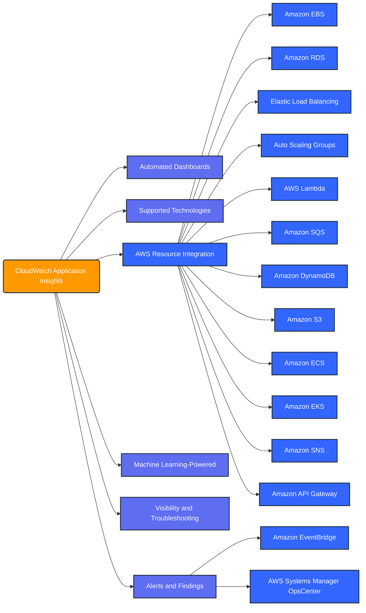
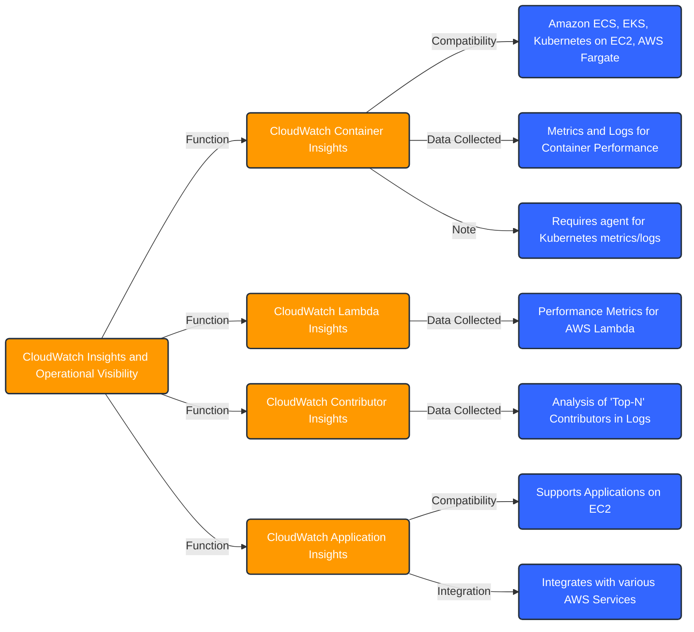

# CloudWatch Insights
## CloudWatch Agent

```mermaid
graph TD
ECS[Amazon ECS] -->|Metrics & Logs| CWAgent[CloudWatch Agent]
EKS[Amazon EKS] -->|Metrics & Logs| CWAgent
EC2[Kubernetes on EC2] -->|Metrics & Logs| CWAgent
Fargate[AWS Fargate] -->|Metrics & Logs| CWAgent

    CWAgent -->|Collect and Monitor| CWCI[CloudWatch Container Insights]

    subgraph AWS CloudWatch
        CWCI
    end

    CWCI --> Dashboard[Container Insights Dashboard]

    %% Optional Descriptions
    CWCI -- "CPU, Memory, Disk, Network Usage" --> Dashboard
    CWCI -- "Container Performance Metrics" --> Dashboard
    CWCI -- "Logs Aggregation & Analysis" --> Dashboard

    %% Styles
    classDef aws fill:#FF9900,color:#fff,stroke:#232F3E,stroke-width:2px;
    class ECS,EKS,EC2,Fargate,CWAgent,CWCI aws;

    classDef dashboard fill:#36f,color:#fff,stroke:#232F3E,stroke-width:2px;
    class Dashboard dashboard;
```

## CloudWatch Lambda Insights

```mermaid
graph TD
Lambda[AWS Lambda Functions] -->|Performance Data| LambdaInsights[CloudWatch Lambda Insights Layer]
LambdaInsights -- "CPU Usage" --> Dashboard
LambdaInsights -- "Memory" --> Dashboard
LambdaInsights -- "Disk" --> Dashboard
LambdaInsights -- "Network Throughput & Errors" --> Dashboard
LambdaInsights -- "Cold Starts & Worker Shutdowns" --> Dashboard
Dashboard[CloudWatch Dashboard] -- "Visual Monitoring & Troubleshooting" --> User[Developers/DevOps]

    %% Descriptions
    Lambda -- "Serverless Application" --> LambdaInsights
    LambdaInsights -- "Automatic Collection & Aggregation" --> Dashboard

    %% Styles
    classDef aws fill:#FF9900,color:#fff,stroke:#232F3E,stroke-width:2px;
    class Lambda,LambdaInsights aws;

    classDef dashboard fill:#36f,color:#fff,stroke:#232F3E,stroke-width:2px;
    class Dashboard dashboard;

    classDef user fill:#5f6df0,color:#fff,stroke:#232F3E,stroke-width:2px;
    class User user;
```

```mermaid
graph LR
Logs(AWS-generated Logs) -->|Analysis| ContributorInsights(CloudWatch Contributor Insights)
ContributorInsights --> TopNContributors{Top-N Contributors}
TopNContributors -->|Identify| BadHosts[Bad Hosts/Endpoints]
TopNContributors -->|Recognize| HighTrafficUsers[High-Traffic Users]
TopNContributors -->|Find| ProblematicURLs[URLs with Most Errors]
ContributorInsights --> PerformanceImpact(Performance Impact Analysis)
PerformanceImpact --> Optimization
Logs --> CustomRules[Custom Rules]
CustomRules --> ContributorInsights
BuiltInRules[Built-in Rules] --> ContributorInsights
ContributorInsights --> Dashboard[CloudWatch Dashboard]
Dashboard --> User[Developers/System Operators]

    %% Descriptions
    ContributorInsights -- "Time Series Visualizations" --> TopNContributors
    ContributorInsights -- "Customization & Flexibility" --> CustomRules

    %% Styles
    classDef aws fill:#FF9900,color:#fff,stroke:#232F3E,stroke-width:2px;
    class Logs,ContributorInsights,BuiltInRules aws;

    classDef analysis fill:#ff8c00,color:#fff,stroke:#232F3E,stroke-width:2px;
    class PerformanceImpact,CustomRules,TopNContributors analysis;

    classDef dashboard fill:#36f,color:#fff,stroke:#232F3E,stroke-width:2px;
    class Dashboard dashboard;

    classDef user fill:#5f6df0,color:#fff,stroke:#232F3E,stroke-width:2px;
    class User user;
```

```mermaid
graph LR
ApplicationInsights(CloudWatch Application Insights) --> AutomatedDashboards[Automated Dashboards]
ApplicationInsights --> SupportedTechnologies[Supported Technologies]
ApplicationInsights --> AWSResourceIntegration[AWS Resource Integration]
ApplicationInsights --> MLPowered[Machine Learning-Powered]
ApplicationInsights --> VisibilityTroubleshooting[Visibility and Troubleshooting]
ApplicationInsights --> AlertsFindings[Alerts and Findings]

    AWSResourceIntegration --> EBS[Amazon EBS]
    AWSResourceIntegration --> RDS[Amazon RDS]
    AWSResourceIntegration --> ELB[Elastic Load Balancing]
    AWSResourceIntegration --> ASG[Auto Scaling Groups]
    AWSResourceIntegration --> Lambda[AWS Lambda]
    AWSResourceIntegration --> SQS[Amazon SQS]
    AWSResourceIntegration --> DynamoDB[Amazon DynamoDB]
    AWSResourceIntegration --> S3[Amazon S3]
    AWSResourceIntegration --> ECS[Amazon ECS]
    AWSResourceIntegration --> EKS[Amazon EKS]
    AWSResourceIntegration --> SNS[Amazon SNS]
    AWSResourceIntegration --> APIGateway[Amazon API Gateway]

    AlertsFindings --> EventBridge[Amazon EventBridge]
    AlertsFindings --> OpsCenter[AWS Systems Manager OpsCenter]

    %% Styles
    classDef aws fill:#FF9900,color:#fff,stroke:#232F3E,stroke-width:2px;
    class ApplicationInsights aws;

    classDef integration fill:#36f,color:#fff,stroke:#232F3E,stroke-width:2px;
    class AWSResourceIntegration,EBS,RDS,ELB,ASG,Lambda,SQS,DynamoDB,S3,ECS,EKS,SNS,APIGateway,EventBridge,OpsCenter integration;

    classDef insights fill:#5f6df0,color:#fff,stroke:#232F3E,stroke-width:2px;
    class AutomatedDashboards,SupportedTechnologies,MLPowered,VisibilityTroubleshooting,AlertsFindings insights;
```

```mermaid
graph LR
CloudWatchInsights("CloudWatch Insights and Operational Visibility") -->|Function| ContainerInsights("CloudWatch Container Insights")
ContainerInsights -->|Compatibility| ECS_EKS_Fargate("Amazon ECS, EKS, Kubernetes on EC2, AWS Fargate")
ContainerInsights -->|Data Collected| ContainerMetrics("Metrics and Logs for Container Performance")
ContainerInsights -->|Note| AgentRequired("Requires agent for Kubernetes metrics/logs")

    CloudWatchInsights -->|Function| LambdaInsights("CloudWatch Lambda Insights")
    LambdaInsights -->|Data Collected| LambdaMetrics("Performance Metrics for AWS Lambda")

    CloudWatchInsights -->|Function| ContributorInsights("CloudWatch Contributor Insights")
    ContributorInsights -->|Data Collected| LogAnalysis("Analysis of 'Top-N' Contributors in Logs")

    CloudWatchInsights -->|Function| ApplicationInsights("CloudWatch Application Insights")
    ApplicationInsights -->|Compatibility| SupportedApps("Supports Applications on EC2")
    ApplicationInsights -->|Integration| AWSIntegration("Integrates with various AWS Services")

    %% Styles
    classDef aws fill:#FF9900,color:#fff,stroke:#232F3E,stroke-width:2px;
    class CloudWatchInsights,ContainerInsights,LambdaInsights,ContributorInsights,ApplicationInsights aws;

    classDef details fill:#36f,color:#fff,stroke:#232F3E,stroke-width:2px;
    class ECS_EKS_Fargate,ContainerMetrics,AgentRequired,LambdaMetrics,LogAnalysis,SupportedApps,AWSIntegration details;
```