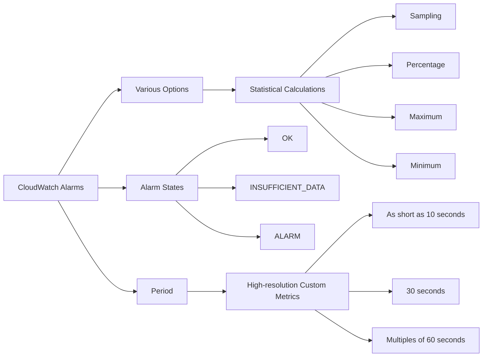
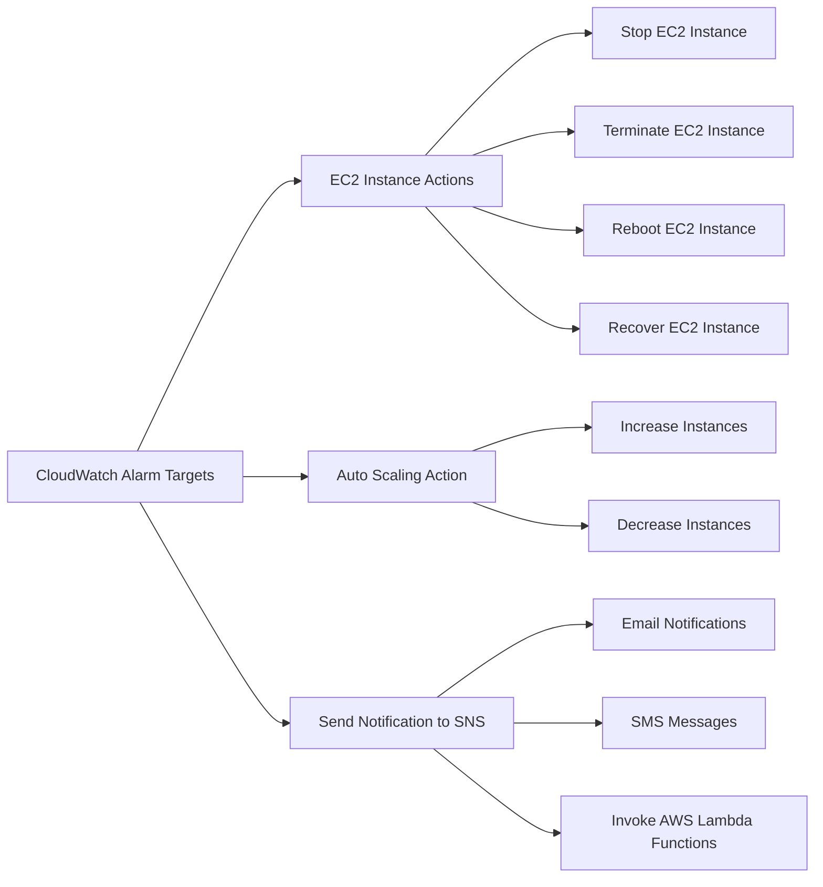
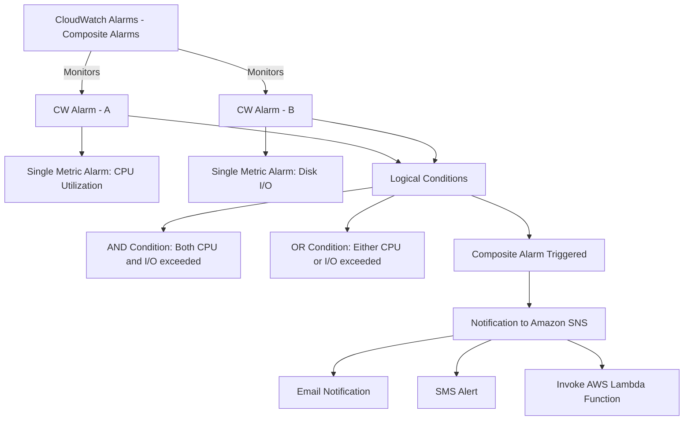
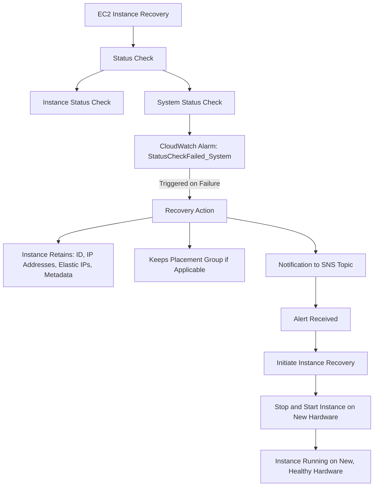
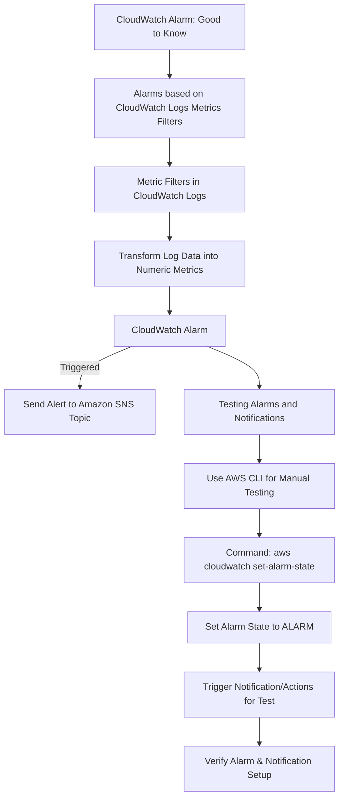

# CloudWatch Alarms

```mermaid
graph LR
    A[CloudWatch Alarms] --> B[Various Options]
    B --> C[Statistical Calculations]
    C --> D1[Sampling]
    C --> D2[Percentage]
    C --> D3[Maximum]
    C --> D4[Minimum]
    A --> E[Alarm States]
    E --> F1[OK]
    E --> F2[INSUFFICIENT_DATA]
    E --> F3[ALARM]
    A --> G[Period]
    G --> H1[High-resolution Custom Metrics]
    H1 --> I1[As short as 10 seconds]
    H1 --> I2[30 seconds]
    H1 --> I3[Multiples of 60 seconds]


```

## CloudWatch Alarm Targets

```mermaid

graph LR
A[CloudWatch Alarm Targets] --> B[EC2 Instance Actions]
B --> C1[Stop EC2 Instance]
B --> C2[Terminate EC2 Instance]
B --> C3[Reboot EC2 Instance]
B --> C4[Recover EC2 Instance]
A --> D[Auto Scaling Action]
D --> E1[Increase Instances]
D --> E2[Decrease Instances]
A --> F[Send Notification to SNS]
F --> G1[Email Notifications]
F --> G2[SMS Messages]
F --> G3[Invoke AWS Lambda Functions]

```

## CloudWatch Alarms - Composite Alarms

```mermaid
graph TD
A[CloudWatch Alarms - Composite Alarms] -->|Monitors| B1[CW Alarm - A]
A -->|Monitors| B2[CW Alarm - B]
B1 --> C1[Single Metric Alarm: CPU Utilization]
B2 --> C2[Single Metric Alarm: Disk I/O]
B1 & B2 --> D[Logical Conditions]
D --> E1[AND Condition: Both CPU and I/O exceeded]
D --> E2[OR Condition: Either CPU or I/O exceeded]
D --> F[Composite Alarm Triggered]
F --> G[Notification to Amazon SNS]
G --> H1[Email Notification]
G --> H2[SMS Alert]
G --> H3[Invoke AWS Lambda Function]
```

## EC2 Instance Recovery

```mermaid
graph TD
A[EC2 Instance Recovery] --> B[Status Check]
B --> C1[Instance Status Check]
B --> C2[System Status Check]

    C2 --> D[CloudWatch Alarm: StatusCheckFailed_System]
    D -->|Triggered on Failure| E[Recovery Action]

    E --> F1[Instance Retains: ID, IP Addresses, Elastic IPs, Metadata]
    E --> F2[Keeps Placement Group if Applicable]

    E --> G[Notification to SNS Topic]
    G --> H[Alert Received]
    H --> I[Initiate Instance Recovery]
    I --> J[Stop and Start Instance on New Hardware]

    J --> K[Instance Running on New, Healthy Hardware]
```

## CloudWatch Alarm: Good to Know

```mermaid
graph TD
A[CloudWatch Alarm: Good to Know] --> B[Alarms based on CloudWatch Logs Metrics Filters]
B --> C[Metric Filters in CloudWatch Logs]
C --> D[Transform Log Data into Numeric Metrics]
D --> E[CloudWatch Alarm]
E -->|Triggered| F[Send Alert to Amazon SNS Topic]

    E --> G[Testing Alarms and Notifications]
    G --> H[Use AWS CLI for Manual Testing]
    H --> I[Command: aws cloudwatch set-alarm-state]
    I --> J[Set Alarm State to ALARM]
    J --> K[Trigger Notification/Actions for Test]

    K --> L[Verify Alarm & Notification Setup]
```