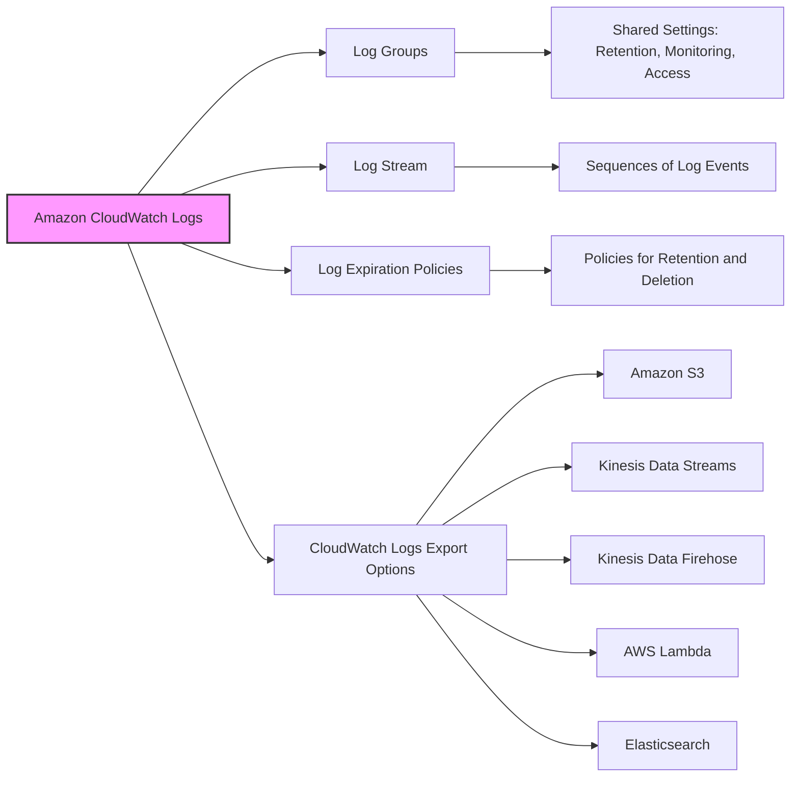
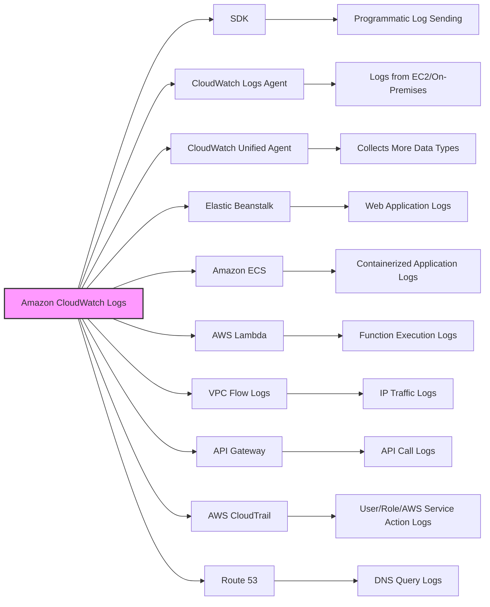
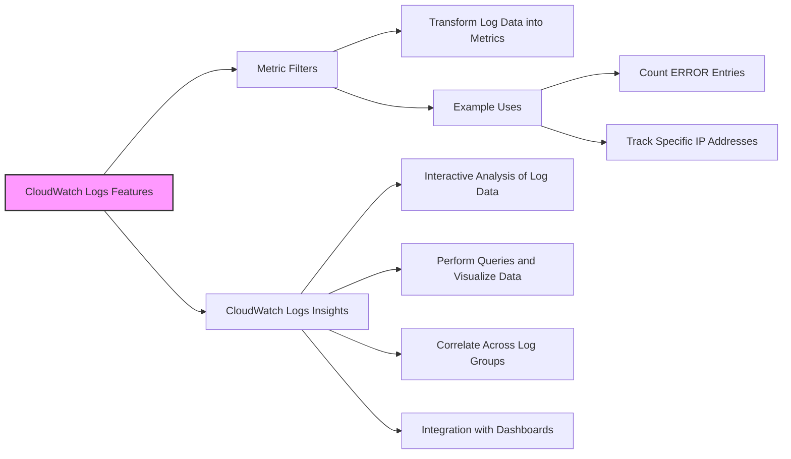
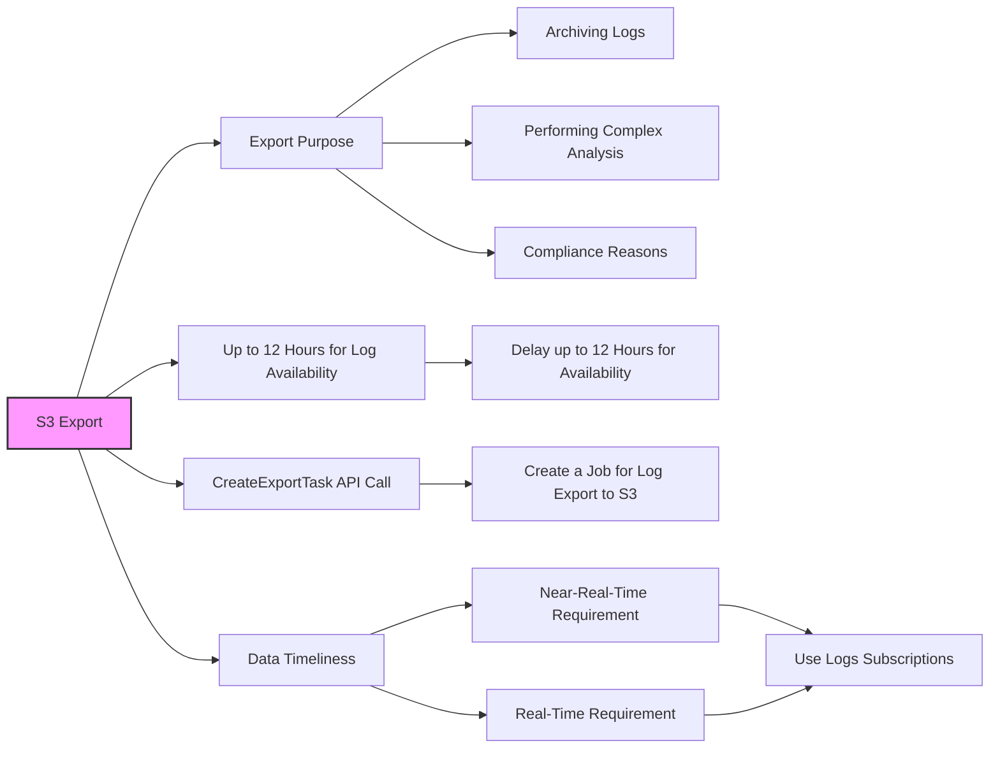
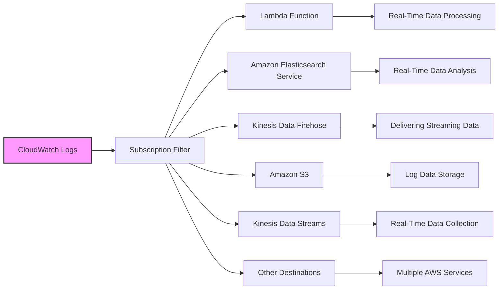
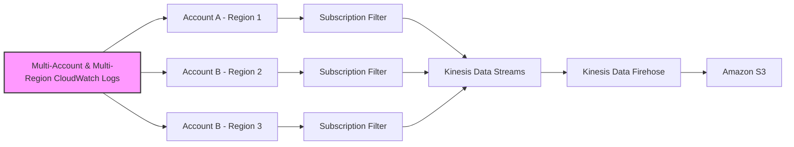
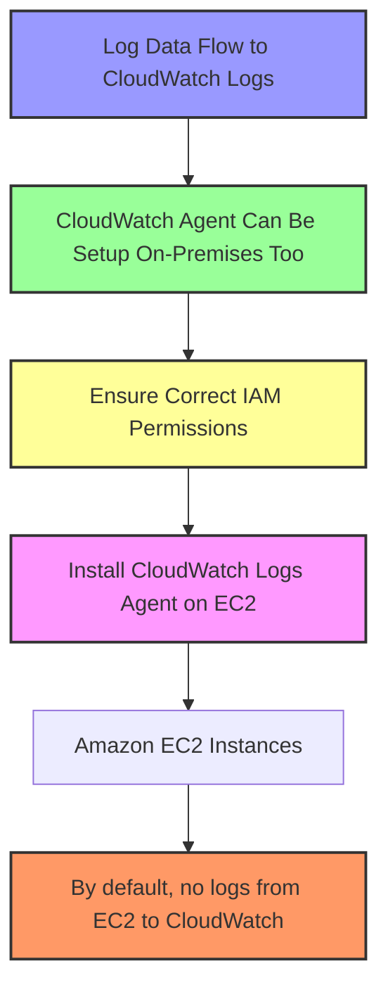
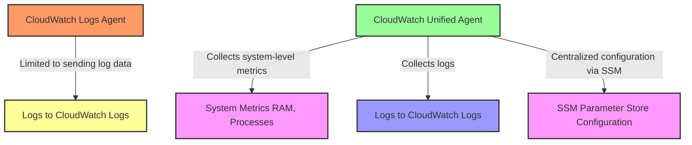
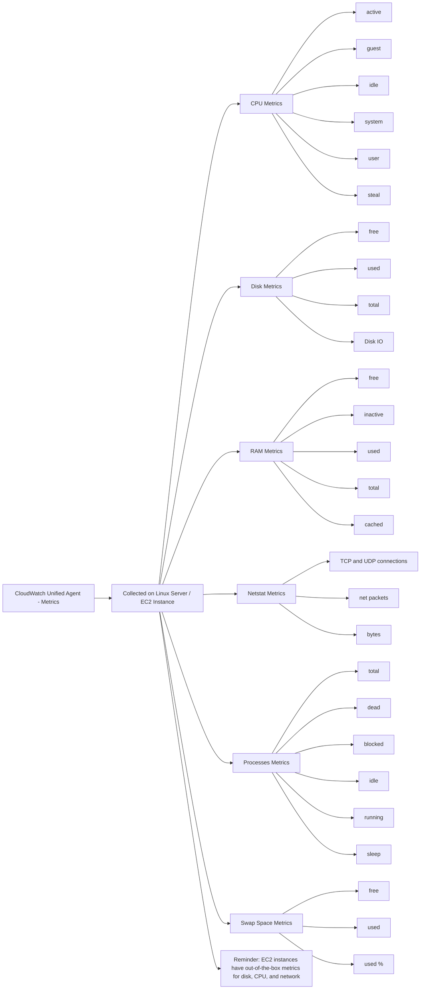

## Amazon CloudWatch Logs

## Amazon CloudWatch Sources

## Amazon CloudWatch S3 Export

## Amazon CloudWatch Subscription Filter

## Multi-Account & Multi-Region CloudWatch Logs

## CloudWatch Logs Agent on EC2

## CloudWatch Logs Agent on EC2

## CloudWatch Unified Agent - Metrics

| Feature                 | CloudWatch Logs                          | Kibana                                  |
|-------------------------|------------------------------------------|-----------------------------------------|
| Primary Use             | Monitoring, storing, and accessing log data from AWS services | Visualization and management interface for Elasticsearch data |
| Real-time Monitoring    | Yes, with CloudWatch Logs Insights       | Yes, with real-time log streaming and analysis |
| Data Storage            | Logs are stored within CloudWatch Logs   | Depends on Elasticsearch cluster for storage |
| Visualization           | Basic graphs and metric filters          | Advanced visualizations with various chart types |
| Custom Dashboards       | Yes, with CloudWatch Dashboards          | Yes, with more customizable options     |
| Alerting                | Yes, with CloudWatch Alarms              | Yes, through Elasticsearch's alerting features |
| Log Data Aggregation    | Yes, can aggregate logs across accounts and regions | Yes, if Elasticsearch is configured to receive logs from various sources |
| Search Capabilities     | Basic search with filter patterns        | Advanced search with Elasticsearch query DSL |
| Scalability             | Managed by AWS, scales with usage        | Depends on the Elasticsearch cluster setup |
| Access Control          | Integrated with AWS IAM                  | Integrated with X-Pack security (part of the Elastic Stack) |
| Third-party Integrations| Limited compared to Kibana               | Extensive through Elasticsearch and Beats |
| Pricing                 | Pay for data ingestion, storage, and analysis | Free to use Kibana, cost associated with Elasticsearch usage |
| Setup and Maintenance   | Managed by AWS, minimal setup required   | Requires setup and maintenance of Elasticsearch cluster |

