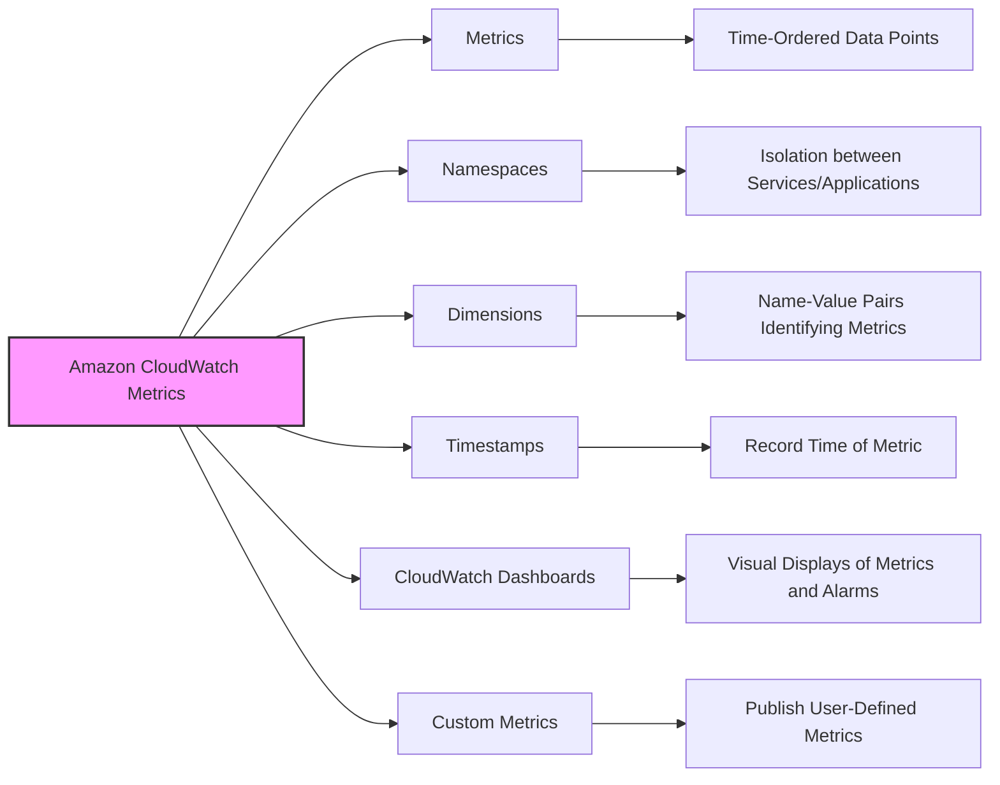
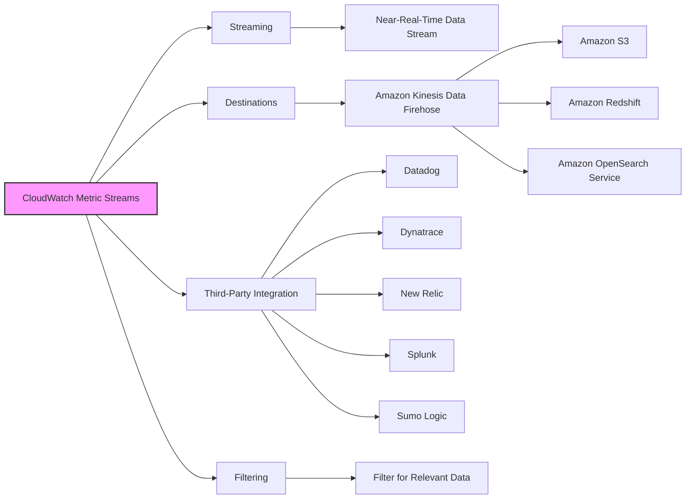

# CloudWatch

## CloudWatch Metrics

```mermaid
graph LR
    CloudWatch_Metrics[Amazon CloudWatch Metrics] --> Metrics[Metrics]
    CloudWatch_Metrics --> Namespaces[Namespaces]
    CloudWatch_Metrics --> Dimensions[Dimensions]
    CloudWatch_Metrics --> Timestamps[Timestamps]
    CloudWatch_Metrics --> Dashboards[CloudWatch Dashboards]
    CloudWatch_Metrics --> Custom_Metrics[Custom Metrics]

    Metrics --> Data_Points[Time-Ordered Data Points]
    Namespaces --> Isolation[Isolation between Services/Applications]
    Dimensions --> Name_Value_Pairs[Name-Value Pairs Identifying Metrics]
    Timestamps --> Record_Time[Record Time of Metric]
    Dashboards --> Visual_Displays[Visual Displays of Metrics and Alarms]
    Custom_Metrics --> User_Defined_Metrics[Publish User-Defined Metrics]

    style CloudWatch_Metrics fill:#f9f,stroke:#333,stroke-width:2px


```

```mermaid
graph LR
Metric_Streams[CloudWatch Metric Streams] --> Streaming[Streaming]
Metric_Streams --> Destinations[Destinations]
Metric_Streams --> Third_Party_Integration[Third-Party Integration]
Metric_Streams --> Filtering[Filtering]

    Streaming --> Real_Time_Data[Near-Real-Time Data Stream]
    Destinations --> Kinesis_Data_Firehose[Amazon Kinesis Data Firehose]
    Kinesis_Data_Firehose --> S3[Amazon S3]
    Kinesis_Data_Firehose --> Redshift[Amazon Redshift]
    Kinesis_Data_Firehose --> OpenSearch_Service[Amazon OpenSearch Service]
    Third_Party_Integration --> Datadog[Datadog]
    Third_Party_Integration --> Dynatrace[Dynatrace]
    Third_Party_Integration --> New_Relic[New Relic]
    Third_Party_Integration --> Splunk[Splunk]
    Third_Party_Integration --> Sumo_Logic[Sumo Logic]
    Filtering --> Relevant_Data_Filter[Filter for Relevant Data]

    style Metric_Streams fill:#f9f,stroke:#333,stroke-width:2px
```

