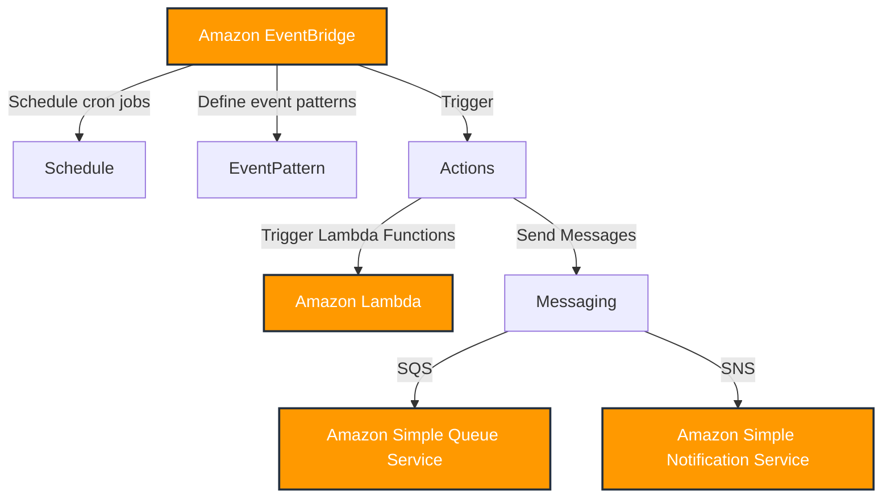
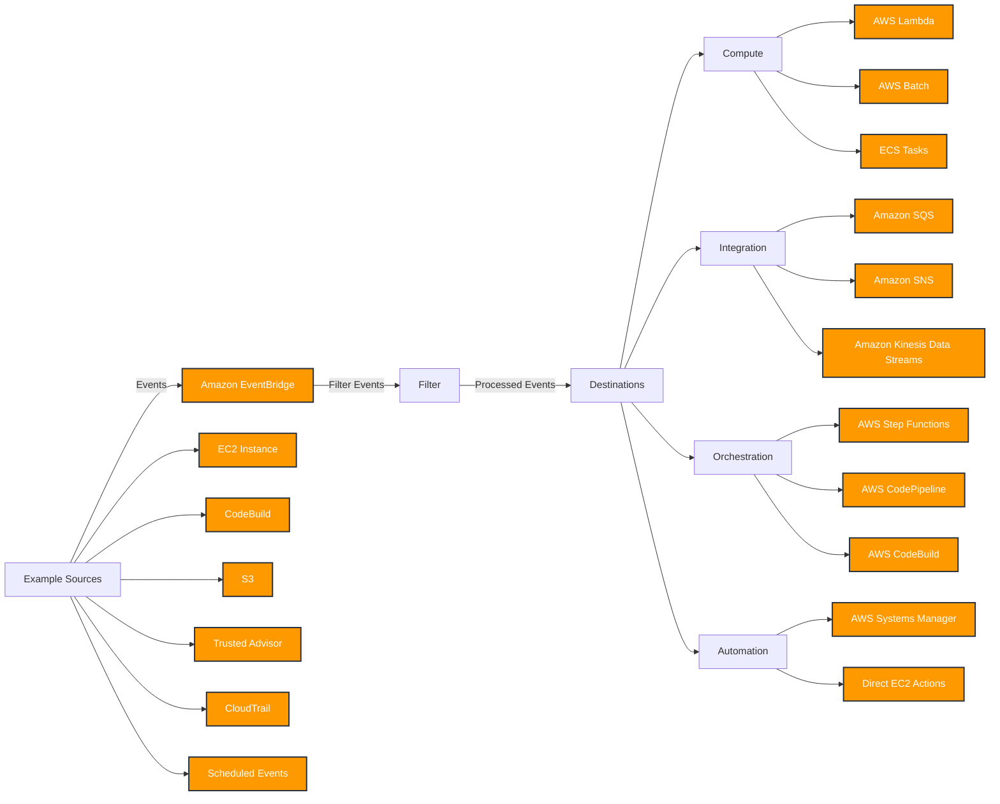
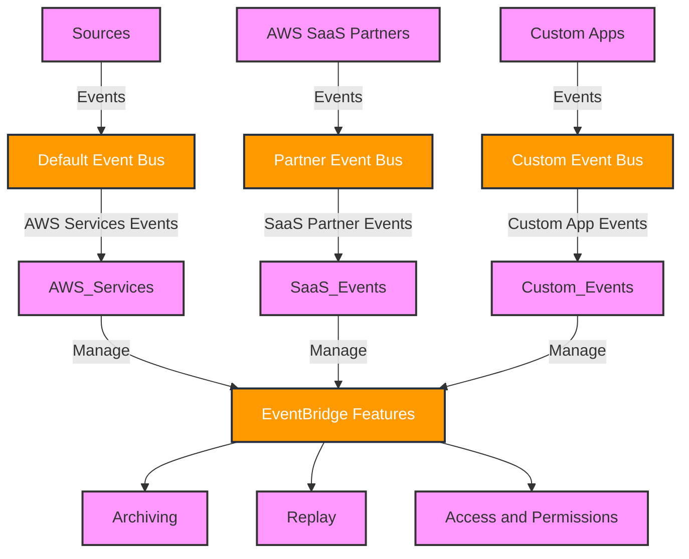
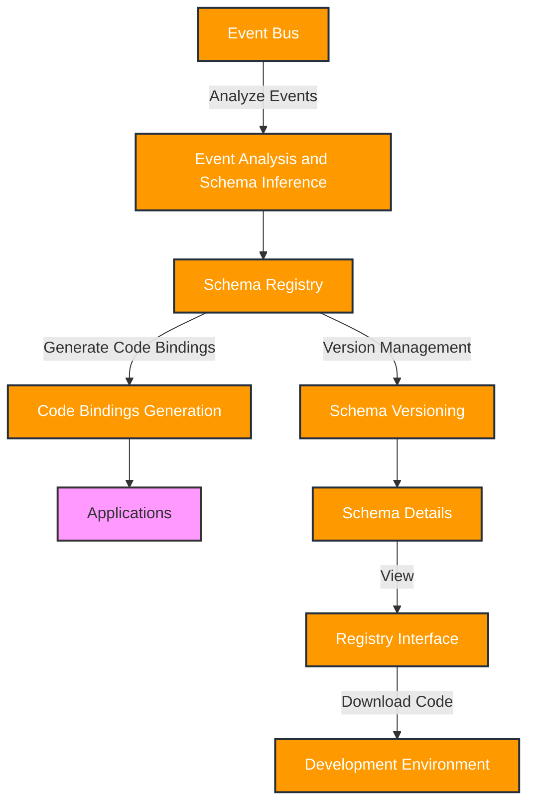
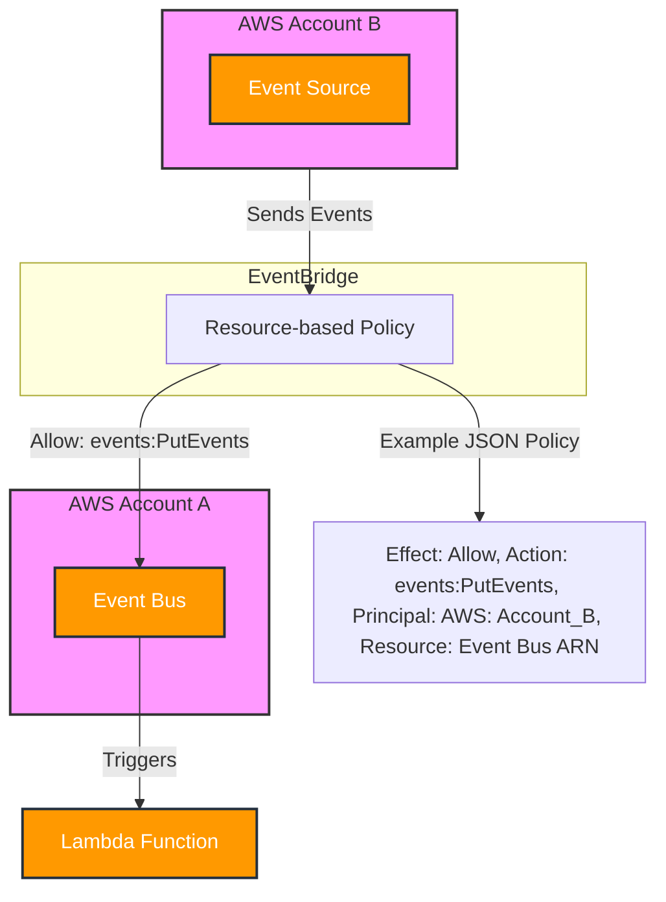
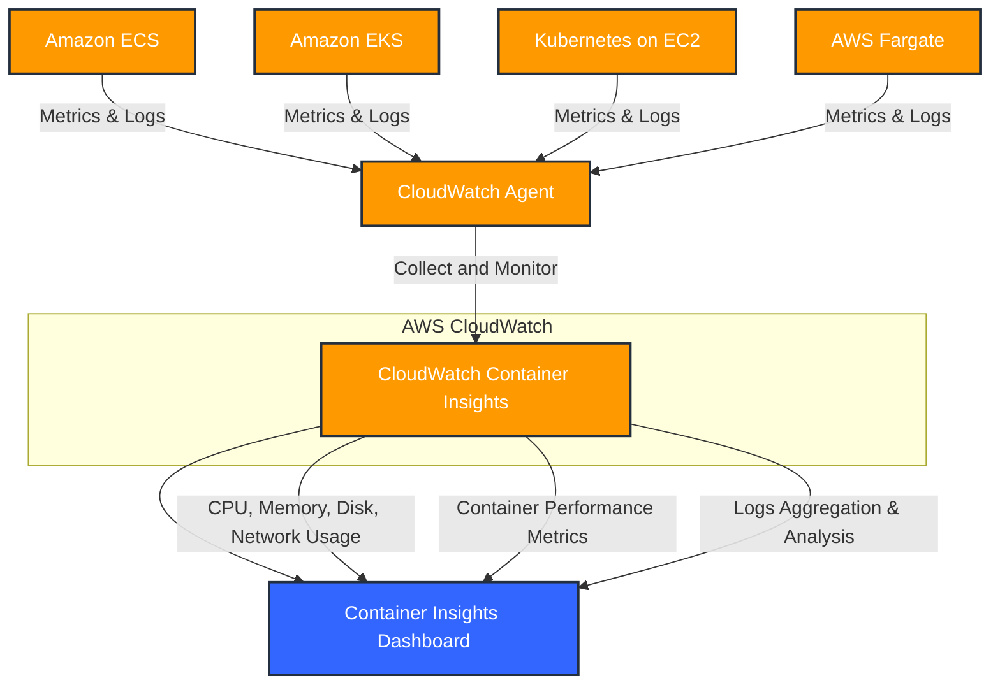

# EventBridge

```mermaid
graph TD
    EB[Amazon EventBridge] -->|Schedule cron jobs| Schedule
    EB -->|Define event patterns| EventPattern
    EB -->|Trigger| Actions

    Actions -->|Trigger Lambda Functions| Lambda[Amazon Lambda]
    Actions -->|Send Messages| Messaging

    Messaging -->|SQS| SQS[Amazon Simple Queue Service]
    Messaging -->|SNS| SNS[Amazon Simple Notification Service]

    classDef aws fill:#FF9900,color:#fff,stroke:#232F3E,stroke-width:2px;
    class EB,Lambda,SQS,SNS aws;

```

```mermaid
graph LR
Sources[Example Sources] -->|Events| EB[Amazon EventBridge]
EB -->|Filter Events| Filter
Filter -->|Processed Events| Destinations

    Sources --> EC2[EC2 Instance]
    Sources --> CodeBuild
    Sources --> S3
    Sources --> TA[Trusted Advisor]
    Sources --> CloudTrail
    Sources --> SE[Scheduled Events]

    Destinations --> Compute
    Destinations --> Integration
    Destinations --> Orchestration
    Destinations --> Automation

    Compute --> Lambda[AWS Lambda]
    Compute --> Batch[AWS Batch]
    Compute --> ECSTasks[ECS Tasks]

    Integration --> SQS[Amazon SQS]
    Integration --> SNS[Amazon SNS]
    Integration --> KDS[Amazon Kinesis Data Streams]

    Orchestration --> StepFunctions[AWS Step Functions]
    Orchestration --> CodePipeline[AWS CodePipeline]
    Orchestration --> CodeBuild2[AWS CodeBuild]

    Automation --> SSM[AWS Systems Manager]
    Automation --> EC2Actions[Direct EC2 Actions]

    classDef aws fill:#FF9900,color:#fff,stroke:#232F3E,stroke-width:2px;
    class EB,EC2,CodeBuild,S3,TA,CloudTrail,SE,Lambda,Batch,ECSTasks,SQS,SNS,KDS,StepFunctions,CodePipeline,CodeBuild2,SSM,EC2Actions aws;


```

```mermaid
graph TD
Sources[Sources] -->|Events| DEB[Default Event Bus]
SaaS_Partners[AWS SaaS Partners] -->|Events| PEB[Partner Event Bus]
Custom_Apps[Custom Apps] -->|Events| CEB[Custom Event Bus]

    DEB -->|AWS Services Events| AWS_Services
    PEB -->|SaaS Partner Events| SaaS_Events
    CEB -->|Custom App Events| Custom_Events

    AWS_Services -->|Manage| EB_Features[EventBridge Features]
    SaaS_Events -->|Manage| EB_Features
    Custom_Events -->|Manage| EB_Features

    EB_Features --> Archiving
    EB_Features --> Replay
    EB_Features --> Access_Permissions[Access and Permissions]

    classDef default fill:#f9f,stroke:#333,stroke-width:2px;
    classDef aws fill:#FF9900,color:#fff,stroke:#232F3E,stroke-width:2px;
    class Sources,SaaS_Partners,Custom_Apps,AWS_Services,SaaS_Events,Custom_Events,Archiving,Replay,Access_Permissions default;
    class DEB,PEB,CEB,EB_Features aws;
```

```mermaid
graph TD
Event_Bus[Event Bus] -->|Analyze Events| Schema_Inference[Event Analysis and Schema Inference]

    Schema_Inference --> Schema_Registry[Schema Registry]
    Schema_Registry -->|Generate Code Bindings| Code_Generation[Code Bindings Generation]
    Schema_Registry -->|Version Management| Versioning[Schema Versioning]

    Code_Generation --> Applications[Applications]
    Versioning --> Schema_Details[Schema Details]

    Schema_Details -->|View| Interface[Registry Interface]
    Interface -->|Download Code| Dev_Environment[Development Environment]

    classDef default fill:#f9f,stroke:#333,stroke-width:2px;
    classDef aws fill:#FF9900,color:#fff,stroke:#232F3E,stroke-width:2px;
    class Event_Bus,Schema_Inference,Schema_Registry,Code_Generation,Versioning,Schema_Details,Interface,Dev_Environment aws;

```

## Resource-based Policy

```mermaid
graph TD
subgraph Account_A [AWS Account A]
EB_A[Event Bus]
end

    subgraph Account_B [AWS Account B]
        Event_Source[Event Source]
    end

    Account_B -->|Sends Events| Policy[Resource-based Policy]
    Policy -->|Allow: events:PutEvents| EB_A

    EB_A -->|Triggers| Lambda_Function[Lambda Function]

    subgraph EventBridge
        Policy
        EB_A
    end

    classDef aws fill:#FF9900,color:#fff,stroke:#232F3E,stroke-width:2px;
    class Event_Source,EB_A,Lambda_Function,Polic aws;

    %% Optional Description
    Policy -- Example JSON Policy --> Policy_JSON[Effect: Allow, Action: events:PutEvents, Principal: AWS: Account_B, Resource: Event Bus ARN]

    %% Styles
    classDef account fill:#f9f,stroke:#333,stroke-width:2px;
    class Account_A,Account_B account;
```

## CloudWatch Agent

```mermaid
graph TD
ECS[Amazon ECS] -->|Metrics & Logs| CWAgent[CloudWatch Agent]
EKS[Amazon EKS] -->|Metrics & Logs| CWAgent
EC2[Kubernetes on EC2] -->|Metrics & Logs| CWAgent
Fargate[AWS Fargate] -->|Metrics & Logs| CWAgent

    CWAgent -->|Collect and Monitor| CWCI[CloudWatch Container Insights]

    subgraph AWS CloudWatch
        CWCI
    end

    CWCI --> Dashboard[Container Insights Dashboard]

    %% Optional Descriptions
    CWCI -- "CPU, Memory, Disk, Network Usage" --> Dashboard
    CWCI -- "Container Performance Metrics" --> Dashboard
    CWCI -- "Logs Aggregation & Analysis" --> Dashboard

    %% Styles
    classDef aws fill:#FF9900,color:#fff,stroke:#232F3E,stroke-width:2px;
    class ECS,EKS,EC2,Fargate,CWAgent,CWCI aws;

    classDef dashboard fill:#36f,color:#fff,stroke:#232F3E,stroke-width:2px;
    class Dashboard dashboard;
```